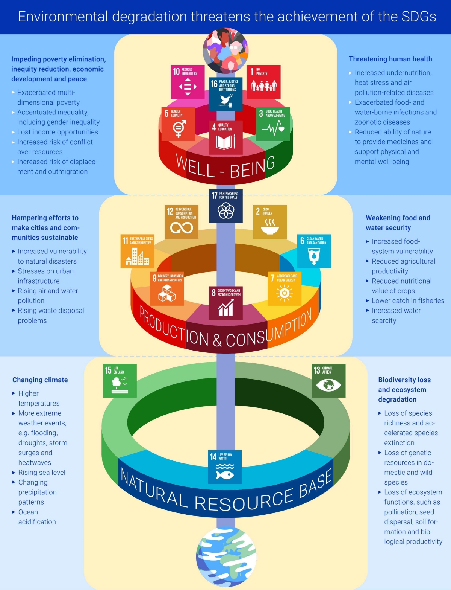
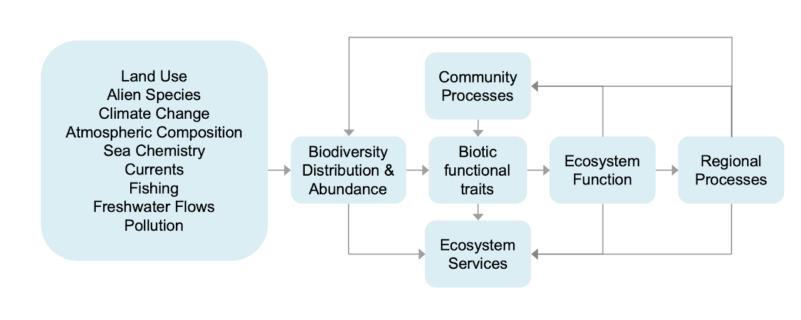
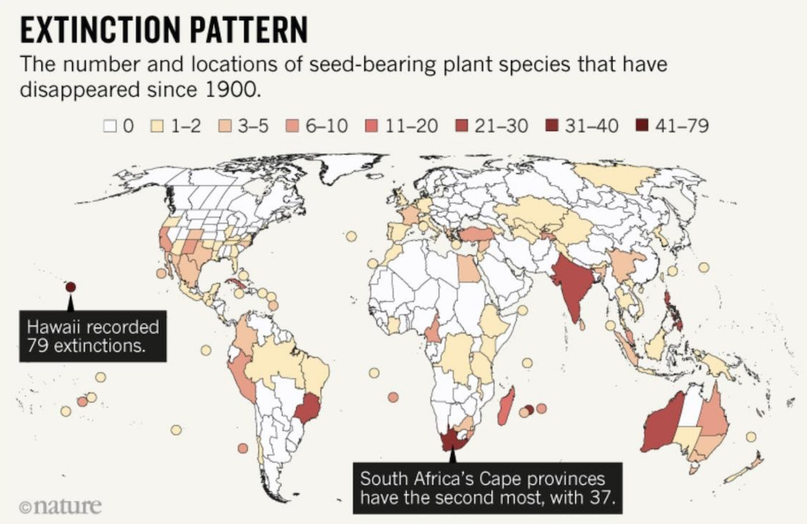
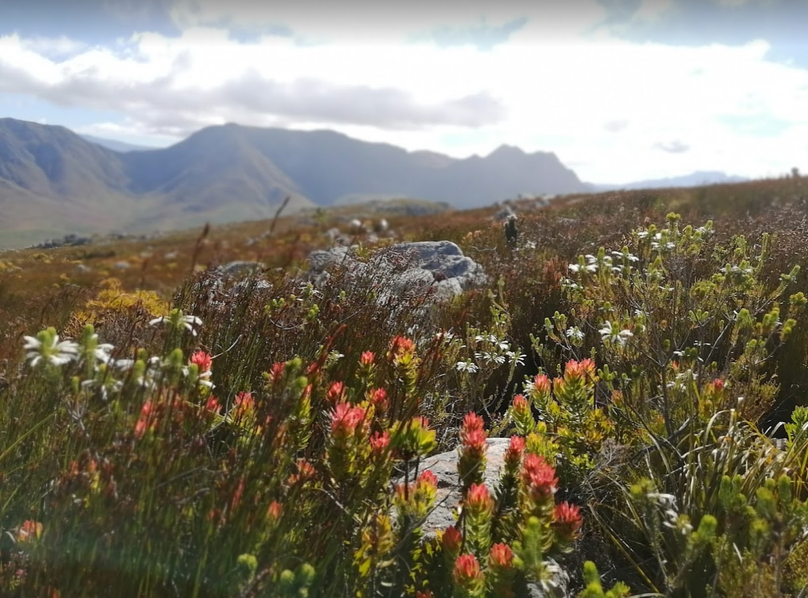

```{r setup, include=FALSE}
options(htmltools.dir.version = FALSE)
knitr::opts_chunk$set(
  fig.width=9, fig.height=3.5, fig.retina=3,
  out.width = "100%",
  cache = FALSE,
  echo = TRUE,
  message = FALSE, 
  warning = FALSE,
  hiline = TRUE
)

library(RefManageR)
BibOptions(check.entries = FALSE,
           bib.style = "authoryear",
           cite.style = "alphabetic",
           style = "markdown",
           hyperlink = FALSE,
           dashed = FALSE)
myBib <- ReadBib("bib/1_intro.bib", check = FALSE)
```

```{r xaringan-themer, include=FALSE, warning=FALSE}
library(xaringanthemer)

# style_duo_accent(
#   primary_color = "#1381B0",
#   secondary_color = "#FF961C",
#   inverse_header_color = "#FFFFFF"
# )

style_mono_light(base_color = "#23395b")

library(knitr)
library(kableExtra)
```

layout: false

.pull-left[
## We depend on biodiversity...

There is growing focus on the importance of biodiversity for our survival

Large global initiatives like the Intergovernmental Science-Policy Platform on Biodiversity and Ecosystem Services (IPBES) focus on strengthening the science-policy interface for biodiversity and ecosystem services for the conservation and sustainable use of biodiversity, long-term human well-being and sustainable development

.footnote[https://ipbes.net/global-assessment]
]

.pull-right[
```{r echo = F, fig.align = 'right', out.width = '110%'}
knitr::include_graphics("images/ipbes.jpg")
```
]

---

layout: false

.pull-left[
## We depend on biodiversity...

Attainment of the Sustainable Development Goals (SDGs) depends on the attainment of the goals relating to natural resource management, namely:

- SDG 13 Climate Action
- SDG 14 Life Below Water
- SDG 15 Life On Land

.footnote[https://www.unep.org/resources/making-peace-nature]
]

.pull-right[
```{r echo = F, fig.align = 'right', out.width = '90%'}

```
]

---

## My research focuses on...

```{r echo = F, fig.align = 'center', out.width = '100%'}

```

.footnote[Figure modified from Chapin et al. 1997, _Science_]

---

## My research focuses on four questions...

```{r echo = F, fig.align = 'center', out.width = '58%'}

```

1. What determines the composition and diversity of communities and ecosystems at various scales?

2. What is the role of biodiversity in ecosystem function (and derived societal benefits)?

3. How is biodiversity changing and what are the impacts on ecosystem services?

4. How can we mitigate or adapt to changing biodiversity and ecosystem services?

.pull-right[
.footnote[Figure modified from Chapin et al. 1997, _Science_]
]


---

layout: false

### I mostly work in the Cape Floristic Region Global Biodiversity Hotspot

```{r echo = F, fig.align = 'center', out.width = '75%'}
knitr::include_graphics("images/hotspots.jpg")
```

.footnote[Myers et al. 2001; https://www.conservation.org/priorities/biodiversity-hotspots]

---

layout: false

## Fynbos diversity...

.pull-left[

```{r echo = F, fig.align = 'center', out.width = '100%'}
knitr::include_graphics("images/cfr_diversity.png")
```

- ~9500 vascular plant species in the Cape Flora
- ~2200 native species on the Cape Peninsula alone
- only 1390 native species in the entire Great Britain and Ireland (~3 x CFR area!)

.footnote[Freiberg and Manning 2013]
]

.pull-right[
```{r echo = F, fig.align = 'center', out.width = '100%'}
knitr::include_graphics("images/centresofendemism.png")
```

- ~70% endemic to CFR
- Many narrow endemics (e.g. one peak)
- ~40% of all species occur in only 1 phytoregion!

.footnote[Freiberg and Manning 2013]
]

---

layout: false

### Sadly, the CFR is also an extinction hotspot...

.pull-left[
```{r echo = F, fig.align = 'center', out.width = '100%'}

```
]

.pull-right[
- 37 documented plant extinctions (13 in Cape Town)

- ~13% of all threatened plant species on the planet (1868/14360)

- Another 1506 considered Rare or Critically Rare 
  - few populations, but no current threats
  - any threat and they shift to EN or CR

]

.footnote[Humphreys et al. 2019]

---

layout: false

### 1. The composition and diversity of Fynbos ecosystems

```{r echo = F, fig.align = 'center', out.width = '100%'}
knitr::include_graphics("images/fynbos_community.jpg")
```

---

class: center

### 1. The composition and diversity of Fynbos ecosystems

```{r echo = F, fig.align = 'center', out.width = '85%'}
knitr::include_graphics("images/fynbos_landscapes.png")
```

Phylogenetically and functionally similar across huge variation in climate, soils etc.

---

layout: false

### 1. The composition and diversity of Fynbos ecosystems

.pull-left[

```{r echo = F, fig.align = 'center', out.width = '110%'}

``` 

]

.pull-right[

- Dominated by a few lineages that have diversified dramatically within the region
  - _Erica_ (~650 spp)
  - Fabaceae (~750 spp)
  - Rutaceae (~300 spp)
  - Proteaceae (~320 spp)
  - Poaceae (~ 200 spp)
  - Restionaceae (~300 spp)
  - Cyperaceae (~200 spp)
  - Iridaceae (~650 spp)
  - Orchidaceae (~250 spp)
  - Aizoaceae (~650 spp)
  - Asteraceae (~1000 spp)
  - Scrophulariaceae (~400 spp)


]

---

layout: false

.pull-left[

### 1. The composition and diversity of Fynbos ecosystems

```{r echo = F, fig.align = 'right', out.width = '85%'}
knitr::include_graphics("images/fynbos_landscapes.png")
```

- Most communities are dominated by the same 10 or so lineages
- Sister species look similar, and have similar effects in the environment in terms of ecosystem function (carbon, hydrology, fire, etc), but must be responding differently to occur in such different environments

]


.pull-right[

```{r echo = F, fig.align = 'right', out.width = '85%'}

```

]

---

layout: false

### 1. The composition and diversity of Fynbos ecosystems

```{r echo = F, fig.align = 'center', out.width = '60%'}

```

A predominance of speciation in allopatry, with minimal functional divergence?

.footnote[Slingsby et al. 2014]

---

class: center

### 2. Biodiversity and the function of Fynbos ecosystems?

```{r echo = F, fig.align = 'center', out.width = '70%'}
knitr::include_graphics("images/lang_postfire_50perc.gif")
```

Post-fire recovery

---

class: center

### 2. Biodiversity and the function of Fynbos ecosystems?

```{r echo = F, fig.align = 'center', out.width = '70%'}

```

Seasonality

---

class: center

### 2. Biodiversity and the function of Fynbos ecosystems?

```{r echo = F, fig.align = 'center', out.width = '55%'}

```

A post-fire timeseries of the Normalized Difference Vegetation Index (NDVI) for one location

---

layout: false

.pull-left[

### 2. Biodiversity and the function of Fynbos ecosystems?

Dominance by indigenous seeders vs sprouters affects rate of aboveground carbon gain and a range of hydrology-related ecosystem functions in fynbos
  - it also changes with a shift to woody alien trees 

<br>

Hypothetical curves are based on information from a range of sources, see book chapter. The temporal range spans c.15 yr and any seasonal variation is excluded. 

.footnote[Figure from Slingsby et al. 2014]
]

.pull-right[
```{r echo = F, fig.align = 'center', out.width = '90%'}
knitr::include_graphics("images/slingsby_2014_BEF.png")
```

]

---

layout: false

### 2. Biodiversity and the function of Fynbos ecosystems?

.pull-left[

We can look at this empirically by fitting curves to postfire NDVI recovery trajectories.

```{r echo = F, fig.align = 'center', out.width = '60%'}

```

The curves are defined by a set of parameters $(\alpha, \gamma, \lambda, etc)$ that determine the rate of recovery, maximum NDVI, etc.

We can also model the parameters as a function of covariates (e.g. soils, climate, topography)

]

.pull-right[
```{r echo = F, fig.align = 'center', out.width = '95%'}

```

.footnote[model from Wilson et al. 2015]

]

---

layout: false

### 2. Biodiversity and the function of Fynbos ecosystems?

.pull-left[

If we look at sites where we have vegetation survey data and information on species traits...

```{r echo = F, fig.align = 'center', out.width = '100%'}

```

]

.pull-right[
```{r echo = F, fig.align = 'center', out.width = '100%'}

```

_**Traits are better predictors of some recovery parameters**_ than soils, climate and topography!

.footnote[Moncrieff/Slingsby/Wilson in prep]

]

---

layout: false

.pull-left[

### 3. Global change and Fynbos?

```{r echo = F, fig.align = 'center', out.width = '100%'}

```

A 44-year repeat vegetation survey at Cape Point

```{r echo = F, fig.align = 'center', out.width = '75%'}
knitr::include_graphics("images/taylorplot.gif")
```

.footnote[Slingsby et al. 2017]

]

.pull-right[

```{r echo = F, fig.align = 'center', out.width = '60%'}
knitr::include_graphics("images/slingsby2017_chd.png")
```

Annual max consecutive hot and dry days (CHD) increased

```{r echo = F, fig.align = 'center', out.width = '100%'}

```

Plots that experienced higher CHD in the first year after fire lost species 

Resprouters and graminoids (low stature, high LMA) were the worst affected

]

---

layout: false

### 3. Global change and Fynbos?

.pull-left[

```{r echo = F, fig.align = 'center', out.width = '100%'}

```

Predicts slower post-fire recovery?

]

.pull-right[

```{r echo = F, fig.align = 'center', out.width = '97%'}

```

.footnote[Moncrieff/Slingsby/Wilson in prep]

]

---

layout: false

### 3. Global change and Fynbos?

.pull-left[

Loss and fragmentation of habitat...

```{r echo = F, fig.align = 'center', out.width = '100%'}
knitr::include_graphics("images/biome_remnants.png")
```

.footnote[Skowno et al. 2021]

]

.pull-right[

Invasive alien plants...

```{r echo = F, fig.align = 'left', out.width = '95%'}
knitr::include_graphics("images/pines.jpg")
```

Many knock-on effects for productivity, water, fire, etc

]

---

layout: false

### 4. Mitigating or adapting to change...

.pull-left[

The postfire recovery model allows us to predict what the natural NDVI trajectory for fynbos should be under any given environmental conditions...

```{r echo = F, fig.align = 'center', out.width = '80%'}

```

]

.pull-right[
```{r echo = F, fig.align = 'center', out.width = '100%'}

```

.footnote[https://www.emma.eco/]

]

---

layout: false

.pull-left[

### 4. Mitigating or adapting to change...

```{r echo = F, fig.align = 'center', out.width = '80%'}

```

.footnote[https://www.emma.eco/]

]

.pull-right[
```{r echo = F, fig.align = 'center', out.width = '60%'}

```

]

---

## References

```{r refs, echo=FALSE, results="asis"}
#NoCite(myBib)
#PrintBibliography(myBib)
```

I need to add these...

---

class: center, middle

# Thanks!

Slides created via the R packages:

[**xaringan**](https://github.com/yihui/xaringan)<br>
[gadenbuie/xaringanthemer](https://github.com/gadenbuie/xaringanthemer)

The chakra comes from [remark.js](https://remarkjs.com), [**knitr**](http://yihui.name/knitr), and [R Markdown](https://rmarkdown.rstudio.com).
