```{r setup, include=FALSE}
options(htmltools.dir.version = FALSE)
knitr::opts_chunk$set(
  fig.width=9, fig.height=3.5, fig.retina=3,
  out.width = "100%",
  cache = FALSE,
  echo = TRUE,
  message = FALSE, 
  warning = FALSE,
  hiline = TRUE
)

library(RefManageR)
BibOptions(check.entries = FALSE,
           bib.style = "authoryear",
           cite.style = "alphabetic",
           style = "markdown",
           hyperlink = FALSE,
           dashed = FALSE)
myBib <- ReadBib("bib/2_species.bib", check = FALSE)
```

```{r xaringan-themer, include=FALSE, warning=FALSE}
library(xaringanthemer)

# style_duo_accent(
#   primary_color = "#1381B0",
#   secondary_color = "#FF961C",
#   inverse_header_color = "#FFFFFF"
# )

style_mono_light(base_color = "#23395b")

#https://mycolor.space/?hex=%2323395B&sub=1 
#"Generic gradient" - #23395B #006287 #008E9D #00B897 #89DD81 #F9F871
#"Matching gradient" (reverse) - #23395B #494E77 #716292 #9C77AA #C88DBF #F5A3D0


library(knitr)
library(kableExtra)
```


```{r xaringan-tile-view, echo=FALSE}
# xaringanExtra::use_tile_view()
```


## The three recycling pathways

```{r echo = F, fig.align = 'center', out.width = '45%'}
knitr::include_graphics("images/pausas_bond_2020_1.jpg")
```

.footnote[Pausas and Bond 2020. _Trends in Ecology and Evolution_]

---
## The three recycling pathways

```{r echo = F, fig.align = 'center', out.width = '75%'}
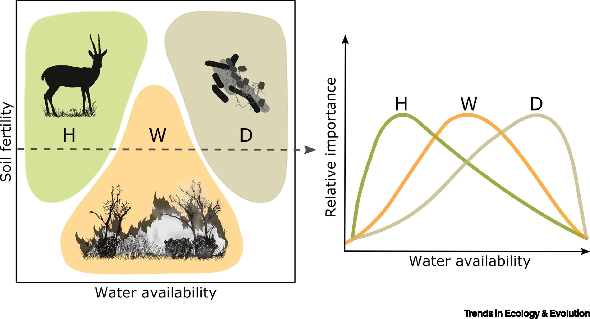
```

.footnote[Pausas and Bond 2020. _Trends in Ecology and Evolution_]

---

.pull-left[
## Three recycling pathways

```{r echo = F, fig.align = 'center', out.width = '70%'}
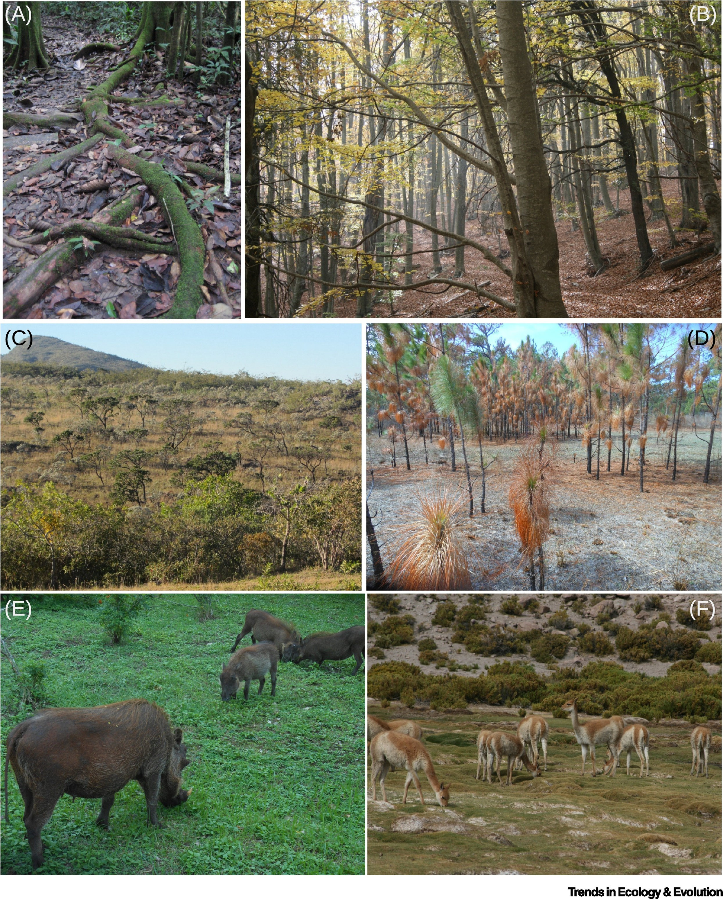
```

.footnote[Pausas and Bond 2020. _Trends in Ecology and Evolution_]
]

.pull-right[

<br>

Microbe-driven (Top): 
- Understory of a rainforest (A; Peruvian Amazon) and beech forest (B; NE Spain), with high humidity and no grasses, where litter is easily decomposed.

Fire-driven (Middle):
- South American savanna (C; Central Brazil) with flammable grasses and thick-barked trees. Frequently burned pine woodland (D; North Carolina) with a flammable grassy and litter understorey with fire-resistant pine saplings.

Herbivory-driven (Bottom): 
- African short-grass savanna (E; Kruger National Park, South Africa), and vicunas grazing in arid grasslands (F; Atacama, Chile). 

]

---

## The three recycling pathways

<br>

```{r echo=FALSE}
ebvs <- read.csv("images/pausas_bond_2020.csv", header = T)

kable(ebvs[1:10,], 
      col.names = c("", "", "Herbivory", "Decomposition", "Wildfire"), 
      row.names = F)  %>%
  kable_styling(font_size = 14)
```

.footnote[Pausas and Bond 2020. _Trends in Ecology and Evolution_]

---

## What about De Hoop?

```{r echo = F, fig.align = 'center', out.height = '60%', warning=F, messages=F}

library(terra, quiet = T)
library(sf, quiet = T)
library(tidyverse, quiet = T)

ndvi <- rast("prac/MODIS/20220130_MODIS_v1g_POT_MOD13Q1_006_NDVI.tif")

# Get veg map and fire and plot
veg <- st_read("/Users/jasper/Documents/Datasets/SANBI/RLE_2021_Remnants/FynRemnantsClean.gpkg", quiet = T)
ndvi_g <- project(ndvi, st_crs(veg)$Wkt)
veg <- st_crop(veg, ndvi_g, quiet = T)
mapview::mapview(veg, zcol = "name", quiet = T) 

```

---

## What about De Hoop?

```{r echo = F, fig.align = 'center', out.width = '55%'}
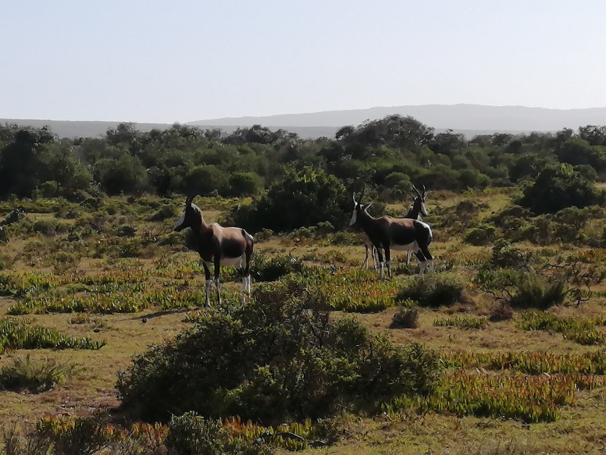
```

---

## What about De Hoop?

```{r echo = F, fig.align = 'center', out.width = '55%'}
knitr::include_graphics("images/potberg_sandstone_fynbos.jpg")
```

---

## What about De Hoop?

```{r echo = F, fig.align = 'center', out.width = '55%'}
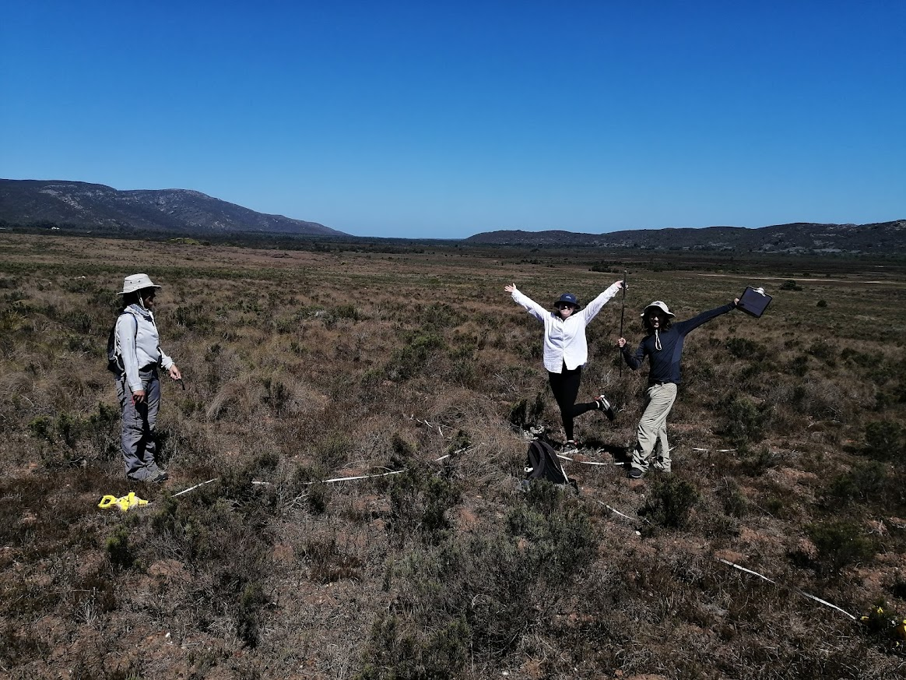
```

---

## The three recycling pathways

<br>

```{r echo=FALSE}
ebvs <- read.csv("images/pausas_bond_2020.csv", header = T)

kable(ebvs[c(12:18),], 
      col.names = c("", "", "Herbivory", "Decomposition", "Wildfire"), 
      row.names = F)  %>%
  kable_styling(font_size = 14)
```

.footnote[Pausas and Bond 2020. _Trends in Ecology and Evolution_]

---

## The three recycling pathways - Feedbacks!

<br>

```{r echo=FALSE}
ebvs <- read.csv("images/pausas_bond_2020.csv", header = T)

kable(ebvs[c(12:18),], 
      col.names = c("", "", "Herbivory", "Decomposition", "Wildfire"), 
      row.names = F)  %>%
  kable_styling(font_size = 14) %>%
  row_spec(1:3, bold = T, color = "white", background = "#D7261E")
```

.footnote[Pausas and Bond 2020. _Trends in Ecology and Evolution_]

---

## The three recycling pathways - Feedbacks!

.pull-left[
```{r echo = F, fig.align = 'center', out.width = '90%'}
knitr::include_graphics("images/pausas_bond_2020_1.jpg")
```

.footnote[Pausas and Bond 2020. _Trends in Ecology and Evolution_]
]

.pull-right[
> _"**Figure 1.** Plant Biomass and Vegetation Structure in Terrestrial Ecosystems is Determined by Three Feedback Processes: Vertebrate Herbivory, Microbial Decomposition, and Wildfires."_
]

---

## What is a feedback?

> _"the modification or control of a process or system by its results or effects"_ - Oxford Dictionary

<br>

**Feedbacks (in ecology) can be positive or negative:**

- **Positive (amplifying) feedback:** 
  - "a feedback process where a stimulus (e.g., disturbance) causes a reaction _**in the same direction**_ and thus it amplifies the stimulus. Thus, it moves the system away from equilibrium; it generates instability, and when strong enough, causes state shifts. It may require an external force to initiate it."

- **Negative (stabilizing) feedback:** 
  - "a feedback process where a stimulus (e.g., disturbance) causes a reaction _**in the opposite direction**_ so that the state of the system is maintained. Negative feedbacks promote stability (e.g., homeostasis) and ensure the maintenance of a steady, stable state."

.footnote[Definitions from Pausas and Bond 2022. _Trends in Ecology and Evolution_]

---

## What are feedbacks in ecology?

Organisms can modify their environment, and these modifications can feed back to the organism and generate emergent properties at different scales, with ecological and evolutionary consequences...

```{r echo = F, fig.align = 'center', out.width = '55%'}
knitr::include_graphics("images/pausas_bond_2022.jpg")
```

.footnote[Definitions from Pausas and Bond 2022. _Trends in Ecology and Evolution_]

---

## Emergence... 

Emergent properties are properties and behaviors of a system as a whole that its parts do not have on their own - they emerge thanks to the interactions among parts.

<br>

For example, in biology, each level of organization has properties which emerge at that level. 
- organisms are not just a group of organs, 
- ecosystems are not just a group of species

They need to be bound together by specific interactions to emerge as such. Thus, diversity and stability of an ecosystem are emergent properties as are the life and behavior of an organism.

---

## Emergence from feedbacks

.pull-left[
```{r echo = F, fig.align = 'center', out.width = '100%'}
knitr::include_graphics("images/pausas_bond_2022.jpg")
```

.footnote[From Pausas and Bond 2022. _Trends in Ecology and Evolution_]
]

.pull-right[
Emergent properties at different scales...

-   Population/Species - Niche construction

-   Community - Alternative Stable States

-   Biosphere - Gaia Hypothesis
]

---

## Niche construction

```{r echo = F, fig.align = 'center', out.width = '60%'}
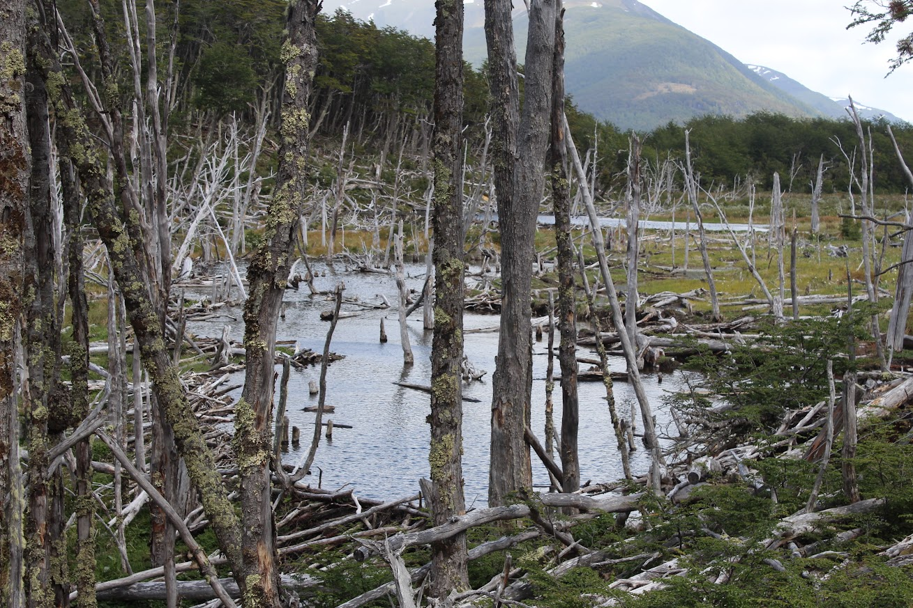
```

.footnote[e.g. beaver dams]

---

## Niche construction

```{r echo = F, fig.align = 'center', out.width = '50%'}
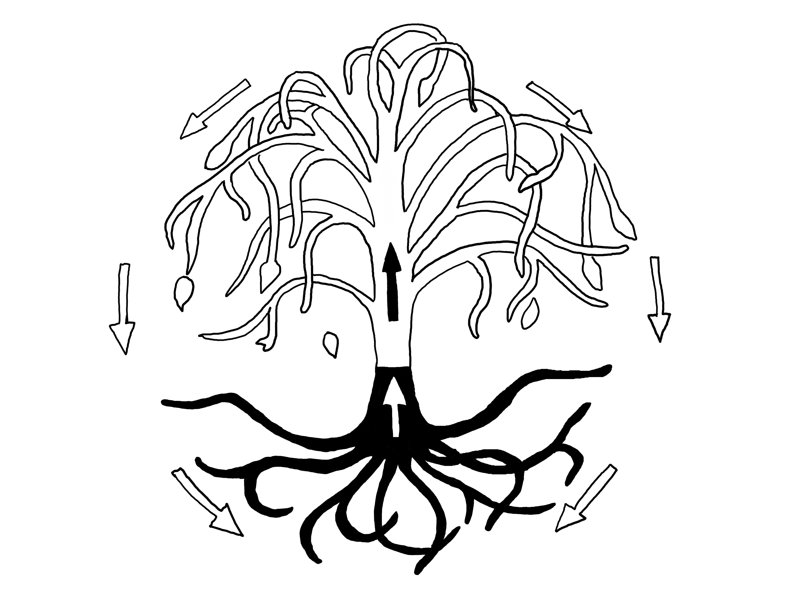
```

.footnote[e.g. trees and plant-soil feedbacks through leaf litter etc (e.g. bush nucleation)]

---

## Niche construction

```{r echo = F, fig.align = 'center', out.width = '50%'}

```

.footnote[e.g. bush nucleation, but also grazer-induced "grazing lawns"]

---

## Niche construction

```{r echo = F, fig.align = 'center', out.width = '55%'}
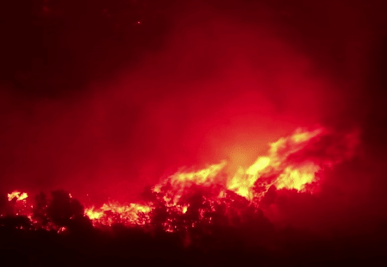
```

.footnote[e.g. flammable plants and fire regimes]

---

## Alternative Stable States

.pull-left[
```{r echo = F, fig.align = 'center', out.width = '100%'}
knitr::include_graphics("images/beisner2003_1.jpg")
```

.footnote[From Beisner et al 2003. _Frontiers in Ecology and Evolution_]
]

.pull-right[
```{r echo = F, fig.align = 'center', out.width = '100%'}
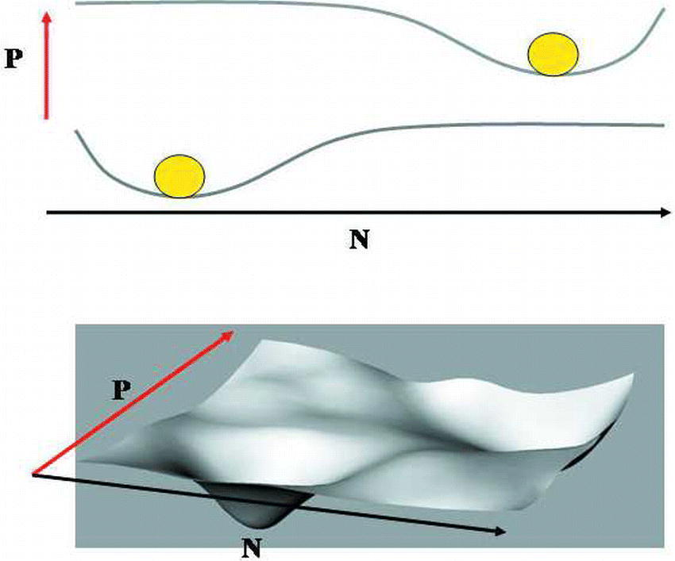
```
]

---

## Alternative Biome States

.pull-left[
```{r echo = F, fig.align = 'center', out.width = '80%'}
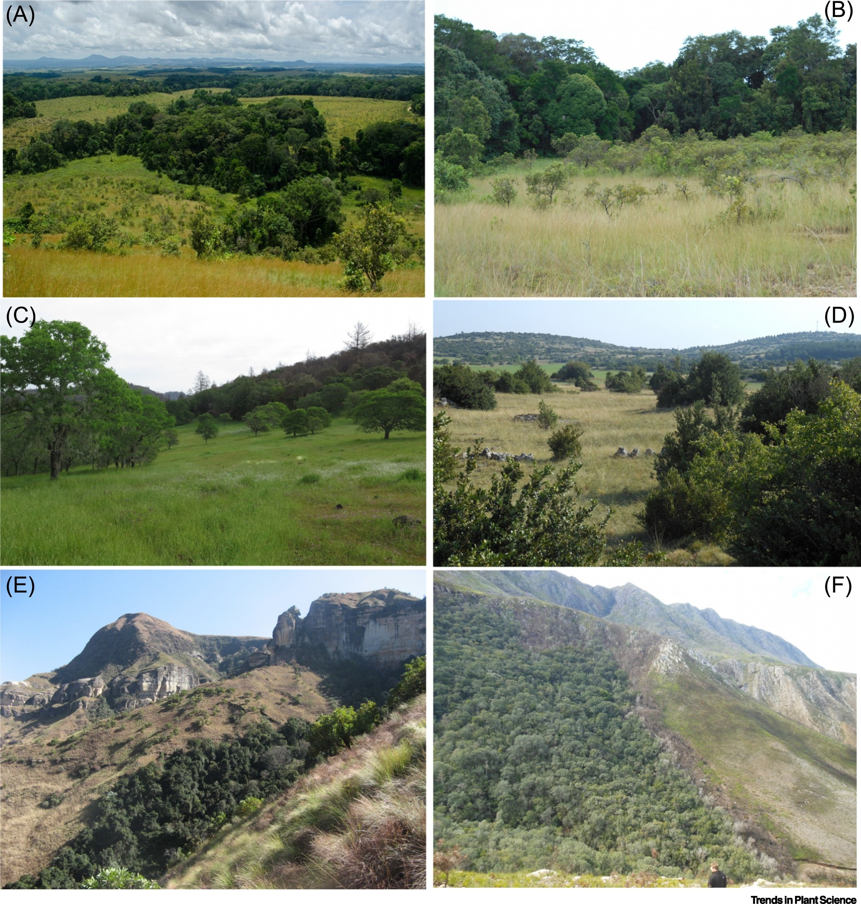
```

.footnote[From Pausas and Bond 2020. _Trends in Plant Science_]
]

.pull-right[
"Open" (grassland, shrubland, savanna) vs "Closed" (forest) ecosystems maintained by fire and/or herbivory
]

---

## Alternative Biome States

```{r echo = F, fig.align = 'center', out.width = '85%'}
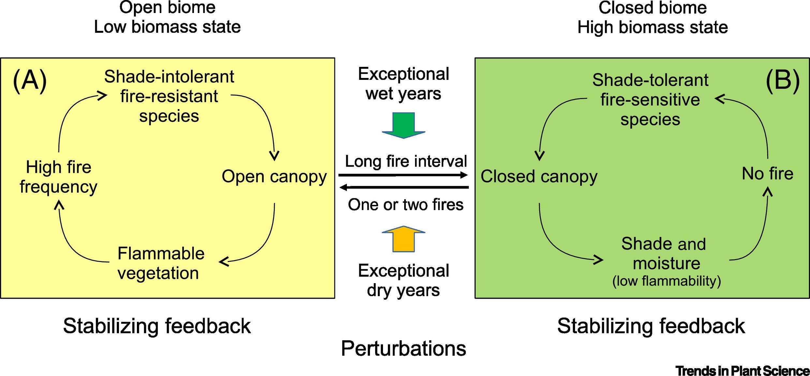
```

.footnote[From Pausas and Bond 2020. _Trends in Plant Science_]

---

## Alternative Biome States - altering the feedback!

```{r echo = F, fig.align = 'center', out.width = '85%'}
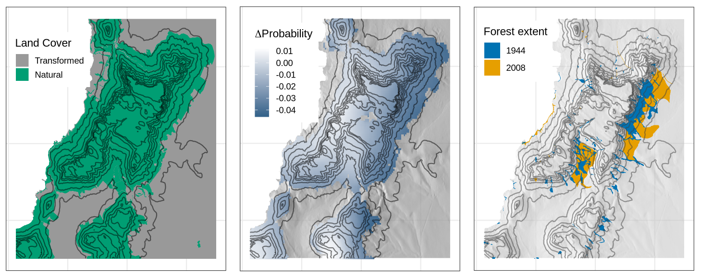
```

Land cover change on the Cape Peninsula alters the flow (and frequency) of fire, allowing forest to invade fynbos.

.footnote[[Slingsby et al 2020. _Global Change Biology_](http://dx.doi.org/10.1111/gcb.14861)]

---

## Gaia Hypothesis

.pull-left[
```{r echo = F, fig.align = 'center', out.width = '80%'}
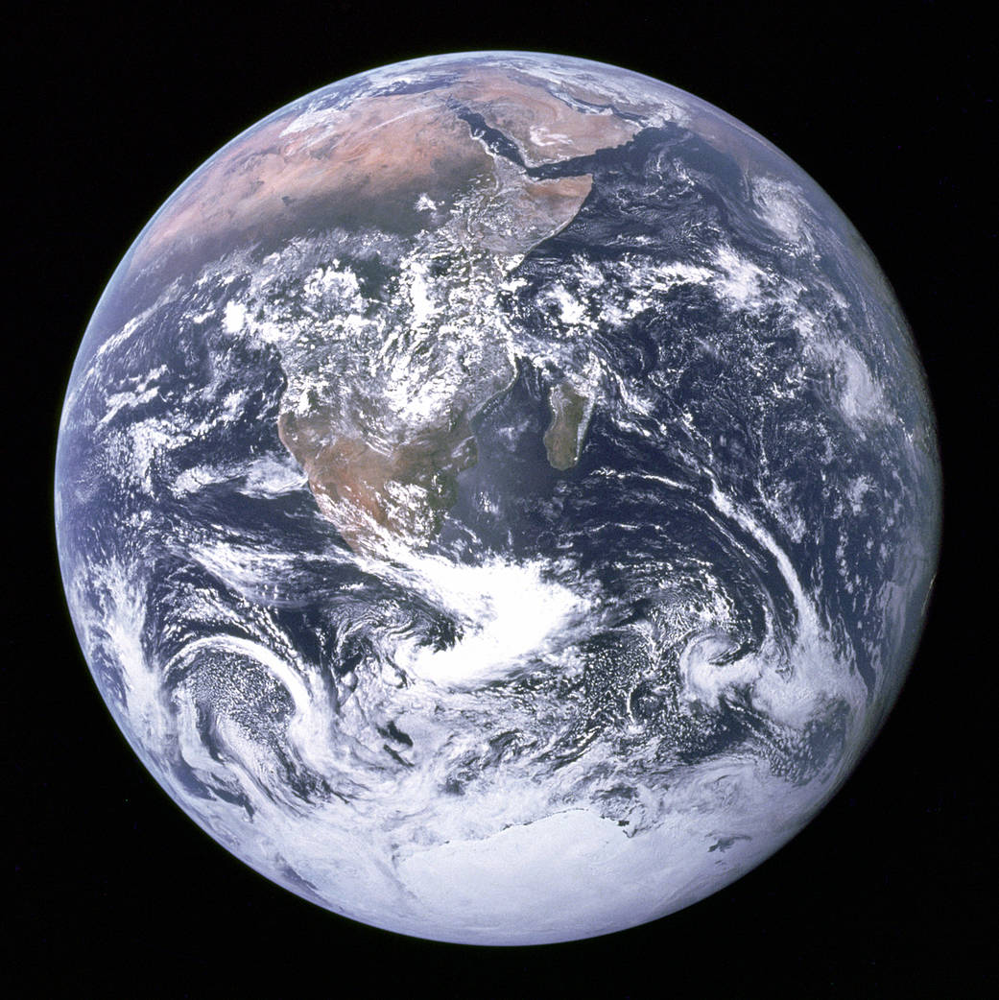
```

.footnote["The Blue Marble" - NASA Apollo 17, 1972]
]

.pull_right[

<br>

- Earth as a global system with feedbacks that stabilize the planetary environment to certain states, and with state changes in geological time 

- The biosphere has a major effect on the atmosphere and thus produces ecological and evolutionary feedbacks that sustain life
]

---

## Gaia Hypothesis - Daisyworld model

.pull-left[
```{r echo = F, fig.align = 'center', out.width = '75%'}
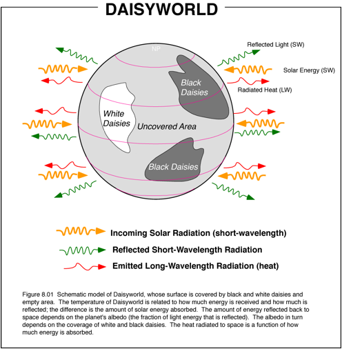
```

.footnote[Watson and Lovelock 1982, _Tellus B_]
]

.pull_right[

<br>

- A planet with nothing but black and white daisies

- Black daisies do better under cooler climate, white daisies under warmer

- When white daisies dominate, albedo increases, cooling the planet and selecting for black daisies

- When black daisies dominate, albedo decreases, warming the planet and selecting for white daisies

- Together, these effects stabilize the planet's climate, and the co-existence of black and white daisies

]

---

## Emergence from feedbacks

.pull-left[
```{r echo = F, fig.align = 'center', out.width = '100%'}
knitr::include_graphics("images/pausas_bond_2022.jpg")
```

.footnote[From Pausas and Bond 2022. _Trends in Ecology and Evolution_]
]

.pull-right[
Emergent properties at different scales...

-   Population/Species - Niche construction

-   Community - Alternative Stable States

-   Biosphere - Gaia Hypothesis
]

---

## Feedbacks across scales

.pull-left[
```{r echo = F, fig.align = 'center', out.width = '100%'}
knitr::include_graphics("images/pausas_bond_2022.jpg")
```

.footnote[From Pausas and Bond 2022. _Trends in Ecology and Evolution_]
]

.pull-right[
Flammability...

- Population/Species (niche construction)

  - postfire gaps generate recruitment opportunities

- Community (Alternative Stable States)

  - increase in fire activity can create and maintain an open biome

- Biosphere (Gaia Hypothesis)

  - open ecosystems have greater albedo than forest, cooling the planet
  
]

---

## Implications of feedbacks?

Thresholds from where feedbacks can be disrupted can generate abrupt (nonlinear) changes.
- implications for local scale and global change driven by climate change, invasive species, human activities, etc.

<br>

Feedbacks link across scales and a change at one scale may have big implications for other scales
- e.g. What is the effect of global tree planting? Reduced atmospheric CO2, but also lower albedo (higher temperature absorption) and increased evapotranspiration?
 
<br>

Simple cause–effect thinking may not be adequate.
- e.g. Ideas like competition and habitat filtering applied in niche theory may not account for potential feedbacks and state shifts. How can we incorporate this?

---

layout: false

## My research focuses on four questions...

```{r echo = F, fig.align = 'center', out.width = '58%'}
knitr::include_graphics("images/chapin2.png")
```

1. What determines the composition and diversity of communities and ecosystems at various scales?

2. What is the role of biodiversity in ecosystem function (and derived societal benefits)?

3. How is biodiversity changing and what are the impacts on ecosystem services?

4. How can we mitigate or adapt to changing biodiversity and ecosystem services?

.pull-right[
.footnote[Figure modified from Chapin et al. 1997, _Science_]
]

---
class: center, middle

# Thanks!

Slides created via the R packages:

[**xaringan**](https://github.com/yihui/xaringan)<br>
[gadenbuie/xaringanthemer](https://github.com/gadenbuie/xaringanthemer)

The chakra comes from [remark.js](https://remarkjs.com), [**knitr**](http://yihui.name/knitr), and [R Markdown](https://rmarkdown.rstudio.com).
