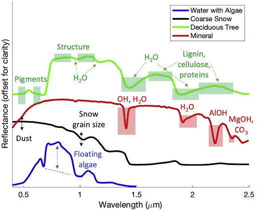
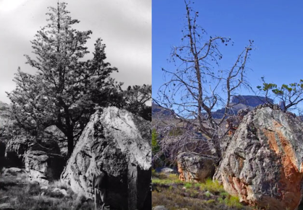

```{r setup, include=FALSE}
options(htmltools.dir.version = FALSE)
knitr::opts_chunk$set(
  fig.width=9, fig.height=3.5, fig.retina=3,
  out.width = "100%",
  cache = FALSE,
  echo = TRUE,
  message = FALSE, 
  warning = FALSE,
  hiline = TRUE
)

library(RefManageR)
BibOptions(check.entries = FALSE,
           bib.style = "authoryear",
           cite.style = "alphabetic",
           style = "markdown",
           hyperlink = FALSE,
           dashed = FALSE)
myBib <- ReadBib("bib/2_species.bib", check = FALSE)
```

```{r xaringan-themer, include=FALSE, warning=FALSE}
library(xaringanthemer)

# style_duo_accent(
#   primary_color = "#1381B0",
#   secondary_color = "#FF961C",
#   inverse_header_color = "#FFFFFF"
# )

style_mono_light(base_color = "#23395b")

#https://mycolor.space/?hex=%2323395B&sub=1 
#"Generic gradient" - #23395B #006287 #008E9D #00B897 #89DD81 #F9F871
#"Matching gradient" (reverse) - #23395B #494E77 #716292 #9C77AA #C88DBF #F5A3D0


library(knitr)
library(kableExtra)
```


```{r xaringan-tile-view, echo=FALSE}
# xaringanExtra::use_tile_view()
```


## The three recycling pathways

```{r echo = F, fig.align = 'center', out.width = '45%'}
knitr::include_graphics("images/pausas_bond_2020_1.jpg")
```

.footnote[Pausas and Bond 2020. _Trends in Ecology and Evolution_]

---
## The three recycling pathways

```{r echo = F, fig.align = 'center', out.width = '75%'}

```

.footnote[Pausas and Bond 2020. _Trends in Ecology and Evolution_]

---

.pull-left[
## Three recycling pathways

```{r echo = F, fig.align = 'center', out.width = '70%'}

```

.footnote[Pausas and Bond 2020. _Trends in Ecology and Evolution_]
]

.pull-right[

<br>

Microbe-driven (Top): 
- Understory of a rainforest (A; Peruvian Amazon) and beech forest (B; NE Spain), with high humidity and no grasses, where litter is easily decomposed.

Fire-driven (Middle):
- South American savanna (C; Central Brazil) with flammable grasses and thick-barked trees. Frequently burned pine woodland (D; North Carolina) with a flammable grassy and litter understorey with fire-resistant pine saplings.

Herbivory-driven (Bottom): 
- African short-grass savanna (E; Kruger National Park, South Africa), and vicunas grazing in arid grasslands (F; Atacama, Chile). 

]

---

## The three recycling pathways

<br>

```{r echo=FALSE}
ebvs <- read.csv("images/pausas_bond_2020.csv", header = T)

kable(ebvs[1:10,], 
      col.names = c("", "", "Herbivory", "Decomposition", "Wildfire"), 
      row.names = F)  %>%
  kable_styling(font_size = 14)
```

.footnote[Pausas and Bond 2020. _Trends in Ecology and Evolution_]

---

## What about De Hoop?

```{r echo = F, fig.align = 'center', out.height = '60%', warning=F, messages=F}

library(terra, quiet = T)
library(sf, quiet = T)
library(tidyverse, quiet = T)

ndvi <- rast("prac/MODIS/20220130_MODIS_v1g_POT_MOD13Q1_006_NDVI.tif")

# Get veg map and fire and plot
veg <- st_read("/home/jasper/Documents/Datasets/SANBI/RLE_2021_Remnants/FynRemnantsClean.gpkg", quiet = T)
ndvi_g <- project(ndvi, st_crs(veg)$Wkt)
veg <- st_crop(veg, ndvi_g, quiet = T)
mapview::mapview(veg, zcol = "name", quiet = T) 

```

---

## What about De Hoop?

```{r echo = F, fig.align = 'center', out.width = '55%'}
knitr::include_graphics("images/potberg_strandveld.jpg")
```

---

## What about De Hoop?

```{r echo = F, fig.align = 'center', out.width = '55%'}
knitr::include_graphics("images/potberg_sandstone_fynbos.jpg")
```

---

## What about De Hoop?

```{r echo = F, fig.align = 'center', out.width = '55%'}

```

---

## The three recycling pathways

<br>

```{r echo=FALSE}
ebvs <- read.csv("images/pausas_bond_2020.csv", header = T)

kable(ebvs[c(12:18),], 
      col.names = c("", "", "Herbivory", "Decomposition", "Wildfire"), 
      row.names = F)  %>%
  kable_styling(font_size = 14)
```

.footnote[Pausas and Bond 2020. _Trends in Ecology and Evolution_]

---

## The three recycling pathways - Feedbacks!

<br>

```{r echo=FALSE}
ebvs <- read.csv("images/pausas_bond_2020.csv", header = T)

kable(ebvs[c(12:18),], 
      col.names = c("", "", "Herbivory", "Decomposition", "Wildfire"), 
      row.names = F)  %>%
  kable_styling(font_size = 14) %>%
  row_spec(1:3, bold = T, color = "white", background = "#D7261E")
```

.footnote[Pausas and Bond 2020. _Trends in Ecology and Evolution_]

---

## The three recycling pathways - Feedbacks!

.pull-left[
```{r echo = F, fig.align = 'center', out.width = '90%'}
knitr::include_graphics("images/pausas_bond_2020_1.jpg")
```

.footnote[Pausas and Bond 2020. _Trends in Ecology and Evolution_]
]

.pull-right[
> _"**Figure 1.** Plant Biomass and Vegetation Structure in Terrestrial Ecosystems is Determined by Three Feedback Processes: Vertebrate Herbivory, Microbial Decomposition, and Wildfires."_
]

---

## What is a feedback?

> _"the modification or control of a process or system by its results or effects"_ - Oxford Dictionary

<br>

**Feedbacks (in ecology) can be positive or negative:**

- **Positive (amplifying) feedback:** 
  - "a feedback process where a stimulus (e.g., disturbance) causes a reaction _**in the same direction**_ and thus it amplifies the stimulus. Thus, it moves the system away from equilibrium; it generates instability, and when strong enough, causes state shifts. It may require an external force to initiate it."

- **Negative (stabilizing) feedback:** 
  - "a feedback process where a stimulus (e.g., disturbance) causes a reaction _**in the opposite direction**_ so that the state of the system is maintained. Negative feedbacks promote stability (e.g., homeostasis) and ensure the maintenance of a steady, stable state."

.footnote[Definitions from Pausas and Bond 2022. _Trends in Ecology and Evolution_]

---

## What are feedbacks in ecology?

Organisms can modify their environment, and these modifications can feed back to the organism and generate emergent properties at different scales, with evolutionary consequences...

```{r echo = F, fig.align = 'center', out.width = '55%'}
knitr::include_graphics("images/pausas_bond_2022.jpg")
```

.footnote[Definitions from Pausas and Bond 2022. _Trends in Ecology and Evolution_]

---


## What are the consequences of feedbacks in ecology?

---

## Historical views on community ecology

<br>

Gleason vs Clements...

<br>

---

## Emergence... 

<br>

Emergent properties...

-   Population/Species (niche construction)

-   Community (Alternative Stable States)

-   Globe (Gaia Hypothesis)

---

## Niche construction 

---

## Alternative Stable States

---

### Alternative biome states

---

## Gaia Hypothesis

-   What it means

-   Daisyworld

---

## Feedbacks across scales

-   Fynbos

-   Global tree restoration

---

## Lectures to date

[Intro Walk n Talk]

1. Introduction to measuring diversity

2. Species richness and diversity: Alpha Diversity

3. Species richness and diversity: Beta Diversity

4. Functional and Phylogenetic Diversity

5. The Assembly of Diversity: Local processes

6. The Assembly of Diversity: Regional processes

7. Biodiversity and Ecosystem Function

8. Remote Sensing of Biodiversity

9. Power analysis

[Recycling pathways and feedbacks Walk n Talk]

.footnote[Providing examples from African ecosystems as far as was possible in the time I had... 
...but the theory is universal, so think about how examples or case studies introduced by other lecturers may apply here.]

---

layout: false

## 1. Why do we need to be able to measure biodiversity?

```{r echo = F, fig.align = 'center', out.width = '58%'}
knitr::include_graphics("images/chapin.png")
```

1. What determines the composition and diversity of communities and ecosystems at various scales?

2. What is the role of biodiversity in ecosystem function (and derived societal benefits)?

3. How is biodiversity changing and what are the impacts on ecosystem services?

4. How can we mitigate or adapt to changing biodiversity and ecosystem services?

.pull-right[
.footnote[Figure modified from Chapin et al. 1997, _Science_]
]

---

class: center, middle

## What have we learnt?

---

## My research focuses on four questions...

```{r echo = F, fig.align = 'center', out.width = '58%'}
knitr::include_graphics("images/chapin2.png")
```

1. What determines the composition and diversity of communities and ecosystems at various scales?

2. What is the role of biodiversity in ecosystem function (and derived societal benefits)?

3. How is biodiversity changing and what are the impacts on ecosystem services?

4. How can we mitigate or adapt to changing biodiversity and ecosystem services?

.pull-right[
.footnote[Figure modified from Chapin et al. 1997, _Science_]
]

---

### We want to measure biodiversity everywhere, all the time...

```{r echo = F, fig.align = 'center', out.width = '80%'}
knitr::include_graphics("images/world_seasonality.gif")
```

.center[Remote sensing is pretty much the only way this can be achieved...]

---

layout: false

.pull-left[

## It's a rapidly growing field

```{r echo = F, fig.align = 'left', out.width = '90%'}
knitr::include_graphics("images/turner2003.png")
```

```{r echo = F, fig.align = 'left', out.width = '90%'}
knitr::include_graphics("images/satellitelaunches.jpg")
```

.footnote[Turner et al. 2003]
]

.pull-right[

```{r echo = F, fig.align = 'left', out.width = '75%'}
knitr::include_graphics("images/cavenderbares2020.png")
```
.footnote[Cavender-Bares et al. 2020]

]

---

class: center

```{r echo = F, fig.align = 'center', out.width = '100%'}
knitr::include_graphics("images/bioscape.png")
```
.left[.footnote[...and the Cape is about to be the epicentre of this endeavour - https://www.bioscape.io/]]

---

layout: false

## BioSCape: Biodiversity Survey of the Cape

.pull-left[

- $>$ 100 scientists and conservation practitioners
- 16 teams (mixed US, RSA, other)
- terrestrial and aquatic
- 2 planes
- 4 instruments (hyperspectral and LiDAR)
- fundamental and applied science

```{r echo = F, fig.align = 'center', out.width = '100%'}
knitr::include_graphics("images/bioscape_planes.png")
```

]

.pull-right[
```{r echo = F, fig.align = 'center', out.width = '100%'}
knitr::include_graphics("images/bioscape_kumu.png")
```
.footnote[www.bioscape.io]
]

---

class: center, middle

## But how do we actually measure biodiversity with remote sensing?

---

layout: false

.pull-left[
## There are many facets of biodiversity to measure!

<br>

An advantage of remote sensing is that it can directly measure the structure, composition and function of biodiversity... 

...at least from the scale of individuals up...

]

.pull-right[
```{r echo = F, fig.align = 'center', out.width = '100%'}
knitr::include_graphics("images/Noss_Biodiversity.png")
```
.footnote[Noss 1990, _Conservation Biology_]
]

---

layout: false

.pull-left[
## There are many facets of biodiversity to measure!

An advantage of remote sensing is that it can directly measure the structure, composition and function of biodiversity... 


```{r echo = F, fig.align = 'center', out.width = '120%'}
knitr::include_graphics("images/skidmore2021_fig1.png")
```
.footnote[Skidmore et al. 2021]

]

.pull-right[

```{r echo = F, fig.align = 'center', out.width = '90%'}
knitr::include_graphics("images/ebv_circle.png")
```


...at least from the scale of individuals up...

.footnote[https://geobon.org/]

]

---

class: center

##Productivity and Seasonality

```{r echo = F, fig.align = 'center', out.width = '80%'}
knitr::include_graphics("images/world_seasonality.gif")
```

---

class: center

##Land cover (and change)

```{r echo = F, fig.align = 'center', out.width = '50%'}
knitr::include_graphics("images/skowno2021.jpg")
```

.left[.footnote[Skowno et al. 2021]]

---

class: center

##Land cover change detection

```{r echo = F, fig.align = 'center', out.width = '70%'}
knitr::include_graphics("images/renosterveld_planet.gif")
```

.left[.footnote[Moncrieff 2022]]

---

class: center

##Land cover change time series

```{r echo = F, fig.align = 'center', out.width = '60%'}
knitr::include_graphics("images/moilwe.png")
```

.left[.footnote[Moilwe et al. in prep]]

---

class: center, middle

## But what about metrics like species, functional and phylogenetic diversity?

---

layout: false

.pull-left[
## Functional diversity?

```{r echo = F, fig.align = 'center', out.width = '100%'}
knitr::include_graphics("images/peninsula_lidar.png")
```

Proteaceae shrubs (dark green) surrounded by low shrubs, forbs and graminoids at Silvermine, TMNP. 

.footnote[Data from City of Cape Town]

]

.pull-right[
```{r echo = F, fig.align = 'center', out.width = '100%'}
knitr::include_graphics("images/purkis_klemas2011_lidar.png")
```

Light detection and ranging (LiDAR) allows you to measure topography and the vertical structure of vegetation.

.footnote[Purkis and Klemas 2011]
]

---

layout: false

.pull-left[
## Functional diversity?

Imaging spectroscopy ("hyperspectral" remote sensing) allows direct measurement of leaf traits.

```{r echo = F, fig.align = 'left', out.width = '92%'}

```

]

.pull-right[
```{r echo = F, fig.align = 'center', out.width = '100%'}
knitr::include_graphics("images/peninsula_hyperspec.png")
```
]

---

layout: false

## Phylogenetic diversity?

```{r echo = F, fig.align = 'center', out.width = '70%'}
knitr::include_graphics("images/meireles2020.jpg")
```

.left[.footnote[Meireles et al. 2020]]

Leaf spectra are phylogenetically conserved for some regions, so it's possible that we'll be able to discern lineages using imaging spectroscopy...

---

layout: false

.pull-left[
## Identifying species?

We can monitor populations of large species..., but identifying all species present...?

```{r echo = F, fig.align = 'center', out.width = '70%'}
knitr::include_graphics("images/machine_learning.png")
```

.footnote[https://xkcd.com/1838/]
]

.pull-right[
```{r echo = F, fig.align = 'center', out.width = '75%'}

knitr::include_graphics("images/cedars_mapped.png")
```

.footnote[Hadebe 2021 MSc thesis]
]

---

class: center

##There are challenges and limitations...

```{r echo = F, fig.align = 'center', out.width = '50%'}
knitr::include_graphics("images/schimel2020_scale.png")
```

.left[.footnote[Schimel et al. 2020]]

---

class: center

##But this is what fancy modelling and proxies are for...

```{r echo = F, fig.align = 'center', out.width = '43%'}
knitr::include_graphics("images/jetz2016.png")
```

.left[.footnote[Jetz et al. 2016]]

---

layout: false

.pull-left[
## Combining remote sensing and in situ data

Using remotely sensed environmental data to inform species distribution models

```{r echo = F, fig.align = 'center', out.width = '100%'}
knitr::include_graphics("images/wilson2016.png")
```

E.g. Observed cloud frequency from the MODIS satellite is a better predictor of the distribution of _Protea cynaroides_ than interpolated precipitation.

.footnote[Wilson and Jetz 2016]

]

.pull-right[
```{r echo = F, fig.align = 'center', out.width = '100%'}
knitr::include_graphics("images/randin2020.jpg")
```
.footnote[Randin et al. 2020]
]

---

layout: false

.pull-left[
## The Spectral Diversity Hypothesis

Is spectral diversity a good proxy for biotic diversity?

```{r echo = F, fig.align = 'left', out.width = '100%'}
knitr::include_graphics("images/frye2021map.png")
```

]

.pull-right[
```{r echo = F, fig.align = 'center', out.width = '90%'}
knitr::include_graphics("images/frye2021fig.png")
```

A test looking at spectral diversity from leaf spectra for 1210 species across 1267 plots supports the hypothesis **at the leaf level...**

.footnote[Frye et al. 2021]
]

---

layout: false

.pull-left[
## The Spectral Diversity Hypothesis


```{r echo = F, fig.align = 'left', out.width = '85%'}
knitr::include_graphics("images/vanleeuwen2020_scale.png")
```

]

.pull-right[
```{r echo = F, fig.align = 'center', out.width = '70%'}
knitr::include_graphics("images/vanleeuwen2020b.png")
```

But canopy reflectance is more complex...

Leaf angle, shadow, density, etc affect the spectral reflectance of vegetation, reducing our ability to identify and map species - especially as the resolution of the imagery coarsens.

.footnote[van Leeuwen et al. 2021]
]

---

layout: false

.pull-left[
### Environmental heterogeneity

Another approach is just to map and monitor environmental heterogeneity

####_"Conserving nature's stage"_

The Nature Conservancy and others using this approach to identify parcels of Earth that are valuable for their capacity to support diverse life forms today and into the future

Typically identified based on their abiotic heterogeneity or geodiversity, much of which can be mapped and/or monitored with remote sensing - topography, climate, soils, etc

]

.pull-right[
```{r echo = F, fig.align = 'center', out.width = '90%'}
knitr::include_graphics("images/humboldt.jpg")
```
.footnote[Alexander von Humboldt]
]

---
class: middle

## Take-home

>*There are many ways to measure biodiversity. None are perfect. You should treat them as hypotheses.*

>*How you measure biodiversity can affect the outcome of your study. There are many ways to measure biodiversity incorrectly for the application at hand!*

>*Measures of biodiversity allow us to explore:*
> - *How biodiversity is generated and communities are assembled*
> - *How biodiversity affects ecosystem functions, including benefits to society*
> - *How the environment is changing with time and human impacts*

>*Community assembly, biotic effects on ecosystem function, and responses to global change are tightly intertwined*

---

## References

```{r refs, echo=FALSE, results="asis"}
NoCite(myBib)
PrintBibliography(myBib)
```

---
class: center, middle

# Thanks!

Slides created via the R packages:

[**xaringan**](https://github.com/yihui/xaringan)<br>
[gadenbuie/xaringanthemer](https://github.com/gadenbuie/xaringanthemer)

The chakra comes from [remark.js](https://remarkjs.com), [**knitr**](http://yihui.name/knitr), and [R Markdown](https://rmarkdown.rstudio.com).
