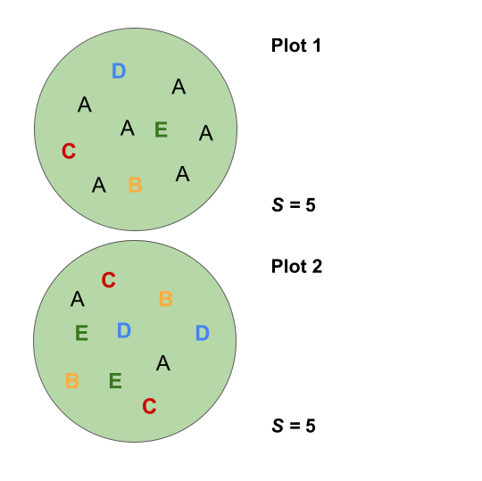
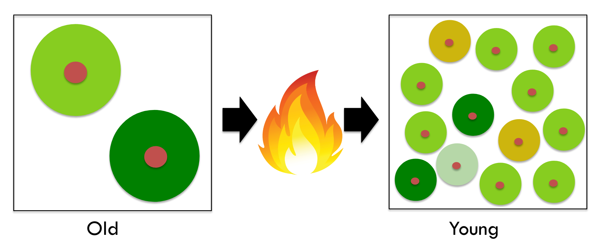
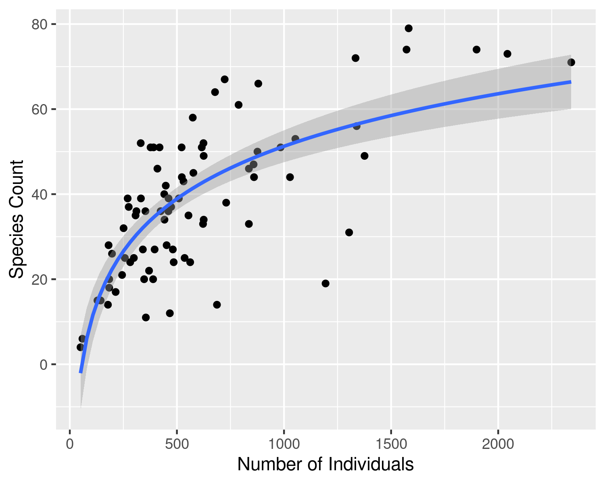
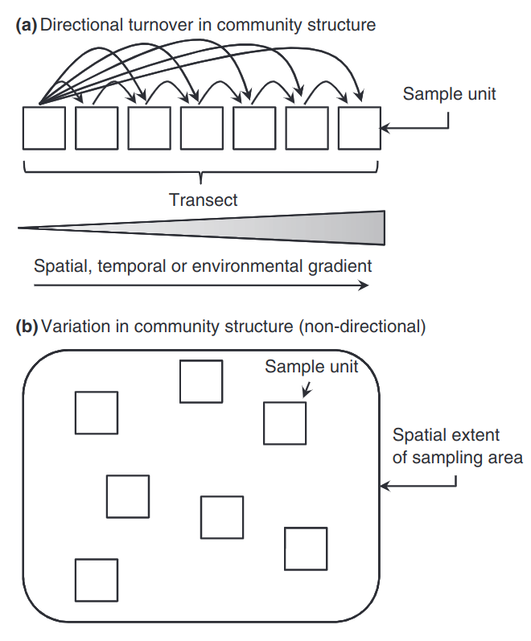
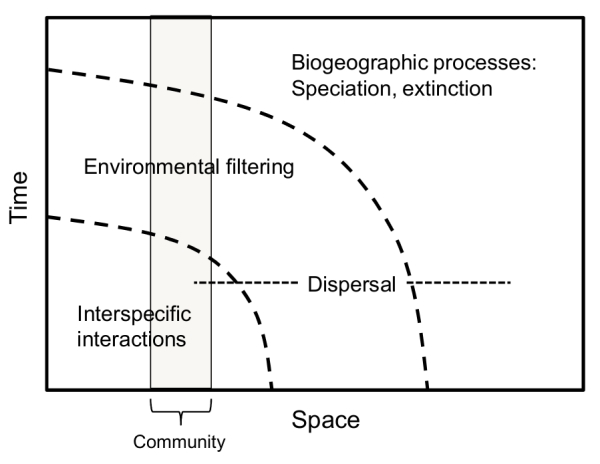
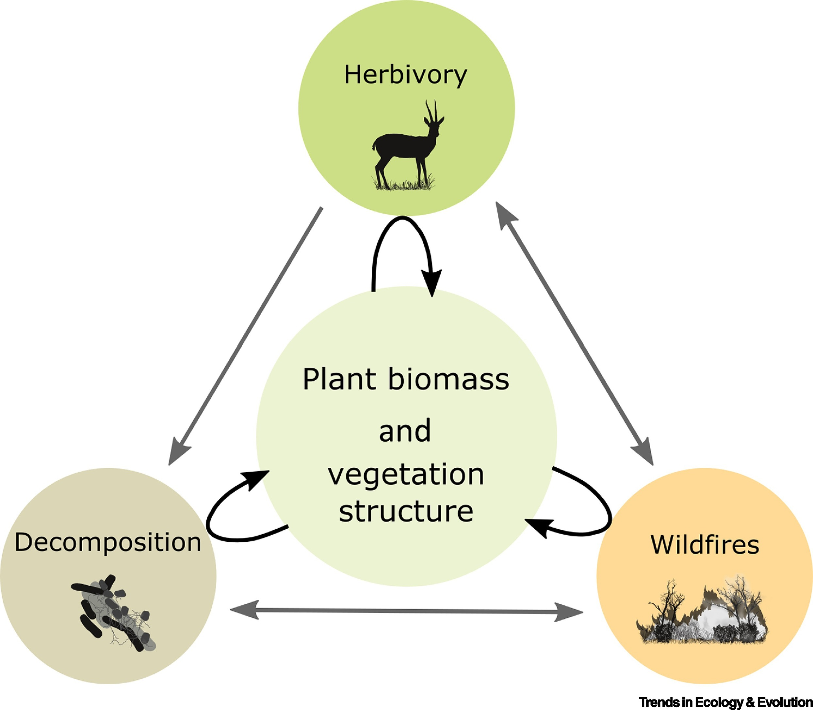
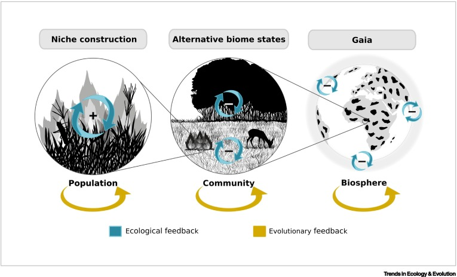

```{r setup, include=FALSE}
options(htmltools.dir.version = FALSE)
knitr::opts_chunk$set(
  fig.width=9, fig.height=3.5, fig.retina=3,
  out.width = "100%",
  cache = FALSE,
  echo = TRUE,
  message = FALSE, 
  warning = FALSE,
  hiline = TRUE
)

library(RefManageR)
BibOptions(check.entries = FALSE,
           bib.style = "authoryear",
           cite.style = "alphabetic",
           style = "markdown",
           hyperlink = FALSE,
           dashed = FALSE)
myBib <- ReadBib("bib/1_intro.bib", check = FALSE)
```

```{r xaringan-themer, include=FALSE, warning=FALSE}
library(xaringanthemer)

# style_duo_accent(
#   primary_color = "#1381B0",
#   secondary_color = "#FF961C",
#   inverse_header_color = "#FFFFFF"
# )

style_mono_light(base_color = "#23395b")

library(knitr)
library(kableExtra)
```

## A quick overview of the exam

Answer three of four 50 mark essay questions (but read the instructions!).

Most questions integrate across content from multiple lecturers. The most relevant lecturers are indicated for each question. Feel free to include content from other lecturers (especially examples), but don't ignore the content of the lecturers indicated.

The final mark allocation by lecturer for the course (across the test and exam) is roughly proportional to the number of lectures in their section. That said, all sections are relevant to the exam, especially given the integrative nature of the essays.

So the mark allocation across the 4 questions (200 marks) in the exam is roughly:

- Laurence 50
- Robert 15
- Dawood 10
- Charlene 50
- Mike 40
- Jasper 35

---

layout: false

.pull-left[
## My lectures

_Note that I provided examples from African ecosystems as far as was possible in the time I had...  ...but the theory is universal, so think about how the content I taught may apply to examples or case studies introduced by other lecturers._

*Other notes:*
- The Power Analysis session was part of the Independent Projects and won't be in the exam.
- The content of the practical is relevant to the exam as the exercise was aimed at reinforcing the content of the lectures.
- We had a few field lectures/discussions that were aimed at helping you ground the theory in real world examples.
]

.pull-right[

<br>

1. Introduction to measuring diversity

2. Species richness and diversity: Alpha Diversity

3. Species richness and diversity: Beta Diversity

4. Functional and Phylogenetic Diversity

5. Traits, Trade-Offs and Phylogeny

6. The Assembly of Diversity: Local processes

7. The Assembly of Diversity: Regional processes

8. Biodiversity and Ecosystem Function

9. Remote Sensing of Biodiversity

10. Feedbacks in Ecology
]

---

layout: false

## 1. Why do we need to be able to measure biodiversity?

```{r echo = F, fig.align = 'center', out.width = '58%'}
knitr::include_graphics("images/chapin2.png")
```

1. What determines the composition and diversity of communities and ecosystems at various scales?

2. What is the role of biodiversity in ecosystem function (and derived societal benefits)?

3. How is biodiversity changing and what are the impacts on ecosystem services?

4. How can we mitigate or adapt to changing biodiversity and ecosystem services?

.pull-right[
.footnote[Figure modified from Chapin et al. 1997, _Science_]
]

---

layout: false

.pull-left[
## 1-4 (All). What is biodiversity and what is the best way to measure it?

<br>

> "biodiversity is the sum total of all biotic variation from the level of genes to ecosystems" - Purvis & Hector 2000, _Nature_

]

.pull-right[
```{r echo = F, fig.align = 'center', out.width = '100%'}
knitr::include_graphics("images/Noss_Biodiversity.png")
```
.footnote[Noss 1990, _Conservation Biology_]
]

---

layout: false

.pull-left[

## 2-3. What are the major components of biodiversity and how do we measure them?

Alpha $(\alpha)$ = mean species diversity/richness within local-scale sites, habitats or communities (often termed "point diversity")

Beta $(\beta)$ = diversity/richness differences between sites or habitats (attributable to species "turnover" or "nestedness")

Gamma $(\gamma)$ = total landscape species diversity/richness

.footnote[Whittaker (1972)]
]

.pull-right[
```{r echo = F, fig.align = 'right', out.width = '110%'}
knitr::include_graphics("images/diversitycomponents.png")
```
]

---


layout: false

.pull-left[

## 2. What are the issues when quantifying $\alpha$-diversity and how can we handle them?


```{r echo = F, fig.align = 'center', out.width = '60%'}

```

]

.pull-right[

```{r echo = F, fig.align = 'center', out.width = '90%'}

```

```{r echo = F, fig.align = 'center', out.width = '90%'}

```

]

---

layout: false

.pull-left[
```{r echo = F, fig.align = 'right', out.width = '110%'}

```

]

.pull-right[

##3. Why do we measure $\beta$ diversity and what questions can it be used to address?

The application $\beta$ diversity can be largely split into 
* directional analyses, that explore *turnover* along spatial, temporal or environmental gradients, and 

* non-directional analyses, that explore *variation* within or among groups.

.footnote[figure from Anderson et al. 2011]
]

---

layout: false

.pull-left[

## 4-5. There's a lot of diversity in the functional form and evolutionary history of species...

```{r echo = F, fig.align = 'center', out.width = '75%'}
knitr::include_graphics("images/growthform_USGS_image_cropped.jpg")
```
]

.pull-right[

```{r echo = F, fig.align = 'center', out.width = '100%'}
knitr::include_graphics("images/traitevolution_cb2004.png")
```

...and these are strongly interrelated...

The evolutionary history of species leaves a strong imprint on current ecology, especially through _trait and niche conservatism_.

_Trade-offs_ among traits constrain the potential combinations of traits and constrain species' niches.

We can measure _functional_ and _phylogenetic_ diversity and use them help us to address ecological and evolutionary questions.

]


---

layout: false

## 6-7. What determines the assembly of species pools?
#### How do the processes vary with spatial and temporal scale? How can we use measures of biodiversity to infer their contribution to observed pattern?

.pull-left[

```{r echo = F, fig.align = 'center', out.width = '90%'}
knitr::include_graphics("images/speciespools.png")
```

Community assembly can be thought of as the successive filtering of species pools descending in spatial (and temporal) scale from global to local

]

.pull-right[

```{r echo = F, fig.align = 'center', out.width = '70%'}

```

We often split it into **regional** versus **local** processes, but they are intricately intertwined...

]

---

.pull-left[
## 8. What are the mechanisms by which biodiversity affects ecosystem function?

```{r echo = F, fig.align = 'left', out.width = '80%'}
knitr::include_graphics("images/hooper_fig1.jpg")
```
]

.pull-right[
```{r echo = F, fig.align = 'center', out.width = '90%'}
knitr::include_graphics("images/loreau2001.jpeg")
```

...and what are the implications of biodiversity loss?

]

---

layout: false

.pull-left[
## 9. What is the promise of and potential challenges for remote sensing of biodiversity?

```{r echo = F, fig.align = 'left', out.width = '70%'}
knitr::include_graphics("images/cawse2021_spectra.png")
```

]

.pull-right[
```{r echo = F, fig.align = 'center', out.width = '100%'}
knitr::include_graphics("images/peninsula_hyperspec.png")
```
]

---

layout: false

.pull-left[
## 10. Feedbacks in ecology

<br>

Organisms with different traits can modify their environment (e.g. by altering flammability, palatability or decomposability), and these modifications can feed back to generate emergent properties at different scales, with ecological and evolutionary consequences...

Thresholds from where feedbacks can be disrupted can generate abrupt (nonlinear) changes (Alternative Stable States).

Simple cause–effect thinking may not be adequate when inferring community assembly, ecosystem function or the potential impacts of global change.
]

.pull-right[
```{r echo = F, fig.align = 'center', out.width = '70%'}

```

```{r echo = F, fig.align = 'center', out.width = '90%'}

```
]

---

class: center, middle

# Thanks!

Slides created via the R packages:

[**xaringan**](https://github.com/yihui/xaringan)<br>
[gadenbuie/xaringanthemer](https://github.com/gadenbuie/xaringanthemer)

The chakra comes from [remark.js](https://remarkjs.com), [**knitr**](http://yihui.name/knitr), and [R Markdown](https://rmarkdown.rstudio.com).
