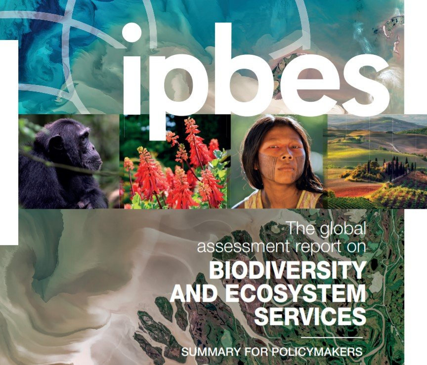
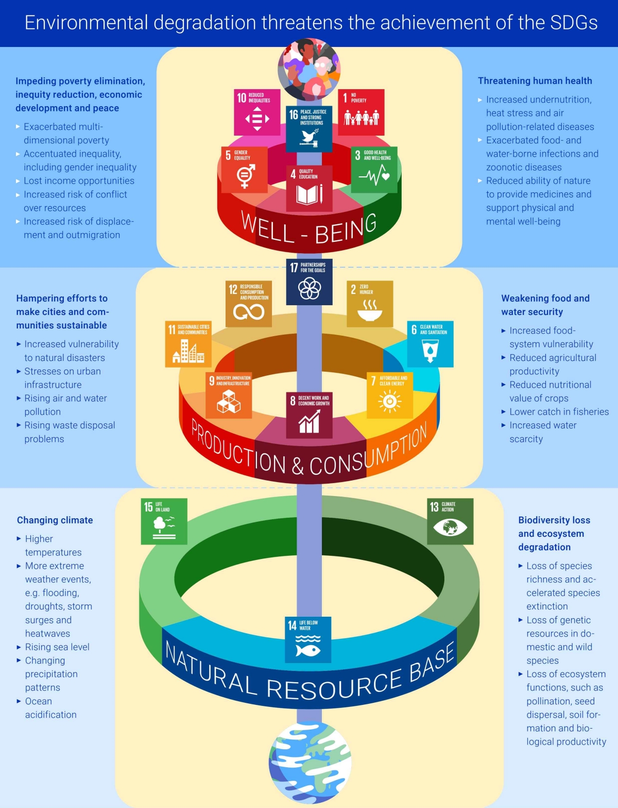
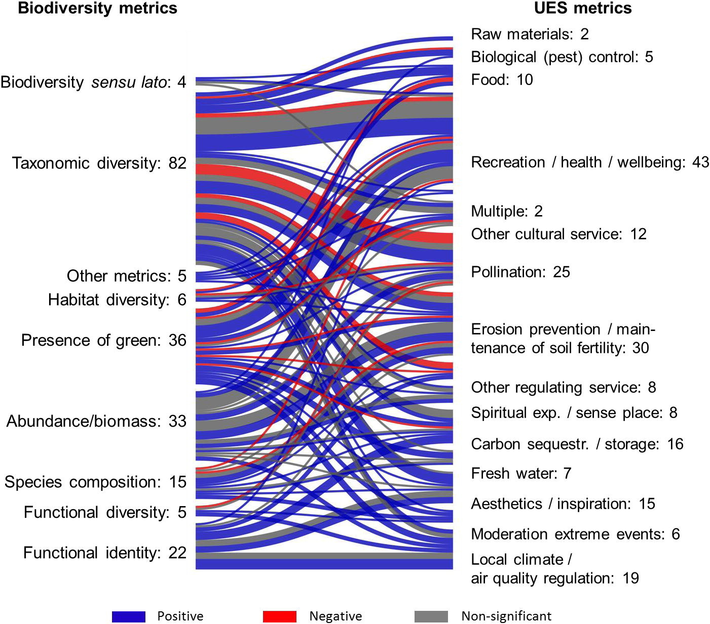
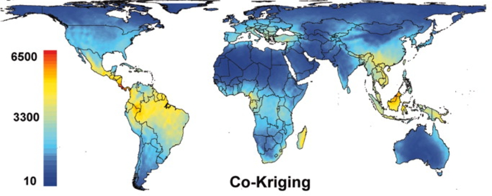
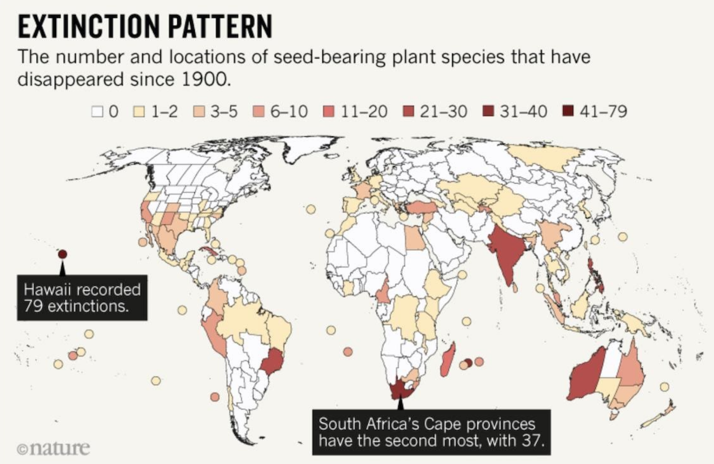
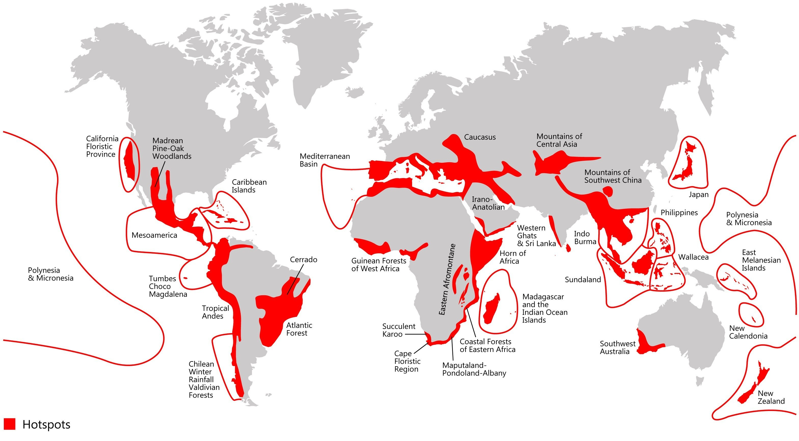
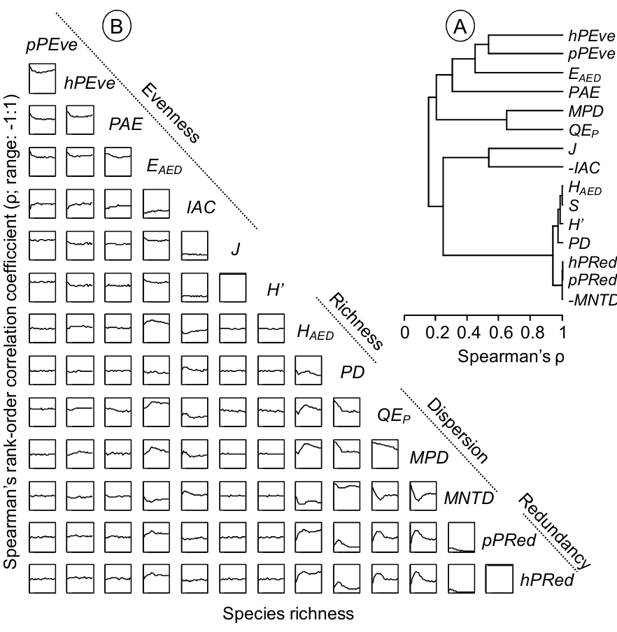
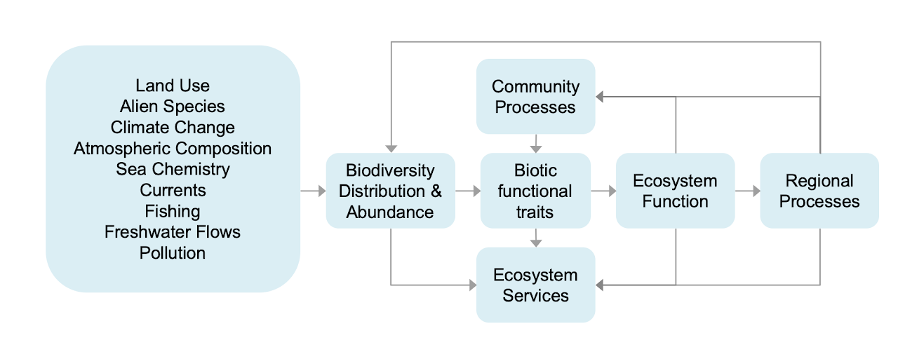

```{r setup, include=FALSE}
options(htmltools.dir.version = FALSE)
knitr::opts_chunk$set(
  fig.width=9, fig.height=3.5, fig.retina=3,
  out.width = "100%",
  cache = FALSE,
  echo = TRUE,
  message = FALSE, 
  warning = FALSE,
  hiline = TRUE
)

library(RefManageR)
BibOptions(check.entries = FALSE,
           bib.style = "authoryear",
           cite.style = "alphabetic",
           style = "markdown",
           hyperlink = FALSE,
           dashed = FALSE)
myBib <- ReadBib("bib/1_intro.bib", check = FALSE)
```

```{r xaringan-themer, include=FALSE, warning=FALSE}
library(xaringanthemer)

# style_duo_accent(
#   primary_color = "#1381B0",
#   secondary_color = "#FF961C",
#   inverse_header_color = "#FFFFFF"
# )

style_mono_light(base_color = "#23395b")

library(knitr)
library(kableExtra)
```

layout: false

.pull-left[
## We depend on biodiversity...

There is growing focus on the importance of biodiversity for our survival, with large global initiatives like the Intergovernmental Science-Policy Platform on Biodiversity and Ecosystem Services (IPBES) focused on strengthening the science-policy interface for biodiversity and ecosystem services for the conservation and sustainable use of biodiversity, long-term human well-being and sustainable development.

.footnote[https://ipbes.net/global-assessment]
]

.pull-right[
```{r echo = F, fig.align = 'right', out.width = '110%'}

```
]

---

layout: false

.pull-left[
## We depend on biodiversity...

Attainment of the Sustainable Development Goals (SDGs) depends on the attainment of the goals relating to natural resource management, namely:

- SDG 13 Climate Action
- SDG 14 Life Below Water
- SDG 15 Life On Land

.footnote[https://www.unep.org/resources/making-peace-nature]
]

.pull-right[
```{r echo = F, fig.align = 'right', out.width = '90%'}

```
]

---

layout: false

## We need to measure biodiversity to...

.pull-left[
### Understand the role of biodiversity

Here we see relationships between biodiversity metrics and urban ecosystem services (UES) that have been tested empirically (from Schwartz et al. 2017).
]

.pull-right[
```{r echo = F, fig.align = 'right', out.width = '100%'}

```
]

---

layout: false

## We need to measure biodiversity to...

### Map the distribution of species and ecosystems

```{r echo = F, fig.align = 'center', out.width = '60%'}
knitr::include_graphics("images/resolv_ecoregions2017.png")
```

.footnote[https://ecoregions.appspot.com/]

---

layout: false

## We need to measure biodiversity to...

### Test macroecological theory - e.g. What determines species richness?

```{r echo = F, fig.align = 'center', out.width = '80%'}

```
.footnote[Kreft & Jetz 2007, _PNAS_]

---

layout: false

## We need to measure biodiversity to...

### Track change in biodiversity

```{r echo = F, fig.align = 'center', out.width = '50%'}

```

.footnote[Humphreys et al. 2019]

---

layout: false

## We need to measure biodiversity to...

### Set conservation priorities

```{r echo = F, fig.align = 'center', out.width = '60%'}

```

.footnote[https://www.conservation.org/priorities/biodiversity-hotspots]

---

layout: false

.pull-left[
## There are many facets of biodiversity to measure!

<br>

> "biodiversity is the sum total of all biotic variation from the level of genes to ecosystems" - Purvis & Hector 2000, _Nature_

]

.pull-right[
```{r echo = F, fig.align = 'center', out.width = '100%'}
knitr::include_graphics("images/Noss_Biodiversity.png")
```
.footnote[Noss 1990, _Conservation Biology_]
]

---

.pull-left[
## There are many facets of biodiversity to measure!

#### Essential Biodiversity Variables (EBVs)

```{r echo = F, fig.align = 'center', out.width = '80%'}
knitr::include_graphics("images/ebv_circle.png")
```

.footnote[https://geobon.org/]
]

.pull-right[
```{r echo=FALSE}
ebvs <- read.csv("images/ebvs.csv", header = T)

kable(ebvs)  %>%
  kable_styling(font_size = 12)
```
]

---

.pull-left[
## And many ways of measuring them!

#### Many kinds of diversity
*   Genetic diversity
*   Taxonomic diversity
*   Phylogenetic diversity
*   Functional diversity
*   Ecosystem diversity
*   etc...

#### And many methods for measuring each of them!!!
]

.pull-right[
```{r echo = F, fig.align = 'center', out.width = '100%'}

```
.footnote[A comparison of **_some_** phylogenetic diversity indices from Slingsby 2011, _PhD Thesis_]
]

---

## My research focuses on four questions...

```{r echo = F, fig.align = 'center', out.width = '58%'}

```

1. What determines the composition and diversity of communities and ecosystems at various scales?

2. What is the role of biodiversity in ecosystem function (and derived societal benefits)?

3. How is biodiversity changing and what are the impacts on ecosystem services?

4. How can we mitigate or adapt to changing biodiversity and ecosystem services?

.pull-right[
.footnote[Figure modified from Chapin et al. 1997, _Science_]
]

---
class: center

## But!

> *"The use of different measures or analytical approaches on a single set of data can naturally result in quite different outcomes and interpretations."* - Anderson et al. 2011

<br>

In other words, there is no one perfect measure of biodiversity.

<br>

Measures of biodiversity are in fact hypotheses, and should be treated as such. Most biodiversity-related hypotheses should be prefaced *"Assuming our measure of biodiversity is a reasonable approximation of reality, then..."*

<br>

It's crucial that we master the methods for measuring and analyzing biodiversity data, and explore the assumptions and implications of the measures we use, if we hope to answer the questions at hand...
    
---

## References

```{r refs, echo=FALSE, results="asis"}
NoCite(myBib)
PrintBibliography(myBib)
```

---

.pull-left[
## My research focuses on community composition

```{r echo = F, fig.align = 'center', out.width = '75%'}
knitr::include_graphics("images/Noss_Biodiversity.png")
```
.footnote[Noss 1990, _Conservation Biology_]
]

.pull-right[
```{r echo=FALSE}
ebvs <- read.csv("images/ebvs.csv", header = T)

kable(ebvs)  %>%
  kable_styling(font_size = 12) %>%
  row_spec(c(11:13), bold = T, color = "white", background = "#23395b")
```
]

---

## Note: composition can apply to any spatial scale

.pull-left[
### Ecosystem types         $\rightarrow$

```{r echo = F, fig.align = 'center', out.width = '100%'}
knitr::include_graphics("images/resolv_ecoregions2017.png")
```

.footnote[https://ecoregions.appspot.com/]
]

.pull-right[
### Ecosystem composition

#### e.g.estimated species richness

```{r echo = F, fig.align = 'center', out.width = '100%'}

```
.footnote[Kreft & Jetz 2007, _PNAS_]
]

---

## Exploring composition allows many insights

.pull-left[
### Global conservation priorities

```{r echo = F, fig.align = 'center', out.width = '100%'}

```

.footnote[https://www.conservation.org/priorities/biodiversity-hotspots]
]

.pull-right[
### Testing macroecological theory

#### What determines species richness?

```{r echo = F, fig.align = 'center', out.width = '100%'}

```
.footnote[Kreft & Jetz 2007, _PNAS_]
]

---

name: colors

## Colors

.left-column[
Text color

[Link Color](#3)

**Bold Color**

_Italic Color_

`Inline Code`
]

.right-column[
Lorem ipsum dolor sit amet, [consectetur adipiscing elit (link)](#3), 
sed do eiusmod tempor incididunt ut labore et dolore magna aliqua. 
Erat nam at lectus urna.
Pellentesque elit ullamcorper **dignissim cras tincidunt (bold)** lobortis feugiat. 
_Eros donec ac odio tempor_ orci dapibus ultrices. 
Id porta nibh venenatis cras sed felis eget velit aliquet.
Aliquam id diam maecenas ultricies mi.
Enim sit amet 
`code_color("inline")`
venenatis urna cursus eget nunc scelerisque viverra.
]

---

# Big Topic or Inverse Slides `#`

## Slide Headings `##`

### Sub-slide Headings `###`

#### Bold Call-Out `####`

This is a normal paragraph text. Only use header levels 1-4.

##### Possible, but not recommended `#####`

###### Definitely don't use h6 `######`

---

# Left-Column Headings

.left-column[
## First

## Second

## Third
]

.right-column[
Dolor quis aptent mus a dictum ultricies egestas.

Amet egestas neque tempor fermentum proin massa!

Dolor elementum fermentum pharetra lectus arcu pulvinar.
]

---
class: inverse center middle

# Topic Changing Interstitial

--

```
class: inverse center middle
```

---
layout: true

## Blocks

---

### Blockquote

> This is a blockquote following a header.
>
> When something is important enough, you do it even if the odds are not in your favor.

---

### Code Blocks

#### R Code

```{r eval=FALSE}
ggplot(gapminder) +
  aes(x = gdpPercap, y = lifeExp, size = pop, color = country) +
  geom_point() +
  facet_wrap(~year)
```

#### JavaScript

```js
var fun = function lang(l) {
  dateformat.i18n = require('./lang/' + l)
  return true;
}
```

---

### More R Code

```{r eval=FALSE}
dplyr::starwars %>% dplyr::slice_sample(n = 4)
```

---

```{r message=TRUE, eval=requireNamespace("cli", quietly = TRUE)}
cli::cli_alert_success("It worked!")
```

--

```{r message=TRUE}
message("Just a friendly message")
```

--

```{r warning=TRUE}
warning("This could be bad...")
```

--

```{r error=TRUE}
stop("I hope you're sitting down for this")
```


---
layout: true

## Tables

---
exclude: `r if (requireNamespace("tibble", quietly=TRUE)) "false" else "true"`

```{r eval=requireNamespace("tibble", quietly=TRUE)}
tibble::as_tibble(mtcars)
```

---

```{r}
knitr::kable(head(mtcars), format = 'html')
```

---
exclude: `r if (requireNamespace("DT", quietly=TRUE)) "false" else "true"`

```{r eval=requireNamespace("DT", quietly=TRUE)}
DT::datatable(head(mtcars), fillContainer = FALSE, options = list(pageLength = 4))
```

---
layout: true

## Lists

---

.pull-left[
#### Here is an unordered list:

*   Item foo
*   Item bar
*   Item baz
*   Item zip
]

.pull-right[

#### And an ordered list:

1.  Item one
1.  Item two
1.  Item three
1.  Item four
]

---

### And a nested list:

- level 1 item
  - level 2 item
  - level 2 item
    - level 3 item
    - level 3 item
- level 1 item
  - level 2 item
  - level 2 item
  - level 2 item
- level 1 item
  - level 2 item
  - level 2 item
- level 1 item

---

### Nesting an ol in ul in an ol

- level 1 item (ul)
  1. level 2 item (ol)
  1. level 2 item (ol)
    - level 3 item (ul)
    - level 3 item (ul)
- level 1 item (ul)
  1. level 2 item (ol)
  1. level 2 item (ol)
    - level 3 item (ul)
    - level 3 item (ul)
  1. level 4 item (ol)
  1. level 4 item (ol)
    - level 3 item (ul)
    - level 3 item (ul)
- level 1 item (ul)

---
layout: true

## Plots

---

```{r plot-example, eval=requireNamespace("ggplot2", quietly=TRUE)}
library(ggplot2)
(g <- ggplot(mpg) + aes(hwy, cty, color = class) + geom_point())
```

---

```{r plot-example-themed, eval=requireNamespace("ggplot2", quietly=TRUE)}
g + xaringanthemer::theme_xaringan(text_font_size = 16, title_font_size = 18) +
  ggtitle("A Plot About Cars")
```

---
layout: false

## Square image

<center></center>

.footnote[GitHub Octocat]

---

### Wide image


.footnote[Wide images scale to 100% slide width]

---

## Two images

.pull-left[

]

.pull-right[

]

---

### Definition lists can be used with HTML syntax.

<dl>
<dt>Name</dt>
<dd>Godzilla</dd>
<dt>Born</dt>
<dd>1952</dd>
<dt>Birthplace</dt>
<dd>Japan</dd>
<dt>Color</dt>
<dd>Green</dd>
</dl>

---
class: center, middle

# Thanks!

Slides created via the R packages:

[**xaringan**](https://github.com/yihui/xaringan)<br>
[gadenbuie/xaringanthemer](https://github.com/gadenbuie/xaringanthemer)

The chakra comes from [remark.js](https://remarkjs.com), [**knitr**](http://yihui.name/knitr), and [R Markdown](https://rmarkdown.rstudio.com).
