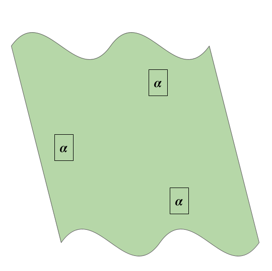
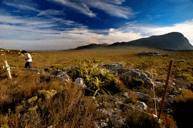
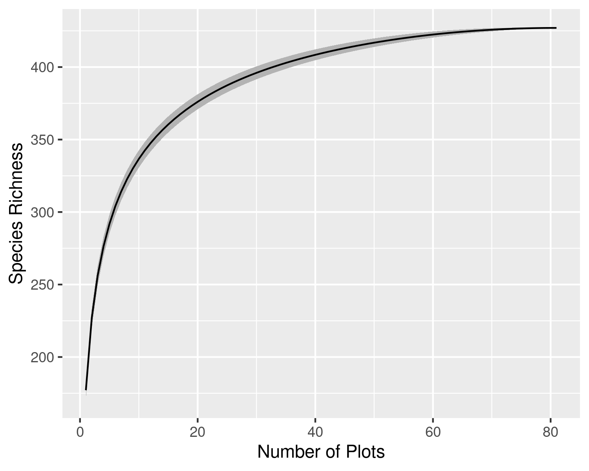

```{r setup, include=FALSE}
options(htmltools.dir.version = FALSE)
knitr::opts_chunk$set(
  fig.width=9, fig.height=3.5, fig.retina=3,
  out.width = "100%",
  cache = FALSE,
  echo = TRUE,
  message = FALSE, 
  warning = FALSE,
  hiline = TRUE
)

library(RefManageR)
BibOptions(check.entries = FALSE,
           bib.style = "authoryear",
           cite.style = "alphabetic",
           style = "markdown",
           hyperlink = FALSE,
           dashed = FALSE)
myBib <- ReadBib("bib/2_species.bib", check = FALSE)
```

```{r xaringan-themer, include=FALSE, warning=FALSE}
library(xaringanthemer)

# style_duo_accent(
#   primary_color = "#1381B0",
#   secondary_color = "#FF961C",
#   inverse_header_color = "#FFFFFF"
# )

style_mono_light(base_color = "#23395b")

#https://mycolor.space/?hex=%2323395B&sub=1 
#"Generic gradient"

library(knitr)
library(kableExtra)
```

layout: false

.pull-left[

## How do we compare diversity between sites?

```{r echo = F, fig.align = 'center', out.width = '95%'}
knitr::include_graphics("images/grassland.jpeg")
```
]

.pull-right[

```{r echo = F, fig.align = 'center', out.width = '75%'}
knitr::include_graphics("images/fynbos.png")
```

```{r echo = F, fig.align = 'center', out.width = '75%'}
knitr::include_graphics("images/forestyoung.jpg")
```
]

---

layout: false

.pull-left[
## $\alpha$-diversity

The species diversity/richness within local-scale sites, habitats or communities (often termed "point diversity") is called **alpha $(\alpha)$ diversity**.

.footnote[Whittaker (1972)]
]

.pull-right[
```{r echo = F, fig.align = 'right', out.width = '110%'}

```

.footnote[Three sample localities in a landscape.]
]

---

layout: false

.pull-left[

## Quantifying $\alpha$-diversity...

Can be counts of the number of species in samples,

```{r echo = F, fig.align = 'center', out.width = '70%'}
knitr::include_graphics("images/alphadiversity1.png")
```

]

.pull-right[

<br>

*S* = a simple count of species

]

---

layout: false

.pull-left[

## Quantifying $\alpha$-diversity...

Can be counts of the number of species in samples,

```{r echo = F, fig.align = 'center', out.width = '70%'}
knitr::include_graphics("images/alphadiversity1.png")
```

]

.pull-right[

<br>

*S* = a simple count of species

<br>

*But what of relative abundance?*

Should a species that is represented by one individual be considered equivalent to one with thousands of individuals?

]

---

layout: false

.pull-left[

## Quantifying $\alpha$-diversity...

Can be counts of the number of species in samples, 

```{r echo = F, fig.align = 'center', out.width = '70%'}
knitr::include_graphics("images/alphadiversity1.png")
```

or include information on their **relative abundance**

]

.pull-right[

<br>

*S* = a simple count of species

<br>

*But what of relative abundance?*

Should a species that is represented by one individual be considered equivalent to one with thousands of individuals?

<br>

A community is considered more diverse if the relative abundances are more evenly distributed 
- because removing one individual is less likely to remove a species.
]

---

layout: false

.pull-left[

## Quantifying $\alpha$-diversity...

Can be counts of the number of species in samples, 

```{r echo = F, fig.align = 'center', out.width = '70%'}
knitr::include_graphics("images/alphadiversity.png")
```

or include information on their **relative abundance**

]

.pull-right[

<br>

**Shannon's index** (*H'*) quantifies species diversity taking into account both species' richness and _**evenness**_ in their relative abundance

$H' = -\sum_{i=1}^{n}(p_i*ln(p_i))$ 

where $p_i$ is the proportion of individuals belonging to the *i*th species.

<br>

You can also quantify evenness independently of richness, e.g. 

- **Pielou's evenness** (*J*) in the relative abundance (independent of *S*) can be calculated directly as $J = H'/log(S)$

    - Ranges near 0 to 1 (maximum evenness)

]

---

layout: false

.pull-left[
## Quantifying $\alpha$-diversity...

Many studies will refer to species counts as "species richness", but this is often in error...

Species counts are sensitive to the number of individuals sampled. 

More individuals means greater potential to encounter more species.

```{r echo = F, fig.align = 'center', out.width = '70%'}

```

]

.pull-right[
```{r echo = F, fig.align = 'right', out.width = '100%'}
knitr::include_graphics("images/spp_ind_accum_CP.png")
```

##### Species counts relative to number of individuals sampled across eighty-one 50m<sup>2</sup> vegetation plots in Table Mountain National Park (data from Slingsby et al. 2017).

The relationship is non-linear and asymptotic.
]

---

layout: false

.pull-left[
## Quantifying $\alpha$-diversity...

Dependence of species counts on number of individuals sampled is problematic when the number of individuals varies between samples (e.g. vegetation plots of different area or with different size individuals, netting events, etc).

```{r echo = F, fig.align = 'center', out.width = '100%'}
knitr::include_graphics("images/fire_age.png")
```

While raw species counts can still be useful for many purposes, it is also useful to have a metric that is independent of abundance and sampling effort.

]

.pull-right[
```{r echo = F, fig.align = 'center', out.width = '90%'}
knitr::include_graphics("images/spp_abund_CP.png")
```

##### Species counts relative to number of individuals sampled for each of eighty-one 50m<sup>2</sup> vegetation plots in Table Mountain National Park (data from Slingsby et al. 2017).

Since the plots are of a set unit area (50m<sup>2</sup>), the species counts in this figure can also be termed ***species density***.
]

---

layout: false

.pull-left[
## Quantifying $\alpha$-diversity...

Dependence of species counts on number of individuals sampled is problematic when the number of individuals varies between samples (e.g. vegetation plots of different area or with different size individuals, netting events, etc).

```{r echo = F, fig.align = 'right', out.width = '100%'}
knitr::include_graphics("images/forest_fynbos.png")
```

While raw species counts can still be useful for many purposes, it is also useful to have a metric that is independent of abundance and sampling effort.

]

.pull-right[
```{r echo = F, fig.align = 'right', out.width = '75%'}
knitr::include_graphics("images/forestyoung.jpg")
```


```{r echo = F, fig.align = 'right', out.width = '75%'}
knitr::include_graphics("images/fynbos.png")
```

]

---

layout: false

.pull-left[

## Species-Area relationship

We often compare the diversity of large areas using the species-area relationship (SAR).

```{r echo = F, fig.align = 'center', out.width = '100%'}
knitr::include_graphics("images/sad.png")
```

]

.pull-right[

We estimate the SAR by sampling nested plots of increasing size.

```{r echo = F, fig.align = 'center', out.width = '40%'}
knitr::include_graphics("images/nested_plots.png")
```

When comparing sites, one solution is to sample enough area to reach the asymptote of the SAR. 

This isn't often logistically (or logically) feasible, so we usually fit curves to estimate the diversity of the larger area by extrapolation.

]

---

layout: false

.pull-left[

## Species-Area relationship

The density of individuals can affect the shape of the species-area relationship (SAR) at fine scales, because of the relationship between species counts and the number of individuals sampled.

```{r echo = F, fig.align = 'center', out.width = '100%'}
knitr::include_graphics("images/sad.png")
```


]

.pull-right[

Many factors can affect the SAR:
- size of individuals
- patchiness/heterogeneity
- dispersal (limitation)
- immigration/extinction
- disturbance
- productivity (e.g. sparse desert vegetation has fewer individuals per unit area)

All sites have same total # of species, but may vary in:
- Site 1 = many, small individuals
- Site 2 = intermediate
- Site 3 = fewer, large individuals

Or:
- Site 1 = homogenous/uniform spread of species
- Site 2 = intermediate
- Site 3 = heterogenous/patchy spread of species


<br>

]

---

layout: false

.pull-left[
## Quantifying $\alpha$-diversity...

###*Species richness* 
...is usually reserved to mean an estimate of the number of species while taking abundance and sampling effort into account (see Gotelli and Colwell 2001 for review).

...is often estimated using individual or sample-based ***rarefaction***<sup>1</sup>. 

Rarefaction involves resampling a set number (*n*) of individuals or samples from the data to determine the expected number of species for any given *n*. Resampling is repeated multiple times for each *n* and the results averaged.

.footnote[<sup>1</sup>there are better methods these days (e.g. Hill numbers), but they are more complicated...]
]

.pull-right[
```{r echo = F, fig.align = 'right', out.width = '100%'}
knitr::include_graphics("images/spec_ind_raref_CP.png")
```

##### Individual-based rarefaction curve developed by sampling individuals from the pooled data from eighty-one 50m<sup>2</sup> vegetation plots in Table Mountain National Park (data from Slingsby et al. 2017). Black line = mean; gray = standard deviation.
]

---

layout: false

.pull-left[
###Individual-based *accumulation* curve 
```{r echo = F, fig.align = 'center', out.width = '85%'}
knitr::include_graphics("images/spp_ind_accum_CP.png")
```

Curve is not smooth, because individuals (and thus species) are added in whatever order (in this case alphabetically by plot).

]

.pull-right[
###Individual-based *rarefaction* curve 

```{r echo = F, fig.align = 'center', out.width = '85%'}
knitr::include_graphics("images/spec_ind_raref_CP.png")
```

Curve is smooth, because individuals (and thus species) are repeatedly sampled and averaged for each sample size.

]

---

layout: false

.pull-left[
###Sample-based *accumulation* curve 
```{r echo = F, fig.align = 'center', out.width = '85%'}
knitr::include_graphics("images/spp_sites_accum_CP.png")
```

Curve is not smooth, because samples (and thus species) are added in whatever order (in this case by plot number).

]

.pull-right[
###Sample-based *rarefaction* curve 

<br>

```{r echo = F, fig.align = 'center', out.width = '85%'}

```

Curve is smooth, because samples (and thus species) are repeatedly sampled and averaged for each sample size.

]


---

layout: false

##Comparing diversity between sites or surveys

.pull-left[
####Sample-based *rarefaction* 
```{r echo = F, fig.align = 'center', out.width = '75%'}
knitr::include_graphics("images/spec_sites_raref_CP_comp.png")
```

]

.pull-right[
####Individual-based *rarefaction* 

```{r echo = F, fig.align = 'center', out.width = '75%'}

```
]

Note that you can compare between sites by rarefying for a set number of individuals or plots! 

Rarefying by samples doesn't really get around the issue of different numbers of individuals though...

---

layout: false

##Comparing diversity between *samples*

.pull-left[
####Raw species counts 
```{r echo = F, fig.align = 'center', out.width = '60%'}
knitr::include_graphics("images/spec_comp_CP.png")
```

.footnote[Note the difference in correlation (_R_) and slope (_y_).]

]

.pull-right[
####Individual-based *rarefaction*<sup>1</sup>

```{r echo = F, fig.align = 'center', out.width = '60%'}

```

.footnote[<sup>1</sup>for *n* = 10 individuals from each sample]
]

---

layout: false

##Comparing diversity between *samples*

.pull-left[
####Raw species counts 
```{r echo = F, fig.align = 'center', out.width = '60%'}
knitr::include_graphics("images/spec_comp_hist_CP.png")
```

Paired T-test: t = 1.4957, df = 80, p-value = 0.1387
]

.pull-right[
####Individual-based *rarefaction*<sup>1</sup>

```{r echo = F, fig.align = 'center', out.width = '60%'}

```

Paired T-test: t = 3.2953, df = 80, p-value = _***0.0015***_

.footnote[<sup>1</sup>for *n* = 10 individuals from each sample]
]

---

class: center, middle

## Take home
Alpha diversity is the diversity at a point location (e.g. a vegetation plot).

Measures of species diversity can consider both the counts of species and evenness in their relative abundance.

Measures of species diversity are affected by factors like the area and number of individuals sampled. Other factors can be important too, like the timing and length of time sampled for (e.g. bird netting, fishing, etc) or the heterogeneity of the environment if sampling by area.

You need to choose your measure of diversity carefully, and potentially correct for these sampling effects (e.g. by using rarefaction, sampling a larger area, estimating the species-area relationship, etc), depending on your question and the taxonomic groups you're working on.

---

## References

```{r refs, echo=FALSE, results="asis"}
NoCite(myBib)
PrintBibliography(myBib)
```

---
class: center, middle

# Thanks!

Slides created via the R packages:

[**xaringan**](https://github.com/yihui/xaringan)<br>
[gadenbuie/xaringanthemer](https://github.com/gadenbuie/xaringanthemer)
