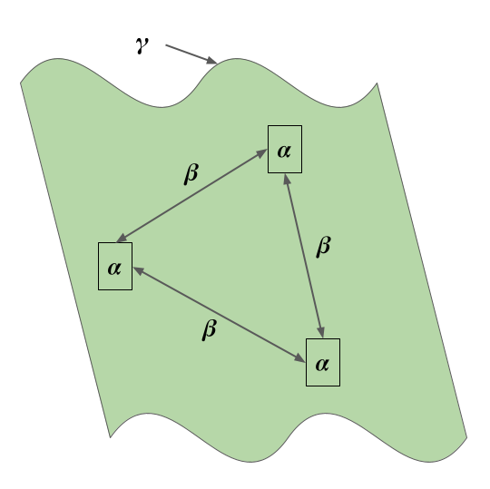
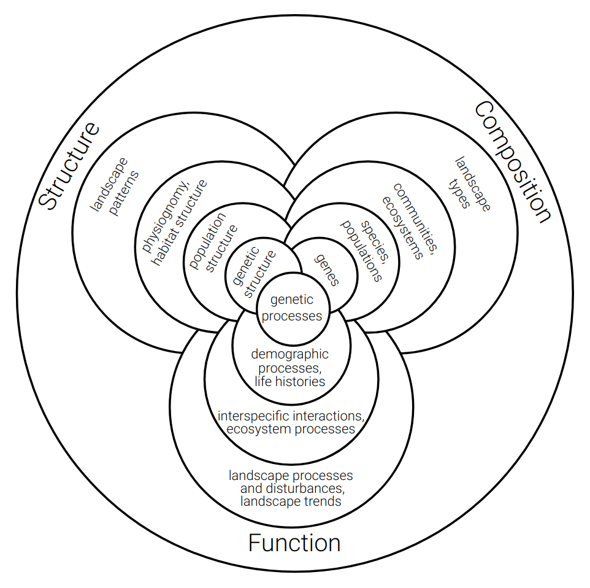
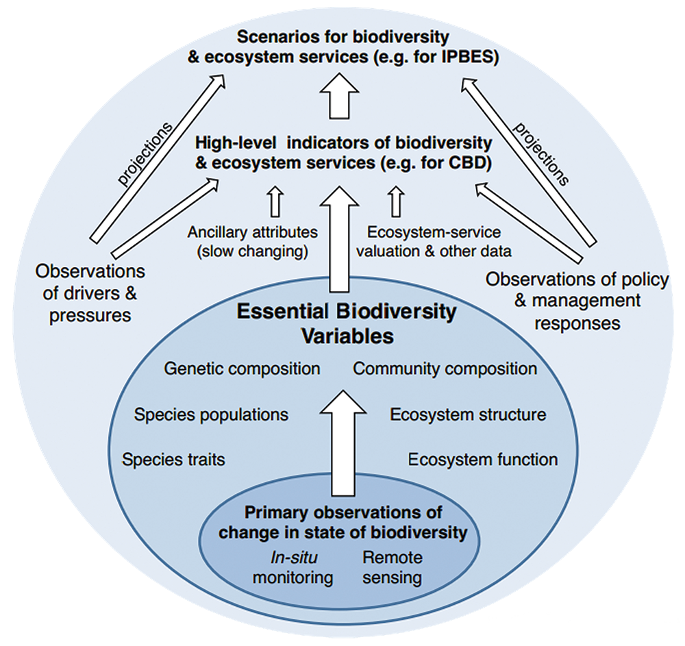

```{r setup, include=FALSE}
options(htmltools.dir.version = FALSE)
knitr::opts_chunk$set(
  fig.width=9, fig.height=3.5, fig.retina=3,
  out.width = "100%",
  cache = FALSE,
  echo = TRUE,
  message = FALSE, 
  warning = FALSE,
  hiline = TRUE
)
```

```{r xaringan-themer, include=FALSE, warning=FALSE}
library(xaringanthemer)

# style_duo_accent(
#   primary_color = "#1381B0",
#   secondary_color = "#FF961C",
#   inverse_header_color = "#FFFFFF"
# )

style_mono_light(base_color = "#006287")

#https://mycolor.space/?hex=%2323395B&sub=1 
#"Generic gradient"

library(knitr)
library(kableExtra)
```

layout: false

.pull-left[
## The components of diversity

Alpha $(\alpha)$ = mean species diversity/richness within local-scale sites, habitats or communities (often termed "point diversity")

Beta $(\beta)$ = diversity/richness differences between sites or habitats (attributable to species "turnover" or "nestedness")

Gamma $(\gamma)$ = total landscape-scale species diversity/richness ()

.footnote[...]
]

.pull-right[
```{r echo = F, fig.align = 'right', out.width = '110%'}

```
]

---

layout: false

.pull-left[
## The decomposition of diversity...

These components are interrelated such that:

$\gamma = \alpha + \beta$

.footnote[]
]

.pull-right[
```{r echo = F, fig.align = 'right', out.width = '110%'}

```
]

---

## Understanding the role of biodiversity...

.pull-left[
### ...requires measuring it

Here we see relationships between biodiversity metrics and urban ecosystem services (UES) that have been tested empirically (from Schwarz et al. 2017, _Ecosystem Services_).
]

.pull-right[
```{r echo = F, fig.align = 'right', out.width = '100%'}
knitr::include_graphics("images/ecosystem_functions.jpg")
```
]

---

.pull-left[
## There are many facets of biodiversity to measure!

> "biodiversity is the sum total of all biotic variation from the level of genes to ecosystems" - Purvis & Hector 2000, _Nature_
]

.pull-right[
```{r echo = F, fig.align = 'center', out.width = '100%'}

```
.footnote[Noss 1990, _Conservation Biology_]
]

---

.pull-left[
## There are many facets of biodiversity to measure!

#### Essential Biodiversity Variables (EBVs)

```{r echo = F, fig.align = 'center', out.width = '80%'}

```

.footnote[https://geobon.org/]
]

.pull-right[
```{r echo=FALSE}
ebvs <- read.csv("images/ebvs.csv", header = T)

kable(ebvs)  %>%
  kable_styling(font_size = 12)
```
]

---

.pull-left[
## And many ways of measuring them!

#### Many kinds of diversity
*   Genetic diversity
*   Taxonomic diversity
*   Phylogenetic diversity
*   Functional diversity
*   Ecosystem diversity
*   etc...

#### And many methods for measuring each of them!!!
]

.pull-right[
```{r echo = F, fig.align = 'center', out.width = '100%'}
knitr::include_graphics("images/diversitymeasures.png")
```
.footnote[A comparison of **_some_** phylogenetic diversity indices from Slingsby 2011, _PhD Thesis_]
]

---
class: center, middle

# Thanks!

Slides created via the R packages:

[**xaringan**](https://github.com/yihui/xaringan)<br>
[gadenbuie/xaringanthemer](https://github.com/gadenbuie/xaringanthemer)

The chakra comes from [remark.js](https://remarkjs.com), [**knitr**](http://yihui.name/knitr), and [R Markdown](https://rmarkdown.rstudio.com).
