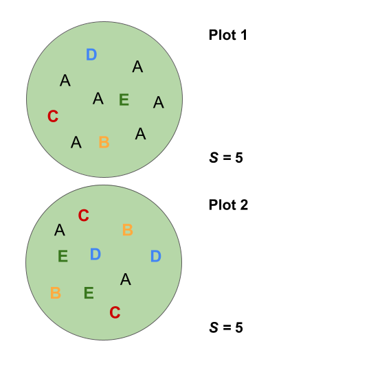
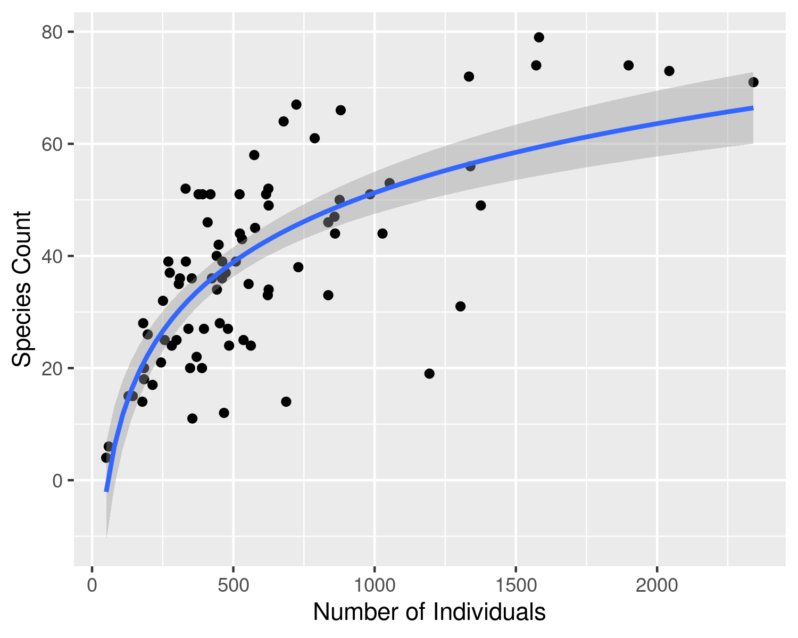
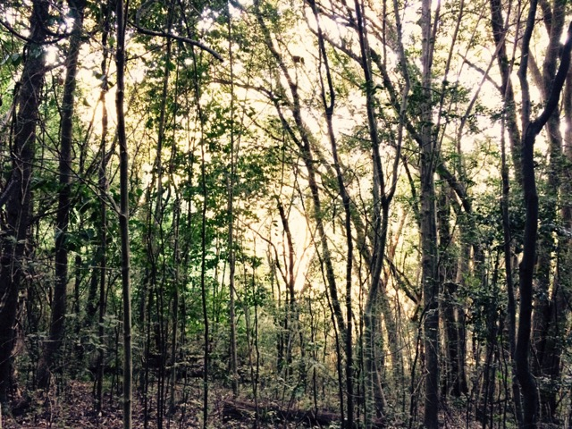
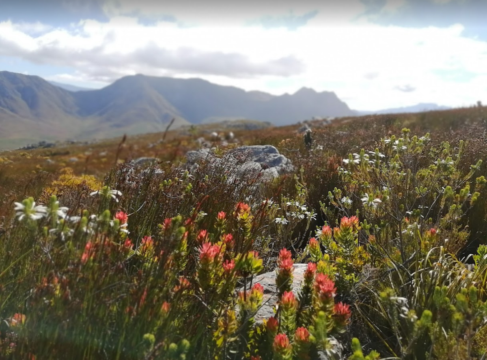

```{r setup, include=FALSE}
options(htmltools.dir.version = FALSE)
knitr::opts_chunk$set(
  fig.width=9, fig.height=3.5, fig.retina=3,
  out.width = "100%",
  cache = FALSE,
  echo = TRUE,
  message = FALSE, 
  warning = FALSE,
  hiline = TRUE
)

library(RefManageR)
BibOptions(check.entries = FALSE,
           bib.style = "authoryear",
           cite.style = "alphabetic",
           style = "markdown",
           hyperlink = FALSE,
           dashed = FALSE)
myBib <- ReadBib("bib/2_species.bib", check = FALSE)
```

```{r xaringan-themer, include=FALSE, warning=FALSE}
library(xaringanthemer)

# style_duo_accent(
#   primary_color = "#1381B0",
#   secondary_color = "#FF961C",
#   inverse_header_color = "#FFFFFF"
# )

style_mono_light(base_color = "#23395b")

#https://mycolor.space/?hex=%2323395B&sub=1 
#"Generic gradient"

library(knitr)
library(kableExtra)
```

layout: false

.pull-left[
## The components of diversity

Alpha $(\alpha)$ = mean species diversity/richness within local-scale sites, habitats or communities (often termed "point diversity")

Beta $(\beta)$ = diversity/richness differences between sites or habitats (attributable to species "turnover" or "nestedness")

Gamma $(\gamma)$ = total landscape species diversity/richness

.footnote[Whittaker (1972)]
]

.pull-right[
```{r echo = F, fig.align = 'right', out.width = '110%'}
knitr::include_graphics("images/diversitycomponents.png")
```
]

---

layout: false

## Quantifying $\alpha$-diversity...


.pull-left[

Can be counts of the number of species in samples

```{r echo = F, fig.align = 'center', out.width = '75%'}

```

]

.pull-right[

*S* = a simple count of species

But what of relative abundance?

]

---

layout: false

## Quantifying $\alpha$-diversity...


.pull-left[

Can be counts of the number of species in samples, or include information on their relative abundance.

```{r echo = F, fig.align = 'center', out.width = '75%'}
knitr::include_graphics("images/alphadiversity.png")
```

]

.pull-right[

A community is considered more diverse if the relative abundances are more evenly distributed, because removing one individual is less likely to remove a species.

The Shannon index (*H'*) quantifies species diversity taking into account both species' richness and evenness in their relative abundance

$H' = -\sum_{i=1}^{n}(p_i*ln(p_i))$ 

where $p_i$ is the proportion of individuals belonging to the *i*th species.

Pielou's measure of evenness (*J*) can be calculated directly as $J = H'/log(S)$

]

---

layout: false

.pull-left[
## Quantifying $\alpha$-diversity...

Many studies will refer to species counts as "species richness", but this is often in error...

Species counts are sensitive to the number of individuals sampled. 

More individuals means greater potential to encounter more species.

```{r echo = F, fig.align = 'center', out.width = '60%'}
knitr::include_graphics("images/taylorplot.gif")
```

]

.pull-right[
```{r echo = F, fig.align = 'right', out.width = '100%'}

```

##### Species counts relative to number of individuals sampled across eighty-one 50m<sup>2</sup> vegetation plots in Table Mountain National Park (data from Slingsby et al. 2017).

The relationship is non-linear and asymptotic.
]

---

layout: false

.pull-left[
## Quantifying $\alpha$-diversity...

Dependence of species counts on number of individuals sampled is problematic when the number of individuals varies between samples (e.g. vegetation plots, netting events, etc).

```{r echo = F, fig.align = 'center', out.width = '100%'}
knitr::include_graphics("images/fire_age.png")
```

While raw species counts can still be useful for many purposes, it is also useful to have a metric that is independent of abundance and sampling effort.

]

.pull-right[
```{r echo = F, fig.align = 'center', out.width = '90%'}

```

##### Species counts relative to number of individuals sampled for each of eighty-one 50m<sup>2</sup> vegetation plots in Table Mountain National Park (data from Slingsby et al. 2017).

Since the samples are of a set unit area (50m<sup>2</sup>), the species counts in this figure can also be termed ***species density***.
]

---

layout: false

.pull-left[
## Quantifying $\alpha$-diversity...

Dependence of species counts on number of individuals sampled is problematic when the number of individuals varies between samples (e.g. vegetation plots, netting events, etc).

```{r echo = F, fig.align = 'right', out.width = '100%'}
knitr::include_graphics("images/forest_fynbos.png")
```

While raw species counts can still be useful for many purposes, it is also useful to have a metric that is independent of abundance and sampling effort.

]

.pull-right[
```{r echo = F, fig.align = 'right', out.width = '75%'}

```


```{r echo = F, fig.align = 'right', out.width = '75%'}

```

]

---

layout: false

.pull-left[
## Species-Area relationship

The size and sampling of the number of individuals can also affect the shape of the species-area relationship (SAR) at fine scales.
- Site 1 = many, small individuals
- Site 2 = intermediate
- Site 3 = fewer, large individuals

```{r echo = F, fig.align = 'center', out.width = '50%'}

```

]

.pull-right[

```{r echo = F, fig.align = 'center', out.width = '100%'}
knitr::include_graphics("images/sad.png")
```

One solution is to make sure you sample an area large enough to encompass all species in an area, but this isn't often logistically (or logically) feasible...

Note that many other factors affect the SAR:
- patchiness/heterogeneity
- dispersal (limitation)
- immigration/extinction
- disturbance

]

---

layout: false

.pull-left[
## Quantifying $\alpha$-diversity...

###*Species richness* 
...is usually reserved to mean an estimate of the richness of species while taking abundance and sampling effort into account (see Gotelli and Colwell 2001 for review).

...is often estimated using individual or sample-based ***rarefaction***. 

i.e. resampling a set number (*n*) of individuals or samples from the data to determine the expected number of species for any given *n*. Resampling is repeated multiple times for each *n* and the results averaged.

]

.pull-right[
```{r echo = F, fig.align = 'right', out.width = '100%'}
knitr::include_graphics("images/spec_ind_raref_CP.png")
```

##### Individual-based rarefaction curve developed by sampling individuals from the pooled data from eighty-one 50m<sup>2</sup> vegetation plots in Table Mountain National Park (data from Slingsby et al. 2017).
]

---

layout: false

.pull-left[
###Individual-based *accumulation* curve 
```{r echo = F, fig.align = 'center', out.width = '85%'}

```

Curve is not smooth, because individuals (and thus species) are added in whatever order (in this case alphabetically by plot).

]

.pull-right[
###Individual-based *rarefaction* curve 

```{r echo = F, fig.align = 'center', out.width = '85%'}
knitr::include_graphics("images/spec_ind_raref_CP.png")
```

Curve is smooth, because individuals (and thus species) are repeatedly sampled and averaged for each sample size.

]

---

layout: false

.pull-left[
###Sample-based *accumulation* curve 
```{r echo = F, fig.align = 'center', out.width = '85%'}

```

Curve is not smooth, because samples (and thus species) are added in whatever order (in this case by plot number).

]

.pull-right[
###Sample-based *rarefaction* curve 

<br>

```{r echo = F, fig.align = 'center', out.width = '85%'}
knitr::include_graphics("images/spec_ind_raref_CP.png")
```

Curve is smooth, because samples (and thus species) are repeatedly sampled and averaged for each sample size.

]


---

layout: false

##Comparing diversity between sites or surveys

.pull-left[
###Sample-based *rarefaction* 
```{r echo = F, fig.align = 'center', out.width = '85%'}

```

]

.pull-right[
###Individual-based *rarefaction* 

```{r echo = F, fig.align = 'center', out.width = '85%'}
knitr::include_graphics("images/spec_ind_raref_CP_comp.png")
```
]

Here I compare surveys of permanent veg plots in the Cape of Good Hope section of TMNP from 1966 and 1996.

---

layout: false

##Comparing diversity between *samples*

.pull-left[
###Raw species counts 
```{r echo = F, fig.align = 'center', out.width = '65%'}

```

]

.pull-right[
###Individual-based *rarefaction*<sup>1</sup>

```{r echo = F, fig.align = 'center', out.width = '65%'}
knitr::include_graphics("images/sper_comp_CP.png")
```

]

.footnote[<sup>1</sup>for *n* = 10 individuals]

---

layout: false

##Comparing diversity between *samples*

.pull-left[
###Raw species counts 
```{r echo = F, fig.align = 'center', out.width = '65%'}

```

Paired T-test: t = 1.4957, df = 80, p-value = 0.1387
]

.pull-right[
###Individual-based *rarefaction*<sup>1</sup>

```{r echo = F, fig.align = 'center', out.width = '65%'}
knitr::include_graphics("images/sper_comp_hist_CP.png")
```

Paired T-test: t = 3.2953, df = 80, p-value = _***0.0015***_
]

---

## References

```{r refs, echo=FALSE, results="asis"}
NoCite(myBib)
PrintBibliography(myBib)
```

---
class: center, middle

# Thanks!

Slides created via the R packages:

[**xaringan**](https://github.com/yihui/xaringan)<br>
[gadenbuie/xaringanthemer](https://github.com/gadenbuie/xaringanthemer)
