```{r setup, include=FALSE}
options(htmltools.dir.version = FALSE)
knitr::opts_chunk$set(
  fig.width=9, fig.height=3.5, fig.retina=3,
  out.width = "100%",
  cache = FALSE,
  echo = TRUE,
  message = FALSE, 
  warning = FALSE,
  hiline = TRUE
)

library(RefManageR)
BibOptions(check.entries = FALSE,
           bib.style = "authoryear",
           cite.style = "alphabetic",
           style = "markdown",
           hyperlink = FALSE,
           dashed = FALSE)
myBib <- ReadBib("bib/2_species.bib", check = FALSE)
```

```{r xaringan-themer, include=FALSE, warning=FALSE}
library(xaringanthemer)

# style_duo_accent(
#   primary_color = "#1381B0",
#   secondary_color = "#FF961C",
#   inverse_header_color = "#FFFFFF"
# )

style_mono_light(base_color = "#23395b")

#https://mycolor.space/?hex=%2323395B&sub=1 
#"Generic gradient" - #23395B #006287 #008E9D #00B897 #89DD81 #F9F871
#"Matching gradient" (reverse) - #23395B #494E77 #716292 #9C77AA #C88DBF #F5A3D0


library(knitr)
library(kableExtra)
```

layout: false

.pull-left[

## Are simple counts of the number of species enough?

```{r echo = F, fig.align = 'center', out.width = '95%'}
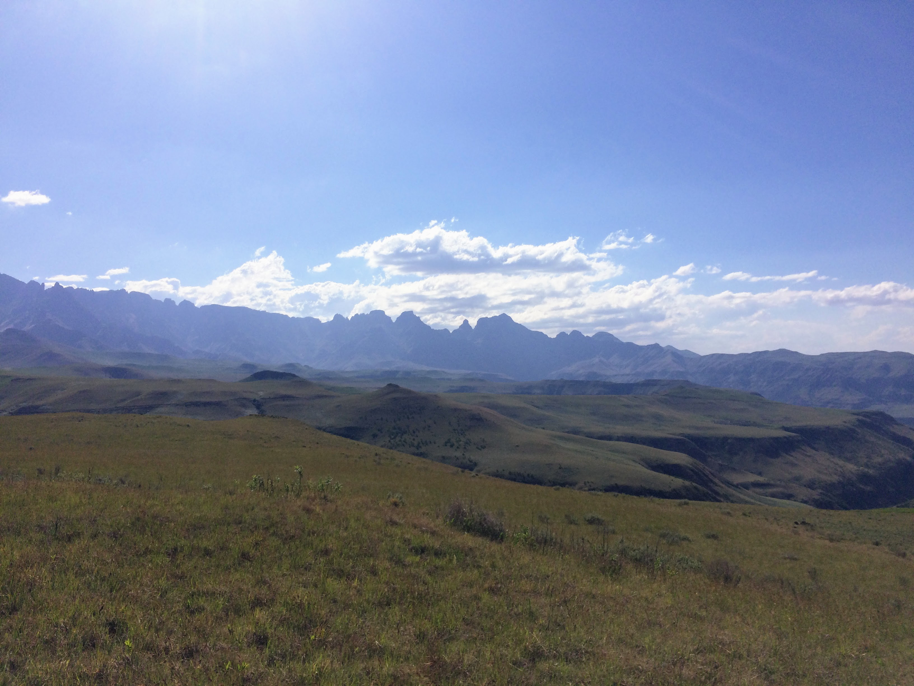
```
]

.pull-right[

```{r echo = F, fig.align = 'center', out.width = '75%'}

```

```{r echo = F, fig.align = 'center', out.width = '75%'}
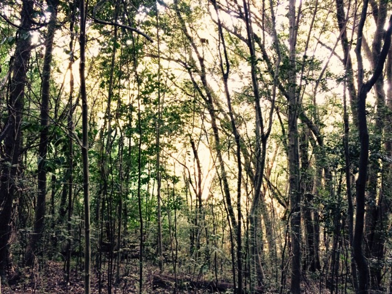
```
]

---

layout: false

## There's a lot of diversity in the form of species

Often associated with the environments in which they occur...

```{r echo = F, fig.align = 'center', out.width = '55%'}
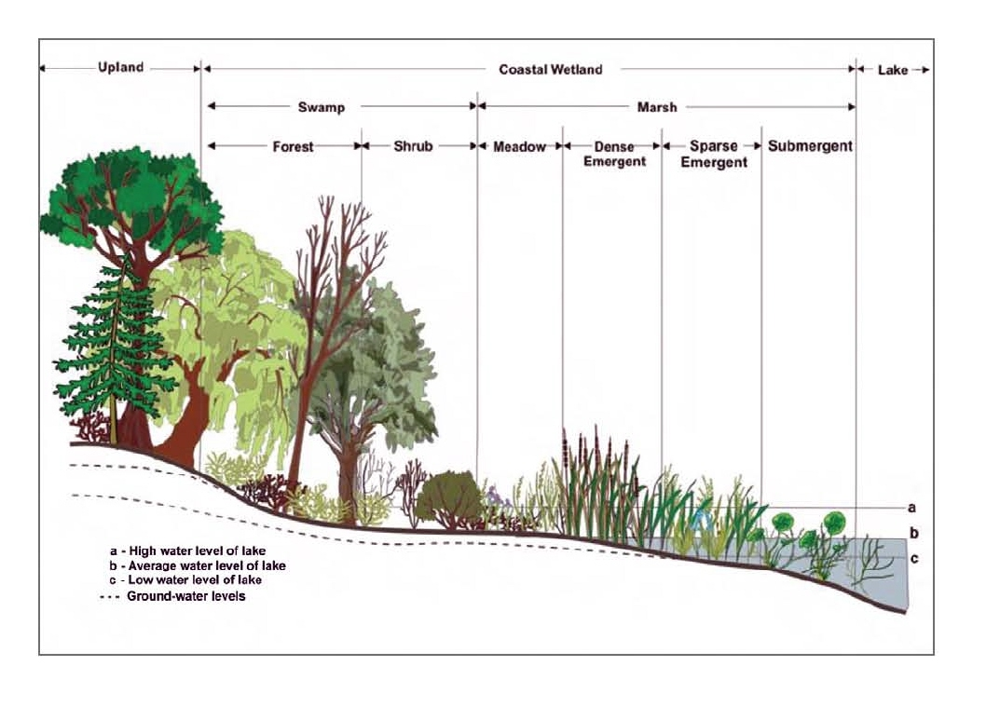
```

---

layout: false

## There's a lot of diversity in the form of species

...and they alter properties of the environment, creating habitat for other species...

```{r echo = F, fig.align = 'center', out.width = '55%'}

```

---

layout: false

## Drawbacks of looking at species diversity only?

- What is a species? There are many definitions!

- Are all species equal?
  - Would you consider 2 _Erica_ species to be equivalent to an _Erica_ and a _Protea_ or cacao and coffee?

- Species counts don't tell you about:
  - the identity of species or the similarities or differences between them
  - the functioning of species or communities 
  - the origins and maintenance of diversity (evolution, ecology and biogeography)

```{r echo = F, fig.align = 'center', out.width = '50%'}
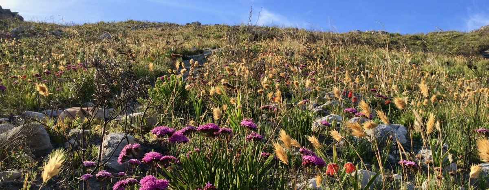
```

---

layout: false

## Measuring _functional_ and _phylogenetic_ diversity

.pull-left[

Many approaches!

Oldest and simplest measures are based on **discrete** predefined  categories:
- **functional groups** (growth form, etc)
- **taxonomic rank** (genera, families, etc<sup>1</sup>)

Simply assign your species to the categories (e.g. trees, shrubs, grasses, etc if you're working with plant functional groups) and calculate your diversity metrics as you would for species.

.footnote[<sup>1</sup>Technically, species diversity is just a discrete measure of phylogenetic diversity where the taxonomic rank is "species"...]
]

.pull-right[

```{r echo = F, fig.align = 'right', out.width = '150%'}
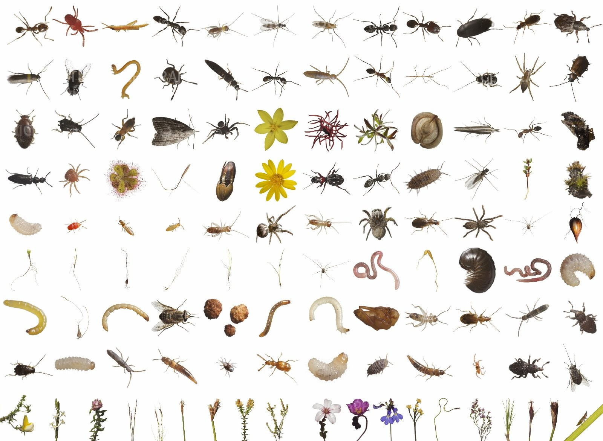
```
]

---

layout: false

## Drawbacks of discrete measures

.pull-left[
Similar to issues with species diversity...

#### Taxonomic ranks
- What is a genus or family?
- Are all genera or families equal?
- Taxonomic ranks are mostly pragmatic categories that help us identify taxa based on shared characters...

#### Functional groups
- How are they defined?
- Quantitative (analysis of measured traits) or qualitative (expert opinion)?
]

.pull-right[
```{r echo = F, fig.align = 'right', out.width = '110%'}
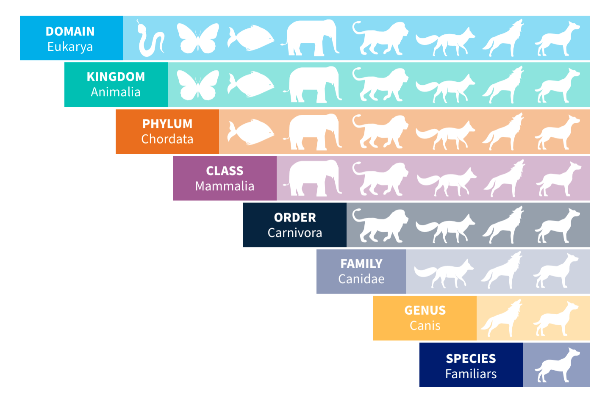
```

.footnote[###### Image from https://www.poolparty.biz/taxonomy-management-101]

]

---

layout: false

.pull-left[

### Defining functional groups

```{r echo = F, fig.align = 'center', out.width = '70%'}
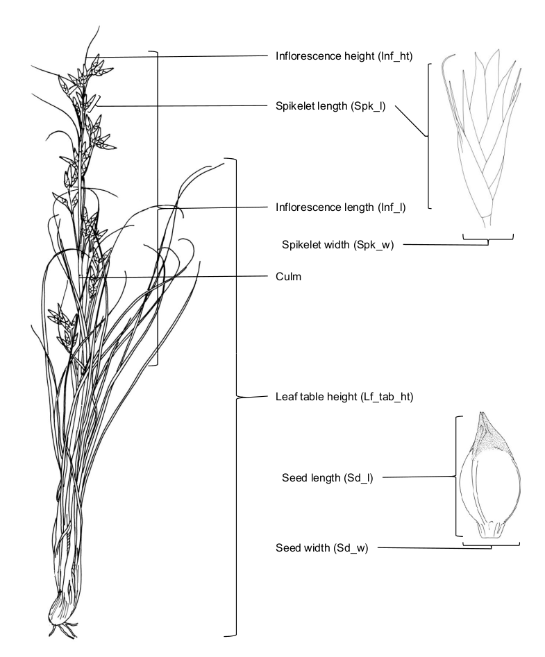
```

1) Measure traits of the species under study

]

.pull-right[

2) Calculate functional distances between species

```{r echo = F, fig.align = 'center', out.width = '30%'}
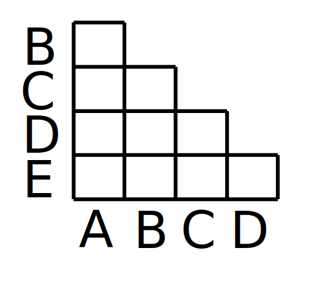
```

3) Cluster species based on distances

```{r echo = F, fig.align = 'center', out.width = '30%'}
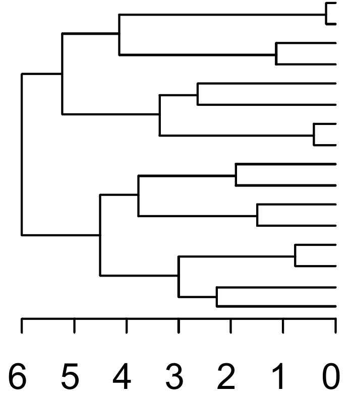
```

4) Define groups based on similarity (depth in tree) or desired number of groups

<br>

...but wait a second?
]

---

layout: false

.pull-left[
## _Continuous_ measures of functional diversity

There's a lot of useful information in the data and analyses used to define functional groups quantitatively!

Rather than lose that information by defining discrete groups and counting them, we can use the unique information directly!

E.g. functional diversity can be calculated as the sum of the branch length joining all species in the sample (Petchey and Gaston 2002)

]

.pull-right[
```{r echo = F, fig.align = 'right', out.width = '90%'}

```
]

---

layout: false

.pull-left[
## _Continuous_ measures of functional diversity

There are 3 major approaches to calculating **continuous** metrics of functional diversity:
- _Pairwise distances_ (e.g. mean or sum of the pairwise distances between all species in a sample - Walker et al. 1999)

- _Hierarchical clustering_ (e.g. sum of the branch length joining all species in the sample - Petchey and Gaston 2002)

- _Multidimensional ordination_ (e.g. the area or volume of encompassed by the set of species in an ordination of trait space (2 or more dimensions) - Villeger et al. 2008)
]

.pull-right[
```{r echo = F, fig.align = 'right', out.width = '90%'}
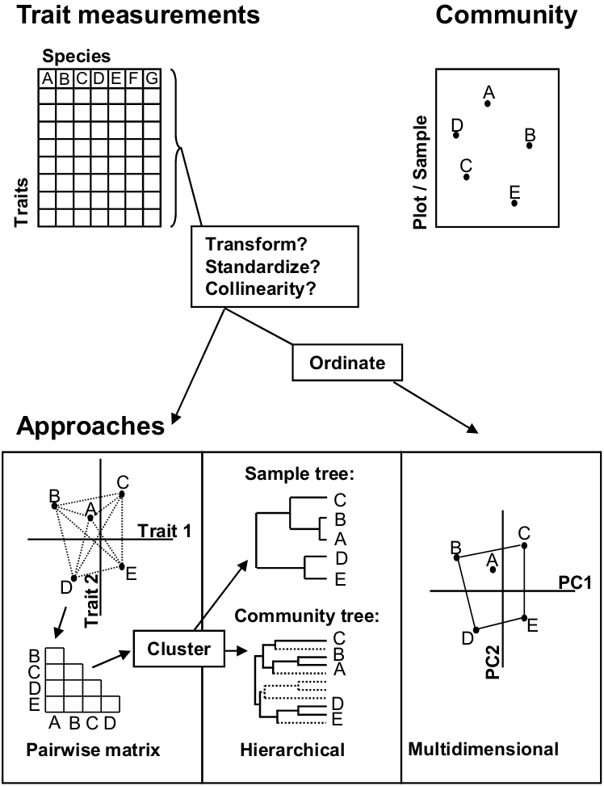
```
]

---

layout: false

.pull-left[
## Phylogenetic diversity

A **molecular phylogeny** (or "phylogenetic tree") represents the relationships between species based on similarity of their DNA. 

Branch lengths are usually time-calibrated based on a molecular clock (rate of mutation through time) to represent time (or evolutionary history).

Phylogenetic distance is often considered a more complete or integrated measure of the functional similarity of species, because it avoids subjectivity in the selection of traits measured...
]

.pull-right[
```{r echo = F, fig.align = 'center', out.width = '75%'}
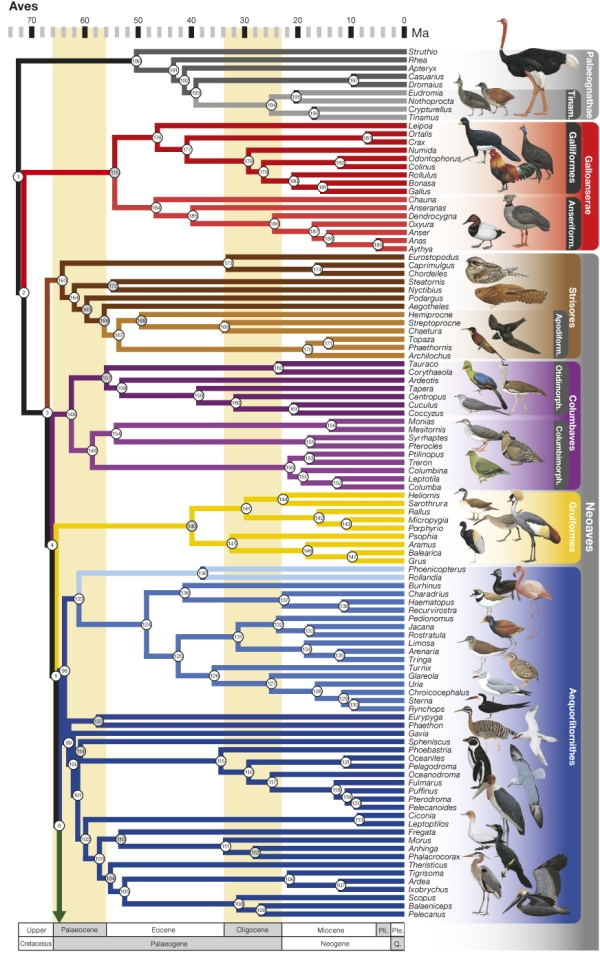
```

]

---

layout: false

.pull-left[
## _Continuous_ measures of phylogenetic diversity

Similar approaches used for phylogenetic diversity.

- _Pairwise distances_ (e.g. mean pairwise distances between all species in a sample or minimum nearest taxon distance - Webb et al. 2002)

- _Phylogenetic trees_ (e.g. sum of the branches joining all species - Faith 1991)
  - can also use the taxonomic hierarchy instead of a phylogeny, but this suffers from the subjectivity of taxonomic ranks

- No _multidimensional ordination_ methods for phylogenetic diversity
]

.pull-right[
```{r echo = F, fig.align = 'center', out.width = '100%'}
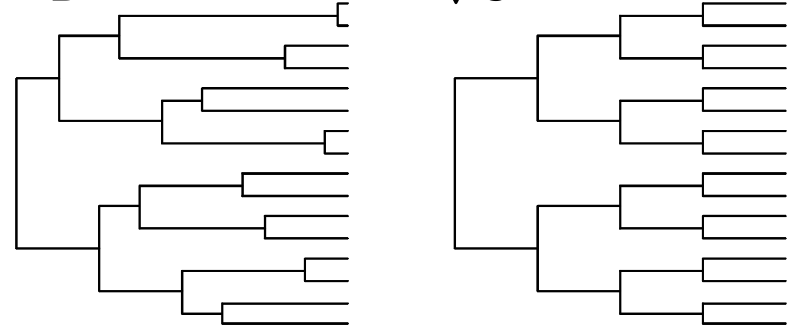
```

#### Molecular phylogeny vs taxonomic hierarchy

The sum of the branch lengths of a phylogeny linking species in a sample represents the _sum total independent evolutionary history_ represented by that sample.

The taxonomic hierarchy (Order, Family, Genus etc) is far less objective.

That said, phylogenies aren't perfect, and there are many sources of error - molecular regions sampled, methods used, etc.

]

---

layout: false

## What about the other components of functional and phylogenetic diversity?
.pull-left[

We've only covered measures of $\alpha$ (or $\gamma$) diversity. 

<br>

Similar methods as for species diversity can be applied to discrete and continuous measures of functional and phylogenetic $\beta$ diversity...

]

.pull-right[
```{r echo = F, fig.align = 'center', out.width = '70%'}
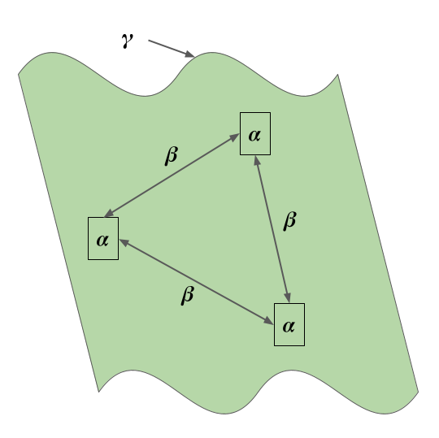
```
]

---
layout: false

## Functional or phylogenetic beta diversity

.pull-left[

```{r echo = F, fig.align = 'center', out.width = '90%'}
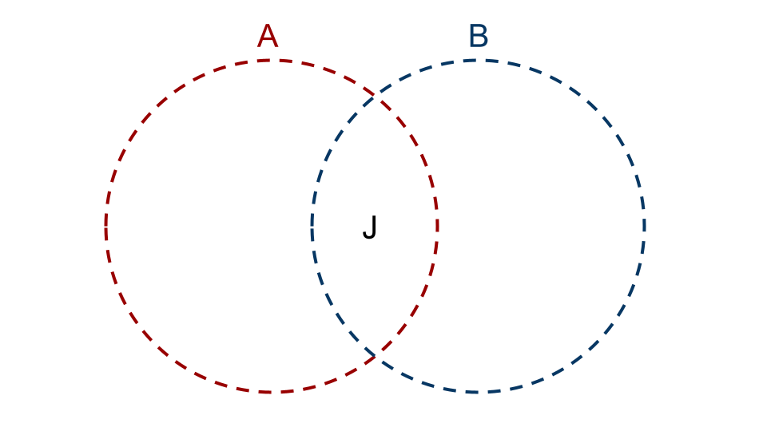
```

e.g. the same equation, $(A+B-2*J)/(A+B)$ 

Where J is the shared quantity, and A and B are totals for each community, 

can be used for...
]

.pull-right[
### Discrete measures

when based on counts of functional groups or taxonomic ranks instead of species

<br>

### Continuous measures

when based on _**branch length**_ (e.g. _PhyloSor_ - Bryant et al. 2008)

]


---
class: center, middle

## So what?

How does being able to measure functional or phylogenetic diversity help us?

---

layout: false

.pull-left[

## "Phylogenetic regionalization"

<br>

Defining phytoregions based on turnover of phylogenetic diversity in the (woody) flora of southern Africa


.footnote[figure from Daru et al. 2016]

]

.pull-right[
```{r echo = F, fig.align = 'center', out.width = '90%'}
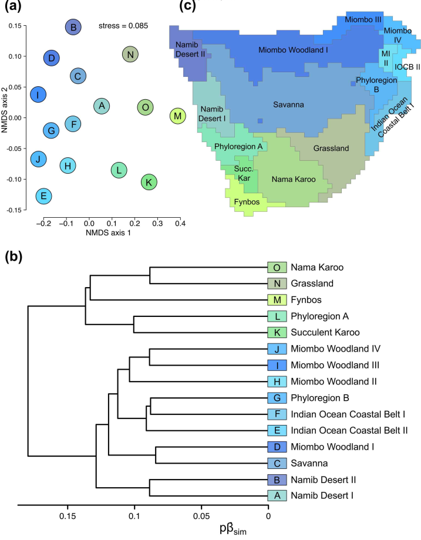
```
]

---

layout: false

.pull-left[

## Decifering the determinants of community assembly

<br>

Don't worry about the scary figure... We'll discuss this more in the next two lectures...

.footnote[figure from Webb et al. 2002]

]

.pull-right[
```{r echo = F, fig.align = 'center', out.width = '90%'}
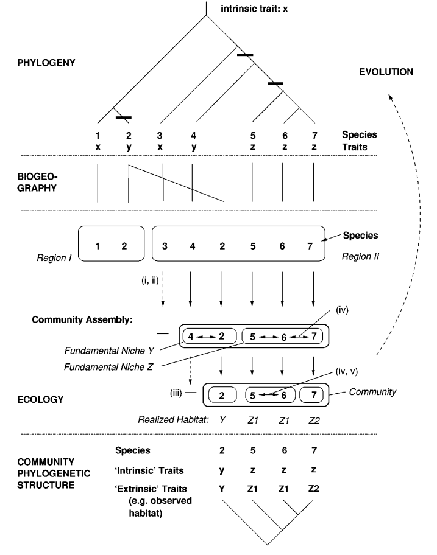
```
]

---

layout: false

.pull-left[

## Null models...

We often explore the drivers behind the patterns of diversity we see by contrasting different measures of diversity and/or comparing them to the patterns we would expect to see in the absence of that driver.

One commonly used method for generating the expected patterns is _null models_... 

Null models can be used to "randomize" properties of interest in the data. Typically we generate a large number of "randomized" datasets (e.g. 999) and explore where the observed data rank with respect to the null datasets.

]

.pull-right[

<br>

```{r echo = F, fig.align = 'right', out.width = '110%'}
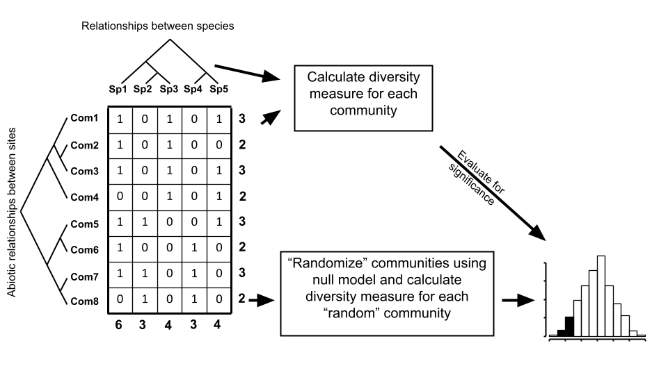
```

We can address questions like:
- _Are species in communities more closely (or distantly) related than we'd expect?_
- _Are species in communities more functionally similar (or dissimilar) than we'd expect?_

.footnote[figure from Slingsby 2011, PhD]
]

---

layout: false

.pull-left[

## Null models...

Null models can be used to "randomize" properties of interest in the data, creating datasets that can serve as a "null" for comparison to your actual data. 

There are a number of ways of doing this, but the key is to only randomize the property of interest and keep everything else the same.

Properties include (_inter alia_):
- functional or phylogenetic relationships
- abiotic (or spatial) relationships among sites
- number of species in communities (row sums)
- number of occurrences (or abundances) of species across all communities (column sums)

You have to think very carefully about what properties are affected when applying null models!


]

.pull-right[

<br>

```{r echo = F, fig.align = 'right', out.width = '110%'}

```

You also need to think carefully about how you sample your communities and how you structure them in your null model (e.g. grouping and analyzing sites separately by region or doing one global analysis).

.footnote[figure from Slingsby 2011, PhD]
]

---

class: center, middle

## Take-home

*There's a lot more to diversity than simple counts of species.*

*Functional and phylogenetic diversity allow us to explore more intricate questions around the ecology, evolution and function of assemblages.*

*Null models can be useful for exploring the factors that determine the assembly of communities.*

---

## References

```{r refs, echo=FALSE, results="asis"}
NoCite(myBib)
PrintBibliography(myBib)
```

---
class: center, middle

# Thanks!

Slides created via the R packages:

[**xaringan**](https://github.com/yihui/xaringan)<br>
[gadenbuie/xaringanthemer](https://github.com/gadenbuie/xaringanthemer)

The chakra comes from [remark.js](https://remarkjs.com), [**knitr**](http://yihui.name/knitr), and [R Markdown](https://rmarkdown.rstudio.com).
