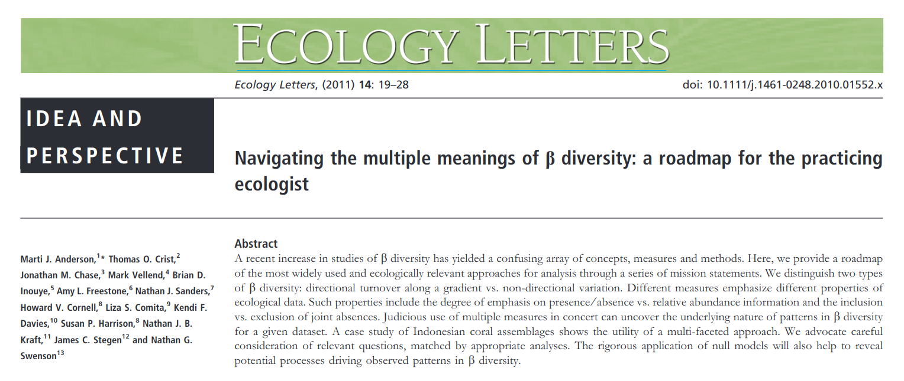
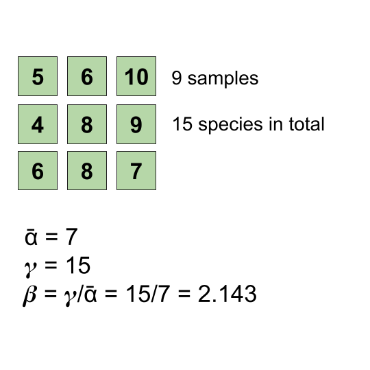
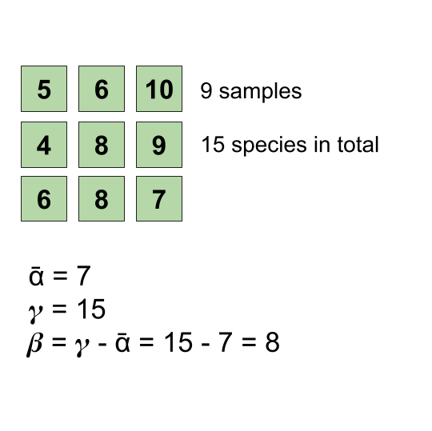
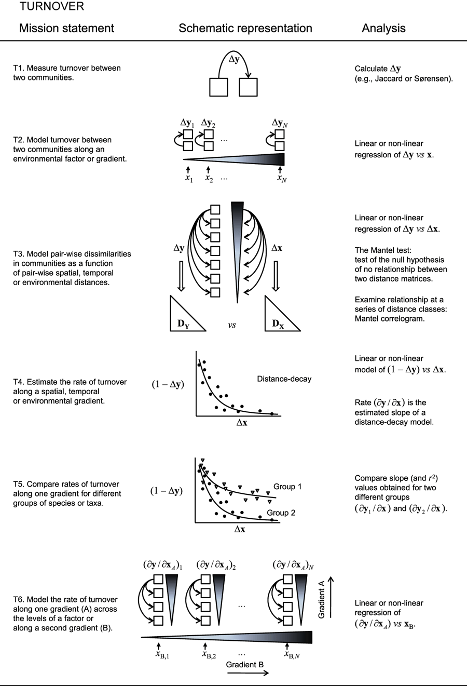
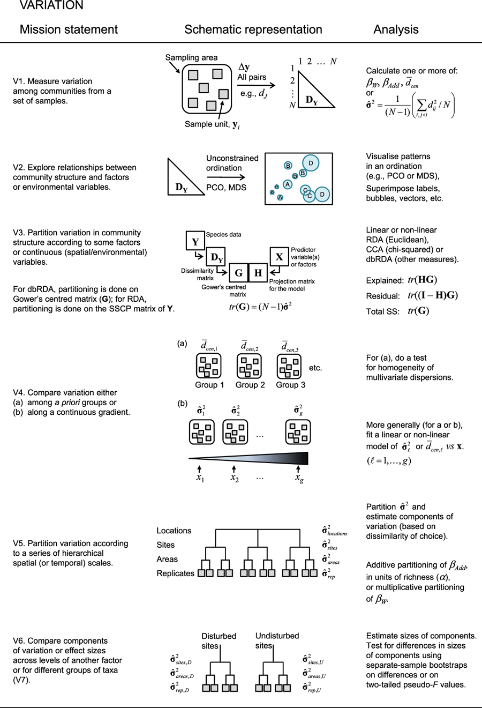
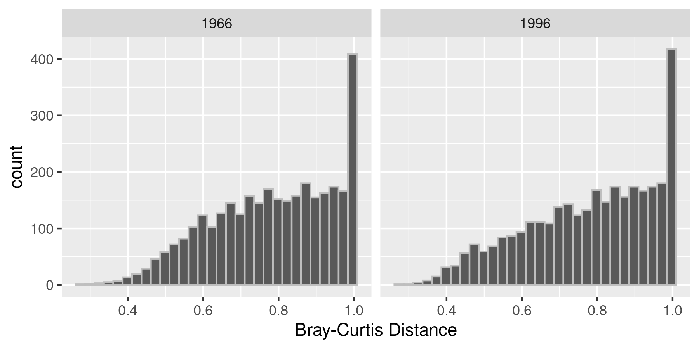

```{r setup, include=FALSE}
options(htmltools.dir.version = FALSE)
knitr::opts_chunk$set(
  fig.width=9, fig.height=3.5, fig.retina=3,
  out.width = "100%",
  cache = FALSE,
  echo = TRUE,
  message = FALSE, 
  warning = FALSE,
  hiline = TRUE
)

library(RefManageR)
BibOptions(check.entries = FALSE,
           bib.style = "authoryear",
           cite.style = "alphabetic",
           style = "markdown",
           hyperlink = FALSE,
           dashed = FALSE)
myBib <- ReadBib("bib/2_species.bib", check = FALSE)
```

```{r xaringan-themer, include=FALSE, warning=FALSE}
library(xaringanthemer)

# style_duo_accent(
#   primary_color = "#1381B0",
#   secondary_color = "#FF961C",
#   inverse_header_color = "#FFFFFF"
# )

style_mono_light(base_color = "#00B897")

#https://mycolor.space/?hex=%2323395B&sub=1 
#"Generic gradient" - #00B897, #89DD81, #F9F871

library(knitr)
library(kableExtra)
```

layout: false

.pull-left[

## Are simple counts of the number of species enough?

```{r echo = F, fig.align = 'center', out.width = '95%'}
knitr::include_graphics("images/grassland.jpeg")
```
]

.pull-right[

```{r echo = F, fig.align = 'center', out.width = '75%'}
knitr::include_graphics("images/fynbos.png")
```

```{r echo = F, fig.align = 'center', out.width = '75%'}
knitr::include_graphics("images/forestyoung.jpg")
```
]

---
layout: false

## Drawbacks of looking at species diversity only?

- What is a species?
  - Many definitions...
- Species counts don't tell you about the identity of species or the similarities and differences between them


```{r echo = F, fig.align = 'center', out.width = '60%'}

```

.footnote[<sup>1</sup>i.e. this is a highly active area of research...]

---

layout: false

.pull-left[
## Measuring $\beta$ diversity

There are two major approaches:

* *"Classical" diversity metrics*, calculated directly from measures of regional $(\gamma)$ and local $(\alpha)$ diversity through additive or multiplicative decomposition

* *Multivariate measures* that calculate distances (or dissimilarities) that represent the compositional resemblance between pairs of samples

.footnote[The two are related, and can even be the same thing in certain scenarios, but I'm not going to go there in this course...]

]

.pull-right[
```{r echo = F, fig.align = 'right', out.width = '110%'}
knitr::include_graphics("images/diversitycomponents.png")
```
]

---

layout: false

.pull-left[
## The decomposition of "classical" diversity metrics...

The components of biodiversity are interrelated and, depending on your preference or application, can be expressed

Multiplicatively (*sensu* Whittaker 1972):

$$\beta = \gamma/\alpha$$

Additively (*sensu* MacArthur et al. 1966, Lande 1996):

$$\beta = \gamma - \alpha$$
.footnote[<sup>1</sup>For reviews see Veech et al. 2002 and Anderson et al. 2011.]
]

.pull-right[
```{r echo = F, fig.align = 'right', out.width = '110%'}
knitr::include_graphics("images/diversitycomponents.png")
```
]

---

layout: false

.pull-left[
## Multiplicative "classical" diversity

$\beta = \gamma/\alpha$ (*sensu* Whittaker 1972)

...expresses $\beta$ diversity as the ratio of landscape $(\gamma)$ to local $(\alpha)$ diversity (usually the mean multiple of local samples, i.e. $\bar{\alpha}$).

If most local $(\alpha)$ samples capture most of the landscape $(\gamma)$ diversity, then $\beta$ diversity (i.e. differences between sites or habitats) must be low, and vv.

Disadvantages: 
* the ratio is unitless
* usually need to know $(\gamma)$

]

.pull-right[
```{r echo = F, fig.align = 'right', out.width = '110%'}

```
]

---

layout: false

.pull-left[
## Additive "classical" diversity

$\beta = \gamma - \alpha$ (*sensu* MacArthur et al. 1966, Lande 1996)

...expresses $\beta$ diversity as the difference between landscape $(\gamma)$ and local $(\alpha)$ diversity (again, usually the mean multiple of local samples, i.e. $\bar{\alpha}$).

If local $(\alpha)$ samples capture most of the landscape $(\gamma)$ diversity, then $\beta$ diversity (i.e. differences between sites or habitats) must be low, and vv.

Advantage:
* the difference is expressed as species.

Disadvantage:
* still usually need to know $(\gamma)$.

]

.pull-right[
```{r echo = F, fig.align = 'right', out.width = '110%'}

```
]

---

layout: false

.pull-left[
## Multivariate measures...

There are a large number of metrics that calculate the dissimilarity of pairs of samples based on the number of species that are shared between them or unique to each.

The metrics typically differ in whether they:
* are based on species presence/absence only, or also include abundance information
* include/exclude joint absence information
* account for differences in the $\alpha$ diversity of samples
]

.pull-right[
```{r echo = F, fig.align = 'right', out.width = '110%'}
knitr::include_graphics("images/diversitycomponents.png")
```
]

---
layout: false

## Multivariate measures...

.pull-left[

```{r echo = F, fig.align = 'center', out.width = '90%'}
knitr::include_graphics("images/betadiv_multiv.png")
```

e.g. the same equation, $(A+B-2*J)/(A+B)$ 

Where J is the shared quantity, and A and B are totals for each community, 

can be...
]

.pull-right[
### Sorenson's Index

when based on species presence/absence only

<br>

### Bray-Curtis distance

when it includes abundance information

]


---

layout: false

.pull-left[
```{r echo = F, fig.align = 'right', out.width = '110%'}
knitr::include_graphics("images/anderson_fig2.png")
```

]

.pull-right[
## *Turnover* vs *Variation*

The application $\beta$ diversity can be largely split into 
* directional analyses, that explore *turnover* along spatial, temporal or environmental gradients, and 

* non-directional analyses, that explore *variation* within or among groups.

.footnote[figure from Anderson et al. 2011]
]

---

layout: false

.pull-left[
```{r echo = F, fig.align = 'right', out.width = '85%'}

```

]

.pull-right[
## "Turnover" applications

Typically explores change in community composition of one or more groups (e.g. taxa) along one or more gradients (e.g. distance, time, elevation, rainfall).

$\Delta$y = change in community composition

$\Delta$x = change in gradient

$\delta y/\delta x$ = rate of turnover along a gradient

.footnote[figure from Anderson et al. 2011]
]

---

layout: false

.pull-left[
```{r echo = F, fig.align = 'right', out.width = '85%'}
# 
```

]

.pull-right[
## "Turnover" examples

Give number matching case in last slide T1, etc

.footnote[]
]

---

layout: false

.pull-left[
```{r echo = F, fig.align = 'right', out.width = '85%'}

```

]

.pull-right[
## "Variation" applications

Typically explores the amount of variation in community composition among sample units across one or more groups (e.g. taxa), sometimes trying to partition the drivers of variation among factors (e.g. experimental treatments), spatial scales or environmental variables.

$\Delta$y = change in community composition

$\hat{\sigma}$<sup>2</sup> = variation in community  structure among sample units  

$\bar{d}$<sub>cen</sub> = average distance-to-centroid of all sample units 

.footnote[figure from Anderson et al. 2011]
]

---

layout: false

## "Variation" examples

Variation among communities from a set of samples (Application V1)

```{r echo = F, fig.align = 'right', out.width = '75%'}

```


.footnote[Not finished? Add a metric? See table.]


---

layout: false

Baselga 2010 - Turnover vs Nestedness components?


---
class: center, middle

## Take-home

>*"Plurality in the concept of $\beta$ diversity can yield important ecological insights when navigated well. By knowing the properties of the measures being used and applying more than one, the underlying ecological structures in the data generating patterns in $\beta$ diversity can be revealed..."* - Anderson et al. 2011

---

## References

```{r refs, echo=FALSE, results="asis"}
NoCite(myBib)
PrintBibliography(myBib)
```

---
class: center, middle

# Thanks!

Slides created via the R packages:

[**xaringan**](https://github.com/yihui/xaringan)<br>
[gadenbuie/xaringanthemer](https://github.com/gadenbuie/xaringanthemer)

The chakra comes from [remark.js](https://remarkjs.com), [**knitr**](http://yihui.name/knitr), and [R Markdown](https://rmarkdown.rstudio.com).
