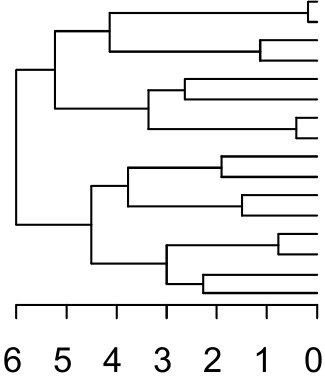

```{r setup, include=FALSE}
options(htmltools.dir.version = FALSE)
knitr::opts_chunk$set(
  fig.width=9, fig.height=3.5, fig.retina=3,
  out.width = "100%",
  cache = FALSE,
  echo = TRUE,
  message = FALSE, 
  warning = FALSE,
  hiline = TRUE
)

library(RefManageR)
BibOptions(check.entries = FALSE,
           bib.style = "authoryear",
           cite.style = "alphabetic",
           style = "markdown",
           hyperlink = FALSE,
           dashed = FALSE)
myBib <- ReadBib("bib/2_species.bib", check = FALSE)
```

```{r xaringan-themer, include=FALSE, warning=FALSE}
library(xaringanthemer)

# style_duo_accent(
#   primary_color = "#1381B0",
#   secondary_color = "#FF961C",
#   inverse_header_color = "#FFFFFF"
# )

style_mono_light(base_color = "#00B897")

#https://mycolor.space/?hex=%2323395B&sub=1 
#"Generic gradient" - #23395B #006287 #008E9D #00B897 #89DD81 #F9F871
#"Matching gradient" (reverse) - #23395B #494E77 #716292 #9C77AA #C88DBF #F5A3D0


library(knitr)
library(kableExtra)
```

layout: false

.pull-left[

## Are simple counts of the number of species enough?

```{r echo = F, fig.align = 'center', out.width = '95%'}
knitr::include_graphics("images/grassland.jpeg")
```
]

.pull-right[

```{r echo = F, fig.align = 'center', out.width = '75%'}
knitr::include_graphics("images/fynbos.png")
```

```{r echo = F, fig.align = 'center', out.width = '75%'}
knitr::include_graphics("images/forestyoung.jpg")
```
]

---

layout: false

## There's a lot of diversity in the form of species

Often associated with the environments in which they occur...

```{r echo = F, fig.align = 'center', out.width = '55%'}
knitr::include_graphics("images/growthform_USGS_image_cropped.jpg")
```

---

layout: false

## There's a lot of diversity in the form of species

...and they alter properties of the environment, creating habitat for other species...

```{r echo = F, fig.align = 'center', out.width = '55%'}
knitr::include_graphics("images/habitat_smaller.jpg")
```

---

layout: false

## Drawbacks of looking at species diversity only?

- What is a species?
  - Many definitions!
- Are all species equal?
  - e.g. would you consider 2 _Erica_ species to be equivalent to an _Erica_ and a _Protea_?
- Species counts don't tell you about the identity of species or the similarities or differences between them
- Species counts don't tell you anything about the functioning of species or communities
- Species counts can't tell you about the origins of diversity (evolution and biogeography)

```{r echo = F, fig.align = 'center', out.width = '65%'}
knitr::include_graphics("images/fynbos_community.jpg")
```

---

layout: false

## Measuring _functional_ and _phylogenetic_ diversity

.pull-left[

Many approaches!

Oldest and simplest measures are based on **discrete** predefined  categories (i.e. **functional groups** or **taxonomic rank** (genera, families, etc<sup>1</sup>)).

Simply assign your species to the categories (e.g. trees, shrubs, grasses, etc if you're working with plant functional groups) and calculate your diversity metrics as you would for species.

.footnote[<sup>1</sup>Technically, species diversity is just a discrete measure of phylogenetic diversity where the taxonomic rank is "species"...]
]

.pull-right[

```{r echo = F, fig.align = 'right', out.width = '150%'}
knitr::include_graphics("images/Fynbos_collage.jpg")
```
]

---

layout: false

## Drawbacks of discrete measures

.pull-left[
Similar to issues with species diversity...

#### Taxonomic ranks
- What is a genus or family?
- Are all genera or families equal?
- Taxonomic ranks are mostly pragmatic categories that help us identify taxa based on shared characters...

#### Functional groups
- How are they defined?
- Quantitative (analysis of measured traits) or qualitative (expert opinion)?
]

.pull-right[
```{r echo = F, fig.align = 'right', out.width = '110%'}
knitr::include_graphics("images/taxonomy.png")
```
]

---

layout: false

.pull-left[

### Defining functional groups

```{r echo = F, fig.align = 'center', out.width = '70%'}
knitr::include_graphics("images/tetraria_traits.png")
```

1) Measure traits of the species under study

]

.pull-right[

2) Calculate functional distances between species

```{r echo = F, fig.align = 'center', out.width = '30%'}
knitr::include_graphics("images/distancemat.png")
```

3) Cluster species based on distances

```{r echo = F, fig.align = 'center', out.width = '30%'}

```

4) Define groups based on similarity (depth in tree) or desired number of groups

<br>

...but wait a second?
]

---

layout: false

.pull-left[
## _Continuous_ measures of functional diversity

Petchey and Gaston (2002)...

]

.pull-right[
```{r echo = F, fig.align = 'right', out.width = '90%'}
knitr::include_graphics("images/FD_continuous.png")
```
]

---

layout: false

.pull-left[
## Multivariate measures...

There are a large number of metrics that calculate the dissimilarity of pairs of samples based on the number of species that are shared between them or unique to each.

The metrics typically differ in whether they:
* are based on species presence/absence only, or also include abundance information
* include/exclude joint absence information
* account for differences in the $\alpha$ diversity of samples
]

.pull-right[
```{r echo = F, fig.align = 'right', out.width = '110%'}
knitr::include_graphics("images/diversitycomponents.png")
```
]

---
layout: false

## Multivariate measures...

.pull-left[

```{r echo = F, fig.align = 'center', out.width = '90%'}
knitr::include_graphics("images/betadiv_multiv.png")
```

e.g. the same equation, $(A+B-2*J)/(A+B)$ 

Where J is the shared quantity, and A and B are totals for each community, 

can be...
]

.pull-right[
### Sorenson's Index

when based on species presence/absence only

<br>

### Bray-Curtis distance

when it includes abundance information

]


---

layout: false

.pull-left[
```{r echo = F, fig.align = 'right', out.width = '110%'}
knitr::include_graphics("images/anderson_fig2.png")
```

]

.pull-right[
## *Turnover* vs *Variation*

The application $\beta$ diversity can be largely split into 
* directional analyses, that explore *turnover* along spatial, temporal or environmental gradients, and 

* non-directional analyses, that explore *variation* within or among groups.

.footnote[figure from Anderson et al. 2011]
]

---

layout: false

.pull-left[
```{r echo = F, fig.align = 'right', out.width = '85%'}
knitr::include_graphics("images/anderson_fig3.gif")
```

]

.pull-right[
## "Turnover" applications

Typically explores change in community composition of one or more groups (e.g. taxa) along one or more gradients (e.g. distance, time, elevation, rainfall).

$\Delta$y = change in community composition

$\Delta$x = change in gradient

$\delta y/\delta x$ = rate of turnover along a gradient

.footnote[figure from Anderson et al. 2011]
]

---

layout: false

.pull-left[
```{r echo = F, fig.align = 'right', out.width = '85%'}
# knitr::include_graphics("images/anderson_fig3.gif")
```

]

.pull-right[
## "Turnover" examples

Give number matching case in last slide T1, etc

.footnote[]
]

---

layout: false

.pull-left[
```{r echo = F, fig.align = 'right', out.width = '85%'}
knitr::include_graphics("images/anderson_fig4.gif")
```

]

.pull-right[
## "Variation" applications

Typically explores the amount of variation in community composition among sample units across one or more groups (e.g. taxa), sometimes trying to partition the drivers of variation among factors (e.g. experimental treatments), spatial scales or environmental variables.

$\Delta$y = change in community composition

$\hat{\sigma}$<sup>2</sup> = variation in community  structure among sample units  

$\bar{d}$<sub>cen</sub> = average distance-to-centroid of all sample units 

.footnote[figure from Anderson et al. 2011]
]

---

layout: false

## "Variation" examples

Variation among communities from a set of samples (Application V1)

```{r echo = F, fig.align = 'right', out.width = '75%'}
knitr::include_graphics("images/beta_variation_CP.png")
```


.footnote[Not finished? Add a metric? See table.]


---

layout: false

Baselga 2010 - Turnover vs Nestedness components?


---
class: center, middle

## Take-home

>*"Plurality in the concept of $\beta$ diversity can yield important ecological insights when navigated well. By knowing the properties of the measures being used and applying more than one, the underlying ecological structures in the data generating patterns in $\beta$ diversity can be revealed..."* - Anderson et al. 2011

---

## References

```{r refs, echo=FALSE, results="asis"}
NoCite(myBib)
PrintBibliography(myBib)
```

---
class: center, middle

# Thanks!

Slides created via the R packages:

[**xaringan**](https://github.com/yihui/xaringan)<br>
[gadenbuie/xaringanthemer](https://github.com/gadenbuie/xaringanthemer)

The chakra comes from [remark.js](https://remarkjs.com), [**knitr**](http://yihui.name/knitr), and [R Markdown](https://rmarkdown.rstudio.com).
