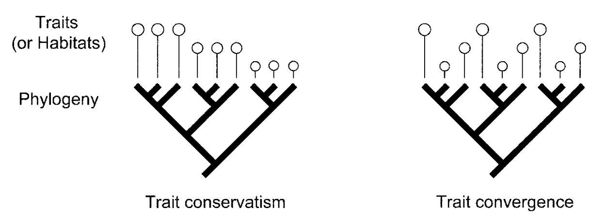

```{r setup, include=FALSE}
options(htmltools.dir.version = FALSE)
knitr::opts_chunk$set(
  fig.width=9, fig.height=3.5, fig.retina=3,
  out.width = "100%",
  cache = FALSE,
  echo = TRUE,
  message = FALSE, 
  warning = FALSE,
  hiline = TRUE
)

library(RefManageR)
BibOptions(check.entries = FALSE,
           bib.style = "authoryear",
           cite.style = "alphabetic",
           style = "markdown",
           hyperlink = FALSE,
           dashed = FALSE)
myBib <- ReadBib("bib/2_species.bib", check = FALSE)
```

```{r xaringan-themer, include=FALSE, warning=FALSE}
library(xaringanthemer)

# style_duo_accent(
#   primary_color = "#1381B0",
#   secondary_color = "#FF961C",
#   inverse_header_color = "#FFFFFF"
# )

style_mono_light(base_color = "#23395b")

#https://mycolor.space/?hex=%2323395B&sub=1 
#"Generic gradient" - #23395B #006287 #008E9D #00B897 #89DD81 #F9F871
#"Matching gradient" (reverse) - #23395B #494E77 #716292 #9C77AA #C88DBF #F5A3D0


library(knitr)
library(kableExtra)
```

layout: false

## There's a lot of variation in species' traits


```{r echo = F, fig.align = 'center', out.width = '60%'}
knitr::include_graphics("images/growthform_USGS_image_cropped.jpg")
```

---

layout: false

## Traits typically relate to life-history strategies

.pull-left[
```{r echo = F, fig.align = 'center', out.width = '55%'}

```
]

.pull-right[
```{r echo = F, fig.align = 'center', out.width = '55%'}

```
]

```{r echo = F, fig.align = 'center', out.width = '55%'}
knitr::include_graphics("images/life-history-variation.jpg")
```

e.g. the fast - slow continuum

---

layout: false

.pull-left[
## There are often trade-offs among traits

Leaf dry mass per unit area (LMA) predicts 
- Nitrogen content 
- photosynthetic capacity
- relative growth rate

But
- Trades off against leaf longevity

.footnote[The leaf economics spectrum (LES) - Wright et al. 2004]

]

.pull-right[
```{r echo = F, fig.align = 'center', out.width = '40%'}
knitr::include_graphics("images/LES.webp")
```
]

---

layout: false

.pull-left[
## There are often trade-offs among traits

LMA correlates with environment (temp and rainfall)
- Higher LMA in hot, dry places

<br>

This also represents a trade-off in that specific traits can limit species to specific resource/habitat requirements (water, light, nutrients).

.footnote[The leaf economics spectrum (LES) - Wright et al. 2004]
]

.pull-right[
```{r echo = F, fig.align = 'center', out.width = '100%'}

```
]

---

layout: false

## Trade-offs constrain trait combinations

.pull-left[
Trade-offs dictate that some traits and trait combinations (and thus life-history strategies) are impossible...

<br>

If each trait is a dimension, trade-offs dictate that the "volume" of the trait space is constrained (cannot be filled).

.footnote[Diaz et al. 2016]
]

.pull-right[
```{r echo = F, fig.align = 'center', out.width = '80%'}

```
]

---

layout: false

## Trade-offs constrain trait combinations

.pull-left[
But trait values, combinations and trade-offs are further constrained by phylogeny.

<br>

Traits and trade-offs often vary among taxonomic lineages, revealing a signal of their evolutionary history (phylogeny).

.footnote[Diaz et al. 2016]
]

.pull-right[
```{r echo = F, fig.align = 'center', out.width = '75%'}

```

]

---

layout: false

## Traits are often similar among closely related species...


```{r echo = F, fig.align = 'center', out.width = '45%'}
knitr::include_graphics("images/proteas_Roets2006.jpg")
```


---

layout: false

### Traits are often similar among closely related species...

.pull-left[
```{r echo = F, fig.align = 'center', out.width = '60%'}

```
]

.pull-right[
```{r echo = F, fig.align = 'center', out.width = '60%'}

```
]

.footnote[e.g. the loss of leaves in an ancestral restio means they are all culm (stem) photosynthetic... ]

---

layout: false

.pull-left[

## ...but not always...
```{r echo = F, fig.align = 'center', out.width = '95%'}

```

```{r echo = F, fig.align = 'center', out.width = '95%'}

```
]

.pull-right[
```{r echo = F, fig.align = 'center', out.width = '90%'}

```
]

---

layout: false

## Trait conservatism has a profound influence on ecology!

.pull-left[
Especially if there is dispersal limitation, as is usually the case for islands... e.g. Darwin's finches

The finches have diversified to fill many niches on the Galapagos islands that are usually filled by other bird lineages elsewhere.

While there has been convergence/divergence in some traits like beak morphology, they all evolved from the same common ancestor and other traits that affect their ecology may be constrained (e.g. climatic tolerance, metabolism, etc).
]

.pull-right[
```{r echo = F, fig.align = 'center', out.width = '100%'}

```
]

---

layout: false

## Trait conservatism has a profound influence on ecology!

.pull-left[
The Cape Flora is much like an island flora, with many species made up from a few lineages (30 clades account for >50% of the ~9000 species).

<br>

Large (diverse) clades like the Proteaceae (~300 spp), Restionaceae (~300 spp) and *Erica* (~700 species) are ecologically dominant, and have a big influence on ecological processes like fire, hydrology, nutrient cycling, etc.
]

.pull-right[
```{r echo = F, fig.align = 'center', out.width = '80%'}
knitr::include_graphics("images/proteas_Roets2006.jpg")
```
]

---

layout: false

## Trait conservatism has a profound influence on ecology!

.pull-left[
Savannas inhabit different climatic niches on different continents...

```{r echo = F, fig.align = 'center', out.width = '100%'}

```

.footnote[Lehman et al. 2014 *Science*]

]

.pull-right[

```{r echo = F, fig.align = 'center', out.width = '100%'}

```

This is likely because of differences in the traits of the dominant lineages and their affects on ecosystem feedbacks, e.g. *Vachellia* and *Senegalia* in Africa versus *Eucalyptus* and *Corymbia* in Australia.
]

---

layout: false

## Trait conservatism has a profound influence on ecology!

.pull-left[
In fact, the same may apply to most major biomes in the world...

.footnote[Moncrieff et al. 2015 *GEB*]
]

.pull-right[

```{r echo = F, fig.align = 'center', out.width = '75%'}

```

]

---

layout: false

## Trait conservatism influence on biogeography!

.pull-left[

```{r echo = F, fig.align = 'center', out.width = '70%'}
knitr::include_graphics("images/crisp2009_1.png")
```

]

.pull-right[

```{r echo = F, fig.align = 'center', out.width = '100%'}

```

Speciation is more likely to occur via dispersal to the same biome on a different continent than to a different biome right next door!

.footnote[Crisp et al. 2009 *Science*]
]

---

class: center, middle

## Take-home

*The evolutionary history of species leaves a strong imprint on current ecology, especially through trait and niche conservatism.*

*We can explore this influence by exploring speciation, trait evolution and biogeography in focal lineages.*

*We can also explore this influence by looking at and contrasting measures of functional and phylogenetic diversity of whole assemblages (previous lecture), revealing insights into the ecology, evolution and function of assemblages.*

---

## References

```{r refs, echo=FALSE, results="asis"}
NoCite(myBib)
PrintBibliography(myBib)
```

---
class: center, middle

# Thanks!

Slides created via the R packages:

[**xaringan**](https://github.com/yihui/xaringan)<br>
[gadenbuie/xaringanthemer](https://github.com/gadenbuie/xaringanthemer)

The chakra comes from [remark.js](https://remarkjs.com), [**knitr**](http://yihui.name/knitr), and [R Markdown](https://rmarkdown.rstudio.com).
