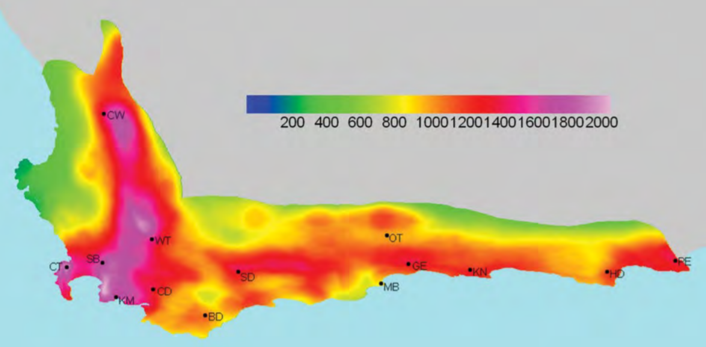

```{r setup, include=FALSE}
options(htmltools.dir.version = FALSE)
knitr::opts_chunk$set(
  fig.width=9, fig.height=3.5, fig.retina=3,
  out.width = "100%",
  cache = FALSE,
  echo = TRUE,
  message = FALSE, 
  warning = FALSE,
  hiline = TRUE
)

library(RefManageR)
BibOptions(check.entries = FALSE,
           bib.style = "authoryear",
           cite.style = "alphabetic",
           style = "markdown",
           hyperlink = FALSE,
           dashed = FALSE)
myBib <- ReadBib("bib/2_species.bib", check = FALSE)
```

```{r xaringan-themer, include=FALSE, warning=FALSE}
library(xaringanthemer)

# style_duo_accent(
#   primary_color = "#1381B0",
#   secondary_color = "#FF961C",
#   inverse_header_color = "#FFFFFF"
# )

style_mono_light(base_color = "#23395b")

#https://mycolor.space/?hex=%2323395B&sub=1 
#"Generic gradient" - #23395B #006287 #008E9D #00B897 #89DD81 #F9F871
#"Matching gradient" (reverse) - #23395B #494E77 #716292 #9C77AA #C88DBF #F5A3D0


library(knitr)
library(kableExtra)
```


```{r xaringan-tile-view, echo=FALSE}
# xaringanExtra::use_tile_view()
```

layout: false

## Diversity is not distributed evenly...

.pull-left[

```{r echo = F, fig.align = 'center', out.width = '90%'}
knitr::include_graphics("images/kreft2007_crop.jpg")

``` 
.footnote[Kreft and Jetz 2007; Freiberg and Manning 2013]
]

.pull-right[

```{r echo = F, fig.align = 'center', out.width = '90%'}
knitr::include_graphics("images/cramer_verboom_2017.jpg")
```
.center[.footnote[Cramer and Verboom 2017]]
]

---

layout: false

### What determines the distribution and abundance of biodiversity?

```{r echo = F, fig.align = 'center', out.width = '100%'}
knitr::include_graphics("images/fynbos_community.jpg")
```

---

layout: false

### And how do these processes vary with spatial and temporal scale?

.pull-left[

```{r echo = F, fig.align = 'center', out.width = '110%'}
knitr::include_graphics("images/fynbos.jpg")
``` 

]

.pull-right[

```{r echo = F, fig.align = 'center', out.width = '61%'}
knitr::include_graphics("images/biomes.jpg")
knitr::include_graphics("images/resolv_ecoregions2017.png")
```

]

---

layout: false

.pull-left[

## Niche theory

The niche is a multidimensional description of a species resource needs, habitat requirements and environmental tolerances<sup>1</sup> 
- i.e. a particular set of abiotic (light, water, nutrient, shelter, etc) and biotic conditions (predators, prey, pathogens, mutualists (e.g. mycorrhizae, pollinators), competitors, etc)
- often explored by looking at where species occur in the environment, or by looking at their traits, assuming these reflect resource use strategies

.center[#####<sup>1</sup>_**In simplified terms**_ (there are a few definitions)]

]

.pull-right[
```{r echo = F, fig.align = 'center', out.width = '70%'}
knitr::include_graphics("images/tetraria_env.png")
```

Environmental space

```{r echo = F, fig.align = 'center', out.width = '70%'}

```

Trait space

]

---

layout: false

.pull-left[

## Niche theory

Niche theory predicts local deterministic processes like habitat filtering, competition, facilitation, etc.
- These processes influence the co-occurrence/coexistence, trait/functional similarity and relatedness of species
- Thus influencing various forms of diversity (species, functional, phylogenetic)

]

.pull-right[
```{r echo = F, fig.align = 'center', out.width = '70%'}
knitr::include_graphics("images/tetraria_env.png")
```

Environmental space

```{r echo = F, fig.align = 'center', out.width = '70%'}

```

Trait space

]

---

layout: false

## Community assembly processes: local scale

.pull-left[

#### *Habitat filtering (or ecological sorting)*


Hypothesis:
- species with similar resource requirements (or stress tolerance) will be sorted into the same environments

Predictions:
- co-occurring species should be more functionally _**similar**_ than you'd expect by chance
- functionally similar species should co-occur _**more**_ often than you'd expect by chance


]

.pull-right[

Habitat filtering
```{r echo = F, fig.align = 'center', out.width = '90%'}
knitr::include_graphics("images/habitat_filtering.png")
```

Ecological sorting
```{r echo = F, fig.align = 'center', out.width = '90%'}
knitr::include_graphics("images/ecological_sorting.png")
```
.footnote[###### ]

]

---

layout: false

## Community assembly processes: local scale

.pull-left[

#### *Limiting similarity* and *Competitive exclusion*


Hypothesis:
- species competing for the same resources cannot stably coexist, because the stronger competitors will exclude the others

Predictions:
- co-occurring species should be more functionally _**different**_ than you'd expect by chance
- functionally similar species should co-occur _**less**_ often than you'd expect by chance


]

.pull-right[
```{r echo = F, fig.align = 'center', out.width = '65%'}
knitr::include_graphics("images/competition.png")
```

.footnote[###### ]

]

---

class: center, middle

## We now have contrasting predictions!

```{r echo = F, fig.align = 'center', out.width = '65%'}

```

#### Functional clustering (low Functional Diversity) = habitat filtering

#### Functional evenness/overdispersion (high Functional Diversity) = competition

---

layout: false

## Let's test them with null models...?

```{r echo = F, fig.align = 'center', out.width = '70%'}
knitr::include_graphics("images/nullmodels.png")
```

.footnote[figure from Slingsby 2011, PhD]

---

class: center, middle

## But wait!

### There are other processes at play that can affect the outcomes...

### Especially when we expand the spatial and temporal scale...

---

layout: false

## Recall that traits are often constrained by phylogeny
```{r echo = F, fig.align = 'center', out.width = '90%'}
knitr::include_graphics("images/traitevolution_cb2004.png")
```

Some degree of trait conservatism is the norm...

---

layout: false

.pull-left[
## Mode of speciation

```{r echo = F, fig.align = 'left', out.width = '100%'}

```

> Closely-related species tend to be similar, because they share a common ancestor (phylogenetic signal and niche conservatism)

]

.pull-right[

<br>

<br>

Where functional similarity reflects phylogeny:

- **Sympatric speciation** (in situ speciation) = phylogenetic and functional clustering

- **Allopatric speciation** (speciation via dispersal, isolation and drift) = phylogenetic and functional evenness/overdispersion

<br>

_i.e. the mode of speciation can create the same pattern as competition or habitat filtering..._
]

---

layout: false

## Community assembly processes

.pull-left[

#### Vary with spatial scale
- competition or facilitation operates between neighbouring individuals
- environmental filtering operates at a range of scales (climate > soils > microsite, etc)
- biogeographic processes (speciation, extinction, vicariance, dispersal) operate across large extents

#### Vary with temporal scale
- pollination, seed dispersal, herbivory, predation, etc can be near-instantaneous
- speciation or trait evolution occur over long periods of time (typically >100s of generations)

]

.pull-right[
```{r echo = F, fig.align = 'center', out.width = '110%'}
knitr::include_graphics("images/assemblyprocesses.png")
```

.footnote[###### ]
]

---

layout: false

## Assembly of species pools across scales

.pull-left[

Community assembly can be thought of as the successive filtering of species pools descending in spatial (and temporal) scale from global to local

```{r echo = F, fig.align = 'center', out.width = '100%'}
knitr::include_graphics("images/speciespools.png")
```

We often split it into **regional** versus **local** processes

.footnote[]

]

.pull-right[
```{r echo = F, fig.align = 'center', out.width = '110%'}
knitr::include_graphics("images/assemblyprocesses.png")
```

.footnote[###### ]
]

---

layout: false

## Local vs Regional scale processes

The diversity of local biological communities is a balance of regional and local processes - Ricklefs 1987

.pull-left[

#### Regional scale
```{r echo = F, fig.align = 'left', out.width = '60%'}
knitr::include_graphics("images/centresofendemism.png")
```

- speciation
- extinction
- dispersal

.footnote[###### The phytogeographic centres of the CFR (Manning and Goldblatt 2012)]
]

.pull-right[

#### Local scale
```{r echo = F, fig.align = 'left', out.width = '90%'}
knitr::include_graphics("images/fynbos_community.jpg")
``` 

- environmental filtering
- interspecific interactions (competition, predation, pathogens, mutualisms)
- adaptation
- stochastic variation
]

---

layout: false

.pull-left[
## Dominant processes vary with the relative scale of your species pools

Community assembly can be thought of as the successive filtering of species pools descending in spatial (and temporal) scale from global to local.

The outcomes of your analyses can depend in the scale at which your communities and regional species pools are defined, because different processes are more or less important at different scales.

.footnote[[Cavender-Bares et al. 2006](https://esajournals.onlinelibrary.wiley.com/doi/full/10.1890/0012-9658%282006%2987%5B109%3APSOFPC%5D2.0.CO%3B2?casa_token=cWplHgCzp80AAAAA%3A7IfWBV54lFb4N37JwSWScsVhuHRJpjhH4e013QvRRymIcKPvp2niEUDnVIpb31yxdkUBbWu20wpIc7I)]
]

.pull-right[
```{r echo = F, fig.align = 'center', out.width = '70%'}

```
]

---

### An example of inferring community assembly from the Cape...

.pull-left[

```{r echo = F, fig.align = 'center', out.width = '100%'}

```

Three scales (pools):
- Global = Cape Floristic Region (CFR)
- Regional = Cape Peninsula (Pen)
- Local = plots within Silvermine (Silv)

.footnote[###### Slingsby 2011, PhD]

]

.pull-right[

```{r echo = F, fig.align = 'center', out.width = '70%'}
knitr::include_graphics("images/centresofendemism.png")
```

The set of species on the Peninsula and in Silvermine are more dissimilar than expected relative to the CFR - _**suggests allopatric speciation**_

Species at Silvermine more dissimilar than expected relative to the Peninsula - _**suggests competition**_

Species within plots are more dissimilar than expected relative to all plots - _**suggests competition**_

]

---
class: center, middle

## Take-home

*Patterns of diversity are determined by assembly processes that operate from local to regional scales*

*While the distinction between local and regional processes is somewhat arbitrary (or even artificial), local scale processes are typically ecological, operating over the near term, while regional processes are typically evolutionary, operating over longer periods of time*

*One method for investigating these processes by exploring functional and phylogenetic diversity at different scales (species pools), often in combination with null models*
---

## References

```{r refs, echo=FALSE, results="asis"}
NoCite(myBib)
PrintBibliography(myBib)
```

---

.pull-left[

### An example of regional species pools from the Cape...

The phytogeographic centres of the CFR

```{r echo = F, fig.align = 'center', out.width = '100%'}
knitr::include_graphics("images/centresofendemism.png")
```

.footnote[###### Data and figure from Manning and Goldblatt 2012]

]

.pull-right[

<br>

```{r echo = F, fig.align = 'center', out.width = '100%'}
div <- read.csv("images/cfr_diversity.csv", header = T)

names(div) <- c("Region", "Area (1000 km2)", "Number of species", "Endemism (%)")

kable(div)  %>%
  kable_styling(font_size = 12) #%>%
#  row_spec(c(11:13), bold = T, color = "white", background = "#23395b")
```

The Cape phytochoria make good _Regional species pools_, but the regional pools used can be defined differently depending on the purposes of the study and if it can be justified, e.g. the Cape Peninsula is a relatively isolated biogeographic unit

CFR effectively = _Global species pool_, because of such high endemism

]

---
class: center, middle

# Thanks!

Slides created via the R packages:

[**xaringan**](https://github.com/yihui/xaringan)<br>
[gadenbuie/xaringanthemer](https://github.com/gadenbuie/xaringanthemer)

The chakra comes from [remark.js](https://remarkjs.com), [**knitr**](http://yihui.name/knitr), and [R Markdown](https://rmarkdown.rstudio.com).
