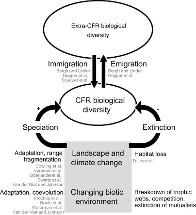
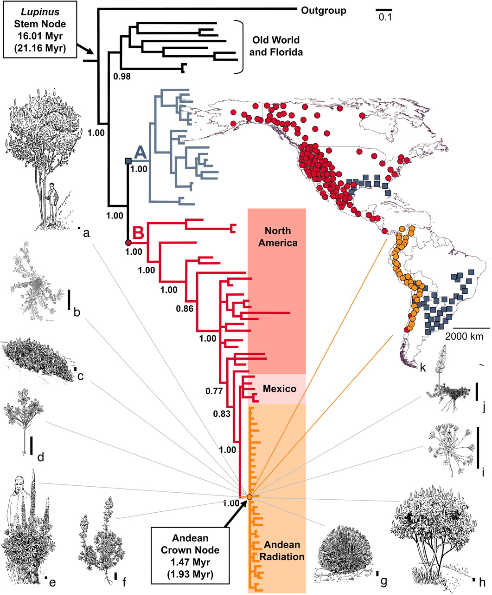
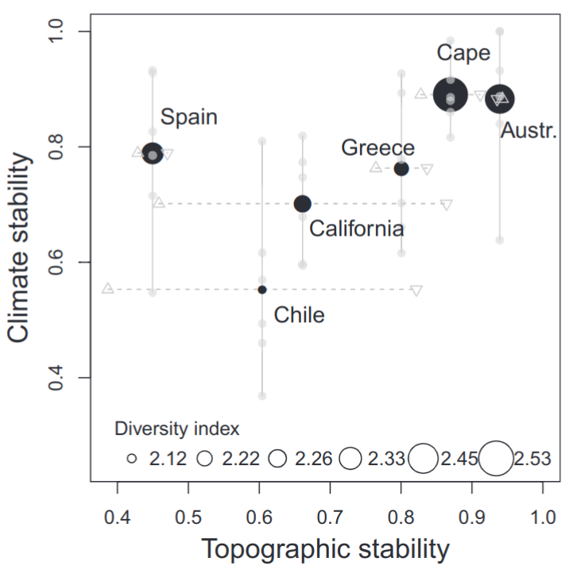
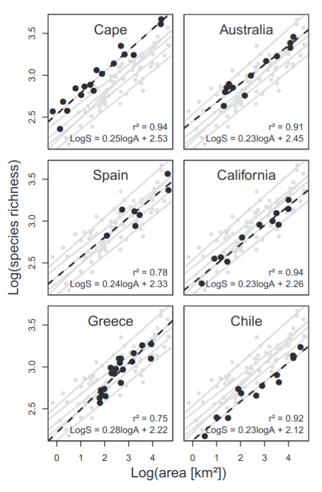
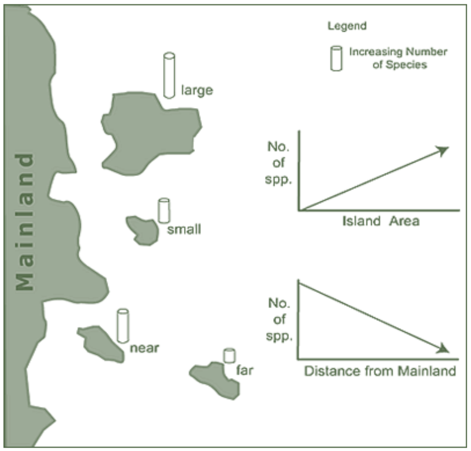
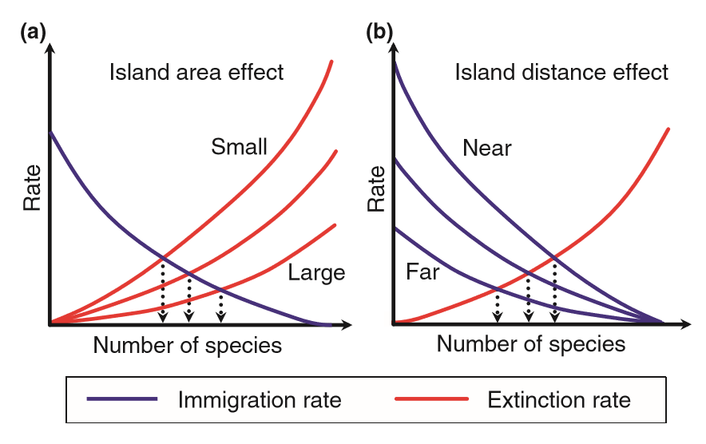
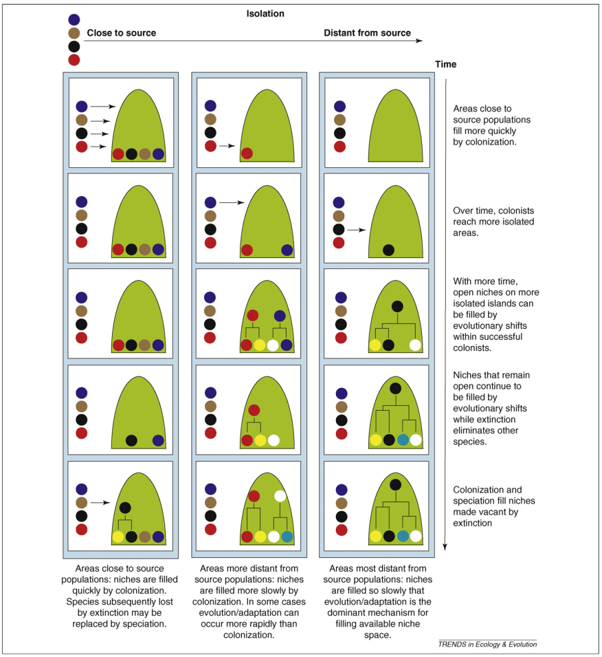
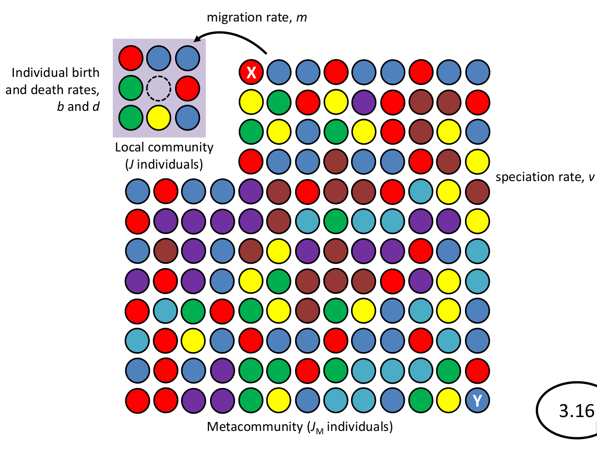

```{r setup, include=FALSE}
options(htmltools.dir.version = FALSE)
knitr::opts_chunk$set(
  fig.width=9, fig.height=3.5, fig.retina=3,
  out.width = "100%",
  cache = FALSE,
  echo = TRUE,
  message = FALSE, 
  warning = FALSE,
  hiline = TRUE
)

library(RefManageR)
BibOptions(check.entries = FALSE,
           bib.style = "authoryear",
           cite.style = "alphabetic",
           style = "markdown",
           hyperlink = FALSE,
           dashed = FALSE)
myBib <- ReadBib("bib/2_species.bib", check = FALSE)
```

```{r xaringan-themer, include=FALSE, warning=FALSE}
library(xaringanthemer)

# style_duo_accent(
#   primary_color = "#1381B0",
#   secondary_color = "#FF961C",
#   inverse_header_color = "#FFFFFF"
# )

style_mono_light(base_color = "#23395b")

#https://mycolor.space/?hex=%2323395B&sub=1 
#"Generic gradient" - #23395B #006287 #008E9D #00B897 #89DD81 #F9F871
#"Matching gradient" (reverse) - #23395B #494E77 #716292 #9C77AA #C88DBF #F5A3D0


library(knitr)
library(kableExtra)
```


```{r xaringan-tile-view, echo=FALSE}
# xaringanExtra::use_tile_view()
```

layout: false

## Local vs Regional scale processes

The diversity of local biological communities is a balance of regional and local processes - Ricklefs 1987

.pull-left[

#### Regional scale
```{r echo = F, fig.align = 'left', out.width = '60%'}
knitr::include_graphics("images/centresofendemism.png")
```

- speciation
- extinction
- dispersal

]

.pull-right[

#### Local scale
```{r echo = F, fig.align = 'left', out.width = '90%'}
knitr::include_graphics("images/fynbos_community.jpg")
``` 

- environmental filtering
- interspecific interactions (competition, predation, pathogens, mutualisms)
- adaptation
- stochastic variation
]

---

layout: false

## Assembly of species pools across scales

.pull-left[

Community assembly can be thought of as the successive filtering of species pools descending in spatial (and temporal) scale from global to local

```{r echo = F, fig.align = 'center', out.width = '100%'}
knitr::include_graphics("images/speciespools.png")
```

We often split it into **regional** versus **local** processes

.footnote[]

]

.pull-right[

_Global species pool_ = all species on the planet (or in the defined study domain, e.g. Cape Floral Region)

_Regional species pools_ = the species that are present in each region (e.g. a biogeographic region or mountain), limited by barriers to dispersal

_Fundamental species pool_ = species with the potential to occur in a particular location (i.e. can disperse there and find the appropriate abiotic conditions necessary for their
survival)

_Realised community_ = the actual observed local community (i.e. the subset of species from the fundamental species pools which have the ability to coexist, either stably or unstably)

]

---

layout: false

.pull-left[

## Regional processes

- speciation
- extinction
- dispersal

]

.pull-right[
```{r echo = F, fig.align = 'center', out.width = '100%'}

```

.footnote[Verboom et al. 2009]
]

---

layout: false

.pull-left[

## Speciation

Driven by many processes, but dramatic radiations often triggered by major events that create **new habitats and opportunities** for adaptive divergence, or cause **isolation**, or both.

E.g. The uplift of the Andes created diverse new habitats because it created steep climatic gradients and exposed new geology/soils. It also split populations by creating new barriers to dispersal (e.g. high mountains between lowland populations, or deep valleys between high elevation populations).

.footnote[Hughes and Eastwood 2006]

]

.pull-right[
```{r echo = F, fig.align = 'center', out.width = '100%'}

```

]

---

Environmental heterogeneity?

---

.pull-left[

## Stability and extinction

```{r echo = F, fig.align = 'center', out.width = '60%'}

```

Environmental stability is key for maintaining high diversity.

.footnote[Cowling et al. 2015]

]

.pull-right[

```{r echo = F, fig.align = 'center', out.width = '70%'}

```

]

---

## Stability and extinction

Much of the northern latitudes was buried in ice at the Last Glacial Maximum 15-25 k years ago!!!

```{r echo = F, fig.align = 'center', out.width = '60%'}
knitr::include_graphics("images/LGM_veg.png")
```

.footnote[Wikipedia]

---

.pull-left[

## Island Biogeography

### Dispersal and extinction

The Equilibrium Theory of Island Biogeography (MacArthur and Wilson 1967)

```{r echo = F, fig.align = 'center', out.width = '60%'}

```

]

.pull-right[

<br>

```{r echo = F, fig.align = 'center', out.width = '100%'}

```

An extension of IBT is to consider specific habitats as islands in a sea of unfavourable habitat (e.g. forest fragments in Fynbos).

.footnote[Figure from Warren et al. 2015]

]

---

.pull-left[

## Island Biogeography Extended

### Dispersal and _speciation_

Isolated islands/habitats where immigration is rare are likely to see local adaptation and in situ speciation over time, resulting in a community of close relatives

Better connected islands/habitats are likely to be dominated by colonization, leaving little opportunity (niche space) for in situ speciation

.footnote[Emerson and Gillespie 2008]

]

.pull-right[

<br>

```{r echo = F, fig.align = 'center', out.width = '100%'}

```

]

---

Mid-domain effect


---

layout: false

## Local vs Regional balance of diversity

- see Tony's lecture 3

---

layout: false

## Community assembly processes

.pull-left[

#### While processes vary with spatial scale
- competition operates between neighbours
- environmental filtering operates at a range of scales (climate > soils > microsite, etc)
- biogeographic processes (speciation, extinction, vicariance, dispersal) operate across large extents

#### Or with temporal scale
- interspecific interactions can be instantaneous
- speciation & trait evolution occurs over long periods of time

]

.pull-right[
```{r echo = F, fig.align = 'center', out.width = '70%'}
knitr::include_graphics("images/assemblyprocesses_crop.jpg")
```

#### The distinction is somewhat arbitrary
- local patterns are affected by regional processes
- regional patterns are affected by local processes
- ecology and evolution are intricately intertwined

.footnote[###### ]
]

---

layout: false

## Local vs Regional scale processes

.pull-left[
### Neutral Theory

```{r echo = F, fig.align = 'center', out.width = '20%'}
knitr::include_graphics("images/Neutral_Theory_Cover.jpg")
```

Local processes (competition etc) are mostly irrelevant and local communities are the result of ...
]

.pull-right[
```{r echo = F, fig.align = 'center', out.width = '100%'}

```

.footnote[Hubbell 2001]
]

---


---

I hope this lecture series has demonstrated that species richness patterns are, firstly, interesting and, secondly, influenced by a diversity of processes, which operate at a range of temporal and spatial scales. Some of these are more local in scale and operate in ecological time while others are more regional in scale and operate over evolutionary time. But there is a continuum, so that it is not straightforward to distinguish the ecological from the evolutionary. And this, indeed, emphasizes again that ecology and evolution are intricately intertwined, to the extent that it is not advisable to do ecology without being evolutionarily aware and, likewise, it is not advisable to study evolution without being ecologically aware. This is, perhaps, the central take-home from this lecture series. 

---

layout: false

.left-column[

### What

### Happened

### Here
]

.right-column[- Latitudinal gradient, energy etc]

.footnote[<sup>1</sup>...]

---

layout: false

.left[Biogeographic processes... Global... ]

.right[- Latitudinal gradient, energy etc]

---

layout: false

Biogeographic processes... Regional... 

- Environmental heterogeneity
- Mid Domain Effect

---

layout: false

Local determinism

- competition
- facilitation
- mutualism

---

layout: false

Examples of teasing apart assembly processes?

---
class: center, middle

## Take-home

>*"..."*

---

## References

```{r refs, echo=FALSE, results="asis"}
NoCite(myBib)
PrintBibliography(myBib)
```

---
class: center, middle

# Thanks!

Slides created via the R packages:

[**xaringan**](https://github.com/yihui/xaringan)<br>
[gadenbuie/xaringanthemer](https://github.com/gadenbuie/xaringanthemer)

The chakra comes from [remark.js](https://remarkjs.com), [**knitr**](http://yihui.name/knitr), and [R Markdown](https://rmarkdown.rstudio.com).
