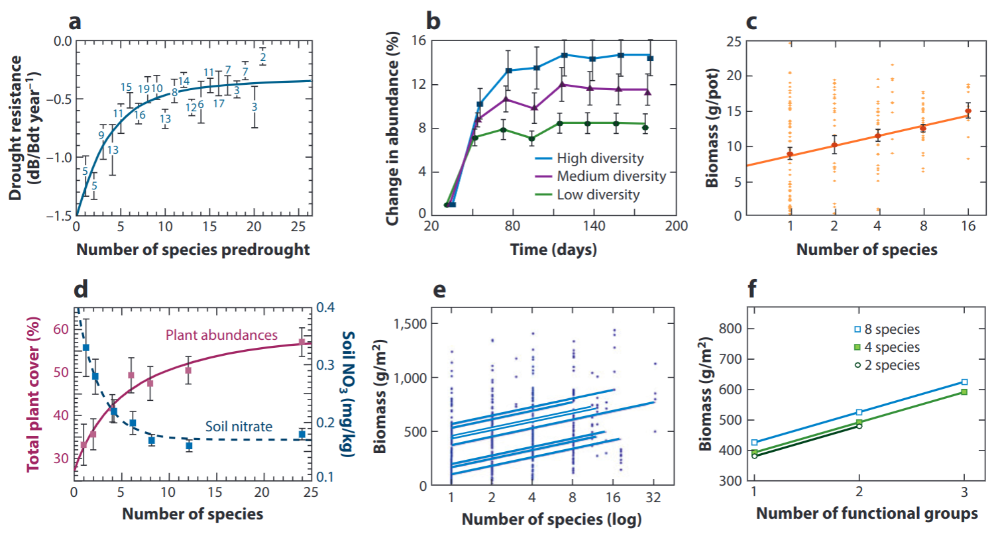
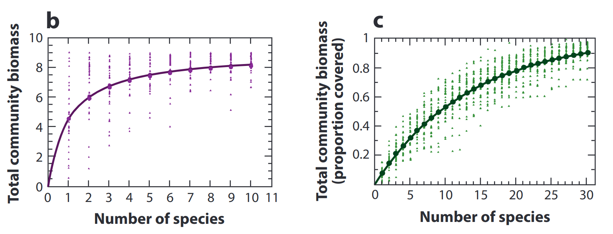
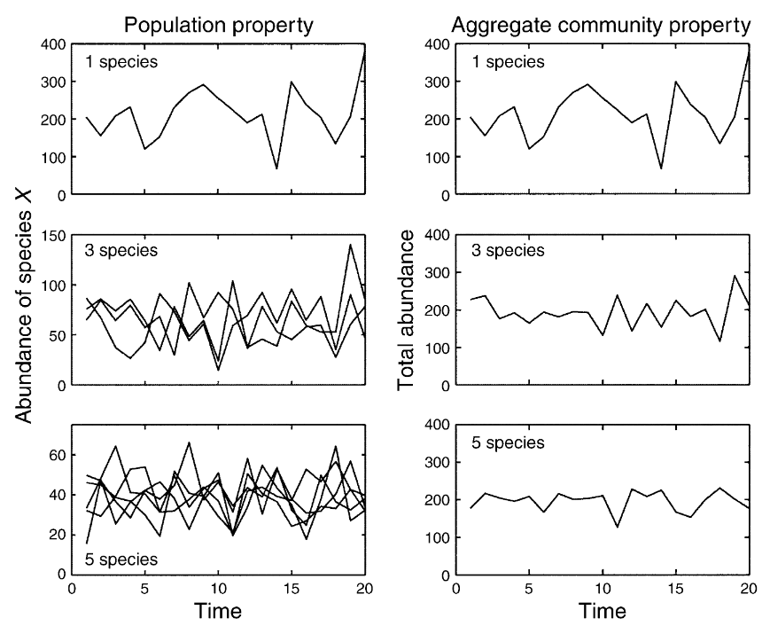
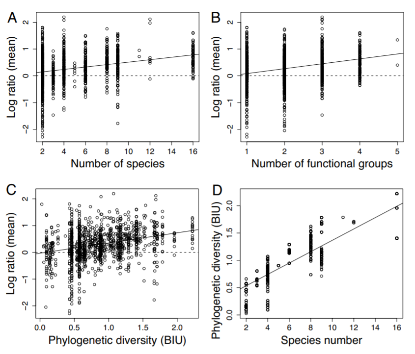
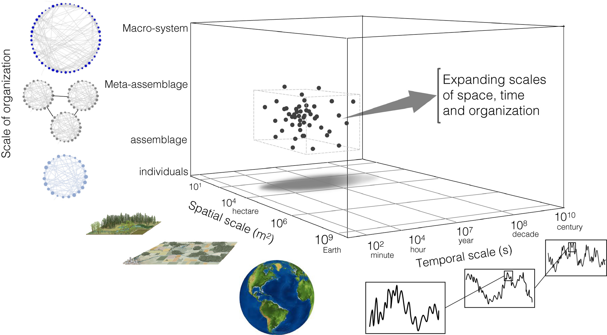
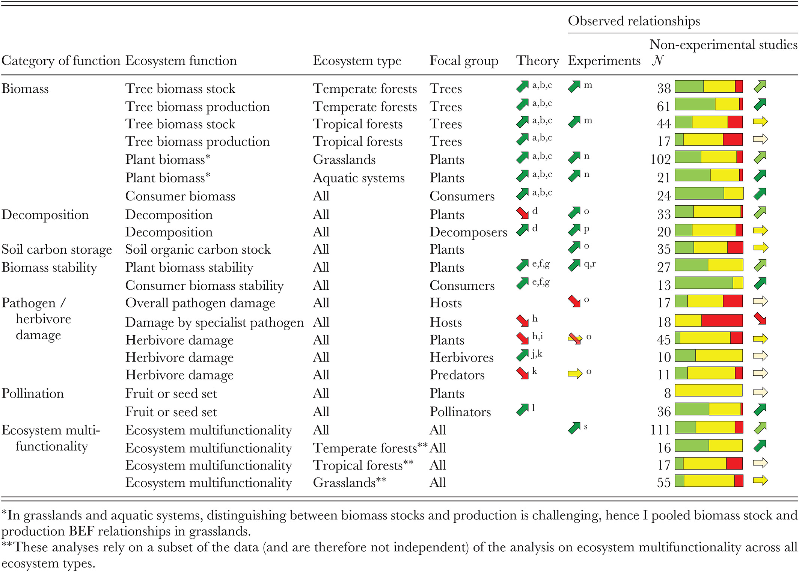
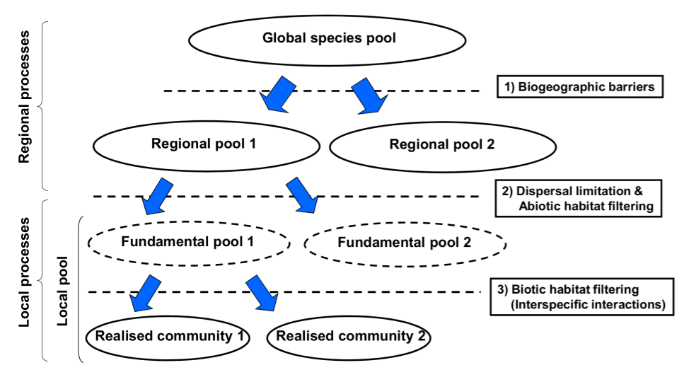
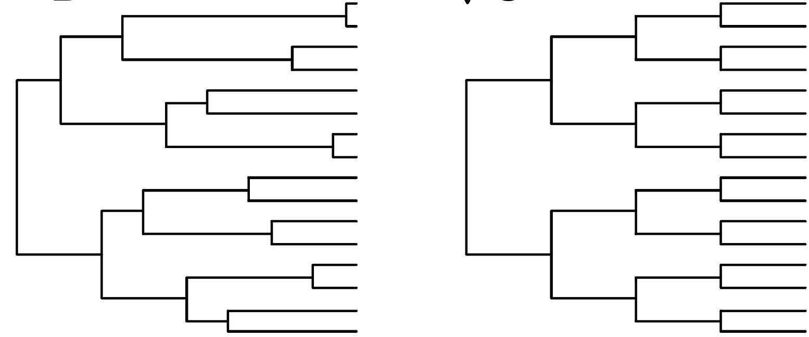

```{r setup, include=FALSE}
options(htmltools.dir.version = FALSE)
knitr::opts_chunk$set(
  fig.width=9, fig.height=3.5, fig.retina=3,
  out.width = "100%",
  cache = FALSE,
  echo = TRUE,
  message = FALSE, 
  warning = FALSE,
  hiline = TRUE
)

library(RefManageR)
BibOptions(check.entries = FALSE,
           bib.style = "authoryear",
           cite.style = "alphabetic",
           style = "markdown",
           hyperlink = FALSE,
           dashed = FALSE)
myBib <- ReadBib("bib/2_species.bib", check = FALSE)
```

```{r xaringan-themer, include=FALSE, warning=FALSE}
library(xaringanthemer)

# style_duo_accent(
#   primary_color = "#1381B0",
#   secondary_color = "#FF961C",
#   inverse_header_color = "#FFFFFF"
# )

style_mono_light(base_color = "#23395b")

#https://mycolor.space/?hex=%2323395B&sub=1 
#"Generic gradient" - #23395B #006287 #008E9D #00B897 #89DD81 #F9F871
#"Matching gradient" (reverse) - #23395B #494E77 #716292 #9C77AA #C88DBF #F5A3D0


library(knitr)
library(kableExtra)
```


```{r xaringan-tile-view, echo=FALSE}
# xaringanExtra::use_tile_view()
```

class: center, middle

## How does biodiversity affect ecosystem function?

```{r echo = F, fig.align = 'center', out.width = '70%'}
knitr::include_graphics("images/lang_postfire_50perc.gif")
```

---

layout: false


.pull-left[

## Ecosystem functions?

- Productivity (C sequestration)
- Decomposition
- Respiration
- Water filtration
- Pollination
- Predation
- Herbivory
- Habitat (for other organisms)
- Etc

```{r echo = F, fig.align = 'center', out.width = '90%'}
#knitr::include_graphics("images/kreft2007_crop.jpg")
#knitr::include_graphics("images/cfr_diversity.png")
``` 

]

.pull-right[

```{r echo = F, fig.align = 'center', out.width = '110%'}
knitr::include_graphics("images/snelgrove2014.jpg")
```
.center[]
.footnote[Snelgrove et al. 2014 (Marine)]
]

---

class: center

## The evolution of B-EF research

```{r echo = F, fig.align = 'center', out.width = '95%'}
knitr::include_graphics("images/vanderplas2019_BEF.jpg")
```
.footnote[Figure from van der Plas 2019]

---

layout: false

.pull-left[

## Trait vs diversity effects?

###Direct trait effects

Dominance by indigenous seeders versus sprouters affects rate of biomass accumulation, change in total stream flow, peak storm-flow pulse, and sediment yield or nutrient runoff in fynbos stands/catchments
  - it also changes with a shift to woody alien trees 

<br>

Hypothetical curves are based on information from a range of sources, see book chapter. The temporal range spans c.15 yr and any seasonal variation is excluded. 

.footnote[Figure from Slingsby et al. 2014]
]

.pull-right[
```{r echo = F, fig.align = 'center', out.width = '90%'}
knitr::include_graphics("images/slingsby_2014_BEF.png")
```

]

---

layout: false

.pull-left[

## Trait vs diversity effects?

###Diversity effects

Experimental communities (e.g. Cedar Creek) reveal diversity effects on several ecosystem properties...

```{r echo = F, fig.align = 'center', out.width = '100%'}
#
knitr::include_graphics("images/Cedar-Creek.jpg")
```

]

.pull-right[
```{r echo = F, fig.align = 'left', out.width = '95%'}
knitr::include_graphics("images/tilman2014_fig4.png")
```
.footnote[Tilman et al. 2014]
]

---

layout: false

## Theoretical mechanisms driving B-EF

.pull-left[

More species = greater probability of higher trait diversity, affecting ecosystem processes through:

_**The selection effect**_

More species = more likely to have species that can dominate ecosystem processes

_**Niche complementarity**_

More species = better filling of available niche space and use of resources (links with community assembly)

**A mix of the two...**

Complementarity among and/or dominance by subsets of species or functional groups


]

.pull-right[

```{r echo = F, fig.align = 'left', out.width = '80%'}
knitr::include_graphics("images/loreau2001.jpeg")
```
.footnote[Figure from Loreau et al. 2001]
]

---

layout: false

.pull-left[

## Types of B-EF effects

### Diversity-Productivity

Productivity has been the primary focus of most B-EF research, and is supported by many experiments

```{r echo = F, fig.align = 'center', out.width = '110%'}

```

.footnote[Tilman et al. 2014]

]

.pull-right[

"Productivity" has been measured in a number of ways, including biomass, plant abundance or % cover

```{r echo = F, fig.align = 'center', out.width = '110%'}

```

Generally results are consistent with "niche complementarity" (modelled in panel c)
  - biomass increases with diversity above that of the most productive monoculture - a phenomenon termed "overyielding"

Under "the selection effect" (panel b) the expected maximum cannot exceed that of the most productive monoculture 

]

---

layout: false

.pull-left[

## Types of B-EF effects

### Diversity-Stability 

"Biodiversity as insurance" - species respond differently to environmental change, but averaging results in lower community variance

```{r echo = F, fig.align = 'center', out.width = '70%'}

```

.footnote[]

]

.pull-right[
```{r echo = F, fig.align = 'center', out.width = '90%'}
knitr::include_graphics("images/tilman2014_fig3.png")
```

Species loss = less compensation (or redundancy) and increasing instability

Interestingly, more species = less species-level stability

.footnote[Hooper et al. 2005 | Tilman et al. 2014]

]

---

layout: false

.pull-left[

## Types of B-EF effects

### Diversity-Invasibility

More diverse communities are more resistant to invasion - Elton 1958

- A corollary of niche theory

Invaders must find resources to survive and grow, but B-EF experiments show that the levels of unconsumed resources decline as diversity increases...

Biomass attained by invaders of a given functional group often most strongly inhibited by the existing biomass of that same functional group - consistent with the predictions of limiting similarity
]

.pull-right[
```{r echo = F, fig.align = 'center', out.width = '100%'}
knitr::include_graphics("images/tilman2014_invasibility.png")
```

.footnote[Tilman et al. 2014]

]

---

layout: false

.pull-left[

## Types of B-EF effects

### Diversity-Multifunctionality

Many more species are needed to maintain multiple types of ecosystem processes than are demonstrably linked to any given process

Not all species have desirable effects on the suite of ecosystem processes measured

]

.pull-right[
```{r echo = F, fig.align = 'center', out.width = '100%'}
knitr::include_graphics("images/hector2007.png")
```

.footnote[###### ]

]

---

class: center, middle

## Other considerations?

---

class: center

## Metrics of biodiversity used?

```{r echo = F, fig.align = 'center', out.width = '48%'}

```

.footnote[Cadotte et al. 2008]
---

class: center

### Does B-EF scale up from experiments in space and time?

```{r echo = F, fig.align = 'center', out.width = '75%'}

```

.footnote[Gonzalez et al. 2020]

---

layout: false

## Ecosystem functions vary in space and with scale?

Bond and Chase 2002?
Gonzalez et al. 2020?

---

layout: false

## Experiments vs the real world?

```{r echo = F, fig.align = 'center', out.width = '68%'}
knitr::include_graphics("images/vanderplas2019_BEF_map.jpg")
```
.footnote[van der Plas 2019]

---

layout: false

## Experiments vs the real world?

```{r echo = F, fig.align = 'center', out.width = '65%'}

```
.footnote[van der Plas 2019]

---

layout: false

## B-EF and global change

.pull-left[

Society depends on a range of ecosystem functions for the services they provide

Diaz paper?

.footnote[https://ipbes.net/global-assessment]
]

.pull-right[
```{r echo = F, fig.align = 'right', out.width = '110%'}
knitr::include_graphics("images/ipbes.jpg")
```
]

---

layout: false

## B-EF and global change

.pull-left[

But we are also altering ecosystems and the functions they provide...

Hooper et al...
Garcia et al. 2018

]

.pull-right[

```{r echo = F, fig.align = 'center', out.width = '100%'}
knitr::include_graphics("images/hooper_fig1.jpg")
```
.footnote[Hooper et al. 2005]
]

---

## My research focuses on four questions...


```{r echo = F, fig.align = 'center', out.width = '80%'}
knitr::include_graphics("images/chapin.png")
```

#### ...linking community assembly, ecosystem function and global change

.pull-right[
.footnote[Figure modified from Chapin et al. 1997, _Science_]
]

---

class: center, middle

## How do we test these predictions?

---

layout: false

## Null models...

```{r echo = F, fig.align = 'center', out.width = '70%'}
knitr::include_graphics("images/nullmodels.png")
```

.footnote[figure from Slingsby 2011, PhD]

---

layout: false

## Community assembly processes

.pull-left[

#### Vary with spatial scale
- competition or facilitation operates between neighbouring plants
- biogeographic processes (speciation, extinction, vicariance, dispersal) operate across large extents

#### Vary with temporal scale
- pollination, seed dispersal or herbivory can be near-instantaneous
- speciation or trait evolution occur over long periods of time

]

.pull-right[
```{r echo = F, fig.align = 'center', out.width = '110%'}
knitr::include_graphics("images/assemblyprocesses.png")
```

.footnote[###### ]

]

---

layout: false

.pull-left[

## Assembly of species pools

```{r echo = F, fig.align = 'center', out.width = '100%'}

```

Community assembly can be thought of as the successive filtering of species pools descending in spatial (and temporal) scale from global to local

]

.pull-right[

<br>

<br>

_Global species pool_ = all species on the planet (or in the defined study domain)

_Regional species pools_ = the species that are present in each region (e.g. a biogeographic region or mountain), limited by barriers to dispersal

_Fundamental species pool_ = species with the potential to occur in a particular location (i.e. can disperse there and find the appropriate abiotic conditions necessary for their
survival)

_Realised community_ = the actual observed local community (i.e. the subset of species from the fundamental species pools which have the ability to coexist, either stably or unstably)

]

---

.pull-left[

### An example of regional species pools from the Cape...

The phytogeographic centres of the CFR

```{r echo = F, fig.align = 'center', out.width = '100%'}

```

.footnote[###### Data and figure from Manning and Goldblatt 2012]

]

.pull-right[

<br>

```{r echo = F, fig.align = 'center', out.width = '100%'}
div <- read.csv("images/cfr_diversity.csv", header = T)

names(div) <- c("Region", "Area (1000 km2)", "Number of species", "Endemism (%)")

kable(div)  %>%
  kable_styling(font_size = 12) #%>%
#  row_spec(c(11:13), bold = T, color = "white", background = "#23395b")
```

The Cape phytochoria make good _Regional species pools_, but the regional pools used can be defined differently depending on the purposes of the study and if it can be justified, e.g. the Cape Peninsula is a relatively isolated biogeographic unit

CFR effectively = _Global species pool_, because of such high endemism

]

---

layout: false

## Local vs Regional scale processes

The diversity of local biological communities is a balance of regional and local processes - Ricklefs 1987

.pull-left[

#### Regional scale
```{r echo = F, fig.align = 'left', out.width = '50%'}

```

- speciation
- extinction
- dispersal

]

.pull-right[

#### Local scale
```{r echo = F, fig.align = 'left', out.width = '35%'}
knitr::include_graphics("images/fynbos.jpg")
``` 

- environmental filtering
- interspecific interactions
  - competitive exclusion
  - predation, pathogen
  - mutualisms (e.g. mycorrhizae, pollination)
- adaptation
- stochastic variation
]


---

layout: false

.left-column[

### What

### Happened

### Here
]

.right-column[- Latitudinal gradient, energy etc]

.footnote[<sup>1</sup>...]

---

layout: false

.left[Biogeographic processes... Global... ]

.right[- Latitudinal gradient, energy etc]

---

layout: false

Biogeographic processes... Regional... 

- Environmental heterogeneity
- Mid Domain Effect

---

layout: false

Local determinism

- competition
- facilitation
- mutualism

---

layout: false

Examples of teasing apart assembly processes?

---

layout: false

.pull-left[
## _Continuous_ measures of functional diversity

There's a lot of useful information in the data and analyses used to create functional groups!

This has led to the development of 3 families of **continuous** functional diversity metrics based on:
- _Pairwise distances_ (e.g. mean or sum of the pairwise distances between all species in a sample - Walker et al. 1999)
- _Hierarchical clustering_ (e.g. sum of the branch length joining all species in the sample - Petchey and Gaston 2002)
- _Multidimensional ordination_ (e.g. the area or volume of encompassed by the set of species in an ordination of trait space (2 or more dimensions) - Villeger et al. 2008)
]

.pull-right[
```{r echo = F, fig.align = 'right', out.width = '90%'}
knitr::include_graphics("images/FD_continuous.png")
```
]

---

layout: false

.pull-left[
## _Continuous_ measures of phylogenetic diversity

Similar approaches can be used when estimating phylogenetic diversity.

Here there are two families of **continuous** metrics, based on:
- _Pairwise distances_ (e.g. mean pairwise distances between all species in a sample or minimum nearest taxon distance - Webb et al. 2002)
- _Phylogenetic trees_ (e.g. sum of the branches joining all species - Faith 1991)
  - can also use the taxonomic hierarchy instead of a phylogeny, but this suffers from the subjectivity of taxonomic ranks
- There are no _multidimensional ordination_ methods for phylogenetic diversity
]

.pull-right[
```{r echo = F, fig.align = 'center', out.width = '75%'}

```

#### Molecular phylogeny vs taxonomic hierarchy:

Usually one would calculate phylogenetic diversity using a molecular phylogeny (or "phylogenetic tree"), where the branch lengths are time-calibrated based on a molecular clock (rate of DNA mutation through time) and represent time. 
- Thus the sum of the branch lengths linking species in a sample represents the _sum total independent evolutionary history_ represented by that sample.

The taxonomic hierarchy (Order, Family, Genus etc) is far less objective.

]

---

layout: false

## What about the other components of functional and phylogenetic diversity?
.pull-left[

We've only covered measures of $\alpha$ (or $\gamma$) diversity. 

Similar methods as for species diversity can be applied to discrete and continuous measures of functional and phylogenetic $\beta$ diversity...

]

.pull-right[
```{r echo = F, fig.align = 'center', out.width = '70%'}
knitr::include_graphics("images/diversitycomponents.png")
```
]

---
layout: false

## Functional or phylogenetic beta diversity

.pull-left[

```{r echo = F, fig.align = 'center', out.width = '90%'}
knitr::include_graphics("images/betadiv_multiv.png")
```

e.g. the same equation, $(A+B-2*J)/(A+B)$ 

Where J is the shared quantity, and A and B are totals for each community, 

can be used for...
]

.pull-right[
### Discrete measures

when based on counts of functional groups or taxonomic ranks instead of species

<br>

### Continuous measures

when based on branch length (e.g. _PhyloSor_ - Bryant et al. 2008)

]


---

layout: false

## Null models...

.pull-left[
```{r echo = F, fig.align = 'right', out.width = '110%'}
knitr::include_graphics("images/nullmodels.png")
```

.footnote[figure from Slingsby 2011, PhD]
]

.pull-right[

Rather expand the FD and PD explanations over more slides and give more examples and move null models to community assembly?


]

---
class: center, middle

## Take-home

>*"..."*

---

## References

```{r refs, echo=FALSE, results="asis"}
NoCite(myBib)
PrintBibliography(myBib)
```

---
class: center, middle

# Thanks!

Slides created via the R packages:

[**xaringan**](https://github.com/yihui/xaringan)<br>
[gadenbuie/xaringanthemer](https://github.com/gadenbuie/xaringanthemer)

The chakra comes from [remark.js](https://remarkjs.com), [**knitr**](http://yihui.name/knitr), and [R Markdown](https://rmarkdown.rstudio.com).
