```{r setup, include=FALSE}
options(htmltools.dir.version = FALSE)
knitr::opts_chunk$set(
  fig.width=9, fig.height=3.5, fig.retina=3,
  out.width = "100%",
  cache = FALSE,
  echo = TRUE,
  message = FALSE, 
  warning = FALSE,
  hiline = TRUE
)

library(RefManageR)
BibOptions(check.entries = FALSE,
           bib.style = "authoryear",
           cite.style = "alphabetic",
           style = "markdown",
           hyperlink = FALSE,
           dashed = FALSE)
myBib <- ReadBib("bib/2_species.bib", check = FALSE)
```

```{r xaringan-themer, include=FALSE, warning=FALSE}
library(xaringanthemer)

# style_duo_accent(
#   primary_color = "#1381B0",
#   secondary_color = "#FF961C",
#   inverse_header_color = "#FFFFFF"
# )

style_mono_light(base_color = "#23395b")

#https://mycolor.space/?hex=%2323395B&sub=1 
#"Generic gradient" - #23395B #006287 #008E9D #00B897 #89DD81 #F9F871
#"Matching gradient" (reverse) - #23395B #494E77 #716292 #9C77AA #C88DBF #F5A3D0


library(knitr)
library(kableExtra)
```


```{r xaringan-tile-view, echo=FALSE}
# xaringanExtra::use_tile_view()
```

class: center, middle

## How does biodiversity affect ecosystem function?

```{r echo = F, fig.align = 'center', out.width = '70%'}
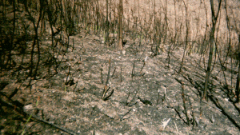
```

---

layout: false


.pull-left[

## Ecosystem functions?

- Productivity (C sequestration)
- Decomposition
- Respiration
- Water filtration
- Pollination
- Predation
- Herbivory
- Habitat (for other organisms)
- Etc

```{r echo = F, fig.align = 'center', out.width = '90%'}
#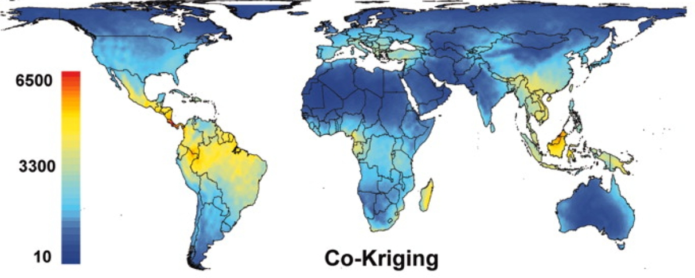
#knitr::include_graphics("images/cfr_diversity.png")
``` 

]

.pull-right[

```{r echo = F, fig.align = 'center', out.width = '110%'}
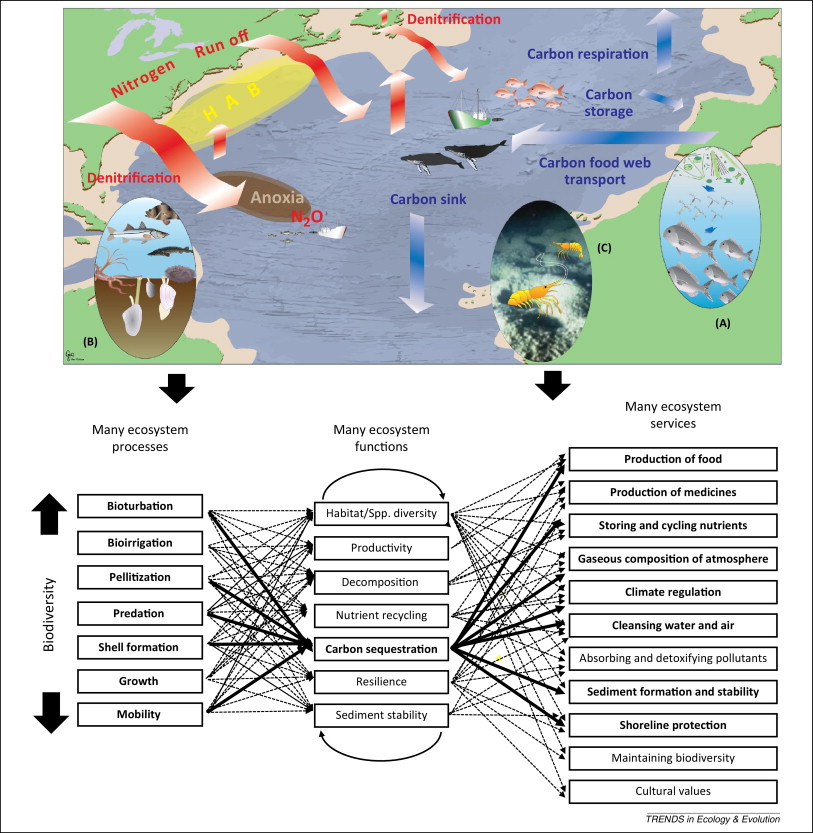
```
.center[]
.footnote[Snelgrove et al. 2014 (Marine)]
]

---

class: center

## The evolution of B-EF research

```{r echo = F, fig.align = 'center', out.width = '95%'}
knitr::include_graphics("images/vanderplas2019_BEF.jpg")
```
.footnote[Figure from van der Plas 2019]

---

layout: false

.pull-left[

## Trait vs diversity effects?

###Direct trait effects

Dominance by indigenous seeders versus sprouters affects rate of biomass accumulation, change in total stream flow, peak storm-flow pulse, and sediment yield or nutrient runoff in fynbos stands/catchments
  - it also changes with a shift to woody alien trees 

<br>

Hypothetical curves are based on information from a range of sources, see book chapter. The temporal range spans c.15 yr and any seasonal variation is excluded. 

.footnote[Figure from Slingsby et al. 2014]
]

.pull-right[
```{r echo = F, fig.align = 'center', out.width = '90%'}
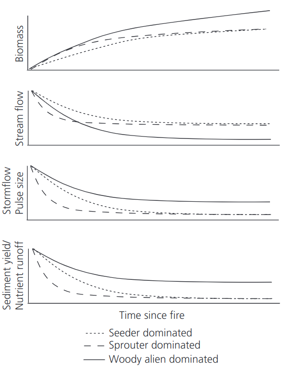
```

]

---

layout: false

.pull-left[

## Trait vs diversity effects?

###Diversity effects

Experimental communities (e.g. Cedar Creek) reveal diversity effects on several ecosystem properties...

```{r echo = F, fig.align = 'center', out.width = '100%'}
#knitr::include_graphics("images/tilman2014_fig1.png")
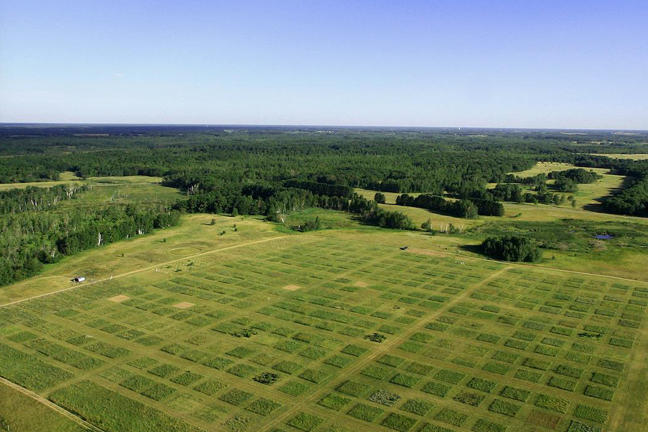
```

]

.pull-right[
```{r echo = F, fig.align = 'left', out.width = '95%'}
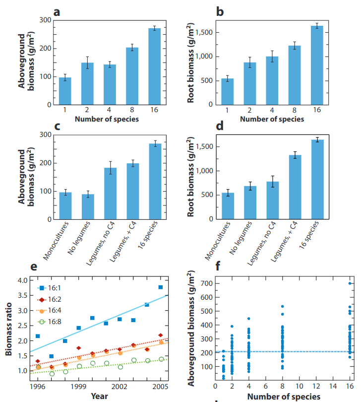
```
.footnote[Tilman et al. 2014]
]

---

layout: false

## Theoretical mechanisms driving B-EF

.pull-left[

More species = greater probability of higher trait diversity, affecting ecosystem processes through:

_**The selection effect**_

More species = more likely to have species that can dominate ecosystem processes

_**Niche complementarity**_

More species = better filling of available niche space and use of resources (links with community assembly)

**A mix of the two...**

Complementarity among and/or dominance by subsets of species or functional groups


]

.pull-right[

```{r echo = F, fig.align = 'left', out.width = '80%'}
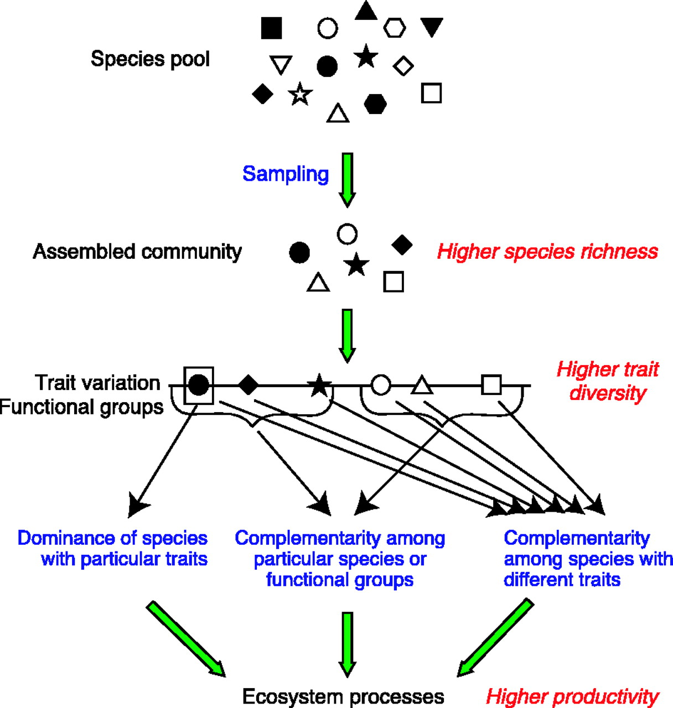
```
.footnote[Figure from Loreau et al. 2001]
]

---

layout: false

.pull-left[

## Types of B-EF effects

### Diversity-Productivity

Productivity has been the primary focus of most B-EF research, and is supported by many experiments

```{r echo = F, fig.align = 'center', out.width = '110%'}
knitr::include_graphics("images/tilman2014_fig1.png")
```

.footnote[Tilman et al. 2014]

]

.pull-right[

"Productivity" has been measured in a number of ways, including biomass, plant abundance or % cover

```{r echo = F, fig.align = 'center', out.width = '110%'}
knitr::include_graphics("images/tilman2014_fig2.png")
```

Generally results are consistent with "niche complementarity" (modelled in panel c)
  - biomass increases with diversity above that of the most productive monoculture - a phenomenon termed "overyielding"

Under "the selection effect" (panel b) the expected maximum cannot exceed that of the most productive monoculture 

]

---

layout: false

.pull-left[

## Types of B-EF effects

### Diversity-Stability 

"Biodiversity as insurance" - species respond differently to environmental change, but averaging results in lower community variance

```{r echo = F, fig.align = 'center', out.width = '70%'}
knitr::include_graphics("images/hooper2005_fig4.png")
```

.footnote[]

]

.pull-right[
```{r echo = F, fig.align = 'center', out.width = '90%'}
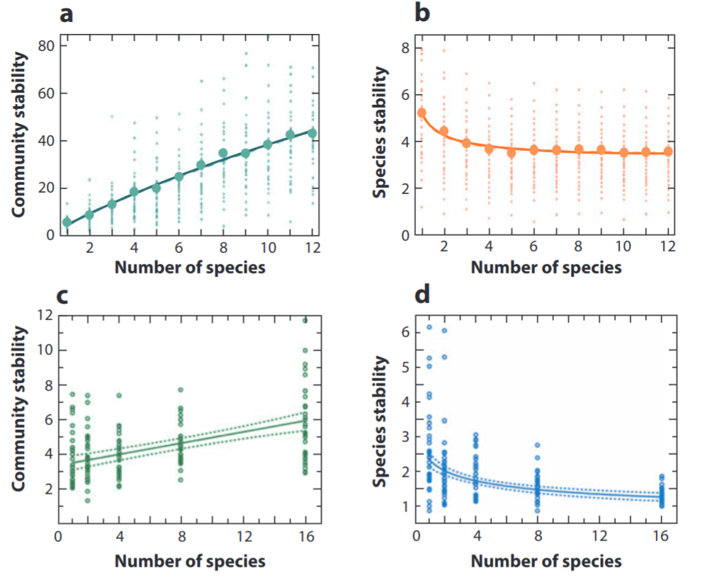
```

Species loss = less compensation (or redundancy) and increasing instability

Interestingly, more species = less species-level stability

.footnote[Hooper et al. 2005 | Tilman et al. 2014]

]

---

layout: false

.pull-left[

## Types of B-EF effects

### Diversity-Invasibility

_More diverse communities are more resistant to invasion_ - Elton 1958

- A corollary of niche theory

Invaders must find resources to survive and grow, but B-EF experiments show that the levels of unconsumed resources decline as diversity increases...

Biomass attained by invaders of a given functional group often most strongly inhibited by the existing biomass of that same functional group - consistent with the predictions of limiting similarity
]

.pull-right[
```{r echo = F, fig.align = 'center', out.width = '100%'}
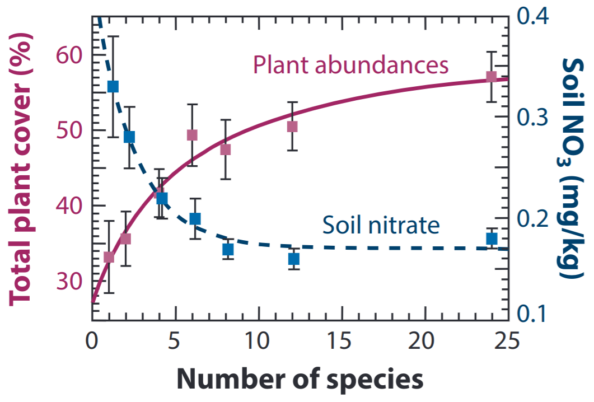
```

.footnote[Tilman et al. 2014]

]

---

layout: false

.pull-left[

## Types of B-EF effects

### Diversity-Multifunctionality

Many more species are needed to maintain multiple types of ecosystem processes than are demonstrably linked to any given process

Not all species have desirable effects on the suite of ecosystem processes measured

]

.pull-right[
```{r echo = F, fig.align = 'center', out.width = '100%'}
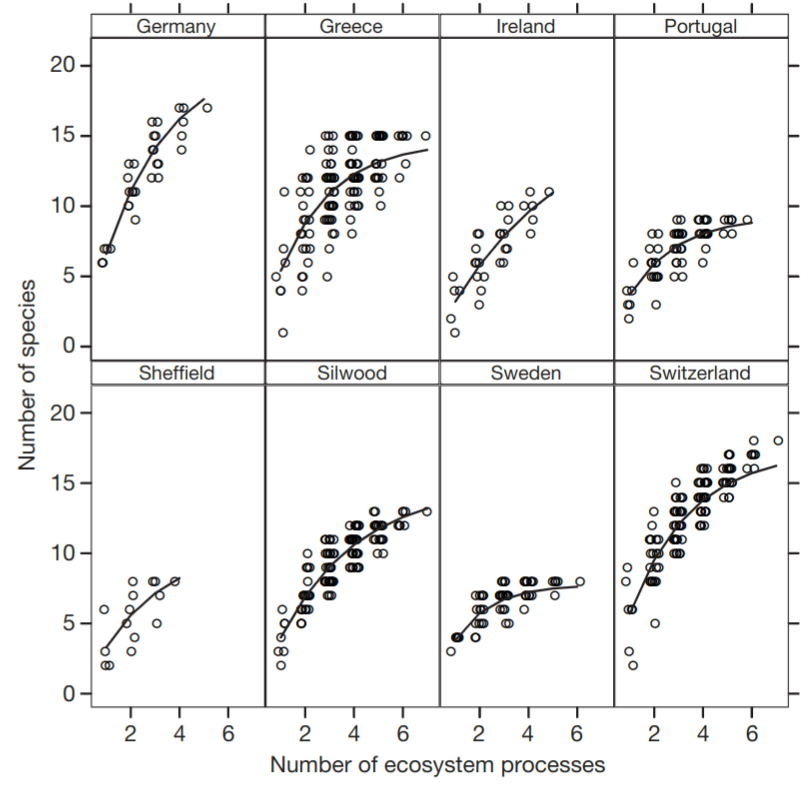
```

.footnote[###### ]

]

---

class: center, middle

## Other considerations?

---

layout: false

## Metrics of biodiversity used?

.pull-left[
Most B-EF studies measure species diversity, assuming its a good proxy for functional diversity, and that the mechanism behind B-EF is mediated by traits.

Increasingly, studies are using FD or PD and often getting better results.
]

.pull-right[
```{r echo = F, fig.align = 'center', out.width = '100%'}
knitr::include_graphics("images/cadotte2008_fig2.png")
```
]

.footnote[Cadotte et al. 2008]

---

class: center

## Does B-EF scale up in space and time?

```{r echo = F, fig.align = 'center', out.width = '75%'}
knitr::include_graphics("images/gonzalez2020.jpg")
```

.footnote[Gonzalez et al. 2020]

---

layout: false

## Does B-EF scale up in space and time?

.pull-left[

###Time?
Most B-EF studies are experiments using microcosms or sets of plots each <10m^2. The oldest have been running for ~30 years.

Most have shown an increasing B-EF effect with time...

]

.pull-right[
```{r echo = F, fig.align = 'center', out.width = '100%'}
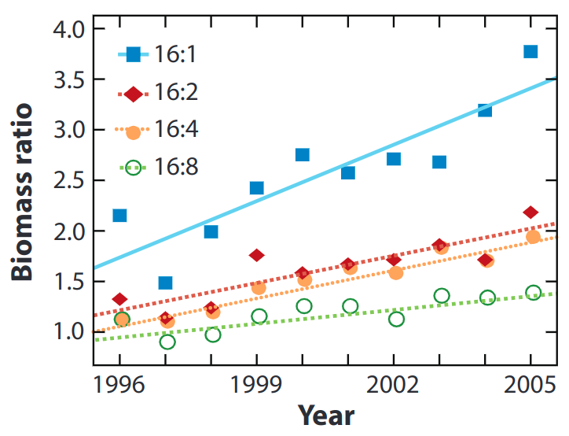
```
]

.footnote[Tilman et al. 2014]

---

layout: false

## Does B-EF scale up in space and time?

.pull-left[

###Space? - It's complicated!!!
Niche complementarity is a local co-existence mechanism, but becomes less important at the regional scale, so the effect on EF should decrease

Greater heterogeneity at the regional scale means adding species with different niche preferences should increase EF (but not so in homogenous regions)

The actual ecosystem functions themselves often change with scale!

]

.pull-right[
```{r echo = F, fig.align = 'center', out.width = '100%'}
knitr::include_graphics("images/gonzalez2020.jpg")
```

A very active area of research!

.footnote[Gonzalez et al. 2020]
]

---

layout: false

## Experiments vs the real world?

```{r echo = F, fig.align = 'center', out.width = '68%'}
knitr::include_graphics("images/vanderplas2019_BEF_map.jpg")
```
.footnote[van der Plas 2019 - a review of 258 published empirical (non-experimental) studies]

---

layout: false

## Experiments vs the real world?

```{r echo = F, fig.align = 'center', out.width = '65%'}
knitr::include_graphics("images/vanderplas2019_BEF_table1.jpg")
```
.footnote[van der Plas 2019]

---

layout: false

## B-EF and global change: Where are we headed?

.pull-left[

We depend on EF for ecosystem services, but we're dramatically altering ecosystems...

```{r echo = F, fig.align = 'center', out.width = '95%'}
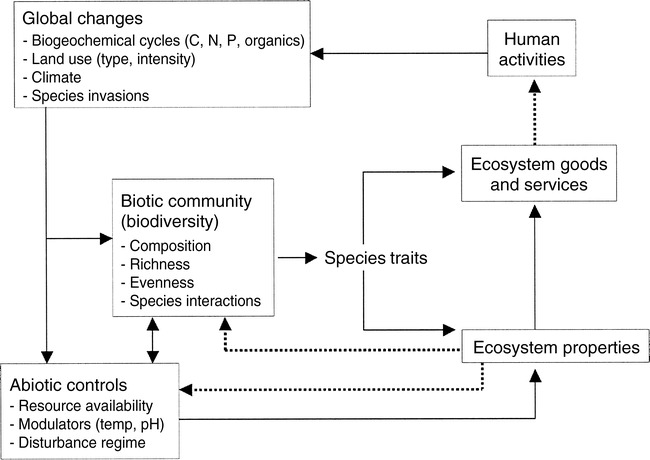
```
.footnote[Hooper et al. 2005]
]

.pull-right[
```{r echo = F, fig.align = 'right', out.width = '95%'}
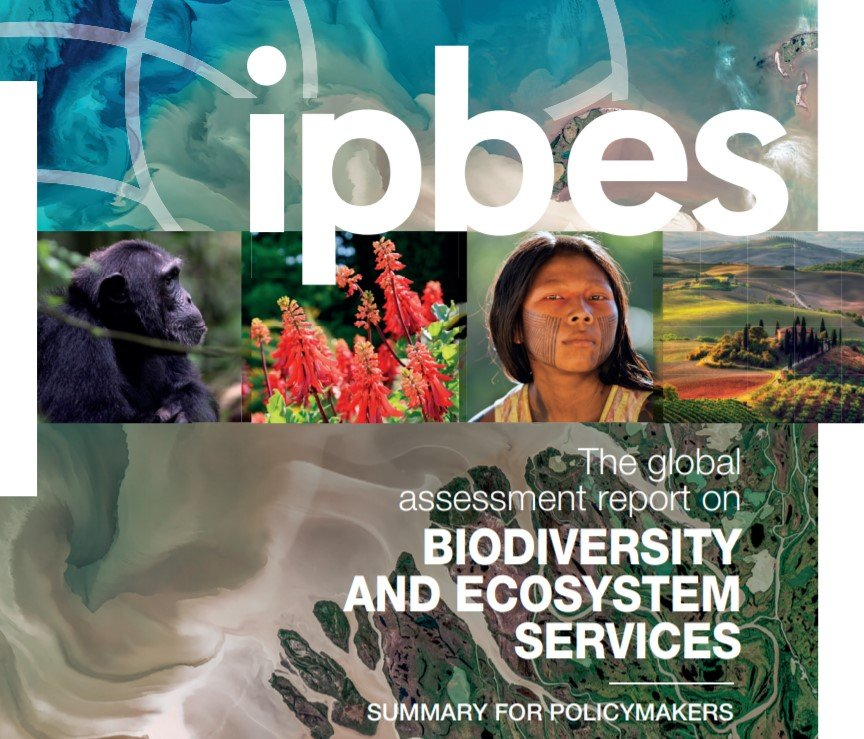
```
.footnote[https://ipbes.net/global-assessment]

]


---

layout: false

## B-EF and global change: Climate change

.pull-left[

The jury is out, but here's one example from an experiment with microbial communities.

####Results
&uparrow; temperature = &downarrow; in the intercept of the B-EF relationship (panel B), but the slope hump-shaped, being highest at low and high temperatures.

####Conclusion
$\Delta$ temperature alters the B-EF relationship, & more species are required to maintain EF under thermal stress.

]

.pull-right[
```{r echo = F, fig.align = 'right', out.width = '110%'}
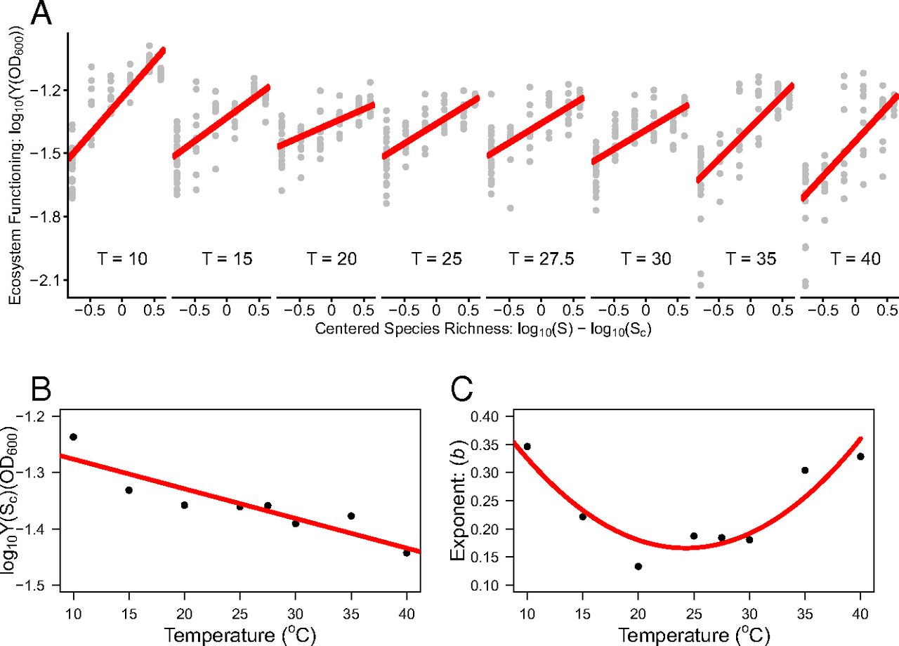
```
.footnote[Garcia et al. 2018]
]

---

layout: false

## B-EF and global change: Fragmentation

.pull-left[

The jury is out, but here's a model simulation.

####Results
&uparrow; fragmentation = &downarrow; total landscape productivity, but stronger B-EF relationships at larger spatial scales (steeper slopes of blue lines in panels e and f)

####Conclusion
Fragmentation is bad, but B-EF may compensate for some of the impacts

]

.pull-right[
```{r echo = F, fig.align = 'right', out.width = '110%'}
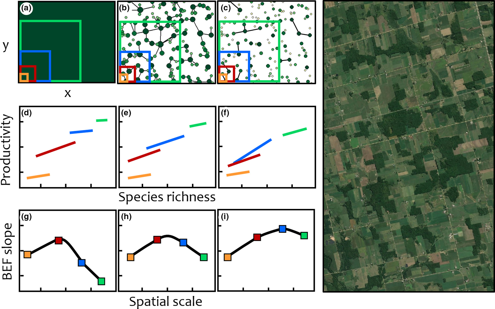
```
.footnote[Gonzalez et al. 2020]
]

---

class: center

##Take-home

_**Community assembly, ecosystem function and global change are intricately linked!!!**_

```{r echo = F, fig.align = 'center', out.width = '80%'}
knitr::include_graphics("images/chapin.png")
```

.footnote[Figure modified from Chapin et al. 1997, _Science_]

---

## References

```{r refs, echo=FALSE, results="asis"}
NoCite(myBib)
PrintBibliography(myBib)
```

---
class: center, middle

# Thanks!

Slides created via the R packages:

[**xaringan**](https://github.com/yihui/xaringan)<br>
[gadenbuie/xaringanthemer](https://github.com/gadenbuie/xaringanthemer)

The chakra comes from [remark.js](https://remarkjs.com), [**knitr**](http://yihui.name/knitr), and [R Markdown](https://rmarkdown.rstudio.com).
