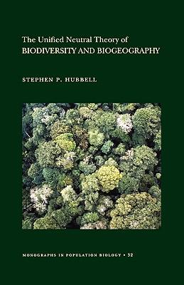

```{r setup, include=FALSE}
options(htmltools.dir.version = FALSE)
knitr::opts_chunk$set(
  fig.width=9, fig.height=3.5, fig.retina=3,
  out.width = "100%",
  cache = FALSE,
  echo = TRUE,
  message = FALSE, 
  warning = FALSE,
  hiline = TRUE
)

library(RefManageR)
BibOptions(check.entries = FALSE,
           bib.style = "authoryear",
           cite.style = "alphabetic",
           style = "markdown",
           hyperlink = FALSE,
           dashed = FALSE)
myBib <- ReadBib("bib/2_species.bib", check = FALSE)
```

```{r xaringan-themer, include=FALSE, warning=FALSE}
library(xaringanthemer)

# style_duo_accent(
#   primary_color = "#1381B0",
#   secondary_color = "#FF961C",
#   inverse_header_color = "#FFFFFF"
# )

style_mono_light(base_color = "#23395b")

#https://mycolor.space/?hex=%2323395B&sub=1 
#"Generic gradient" - #23395B #006287 #008E9D #00B897 #89DD81 #F9F871
#"Matching gradient" (reverse) - #23395B #494E77 #716292 #9C77AA #C88DBF #F5A3D0


library(knitr)
library(kableExtra)
```


```{r xaringan-tile-view, echo=FALSE}
# xaringanExtra::use_tile_view()
```

layout: false

## Local vs Regional scale processes

The diversity of local biological communities is a balance of regional and local processes - Ricklefs 1987

.pull-left[

#### Regional scale
```{r echo = F, fig.align = 'left', out.width = '60%'}
knitr::include_graphics("images/centresofendemism.png")
```

- speciation
- extinction
- dispersal

]

.pull-right[

#### Local scale
```{r echo = F, fig.align = 'left', out.width = '90%'}
knitr::include_graphics("images/fynbos_community.jpg")
``` 

- environmental filtering
- interspecific interactions (competition, predation, pathogens, mutualisms)
- adaptation
- stochastic variation
]

---

layout: false

### Assembly of species pools across scales

.pull-left[

Community assembly can be thought of as the successive filtering of species pools descending in spatial (and temporal) scale from global to local

```{r echo = F, fig.align = 'center', out.width = '100%'}
knitr::include_graphics("images/speciespools.png")
```

We often split it into **regional** versus **local** processes

.footnote[]

]

.pull-right[

_Global species pool_ = all species on the planet (or in the defined study domain, e.g. Cape Floral Region)

_Regional species pools_ = the species that are present in each region (e.g. a biogeographic region or mountain), limited by barriers to dispersal

_Fundamental species pool_ = species with the potential to occur in a particular location (i.e. can disperse there and find the appropriate abiotic conditions)

_Realised community_ = the actual observed local community (i.e. a subset of the fundamental species pool with the ability to coexist, either stably or unstably)

**_Functional or phylogenetic structure can be created or altered at any step..._**
]

---

layout: false

.pull-left[

## Regional processes

- speciation
- extinction
- dispersal

]

.pull-right[
```{r echo = F, fig.align = 'center', out.width = '100%'}
knitr::include_graphics("images/cfr_diversification_paper.jpg")
```

.footnote[Verboom et al. 2009 (CFR = Cape Floristic Region)]
]

---

layout: false

.pull-left[

## Speciation

Driven by many processes, but dramatic radiations often triggered by major events/changes that create **new habitats and opportunities** for adaptive divergence, or cause **isolation**, or both.

E.g. The "Andean radiation" of the genus _Lupinus_ was driven by the uplift of the Andes 

The uplift created diverse new habitats, because it created steep climatic gradients and exposed new geology/soils. 

It also split populations by creating new barriers to dispersal (e.g. high mountains between lowland populations, or deep valleys between high elevation populations).

.footnote[Hughes and Eastwood 2006]

]

.pull-right[
```{r echo = F, fig.align = 'center', out.width = '100%'}
knitr::include_graphics("images/hughes2006.jpg")
```

]

---

.pull-left[

## Extinction and stability

```{r echo = F, fig.align = 'center', out.width = '60%'}
knitr::include_graphics("images/cowling2015b.png")
```

Major change can be bad for diversity though... Too much, and things go extinct!

Environmental stability is key for maintaining high diversity.

]

.pull-right[

```{r echo = F, fig.align = 'center', out.width = '70%'}
knitr::include_graphics("images/cowling2015.png")
```

.footnote[Cowling et al. 2015]

]


---

layout: false

## Extinction and stability

### Why are there no biodiversity hotspots in the northern latitudes?

```{r echo = F, fig.align = 'center', out.width = '60%'}
knitr::include_graphics("images/hotspots.jpg")
```

.footnote[https://www.conservation.org/priorities/biodiversity-hotspots]

---

## Extinction and stability

### They were mostly buried in ice 15-25 000 years ago!!!

```{r echo = F, fig.align = 'center', out.width = '60%'}

```

.footnote[Wikipedia]

---

.pull-left[

## Dispersal (and extinction)

#### The Equilibrium Theory of Island Biogeography 

```{r echo = F, fig.align = 'center', out.width = '60%'}
knitr::include_graphics("images/IBT.png")
```

_Larger islands, closer to the mainland have more species._
- Larger = lower extinction (larger populations)
- Closer = higher immigration

]

.pull-right[

<br>

```{r echo = F, fig.align = 'center', out.width = '100%'}
knitr::include_graphics("images/island_biogeography.png")
```

<br>

An extension of IBT is to consider specific habitats as islands in a sea of unfavourable habitat (e.g. forest fragments in Fynbos).

.footnote[MacArthur and Wilson 1967 (Figure from Warren et al. 2015)]

]

---

.pull-left[

## Dispersal and _speciation_

### Island Biogeography Extended

Better connected islands/habitats are likely to be dominated by colonization, leaving little opportunity (niche space) for _in situ_ speciation

Isolated islands/habitats where immigration is rare are likely to see local adaptation and _in situ_ speciation over time, resulting in a community of close relatives

.footnote[Emerson and Gillespie 2008]

]

.pull-right[

<br>

```{r echo = F, fig.align = 'center', out.width = '100%'}
knitr::include_graphics("images/emerson2008.png")
```

]

---

layout: false

.pull-left[

## Environmental heterogeneity

### A driver of diversity across scales?

The Environmental Heterogeneity (EH) hypothesis (Ricklefs 1977 and others)

**Ecological** (~local):
- Provides greater available niche space (and/or refuges), enhancing coexistence

**Evolutionary** (~regional):
- Provides more opportunities for isolation and divergent adaptation, promoting diversification (speciation) and persistence (less extinction)

]

.pull-right[

```{r echo = F, fig.align = 'center', out.width = '75%'}

```

A meta-analysis of different taxa across the globe found strong support for EH (Stein et al. 2014).

```{r echo = F, fig.align = 'center', out.width = '50%'}
knitr::include_graphics("images/cramer_verboom_2017.jpg")
```

Cramer and Verboom 2017 found good support for EH explaining plant diversity across South Africa.

]

---

layout: false

.pull-left[

## "Neutral" models

_**The Unified Neutral Theory of Biodiversity and Biogeography - Hubbell 2001**_

All individuals of all species are functionally equivalent and local processes (competition etc) are mostly irrelevant...

Local communities are determined by birth, death and migration, which depend only on species abundances...

Local patterns of functional and phylogenetic diversity are determined by the regional species pool (the "Metacommunity" in this case) and dispersal constraints...
]

.pull-right[

```{r echo = F, fig.align = 'center', out.width = '25%'}

```

```{r echo = F, fig.align = 'center', out.width = '90%'}
knitr::include_graphics("images/neutral_theory.png")
```

]

---

.pull-left[

## "Neutral" models

The Mid‐Domain Effect (MDE), Colwell & Lees 2000

- aims to explain spatial patterns in species richness invoking only stochasticity and geometrical constraints

- predicts a hump‐shaped pattern in species richness in the mid-domain, because that's where most species ranges will overlap (if all else is equal, i.e. no ecological effects)

- it's essentially a spatially bounded neutral model where communities are linked by short‐distance migration 

Neutral models generally predict that local diversity is determined by regional processes...
]

.pull-right[

<br>

```{r echo = F, fig.align = 'center', out.width = '100%'}

```

.footnote[Rangel and Diniz-Filho 2005]

]

---

layout: false

### To what extent is variation in diversity the result of local determinism (i.e. ecology) vs regional processes (i.e. evolution and biogeography)?

.pull-left[

Local determinism makes 3 predictions (Ricklefs 2004) 
1. diversity should be strongly correlated with physical aspects of the environment
    - see EH hypothesis
2. local diversity in comparable habitats should not vary between regions
    - see Stability slides, comparing MTEs
3. local diversity, above some saturation level, should be independent of regional diversity
    - Type I = local diversity $\propto$ regional diversity
    - Type II = local diversity saturates
    
There is evidence for and against each, suggesting that the patterns we see are a mix of the two...
]

.pull-right[
```{r echo = F, fig.align = 'center', out.width = '100%'}

```

.footnote[Gaston 2000]
]

---

layout: false

## Community assembly processes

.pull-left[

<br>

While processes vary with spatial or temporal scale, the distinction is somewhat arbitrary

- local patterns are affected by regional processes

- regional patterns are affected by local processes

- ecology and evolution are intricately intertwined

]

.pull-right[
```{r echo = F, fig.align = 'center', out.width = '95%'}
knitr::include_graphics("images/assemblyprocesses_crop.jpg")
```

.footnote[###### ]
]

---

class: center, middle

## Take-home

Diversity patterns are influenced by a range of processes, which operate at various temporal and spatial scales. 

Some are more local, operating in ecological time. Others are more regional, operating over evolutionary time. 

There is a continuum, so it's not straightforward to distinguish the ecological from the evolutionary. 

Ecology and evolution are intricately intertwined. It's not advisable to study either without cognisance of the other.


---

## References

```{r refs, echo=FALSE, results="asis"}
NoCite(myBib)
PrintBibliography(myBib)
```

---
class: center, middle

# Thanks!

Slides created via the R packages:

[**xaringan**](https://github.com/yihui/xaringan)<br>
[gadenbuie/xaringanthemer](https://github.com/gadenbuie/xaringanthemer)

The chakra comes from [remark.js](https://remarkjs.com), [**knitr**](http://yihui.name/knitr), and [R Markdown](https://rmarkdown.rstudio.com).
