```{r setup, include=FALSE}
options(htmltools.dir.version = FALSE)
knitr::opts_chunk$set(
  fig.width=9, fig.height=3.5, fig.retina=3,
  out.width = "100%",
  cache = FALSE,
  echo = TRUE,
  message = FALSE, 
  warning = FALSE,
  hiline = TRUE
)

library(RefManageR)
BibOptions(check.entries = FALSE,
           bib.style = "authoryear",
           cite.style = "alphabetic",
           style = "markdown",
           hyperlink = FALSE,
           dashed = FALSE)
myBib <- ReadBib("bib/2_species.bib", check = FALSE)
```

```{r xaringan-themer, include=FALSE, warning=FALSE}
library(xaringanthemer)

# style_duo_accent(
#   primary_color = "#1381B0",
#   secondary_color = "#FF961C",
#   inverse_header_color = "#FFFFFF"
# )

style_mono_light(base_color = "#23395b")

#https://mycolor.space/?hex=%2323395B&sub=1 
#"Generic gradient" - #23395B #006287 #008E9D #00B897 #89DD81 #F9F871
#"Matching gradient" (reverse) - #23395B #494E77 #716292 #9C77AA #C88DBF #F5A3D0


library(knitr)
library(kableExtra)
```


```{r xaringan-tile-view, echo=FALSE}
# xaringanExtra::use_tile_view()
```

class: center, middle

## How does biodiversity affect ecosystem function?

```{r echo = F, fig.align = 'center', out.width = '70%'}
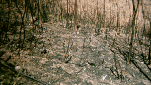
```

---

layout: false

## What are ecosystem functions? ...a bit of a quagmire...

#### Eco_logical_ processes
- result from interactions among organisms and between organisms and their environment
  - such as competition, herbivory, carnivory, mutualisms, photosynthesis

#### Ecosystem processes
- transfers of energy, material, or organisms among pools in an ecosystem, 
  - such as primary  production, decomposition, heterotrophic respiration and evapotranspiration

#### Ecosystem functions
- attributes related to the performance of an ecosystem that are the consequence of ecosystem processes - typically direct and indirect benefits of ecosystem processes for a range of species, including humans
  - examples include nutrient regulation, food production and water supply

.footnote[definitions from [Pettorelli et al 2018](http://dx.doi.org/10.1002/rse2.59)]

---

layout: false

## What are ecosystem services?

#### Ecosystem services
- the benefits human populations derive, directly or indirectly, from ecosystem functions, typically split into:
  - provisioning services (food, fibre, water, biomass, etc)
  - regulating services (air and water quality, erosion control, etc)
  - supporting services (soil formation, nutrient cycling, hydrological cycle, primary productivity...)
  - cultural services (recreation, ecotourism, ethical values, spiritual connections)

> The key distinction between ecosystem functions and ecosystem services is that  functions  can  have  both  intrinsic  and  potential anthropocentric values, while services are defined only in terms of their benefits to people.

Note that we've only recently been trying to come up with clear definitions so there are still grey areas - e.g. most "supporting services" are probably ecosystem processes...

---

layout: false


.pull-left[

## Ecosystem functions in B-EF research

- Productivity (C sequestration)
- Decomposition
- Respiration
- Pollination
- Biogeochemical cycling (nutrients, water)
- Habitat (for other organisms)
- Stability
- Invasibility, etc...

##### While there is increasing recognition of the different definitions I just gave you, historically there's been quite a bit of overlap. Either way, it is interesting to explore how biodiversity affects any and all of ecological processes, ecosystem processes, ecosystem  functions and ecosystem services. By the same token, it's probably easier to retain the name "Biodiversity-Ecosystem Function (or B-EF)" for the field of research, rather than rename it "B-ElP-EP-EF-ES"?

]

.pull-right[

```{r echo = F, fig.align = 'center', out.width = '110%'}
knitr::include_graphics("images/snelgrove2014.jpg")
```
.center[]
.footnote[Snelgrove et al. 2014 (Marine)]
]

---

class: center

## The evolution of B-EF research

```{r echo = F, fig.align = 'center', out.width = '95%'}
knitr::include_graphics("images/vanderplas2019_BEF.jpg")
```
.footnote[Figure from van der Plas 2019]

---

class: center, middle

## Trait vs diversity effects?

---

layout: false

## Trait vs diversity effects?

.pull-left[
###Direct trait effects

- Ecosystem function is directly linked to a particular trait or set of traits.
  - i.e. the actual species identity or trait value is what matters

]

.pull-right[
###Diversity effects

- Ecosystem function is dependent on the diversity of organisms or range of traits present (i.e. species, functional or phylogenetic diversity). 
  - i.e. the range or variation in species/traits/phylogenetic history is what matters


]

---

layout: false

.pull-left[

##Direct trait effects

Dominance by indigenous seeders versus sprouters affects rate of biomass accumulation, change in total stream flow, peak storm-flow pulse, and sediment yield or nutrient runoff with time since fire in fynbos stands/catchments
  - it also changes with a shift to woody alien trees 

```{r echo = F, fig.align = 'center', out.width = '100%'}
knitr::include_graphics("images/treurnicht2021.jpg")
```
.footnote[Image from [Treurnicht et al. 2021](http://dx.doi.org/10.1111/1365-2664.13882)]

]

.pull-right[
```{r echo = F, fig.align = 'center', out.width = '72%'}
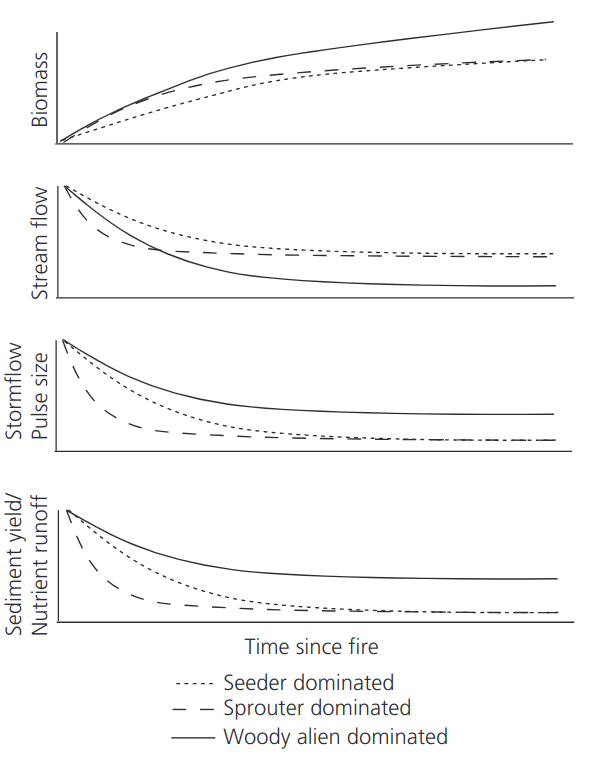
```

Hypothetical curves based on literature. Time span ~15 yrs. Seasonality excluded. 

.footnote[From [Slingsby et al. 2014](https://www.zora.uzh.ch/id/eprint/100403/)]
]

---

layout: false

.pull-left[

##Diversity effects

Experimental communities (e.g. Cedar Creek) reveal diversity effects on several ecosystem properties...

```{r echo = F, fig.align = 'center', out.width = '100%'}
#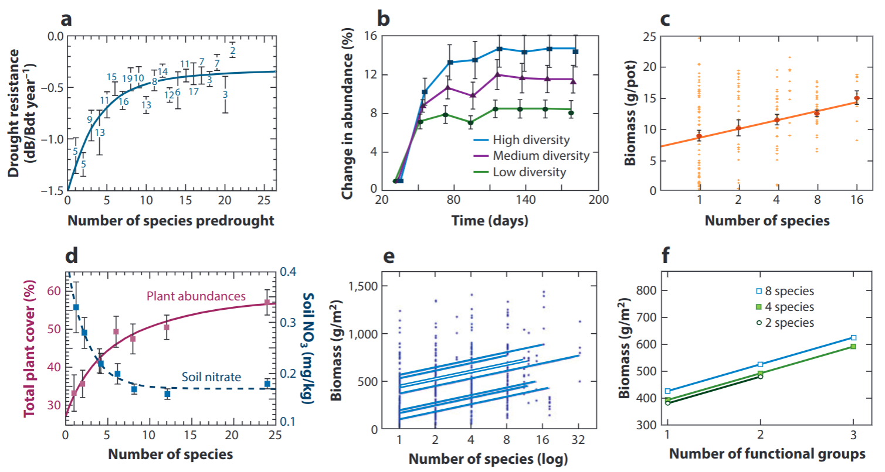
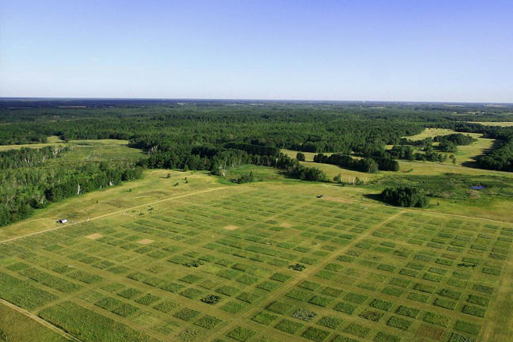
```

]

.pull-right[
```{r echo = F, fig.align = 'left', out.width = '93%'}
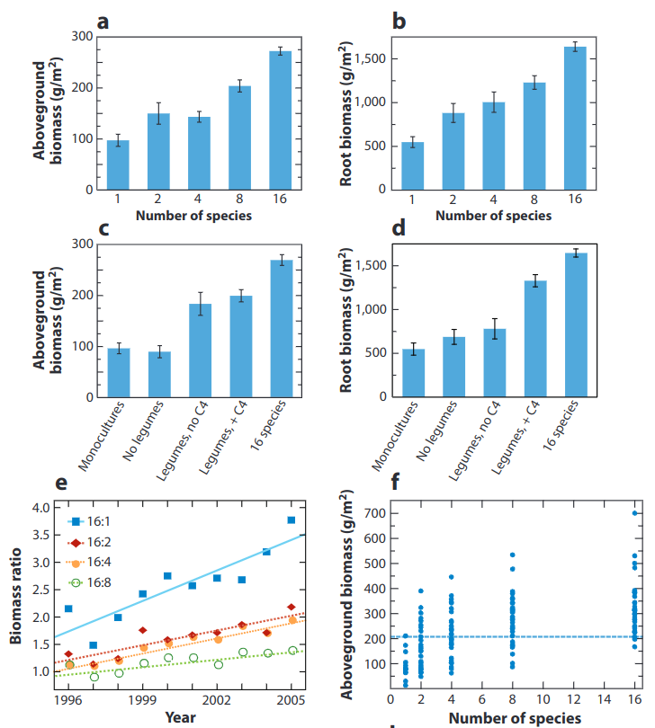
```
.footnote[Tilman et al. 2014]
]

---

layout: false

## Theoretical mechanisms driving B-EF

.pull-left[

More species = greater probability of higher trait diversity, affecting ecosystem processes through:

_**1. The selection effect**_

- More species = more likely to have species that can dominate ecosystem processes

_**2. Niche complementarity**_

- More species = better filling of available niche space and use of resources (links with community assembly)

_**3. A mix of the two...**_

- Complementarity among and/or dominance by subsets of species or functional groups


]

.pull-right[

```{r echo = F, fig.align = 'left', out.width = '80%'}
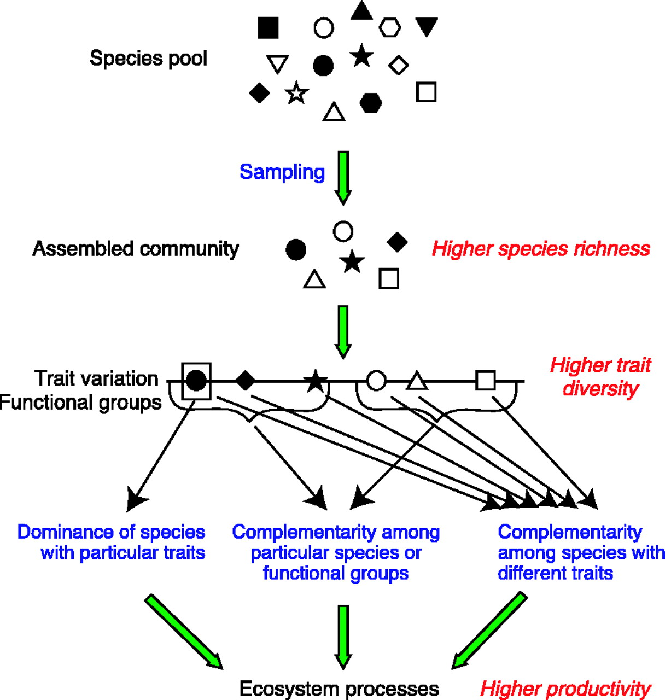
```
.footnote[Figure from Loreau et al. 2001]
]

---

layout: false

.pull-left[

## Types of B-EF effects

### Diversity-Productivity

Productivity has been the primary focus of most B-EF research, and is supported by many experiments

```{r echo = F, fig.align = 'center', out.width = '110%'}

```

.footnote[Tilman et al. 2014]

]

.pull-right[

"Productivity" has been measured in a number of ways, including biomass, plant abundance or % cover

```{r echo = F, fig.align = 'center', out.width = '110%'}
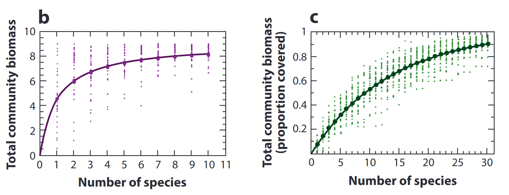
```

Generally results are consistent with "niche complementarity" (modelled in panel c)
  - biomass increases with diversity above that of the most productive monoculture - a phenomenon termed "overyielding"

Under "the selection effect" (panel b) the expected maximum cannot exceed that of the most productive monoculture 

]

---

layout: false

.pull-left[

## Types of B-EF effects

### Diversity-Stability 

```{r echo = F, fig.align = 'center', out.width = '70%'}
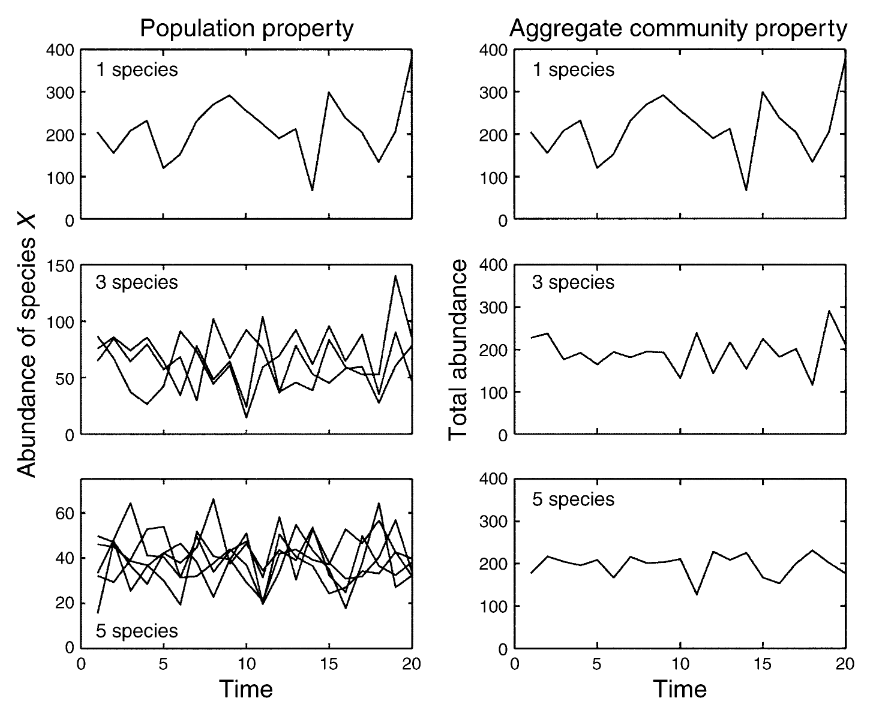
```

"Biodiversity as insurance" - species respond differently to environmental change, but averaging results in lower community variance

]

.pull-right[
```{r echo = F, fig.align = 'center', out.width = '90%'}
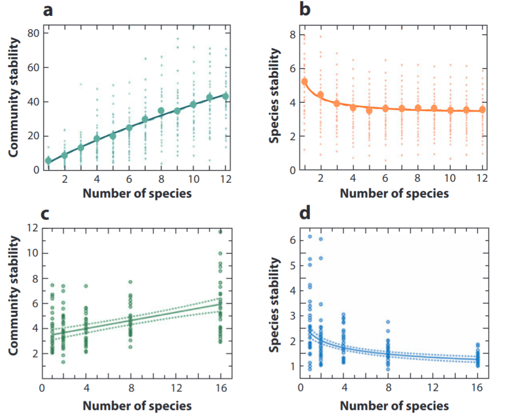
```

Species loss = less compensation (or redundancy) and increasing _community-level_ instability.

Supported by models (a, b) and experiments (c, d), BUT more species means less _species-level_ stability (consistent with niche theory).

.footnote[Hooper et al. 2005 | Tilman et al. 2014]

]

---

layout: false

.pull-left[

## Types of B-EF effects

### Diversity-Invasibility

_More diverse communities are more resistant to invasion_ - Elton 1958

- A corollary of niche theory

**Logic:** Invaders must find resources to survive and grow, but theory predicts that levels of unconsumed resources decline as diversity increases (and is supported by B-EF experiments - see figure).

**Findings:** Biomass attained by invaders of a given functional group are often most strongly inhibited by existing biomass of that same functional group - consistent with the predictions of limiting similarity.
]

.pull-right[
```{r echo = F, fig.align = 'center', out.width = '100%'}
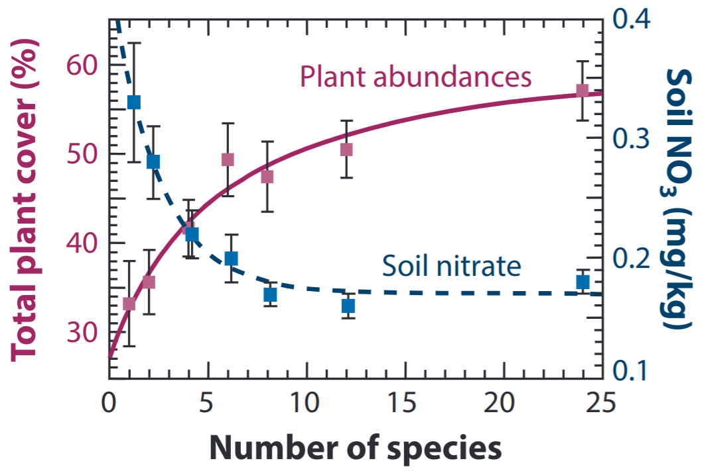
```

.footnote[Tilman et al. 2014]

]

---

layout: false

.pull-left[

## Types of B-EF effects

### Diversity-Multifunctionality

Many more species are needed to maintain multiple types of ecosystem processes than are demonstrably linked to any given process.

Not all species have desirable effects on the suite of ecosystem processes measured.

]

.pull-right[
```{r echo = F, fig.align = 'center', out.width = '100%'}
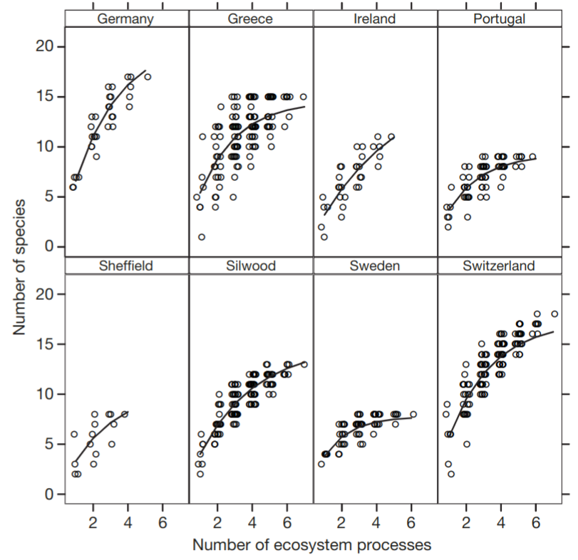
```

.footnote[###### ]

]

---

class: center, middle

## Other considerations?

---

layout: false

## Metrics of biodiversity used?

.pull-left[
Most B-EF studies measure species diversity, assuming its a good proxy for functional diversity, and that the mechanism behind B-EF is mediated by traits.

Increasingly, studies are using FD or PD and often getting better results. There is also more focus on selecting the right traits, guided by theory.

```{r echo = F, fig.align = 'center', out.width = '100%'}

```
.footnote[[Chacón-Labella et al. 2022](http://dx.doi.org/10.1016/j.tree.2022.10.007)]

]

.pull-right[
```{r echo = F, fig.align = 'center', out.width = '95%'}
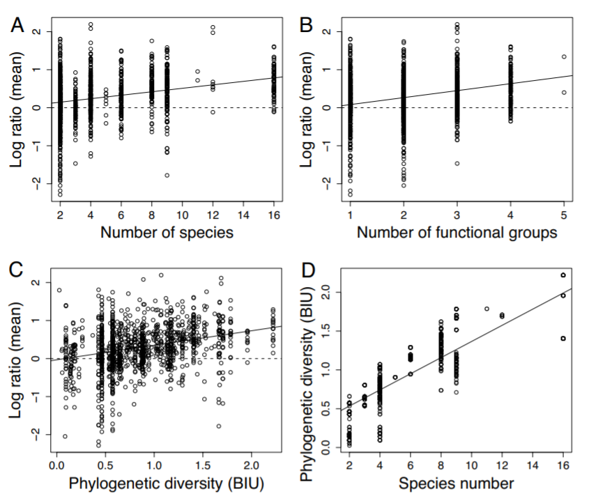
```
.footnote[Cadotte et al. 2008]
]

---

class: center

## Does B-EF scale up in space and time?

```{r echo = F, fig.align = 'center', out.width = '75%'}
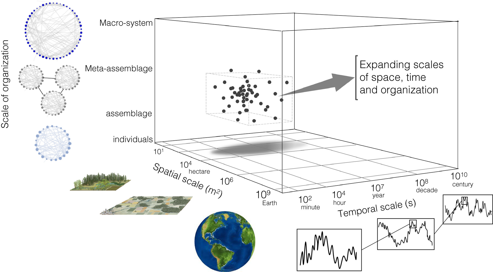
```

.footnote[Gonzalez et al. 2020]

---

layout: false

## Does B-EF scale up in space and time?

.pull-left[

###Time?
Most B-EF studies are experiments using microcosms or sets of plots each <10 $m^2$. The oldest have been running for ~30 years.

Most have shown an increasing B-EF effect with time...

]

.pull-right[
```{r echo = F, fig.align = 'center', out.width = '100%'}
knitr::include_graphics("images/tilman2014_time.png")
```
]

.footnote[Tilman et al. 2014]

---

layout: false

## Does B-EF scale up in space and time?

.pull-left[

###Space? - It's complicated!!!
Niche complementarity is a local co-existence mechanism, but becomes less important at the regional scale, so the effect on EF should decrease.

Greater heterogeneity at the regional scale means adding species with different niche preferences should increase EF (but not so in homogenous regions).

The actual ecosystem functions themselves often change with scale!

]

.pull-right[
```{r echo = F, fig.align = 'center', out.width = '100%'}

```

A very active area of research!

.footnote[Gonzalez et al. 2020]
]

---

layout: false

## Experiments vs the real world?

```{r echo = F, fig.align = 'center', out.width = '68%'}
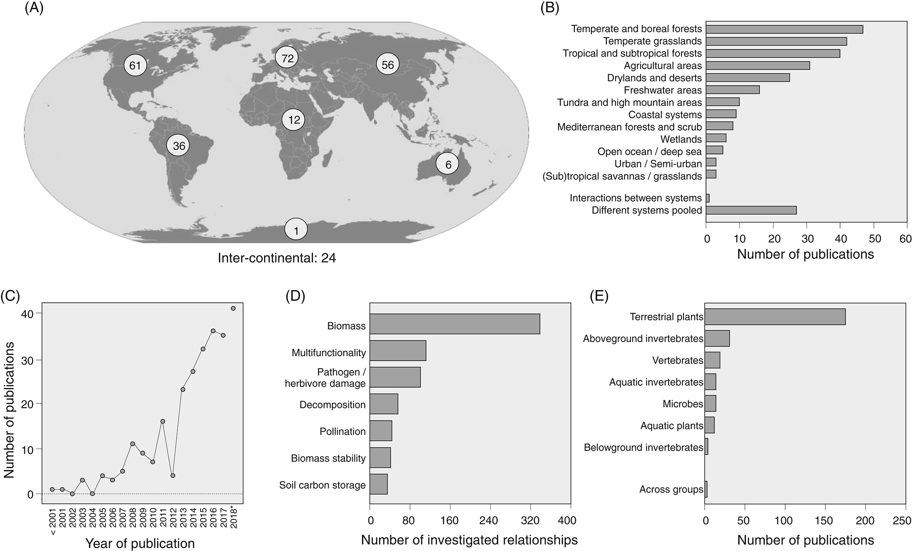
```
.footnote[van der Plas 2019 - a review of 258 published empirical (non-experimental) studies]

---

layout: false

## Experiments vs the real world?

```{r echo = F, fig.align = 'center', out.width = '65%'}
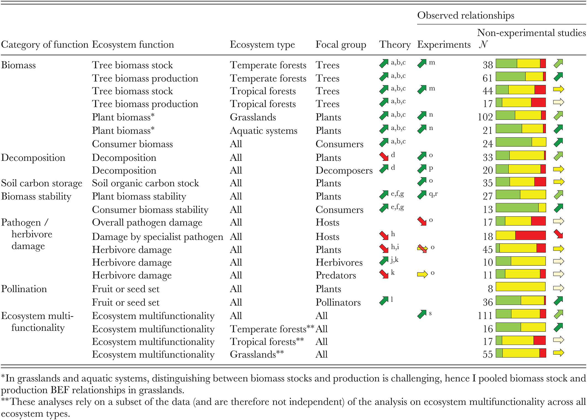
```
.footnote[van der Plas 2019]

---

layout: false

## B-EF and global change: Where are we headed?

.pull-left[

We depend on EF for ecosystem services, but we're dramatically altering ecosystems...

```{r echo = F, fig.align = 'center', out.width = '95%'}
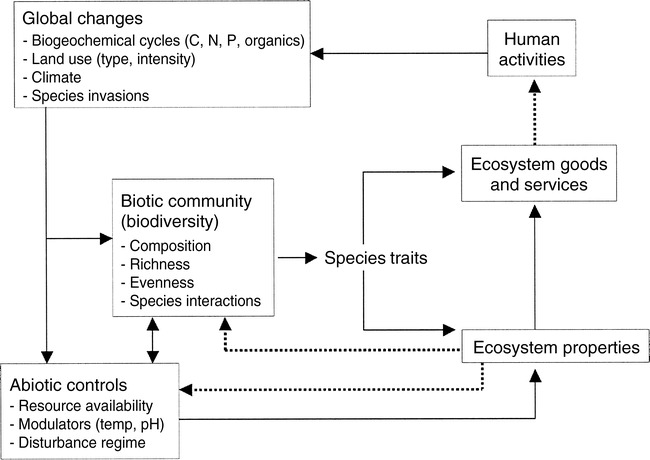
```
.footnote[Hooper et al. 2005]
]

.pull-right[
```{r echo = F, fig.align = 'right', out.width = '95%'}
knitr::include_graphics("images/ipbes.jpg")
```
.footnote[https://ipbes.net/global-assessment]

]

---

layout: false

## B-EF and global change: Climate change

.pull-left[

The jury is out, but here's one example from an experiment with microbial communities.

####Results
&uparrow; temperature = &downarrow; in the intercept of the B-EF relationship (panel B), but the slope is hump-shaped and highest at low and high temperatures.

####Conclusion
- $\Delta$ temperature alters the B-EF relationship
- more species are required to maintain EF under thermal stress (lower and higher end of the scale)

]

.pull-right[
```{r echo = F, fig.align = 'right', out.width = '110%'}
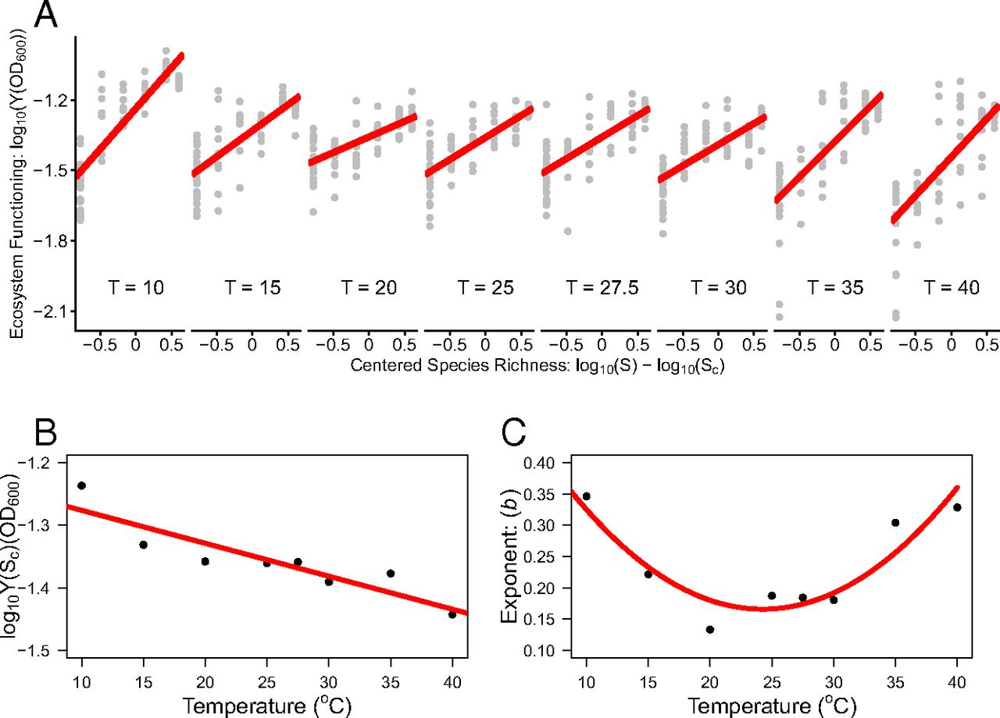
```
.footnote[Garcia et al. 2018]
]

---

layout: false

## B-EF and global change: Habitat fragmentation

.pull-left[

The jury is out, but here's a model simulation.

####Results
&uparrow; fragmentation = &downarrow; total landscape productivity, but stronger B-EF relationships in fragmented landscapes at larger spatial scales (steeper slopes of blue lines in panels e and f)

####Conclusion
Fragmentation is bad, but B-EF may actually compensate for some of the impacts

]

.pull-right[
```{r echo = F, fig.align = 'right', out.width = '110%'}
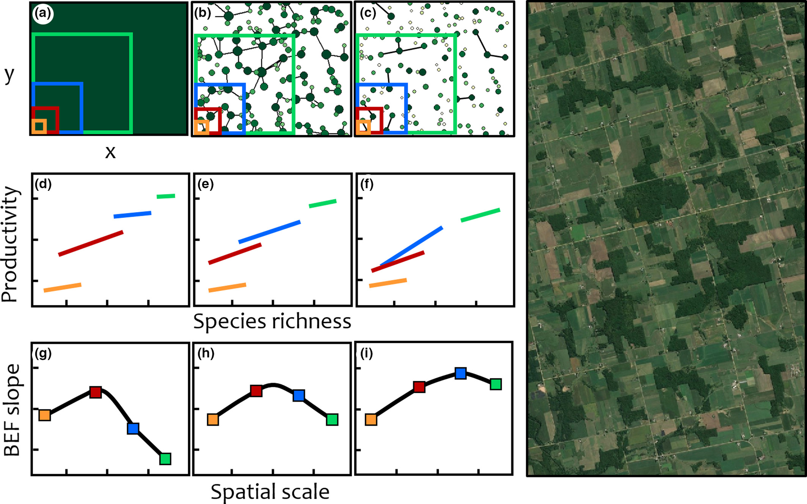
```
.footnote[Gonzalez et al. 2020]
]

---

class: center

##Take-home

_**Community assembly, ecosystem function and global change are intricately linked!!!**_

```{r echo = F, fig.align = 'center', out.width = '80%'}
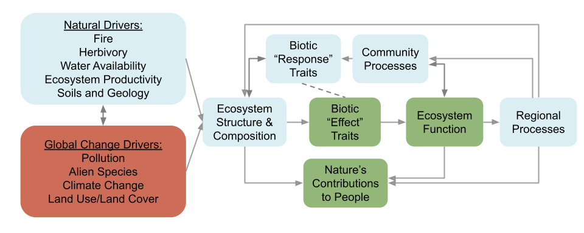
```

.footnote[Figure modified from Chapin et al. 1997, _Science_]

---
class: center, middle

# Thanks!

Slides created via the R packages:

[**xaringan**](https://github.com/yihui/xaringan)<br>
[gadenbuie/xaringanthemer](https://github.com/gadenbuie/xaringanthemer)

The chakra comes from [remark.js](https://remarkjs.com), [**knitr**](http://yihui.name/knitr), and [R Markdown](https://rmarkdown.rstudio.com).