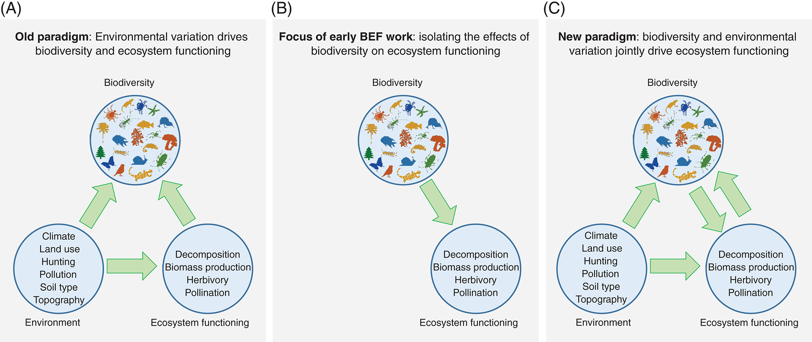
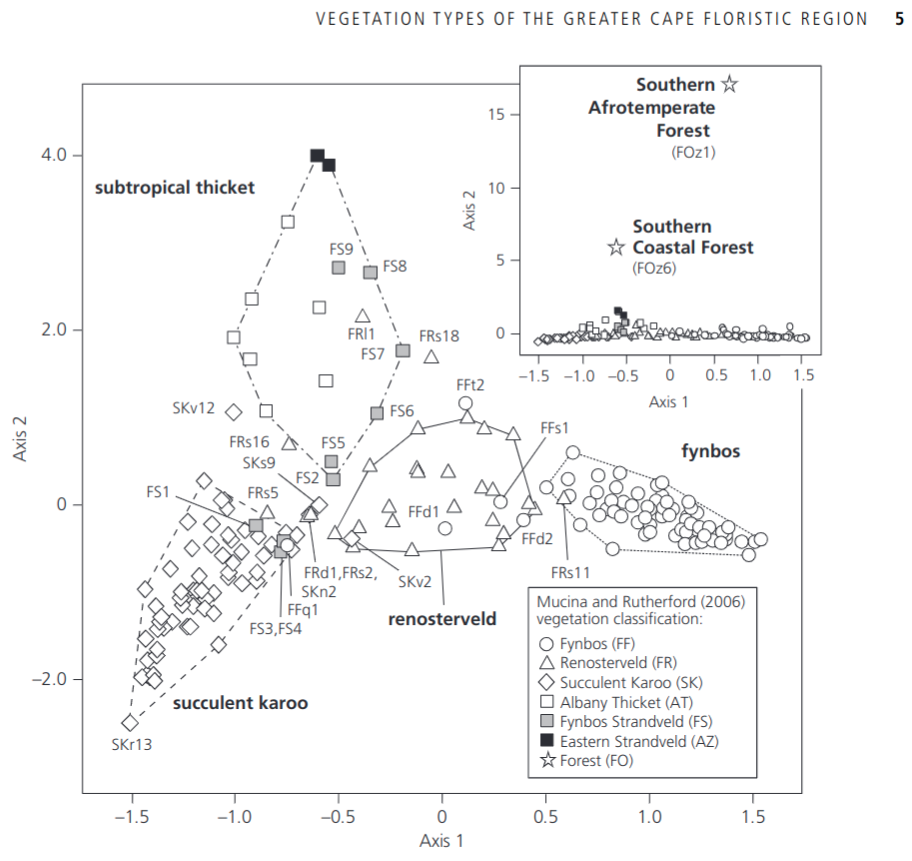

```{r setup, include=FALSE}
knitr::opts_chunk$set(echo = TRUE,  dev = "cairo_pdf")
```

# Introduction

Our understanding of and approach to studying the relationship between biodiversity and ecosystem function (B-EF) has evolved over the past few decades (Figure 1; van der Plas 2019). The historical view was one of biodiversity as the response variable, being determined by environmental and anthropogenic factors, with little feedback to ecosystem function. In the early 1990s, this shifted (and perhaps overcompensated) to focus on the causal effects of variation in biodiversity on ecosystem functioning, with little emphasis on the role of environmental variation. More recently, there is recognition that biodiversity both responds to the environment and partly drives ecosystem function in concert with environmental variation. The current focus of most B-EF research is on the relative importance of abiotic drivers (natural and anthropogenic) versus biotic variation in determining various ecosystem functions.

```{r echo = F, fig.align = 'center', out.width = '95%', fig.cap = "(from van der Plas 2019)"}

```

The Cape Floristic Region (CFR) of South Africa is one of the most botanically diverse areas on the planet. The indigenous flora of the CFR has several components with different evolutionary and biogeographic origins (Figure 2; Bergh et al. 2014), and distinct differences in a range of ecosystem functions. The CFR also has a long history of global change impacts, from direct anthropogenic disturbance (e.g. land use / land cover) to the introduction of invasive alien species. This provides a range of highly varied ecosystem types within close proximity, that often share or contrast in their biotic composition (species, functional and phylogenetic diversity) and abiotic conditions - climate, soils and disturbance regimes (fire, herbivory).

```{r echo = F, fig.align = 'center', out.width = '60%', fig.cap = "Ordination of genus-level floristic similarities of GCFR vegetation units sensu Mucina and Rutherford (2006), as inferred on the basis of the 'important species' lists provided in The vegetation of South Africa, Lesotho and Swaziland (Mucina and Rutherford 2006). Figure from Bergh et al. 2014."}

```


[Describe the measures of ecosystem function here... i.e. average and amplitude of seasonality of the Normalized Difference Vegetation Index (NDVI) recorded by the MODIS Terra satellite...]

In this practical, we will explore how variation in a set of measures of biodiversity (species, functional and phylogenetic $\alpha$ and $\beta$ diversity) and environmental conditions relate to a set of metrics of ecosystem function derived from satellite timeseries.

The questions are:

* Does the variation in environmental conditions potentially explain the observed variation in biodiversity (species, functional and phylogenetic $\alpha$ and $\beta$ diversity)?

* To what degree does the variation in functional and phylogenetic diversity potentially explain the observed variation in our measures of ecosystem function?

* What is the relative role of the environment versus biodiversity in determining the observed variation in ecosystem function?

Finally, consider this practical a descriptive study. In your discussion, describe a follow-up study that you would perform to discern cause from correlation and partition the relative influence of environmental conditions versus biodiversity on our measures of ecosystem function.

<br>

# Methods:

The sites are selected to represent contrasting vegetation, but to all be the same (or similar) post-fire age (time since last fire). We will split into 4 teams of 2 or 3. Each pair will survey a point location (towards the corners) within the 250 by 250m MODIS pixel that makes up each site.

Each team will need:

* One or more smartphones
* 2 x 10m measuring tape (or longer)
* 1 x clipboard, paper and pen or pencil
* 1 x densiometer
* 1 x metre rule
* 1 x Vernier calipers
* 8 x large plastic bags for carrying soil and plant samples for each point location
* 8 x soil sample bags
* 2 x masking tape
* 2 x marker pen

At each site, navigate to your team's point location, lay out the two tapes at 90 degrees, crossing at 3.2m and ending at 6.4m. Consider this your guide for a 3.2m radius (~20m2) circle. Within the circle we will measure:

1. _Environmental conditions:_

  * Estimate % projected cover (think the area you would see from above) bare soil

  * Take a densiometer reading at ground level. To do this, hold the densiometer level on the soil surface. Pick a spot close to the centre, but try not to pick an obviously open (or closed) patch, it should be representative of the location. To take a reading, split each square into quarters and score them for the amount of light visible - a value from 0 (complete canopy cover) to 4 (no vegetation visible) - counting up these values for all 24 squares (to a maximum of 96), and write this down. We will convert this to canopy cover later, applying the formula $100 - 1.04*X$, where $X$ is your reading.

  * Take a **soil sample** (as per Mike's prac, but it can be smaller as we are going to pool the 4 samples per site). These we will process for soil colour and pH as per Mike's prac.

  * Do a **dung count**, scoring dung for the point location by the number of quarters where you find dung (i.e. a single score from 0-4 for the point location). Try to avoid scoring obvious single scat ("dung creation") events in more than one quadrat, unless it's an impressive pile.
  
  * Take a few notes (and photos) on any other features that you think may be important or interesting (slope, rockiness, whatever).

<br>

2. _Diversity sampling:_

  * First, make sure your smartphone is fully charged and set to record GPS location with your photographs!

  * With your team, decide on which are the top 5 species by % projected cover. If your site is dominated by fewer than 5 species, count up as many species as make up 80% of the vegetation. 

    * Take diagnostic photos for the 5 species (habit (whole plant), leaf, base, flowers and/or fruits).

    * For each of three individuals of your 5 target species, measure the height and collect a shoots for measuring leaf length and leaf width (mark with masking tape and put in sample bag for the site).
    
  * Finally, set a timer and take as many photos of new species (other than your 5 target species) within or near your plot as you can before the alarm goes off. Make sure to take a photo of your site label on your sample bag between sites so you know which photos were collected at which sites. When we get back to base you will upload the photos to folders in the intranet labeled by site.

# Analyses

## Species Diversity

For this I have just taken the count of species encountered at each point, and the aggregated set of unique species for each site. i.e. no rarefaction etc. Do you think this is an issue for the method we used?

```{r, echo = F, message=FALSE}
library(tidyverse)
library(readxl)
library(knitr)

# Read in data
sdat <- read_xlsx("prac/pracdatasheet.xlsx", sheet = "Species")

# Select indigenous or invasive species only
#sdat <- sdat %>% filter(is.na(Alien))
#sdat <- sdat %>% filter(Alien == 1)

site_SD <- sdat %>% 
  filter(Point == "SE") %>% # Select only the SE corner
  select(Site, WorkingName) %>% 
  unique() %>%
  group_by(Site) %>%
  summarize(`Species Number` = n())

kable(site_SD)
```


```{r, echo = F, message=FALSE}
#And by point site:

# point_SD <- sdat %>% 
#   mutate(PointName = paste(Site, Point, sep = "_")) %>%
#   select(PointName, WorkingName) %>% 
#   unique() %>%
#   group_by(PointName) %>%
#   summarize(`Species Number` = n())

#kable(point_SD)
```


## Functional Diversity

Here I've estimated Functional Diversity (FD) according to the method of Petchey and Gaston (2002) for each of the points, sites and functional turnover between points and between sites using the method of Bryant et al. 2008.

Sites:
```{r, echo = F, message=FALSE}
#library(FD)
library(picante)

# Read in data
tdat <- read_xlsx("prac/pracdatasheet.xlsx", sheet = "Traits")

# Make a community data matrix for the sites
samp <- tdat %>%                                    # For sites, lumping all points together 
  mutate(PointName = paste(Site, Point, sep = "_"), # Make a new name column combining Site and Point
         Abundance = 6-SpeciesNumber) %>%           # Use rankings as "pseudo-abundance", but subtract from 6 to make higher rankings higher abundance
  select(Site, PointName, FullName, Abundance) %>%  # Select the columns we want
  unique() %>%                                      # Remove duplicates (there were 3 reps for each species by point)
  group_by(FullName, Site) %>%                      # For each species within each site...
  summarize(Abundance = sum(Abundance)) %>%         # ...sum the abundances
  pivot_wider(names_from = FullName, 
              values_from = Abundance,
              values_fill = 0) %>%                  # Turn the 3 columns into a species by site community data matrix
  na.omit()                                         # Drop and NA entries


# Make a community data matrix for the points within sites
pointsamp <- tdat %>%                               # For points within sites 
  mutate(PointName = paste(Site, Point, sep = "_"), # Make a new name column combining Site and Point
         Abundance = 6-SpeciesNumber) %>%           # Use rankings as "pseudo-abundance", but subtract from 6 to make higher rankings higher abundance
  select(PointName, FullName, Abundance) %>%        # Select the 3 columns we want
  unique() %>%                                      # Remove duplicates (there were 3 reps for each species by point)
  pivot_wider(names_from = FullName, 
              values_from = Abundance,
              values_fill = 0)  %>%                 # Turn the 3 columns into a species by point community data matrix
  na.omit()                                         # Drop and NA entries

# Extract species trait means and scale them to mean = 0 and sd = 0
traits <- tdat %>% 
  group_by(FullName) %>%
  summarize(PlantHeight_cm = mean(PlantHeight_cm, na.rm = T), 
            LeafLength_mm = mean(LeafLength_mm, na.rm = T), 
            LeafWidth_mm = mean(LeafWidth_mm, na.rm = T)) %>%
  mutate(across(where(is.numeric), scale)) %>%
  na.omit() # Drop and NA entries

# Use the traits to create a distance matrix for the species
trt <- as.matrix(traits[,-1])
rownames(trt) <- traits$FullName
D <- dist(trt)

# Use this distance matrix to construct a dendrogram that represents the similarity/dissimilarity among species according to their traits
tree <- hclust(D,"average")

# Transform the dendrogram into an object of class 'phylo' (needed for the next step)
ptree <- as.phylo(tree)

# Finally, calculate the functional diversity for each community - sites and points separately (see ?pd help topic to see how to include or not the root of the dendrogram; the default is to include it).
sampFD <- pd(samp[,-1], ptree)
rownames(sampFD) <- samp$Site
colnames(sampFD)[1] <- "FD"

pointsampFD <- pd(pointsamp[,-1], ptree)
rownames(pointsampFD) <- pointsamp$PointName
colnames(pointsampFD)[1] <- "FD"

# print tables
kable(sampFD, digits = 3)

```

By point sample:

```{r, echo = F, message=FALSE}
kable(pointsampFD, digits = 3)
```

And functional turnover between sites:

```{r, echo = F, message=FALSE}
# calculate functional turnover between sites
sampBFD <- phylosor(samp[,-1], ptree)

msampBFD <- as.data.frame(as.matrix(sampBFD)) # some tomfoolery to present it nicely...
dimnames(msampBFD) <- list(samp$Site, samp$Site)

msampBFDl <- msampBFD
msampBFDl[upper.tri(msampBFDl, diag = T)] <- NA
options(knitr.kable.NA = '') # set table printing function to make NA values blank
kable(msampBFDl, digits = 3) # print a table
```

See help file `?picante::phylosor` in R for details to help know how to interpret. Note that while the function was written for phylogenetic turnover, we've used it for functional turnover.

```{r, echo = F, message=FALSE}
# library(circlize)

# ?chordDiagram
```


```{r, echo = F, message=FALSE}
## Phylogenetic Diversity

# Here I've estimated Faith's Phylogenetic Diversity (PD; Faith 1991) for each of the sites and phyloSor (Bryant et al. 2008), the phylogenetic turnover between sites.


# tree <- read.nexus("prac/Soltis_etal_639taxa_8cploci_rooted.dated.tre")


#plot.phylo(tree, type = "radial", cex = 0.25)
```


## Environmental Similarity among sites

Here I provide a table and an ordination of the site-level environmental measurements we took relating to various aspects of soil conditions, canopy coverage and herbivory.

```{r, echo = F, message=FALSE}
# Read in data
pdat <- read_xlsx("prac/pracdatasheet.xlsx", sheet = "Sites")
names(pdat)

# Make boxplot of any variable
pdat %>% ggplot() +
  geom_boxplot(aes(y = Dung, x = Site))

# Test for significant difference among sites
kruskal.test(Dung ~ Site, data = pdat)

# Dunn's Post hoc test to directly explore differences among sites
library(FSA)
posthoc <- dunnTest(Dung ~ Site, data = pdat,
              method="bh")

posthoc

# Map?
#mapview(Pinus_sf_sub, zcol = "Height_m", cex = 10, layer.name="P. radiata height (m)")

```
Ordination...

Species...

```{r, echo = F, message=FALSE, warning=FALSE}

set.seed(123) # this allows the result to be reproduced

# tomfoolery to get the community data into the desired format
comm <- as.data.frame(unclass(samp))
rownames(comm) <- comm[,1]
comm <- comm[,-1]

# run NMDS
nmds <- metaMDS(comm, distance = "bray", k = 2, autotransform =TRUE, trymax = 999)

# Check stress plot
stressplot(nmds)

# Summarize environmental data to site level (i.e. take the average of point measurements)
env <- pdat %>% 
  group_by(Site) %>%
  summarize(BareSoil = mean(PercentBareSoil), 
            pH = mean(SoilPH), 
            Dung = mean(Dung),
            `Canopy Density` = mean(Densiometer))

# Fit the environmental data to the NMDS fit
en <- envfit(nmds, env, permutations = 999, na.rm = TRUE)

# Plot
plot(nmds)
plot(en)

```

FD

```{r}
fnmds <- metaMDS(msampBFD, trymax = 999)

plot(fnmds)
plot(en)

# Try adding the rest yourself...
```


Mike has shown you how to explore soil colour. Feel free to explore and add it in...

## Ecosystem function

To explore ecosystem function we looked at the 20-year time series of the Normalized Difference Vegetation Index (NDVI) recorded by the MODIS satellite mission. From these we used the post-fire recovery trajectory modelling framework developed by Wilson et al (2015) to derive estimates of the mean maximum NDVI (alpha + gamma), and the amplitude and timing of seasonality (big alpha and phi) as our measures of ecosystem function. Here I've provided a table of these parameters by site and plots of the model fits. Are the models good fits? Do they miss anything? Is it relevant to the questions we're asking?

```{r}

```


## Explore relationship between EF and measures of diversity

- Mantel tests?
?mantel

## Test relationships using a null model?


# References

Bergh et al

Mucina and Rutherford

Slingsby et al. 2020

van der Plas

Wilson et al
