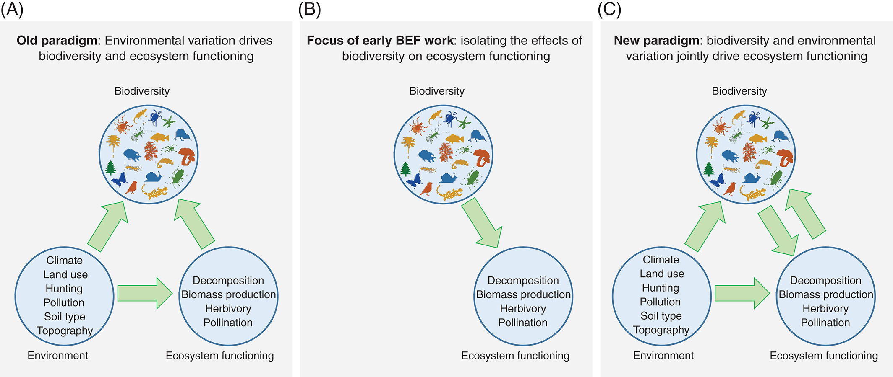
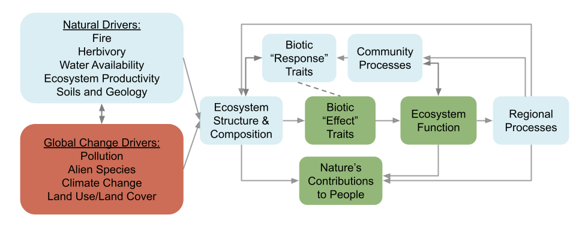

```{r setup, include=FALSE}
options(htmltools.dir.version = FALSE)
knitr::opts_chunk$set(
  fig.width=9, fig.height=3.5, fig.retina=3,
  out.width = "100%",
  cache = FALSE,
  echo = TRUE,
  message = FALSE, 
  warning = FALSE,
  hiline = TRUE
)

library(RefManageR)
BibOptions(check.entries = FALSE,
           bib.style = "authoryear",
           cite.style = "alphabetic",
           style = "markdown",
           hyperlink = FALSE,
           dashed = FALSE)
myBib <- ReadBib("bib/2_species.bib", check = FALSE)
```

```{r xaringan-themer, include=FALSE, warning=FALSE}
library(xaringanthemer)

# style_duo_accent(
#   primary_color = "#1381B0",
#   secondary_color = "#FF961C",
#   inverse_header_color = "#FFFFFF"
# )

style_mono_light(base_color = "#23395b")

#https://mycolor.space/?hex=%2323395B&sub=1 
#"Generic gradient" - #23395B #006287 #008E9D #00B897 #89DD81 #F9F871
#"Matching gradient" (reverse) - #23395B #494E77 #716292 #9C77AA #C88DBF #F5A3D0


library(knitr)
library(kableExtra)
```


```{r xaringan-tile-view, echo=FALSE}
# xaringanExtra::use_tile_view()
```

class: center

## The evolution of Biodiversity-Ecosystem Function research

There's been a shift towards acknowledging the 3-way interplay between environmental drivers, the properties of biotic communities and ecosystem function.

```{r echo = F, fig.align = 'center', out.width = '65%'}

```

.footnote[Figure from van der Plas 2019]

---

## This acknowledges the biotic "response" and "effect"

```{r echo = F, fig.align = 'center', out.width = '100%'}

```

.footnote[Figure modified from Chapin et al. 1997, _Science_]

---

## Feedbacks!

.pull-left[
```{r echo = F, fig.align = 'center', out.width = '90%'}
knitr::include_graphics("images/pausas_bond_2020_1.jpg")
```

.footnote[Pausas and Bond 2020. _Trends in Ecology and Evolution_]
]

.pull-right[
> _"**Figure 1.** Plant Biomass and Vegetation Structure in Terrestrial Ecosystems is Determined by Three Feedback Processes: Vertebrate Herbivory, Microbial Decomposition, and Wildfires."_

These feedbacks are particularly likely where there are linkages and trade-offs in the traits that determine species _response_ to the selective environment versus the traits that determine their _effect_ on the environment _sensu_ [Diaz and Cabido 2001](https://www.sciencedirect.com/science/article/pii/S0169534701022832) (especially Box 2).

]

---

class: center

## The De Hoop landscape includes a wide range of environmental conditions and vegetation communities

```{r echo = F, fig.align = 'center', out.height = '60%', warning=F, messages=F}

library(terra, quiet = T)
library(sf, quiet = T)
library(tidyverse, quiet = T)

ndvi <- rast("prac/MODIS/20220130_MODIS_v1g_POT_MOD13Q1_006_NDVI.tif")

# Get veg map and fire and plot
veg <- st_read("/Users/jasper/Documents/Datasets/SANBI/RLE_2021_Remnants/FynRemnantsClean.gpkg", quiet = T)
ndvi_g <- project(ndvi, st_crs(veg)$Wkt)
veg <- st_crop(veg, ndvi_g, quiet = T)
#fire <- st_read("/Users/jasper/Documents/Datasets/Fire/All_Fires_20_21_gw/CNCFires2021Clean.gpkg", quiet = T)
#fire <- st_crop(fire, ndvi_g, quiet = T)
mapview::mapview(veg, zcol = "name", quiet = T) #+
#mapview::mapview(fire, zcol = "year", quiet = T)

```

---

class: center

## With variation in species and their traits

.pull-left[ 
```{r echo = F, fig.align = 'center', out.width = '95%'}
knitr::include_graphics("images/eastern_ruens_shale_renosterveld.jpg")
```
]

.pull-right[ 
```{r echo = F, fig.align = 'center', out.width = '95%'}
knitr::include_graphics("images/potberg_sandstone_fynbos.jpg")
```
]

We'll look at ~4 sites with different vegetation and traits

---

####Aim:
To use species' traits to explore how species both respond to and modify resources and ecological processes in their environment and thus infer community assembly processes and biotic effects on ecosystem function.

Over and above the abiotic template, the main ecological processes of interest here are:
- interspecific interactions (e.g. competition)
- disturbance by fire
- disturbance by herbivory

---

####Hypothesis:

Differences in the relative dominance of ecological processes across ecosystems in De Hoop Nature Reserve should be reflected in both the emergent properties of each ecosystem as a whole and in the structure, composition and function of plant biodiversity within each such that the dominant plant traits create feedbacks to maintain each ecological process.

####Questions:

- What are the dominant ecological processes determining community assembly and ecosystem function in each ecosystem sampled? How is this reflected in species' "response" and "effect" traits?

- Are there any correlations between "response" and "effect" traits that could create selective trade-offs within species, or potentially generate ecosystem-level feedbacks?

- To what degree is variation in traits determined by evolutionary history (i.e. the phylogenetic relationships among species)?

- Is there any evidence that the dominant ecological processes across the reserve may be being altered and what are the likely consequences?

---

## Within each site we have sampled 4 point locations

```{r echo = F, fig.align = 'center', out.height = '65%', warning=F, messages=F, results='asis'}
# Get image dates
dates <- read.csv("prac/MODIS/dates.csv", header = F)
dates <- dates[seq(2,nrow(dates),2),]
dates <- substr(dates, 25, 34)

# Get raster data
ndvi <- rast("prac/MODIS/20220130_MODIS_v1g_POT_MOD13Q1_006_NDVI.tif")
names(ndvi) <- dates
ndvi <- ndvi*.0001

# Get sites
sites <- vect(st_read("/Users/jasper/GIT/BIO3018F/prac/Potberg_prac_sites.kml", quiet = T))
sites <- project(sites, ndvi)

# Get sample locations
adat <- terra::extract(ndvi, sites, xy=T, cells = T)
adat <- as.data.frame(t(adat[,-c(1,506:508)]))
#adat <- as.data.frame(adat[-1,])
colnames(adat) <- sites$Name
adat$calendar_date <- as.Date(dates, format = "%Y_%m_%d")
adat <- adat %>% pivot_longer(cols = sites$Name, names_to = "site")
adat$age <- (as.numeric(adat$calendar_date) - min(as.numeric(adat$calendar_date), na.rm = T))/365.25 + 2922 #add 8 years...
adat$scale <- 1

#####
adat <- terra::extract(ndvi, sites, xy=T, cells = T)
#hmm[,506:508]
#geom(sites)
centroids <- xyFromCell(ndvi, cell = adat$cell)
NW <- centroids + data.frame(x = rep(-50,6), y = rep(50, 6))
SW <- centroids + data.frame(x = rep(-50,6), y = rep(-50, 6))
NE <- centroids + data.frame(x = rep(50,6), y = rep(50, 6))
SE <- centroids + data.frame(x = rep(50,6), y = rep(-50, 6))

sampsites <- bind_rows(NW, SW, NE, SE)
sampsites$Team <- c(rep("NW", 6), rep("SW", 6), rep("NE", 6), rep("SE", 6))

pt <- st_as_sf(sampsites, coords = c("x", "y"), crs = crs(ndvi))
pt <- st_transform(pt, crs = st_crs(4326))

library(leaflet)
library(leaflet.extras)
library(htmltools)
library(widgetframe)

leaflet() %>%
  enableTileCaching() %>%
  #addTiles(options = tileOptions(useCache = TRUE, crossOrigin = TRUE))
  # Add default OpenStreetMap map tiles
  addProviderTiles("Esri.WorldImagery") %>%
  # Add our points
  addCircleMarkers(data = pt,
                   radius = 3,
                   color = "blue") %>%
  frameWidget()
```

---

## What abiotic variables should we measure in the field?

---

## What ecosystem variables should we measure in the field to explore...

- interspecific interactions (e.g. competition)?
- disturbance by fire?
- disturbance by herbivory?

---

## What species traits should we measure to explore...

.pull-left[
Species' *response* to: 
- the abiotic environment?
- interspecific interactions (e.g. competition)?
- disturbance by fire?
- disturbance by herbivory?
]

.pull-right[
Species' *effect* on: 
- the abiotic environment?
- interspecific interactions (e.g. competition)?
- disturbance by fire?
- disturbance by herbivory?
]

---

## At each point location we'll

Sample _Environmental conditions:_

- Estimate % projected cover (think the area you would see from above) bare soil

- Take a densiometer reading at ground level (a measure of canopy cover / shade / competition for light)

- Take a **soil sample** for soil moisture (weigh, dry and re-weigh)

- Do a **dung count** transect

- Look for evidence of historical fires (burn scars, dead burnt skeletons, charcoal)
  
- Take a few notes (and photos) on any features you think may be interesting

---

## At each point location we'll

Sample _Traits:_

- Decide on which are the dominant species (by % projected cover) to make up 80% of the vegetation cover.

- Make sure your smartphone is fully charged and set to record GPS location with your photographs!

- Take diagnostic photos for the species (habit (whole plant), leaf, base, flowers and/or fruits) and estimate their % cover

- For six individuals of each of the target species, 
  - measure the height and canopy diameter (in 2 perpendicular axes)
  - collect shoot for measuring leaf traits back at the Potberg centre (length, width, area and dry mass).
  - collect a 70cm long shoot/branch

- Take a pic of your site label between sites so you know what photos (and species) are from where.

---

## Data analysis!!!

First, we need to download the data, which we can do directly from Google Drive

```{r}
# Get necessary packages
library(tidyverse)
library(googlesheets4)
library(googledrive)
library(readxl)
library(GGally)
library(taxize)
library(reactable)

# Tell Google drive and Google sheets the file is open to view
drive_deauth()
gs4_deauth()

# Download file to a local directory (SET YOUR OWN!!!)
sheet <- "https://docs.google.com/spreadsheets/d/1VYMvHk7b_GcVFxCLYt4GUyUIMfrgWasQT7uy6aE0_ms/edit#gid=1570965423"
drive_download(sheet, path = "prac/flammability/flammabilitytraits2024.xlsx", overwrite = TRUE)
```

Set `path = ` to wherever you want to save the data on your laptop...

---

## Read in data

```{r}
traits <- read_xlsx("prac/flammability/flammabilitytraits2024.xlsx","TraitData")
fire <- read_xlsx("prac/flammability/flammabilitytraits2024.xlsx","Flammability")
taxonomy <- read_xlsx("prac/flammability/flammabilitytraits2024.xlsx","AcceptedSpecies")
site <- read_xlsx("prac/flammability/flammabilitytraits2024.xlsx","SiteData")
```

Set the file path to wherever you saved the data on your laptop...

---

## Summarise the site data

.pull-left[
```{r, fig.asp = 0.5, eval = FALSE}
site %>%
  mutate(
    CanopyCover = 100 - 4.16*Densiometer,
    Herbivory = as.numeric(factor(`Herbivory (A/L/M/H)`, levels = c("A","L","M","H")))-1,
    `Evidence of fire` = as.numeric(factor(`Dead skeletons or charcoal (A/L/M/H)`, levels = c("A","L","M","H")))-1) %>%
  pivot_longer(cols = c("CanopyCover", "Herbivory", "Dung", "Trampling", "SoilPH", "Bare soil (%)", "Infiltration (s)", "Ticks (/10)", "Evidence of fire", "Termite mounds")) %>%
  ggplot(aes(y = value, x = SiteName)) +
    geom_boxplot() +
    theme(axis.text.x = element_text(angle = 45, hjust = 1)) +
    facet_wrap(vars(name), nrow = 3, scales = "free")
```
Note that I've converted the ordinal classes (Absent > Low > Medium > High) into numbers (0 - 3) and taken the averages.
]

.pull-right[
```{r, fig.asp = 0.8, echo = FALSE}
site %>%
  mutate(
    CanopyCover = 100 - 4.16*Densiometer,
    Herbivory = as.numeric(factor(`Herbivory (A/L/M/H)`, levels = c("A","L","M","H")))-1,
    `Evidence of fire` = as.numeric(factor(`Dead skeletons or charcoal (A/L/M/H)`, levels = c("A","L","M","H")))-1) %>%
  pivot_longer(cols = c("CanopyCover", "Herbivory", "Dung", "Trampling", "SoilPH", "Bare soil (%)", "Infiltration (s)", "Ticks (/10)", "Evidence of fire", "Termite mounds")) %>%
  ggplot(aes(y = value, x = SiteName)) +
    geom_boxplot() +
    theme(axis.text.x = element_text(angle = 45, hjust = 1)) +
    facet_wrap(vars(name), nrow = 3, scales = "free")
```
]
---

## Summarise traits by species - morphometrics

by taking the mean or the majority class

```{r}
# Leaf traits
traits <- traits %>%
  group_by(Taxon) %>%
  summarise(
    SppCode = first(names(sort(table(SppCode), decreasing = TRUE))),
    Site = first(names(sort(table(SiteName), decreasing = TRUE))),
    `Cover at site (%)` = mean(`Cover at site (%)`, na.rm = T),
    `Growth form` = factor(first(names(sort(table(`Growth form`), decreasing = TRUE))), levels = c("Graminoid", "Shrub", "Tree")),
    `Height (cm)` = mean(`Height (cm)`, na.rm = T),
    `Leaf length (mm)` = mean(`Mean leaf length (mm)`, na.rm = T),
    `Leaf width (mm)` = mean(`Mean leaf width (mm)`, na.rm = T),
    LMA = mean(`Dry weight (g)`, na.rm = T)/mean(`Leaf area (cm2)`),
    LDMC = mean(`Dry weight (g)`, na.rm = T)/mean(`Wet weight (g)`),
    `Dead material (%)` = mean(`Dead material (%)`, na.rm = T),
    Caginess = factor(toupper(first(names(sort(table(Cageyness), decreasing = TRUE)))), levels = c("L", "M", "H")),
    Herbivory = factor(toupper(first(names(sort(table(`Herbivore damage`), decreasing = TRUE)))), levels = c("L", "M")),
    `Leaf strength` = factor(first(names(sort(table(`Leaf strength`), decreasing = TRUE))), levels = c("L", "M", "H")),
    `Phenolics` = factor(first(names(sort(table(`Phenolics`), decreasing = TRUE))), levels = c("A", "L", "M", "H"))
    )
```

---

## Summarise traits by species - flammability

by taking the mean or the majority class

```{r}
# Flammability
fire <- fire %>%
  group_by(SppCode) %>%
  summarise(
    `Max T (C)` = mean(`Max T (C)`, na.rm = T),
    `Burning time BT (s)` = mean(`Burning time BT (s)`, na.rm = T),
    `Length burnt BL (cm)` = mean(`Length burnt BL (cm)`, na.rm = T),
    `Biomass Burnt BB (%)` = mean(`Biomass Burnt BB (%)`, na.rm = T)
  )

# Join traits into one
data <- left_join(traits, fire)
data <- left_join(data, taxonomy)
```

...and join the taxonomy, morphometric and flammability traits into one

---

.pull-left[

## Taxonomic classification

```{r}
data$Taxon <- data$Taxon %>% str_replace_all(c("Elytropappus rhinocerotis" = "Dicerothamnus rhinocerotis", "Rapanea melanophloeos" = "Myrsine melanophloeos"))

taxaclass <- classification(data$Taxon, db = "ncbi")
```
]

.pull-right[
```{r, fig.asp = 0.8}
tree <- class2tree(taxaclass)

plot(tree)
lines(x=c(24,24),y=c(0,25),lwd=2)
```
How about we split the 25 taxa into 6 groups?

]

---

.pull-left[

## Taxonomic classification

```{r, eval = FALSE}
# Extract and merge higher taxonomic ranks
tclass <- tree$classification %>% select(norank_91835, norank_4734, norank_91836, norank_2821351, norank_71274) %>%
unite(col = "TaxonClass", na.rm = T)

# Group Proteaceae
tclass[which(rownames(tclass) %in% c("Aulax umbellata", "Leucadendron salignum", "Mimetes cucullatus", "Protea neriifolia", "Protea repens")),1] <- "proteaceae"

# tclass <- cutree(as.hclust(ape::multi2di(tree$phylo)), k = 6) #Another way to do it based on branches

# Combine data
data <- left_join(data, data.frame(TaxonClass = tclass[,1], Taxon = rownames(tclass)))

reactable(data)
```
]

.pull-right[
```{r, echo = FALSE}
# Extract and merge higher taxonomic ranks
tclass <- tree$classification %>% select(norank_91835, norank_4734, norank_91836, norank_2821351, norank_71274) %>%
unite(col = "TaxonClass", na.rm = T)

# Group Proteaceae
tclass[which(rownames(tclass) %in% c("Aulax umbellata", "Leucadendron salignum", "Mimetes cucullatus", "Protea neriifolia", "Protea repens")),1] <- "proteaceae"

# tclass <- cutree(as.hclust(ape::multi2di(tree$phylo)), k = 6) #Another way to do it based on branches

# Combine data
data <- left_join(data, data.frame(TaxonClass = tclass[,1], Taxon = rownames(tclass)))

reactable(data)
```
]

---

## Create sets of variables for comparisons in analyses

```{r}
# continuous morphometric traits
cont_trts <- c("Height (cm)", "Leaf length (mm)", "Leaf width (mm)", "LMA", "LDMC", "Dead material (%)")

# discrete morphometric traits
disc_trts <- c("Growth form", "Caginess", "Herbivory", "Leaf strength", "Phenolics")

# flammability traits (continuous)
flammability <- c("Max T (C)", "Burning time BT (s)", "Length burnt BL (cm)", "Biomass Burnt BB (%)")
```

---

## Plant traits: within continuous morphometric traits

```{r, fig.align = 'center', out.width = '70%', fig.asp = 0.6}
data %>%  ggpairs(cont_trts) 
```

---

.pull-left[

### Plant traits: continuous vs discrete

```{r, fig.align = 'center', out.width = '100%', fig.asp = 1, eval=FALSE}
data %>% ggduo(disc_trts, cont_trts)
```
]

.pull-right[
```{r, fig.align = 'center', out.width = '100%', fig.asp = 1, echo=FALSE}
data %>% ggduo(disc_trts, cont_trts)
```
]

---

### Plant traits: continuous by site

.pull-left[

```{r, fig.align = 'center', out.width = '55%', fig.asp=1.25}
# Unweighted
data %>% ggduo("Site", cont_trts)
```
]

.pull-right[

```{r, fig.align = 'center', out.width = '55%', fig.asp = 1.25}
# Weighted by % cover of species
data %>% ggduo("Site", cont_trts, mapping = ggplot2::aes(weight = `Cover at site (%)`))
```
]

---

.pull-left[

### Plant traits: by TaxonClass

```{r planttaxclass1, fig.align = 'center', out.width = '75%', fig.asp=1.5, eval = FALSE}
data %>% ggduo(columnsX = "TaxonClass", columnsY = cont_trts)
```
]

.pull-right[

```{r planttaxclass2, fig.align = 'center', out.width = '75%', fig.asp=1.5, echo = FALSE}
data %>% ggduo(columnsX = "TaxonClass", columnsY = cont_trts)
```
]

---

### Plant traits: discrete by site

.pull-left[
```{r, fig.align = 'center', out.width = '65%', fig.asp=1.15}
# Unweighted
data %>% ggduo("Site", disc_trts)
```
]

.pull-right[
```{r, fig.align = 'center', out.width = '65%', fig.asp = 1.15}
# Weighted by % cover of species
data %>% ggduo("Site", disc_trts, mapping = ggplot2::aes(weight = `Cover at site (%)`))
```
]
---

# Flammability traits

---

### Flammability traits: within

```{r, fig.align = 'center', out.width = '70%', fig.asp = 0.6}
data %>% ggpairs(flammability, mapping = ggplot2::aes(colour = Site))
```

---

.pull-left[
### Flammability by site

```{r, fig.align = 'center', out.width = '75%', fig.asp = 1.5, eval = FALSE}
data %>% ggduo("Site", flammability)
```
]

.pull-right[

```{r, fig.align = 'center', out.width = '75%', fig.asp = 1.5, echo = FALSE}
data %>% ggduo("Site", flammability)
```
]

---

.pull-left[
### Flammability by site

```{r, fig.align = 'center', out.width = '75%', fig.asp = 1.5, eval = FALSE}
data %>%
  ggduo("Site", flammability,
        mapping = ggplot2::aes(weight = `Cover at site (%)`))
```

Now weighted by % cover of species

]

.pull-right[

```{r, fig.align = 'center', out.width = '75%', fig.asp = 1.5, echo = FALSE}
data %>%
  ggduo("Site", flammability,
        mapping = ggplot2::aes(weight = `Cover at site (%)`))
```
]

---

.pull-left[
### Flammability by TaxonClass

```{r flamtaxclass1, fig.align = 'center', out.width = '75%', fig.asp = 1.5, eval = FALSE}
data %>% ggduo(columnsX = "TaxonClass", columnsY = flammability)
```
]

.pull-right[

```{r flamtaxclass2, fig.align = 'center', out.width = '75%', fig.asp = 1.5, echo = FALSE}
data %>% ggduo(columnsX = "TaxonClass", columnsY = flammability)
```
]

---

### Flammability by species

.pull-left[

```{r, fig.align = 'center', out.width = '100%', fig.asp = 0.8, eval = FALSE}
data %>%
  select(all_of(c("Taxon", "Site", flammability))) %>%
  pivot_longer(cols = flammability) %>%
  ggplot(aes(y = value, x = fct_reorder(Taxon, as.numeric(as.factor(Site))), fill = Site)) +
    geom_col() +
    theme(axis.text.x = element_text(angle = 90, hjust = 1)) +
    facet_wrap(vars(name), scales = "free") +
    xlab("Species")
```

]

.pull-right[

```{r, fig.align = 'center', out.width = '100%', fig.asp = 0.8, echo = FALSE}
data %>%
  select(all_of(c("Taxon", "Site", flammability))) %>%
  pivot_longer(cols = flammability) %>%
  ggplot(aes(y = value, x = fct_reorder(Taxon, as.numeric(as.factor(Site))), fill = Site)) +
    geom_col() +
    theme(axis.text.x = element_text(angle = 90, hjust = 1)) +
    facet_wrap(vars(name), scales = "free") +
    xlab("Species")
```
]

---

# Plant vs flammability traits

---

### Flammability vs discrete traits: unweighted vs weighted

.pull-left[
```{r, fig.align = 'center', out.width = '100%', fig.asp = 0.8}
data %>% ggduo(disc_trts, flammability)
```
]

.pull-right[

```{r, fig.align = 'center', out.width = '100%', fig.asp = 0.8}
data %>% ggduo(disc_trts, flammability, mapping = ggplot2::aes(weight = `Cover at site (%)`))
```
]

---

### Flammability vs continuous traits

```{r, fig.align = 'center', out.width = '70%', fig.asp = 0.6}
data %>% ggpairs(c(cont_trts, flammability))
```

---

# Deliverable

A brief research report in the format of a paper in the journal [_Biology Letters_](https://royalsocietypublishing.org/rsbl/for-authors).

- 2,500 words maximum, including references.
- Standard journal paper format: 
  - Title 
  - Abstract 
  - Introduction 
  - Methods 
  - Results 
  - Discussion 
  - References
  
- Consider relevant references from the lectures...
- No statistics required, but you're welcome to have a go for extra marks.
- Feel free to highlight the shortcomings of our study and what you would do to improve it.

---
class: center, middle

# Thanks!

Slides created via the R packages:

[**xaringan**](https://github.com/yihui/xaringan)<br>
[gadenbuie/xaringanthemer](https://github.com/gadenbuie/xaringanthemer)

The chakra comes from [remark.js](https://remarkjs.com), [**knitr**](http://yihui.name/knitr), and [R Markdown](https://rmarkdown.rstudio.com).
