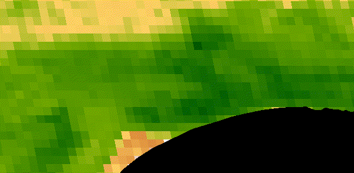

```{r setup, include=FALSE}
options(htmltools.dir.version = FALSE)
knitr::opts_chunk$set(
  fig.width=9, fig.height=3.5, fig.retina=3,
  out.width = "100%",
  cache = FALSE,
  echo = TRUE,
  message = FALSE, 
  warning = FALSE,
  hiline = TRUE
)

library(RefManageR)
BibOptions(check.entries = FALSE,
           bib.style = "authoryear",
           cite.style = "alphabetic",
           style = "markdown",
           hyperlink = FALSE,
           dashed = FALSE)
myBib <- ReadBib("bib/2_species.bib", check = FALSE)
```

```{r xaringan-themer, include=FALSE, warning=FALSE}
library(xaringanthemer)

# style_duo_accent(
#   primary_color = "#1381B0",
#   secondary_color = "#FF961C",
#   inverse_header_color = "#FFFFFF"
# )

style_mono_light(base_color = "#23395b")

#https://mycolor.space/?hex=%2323395B&sub=1 
#"Generic gradient" - #23395B #006287 #008E9D #00B897 #89DD81 #F9F871
#"Matching gradient" (reverse) - #23395B #494E77 #716292 #9C77AA #C88DBF #F5A3D0


library(knitr)
library(kableExtra)
```


```{r xaringan-tile-view, echo=FALSE}
# xaringanExtra::use_tile_view()
```

class: center

## The evolution of Biodiversity-Ecosystem Function research

There's been a shift towards acknowledging the 3-way interplay between environmental drivers, the properties of biotic communities and ecosystem function.

```{r echo = F, fig.align = 'center', out.width = '65%'}
knitr::include_graphics("images/vanderplas2019_BEF.jpg")
```

.footnote[Figure from van der Plas 2019]

---

class: center

## The De Hoop landscape includes a wide range of environmental conditions and vegetation communities

```{r echo = F, fig.align = 'center', out.height = '60%', warning=F, messages=F}

library(terra, quiet = T)
library(sf, quiet = T)
library(tidyverse, quiet = T)

ndvi <- rast("prac/MODIS/20220130_MODIS_v1g_POT_MOD13Q1_006_NDVI.tif")

# Get veg map and fire and plot
veg <- st_read("/home/jasper/Documents/Datasets/SANBI/RLE_2021_Remnants/FynRemnantsClean.gpkg", quiet = T)
ndvi_g <- project(ndvi, st_crs(veg)$Wkt)
veg <- st_crop(veg, ndvi_g, quiet = T)
#fire <- st_read("/home/jasper/Documents/Datasets/Fire/All_Fires_20_21_gw/CNCFires2021Clean.gpkg", quiet = T)
#fire <- st_crop(fire, ndvi_g, quiet = T)
mapview::mapview(veg, zcol = "name", quiet = T) #+
#mapview::mapview(fire, zcol = "year", quiet = T)

```

---

class: center

## With variation in "vegetation greenness" over time

```{r echo = F, fig.align = 'center', out.width = '75%'}

```

"vegetation greenness" = the Normalized Difference Vegetation Index (NDVI)

---

## We're going to look at 6 different sites with varying NDVI

```{r echo = F, fig.align = 'center', out.height = '65%', warning=F, messages=F}

# Get image dates
dates <- read.csv("prac/MODIS/dates.csv", header = F)
dates <- dates[seq(2,nrow(dates),2),]
dates <- substr(dates, 25, 34)

# Get raster data
ndvi <- rast("prac/MODIS/20220130_MODIS_v1g_POT_MOD13Q1_006_NDVI.tif")
names(ndvi) <- dates
ndvi <- ndvi*.0001

# Get sites
sites <- vect(st_read("/home/jasper/GIT/BIO3018F/prac/Potberg_prac_sites.kml", quiet = T))
sites <- project(sites, ndvi)

# Get sample locations
adat <- terra::extract(ndvi, sites, xy=T, cells = T)
adat <- as.data.frame(t(adat[,-c(1,506:508)]))
#adat <- as.data.frame(adat[-1,])
colnames(adat) <- sites$Name
adat$calendar_date <- as.Date(dates, format = "%Y_%m_%d")
adat <- adat %>% pivot_longer(cols = sites$Name, names_to = "site")
adat$age <- (as.numeric(adat$calendar_date) - min(as.numeric(adat$calendar_date), na.rm = T))/365.25 + 2922 #add 8 years...
adat$scale <- 1

###Plot all timeseries
adat %>%
  ggplot(aes(x = calendar_date, y = value*scale)) + 
  geom_line() +
  #  geom_point() +
  facet_wrap(.~ site) +
  ylab("NDVI") +
  ylim(0.2, 0.9)

```

---

## We ask:

* Does the variation in environmental conditions explain the observed variation in biodiversity (species and functional $\alpha$ and $\beta$ diversity)?

* To what degree does variation in species and functional and diversity explain the observed variation in our measures of ecosystem function?

* What is the relative role of the environment versus biodiversity in determining the observed variation in ecosystem function?

---

## Within each site we'll sample 4 point locations

```{r echo = F, fig.align = 'center', out.height = '65%', warning=F, messages=F}

adat <- terra::extract(ndvi, sites, xy=T, cells = T)
#hmm[,506:508]
#geom(sites)
centroids <- xyFromCell(ndvi, cell = adat$cell)
NW <- centroids + data.frame(x = rep(-50,6), y = rep(50, 6))
SW <- centroids + data.frame(x = rep(-50,6), y = rep(-50, 6))
NE <- centroids + data.frame(x = rep(50,6), y = rep(50, 6))
SE <- centroids + data.frame(x = rep(50,6), y = rep(-50, 6))

sampsites <- bind_rows(NW, SW, NE, SE)
sampsites$Team <- c(rep("NW", 6), rep("SW", 6), rep("NE", 6), rep("SE", 6))

pt <- st_as_sf(sampsites, coords = c("x", "y"), crs = crs(ndvi))
pt <- st_transform(pt, crs = st_crs(4326))

library(leaflet)
library(leaflet.extras)
library(htmltools)
leaflet() %>%
  enableTileCaching() %>%
  #addTiles(options = tileOptions(useCache = TRUE, crossOrigin = TRUE))
  # Add default OpenStreetMap map tiles
  addProviderTiles("Esri.WorldImagery", options = tileOptions(useCache = TRUE, crossOrigin = TRUE)) %>%
  # Add our points
  addCircleMarkers(data = pt,
                   radius = 3,
                   color = "blue")
```

---

## At each point location we'll

Sample _Environmental conditions:_

- Estimate % projected cover (think the area you would see from above) bare soil

- ~~Take a densiometer reading at ground level~~

- ~~Take a **soil sample**~~

- Do a **dung count**, scoring dung for the point location by the number of quarters where you find dung (i.e. 0-4 for the point location)
  
- Take a few notes (and photos) on any features you think may be interesting

---

## At each point location we'll

Sample _Diversity:_

- Make sure your smartphone is fully charged and set to record GPS location with your photographs!

- Decide on which are the top 5 species by % projected cover (or just species that make up 80% of the vegetation). 

- Take diagnostic photos for the 5 species (habit (whole plant), leaf, base, flowers and/or fruits) and score them 1-5 from most to least abundant

- For three individuals of each of your 5 target species, 
  - measure the height and collect shoot for measuring leaf traits back at the Potberg centre (length, width, area and dry mass).
    
- Finally, set a timer and take as many diagnostic photos of new species (other than your 5 target species) within or near your plot as you can before the alarm goes off. 

- Take a pic of your site label between sites so you know what photos are from where.
  
---

## References

```{r refs, echo=FALSE, results="asis"}
NoCite(myBib)
PrintBibliography(myBib)
```

---
class: center, middle

# Thanks!

Slides created via the R packages:

[**xaringan**](https://github.com/yihui/xaringan)<br>
[gadenbuie/xaringanthemer](https://github.com/gadenbuie/xaringanthemer)

The chakra comes from [remark.js](https://remarkjs.com), [**knitr**](http://yihui.name/knitr), and [R Markdown](https://rmarkdown.rstudio.com).
