```{r setup, include=FALSE}
options(htmltools.dir.version = FALSE)
knitr::opts_chunk$set(
  fig.width=9, fig.height=3.5, fig.retina=3,
  out.width = "100%",
  cache = FALSE,
  echo = TRUE,
  message = FALSE, 
  warning = FALSE,
  hiline = TRUE
)

library(RefManageR)
BibOptions(check.entries = FALSE,
           bib.style = "authoryear",
           cite.style = "alphabetic",
           style = "markdown",
           hyperlink = FALSE,
           dashed = FALSE)
myBib <- ReadBib("bib/2_species.bib", check = FALSE)
```

```{r xaringan-themer, include=FALSE, warning=FALSE}
library(xaringanthemer)

# style_duo_accent(
#   primary_color = "#1381B0",
#   secondary_color = "#FF961C",
#   inverse_header_color = "#FFFFFF"
# )

style_mono_light(base_color = "#23395b")

#https://mycolor.space/?hex=%2323395B&sub=1 
#"Generic gradient" - #23395B #006287 #008E9D #00B897 #89DD81 #F9F871
#"Matching gradient" (reverse) - #23395B #494E77 #716292 #9C77AA #C88DBF #F5A3D0


library(knitr)
library(kableExtra)
```


```{r xaringan-tile-view, echo=FALSE}
# xaringanExtra::use_tile_view()
```

class: center, middle

### We want to measure biodiversity everywhere, all the time...

```{r echo = F, fig.align = 'center', out.width = '80%'}
knitr::include_graphics("images/world_seasonality.gif")
```

.center[Remote sensing is pretty much the only way this can be achieved...]

---

layout: false

.pull-left[

## It's a rapidly growing field

```{r echo = F, fig.align = 'left', out.width = '90%'}
knitr::include_graphics("images/turner2003.png")
```

```{r echo = F, fig.align = 'left', out.width = '90%'}
knitr::include_graphics("images/satellitelaunches.jpg")
```

.footnote[Turner et al. 2003]
]

.pull-right[

```{r echo = F, fig.align = 'left', out.width = '75%'}
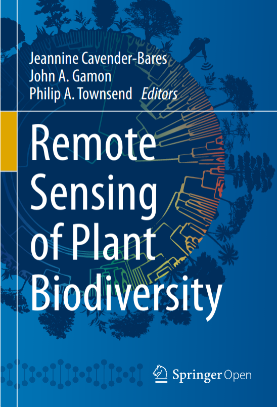
```
.footnote[Cavender-Bares et al. 2020]

]

---

class: center

```{r echo = F, fig.align = 'center', out.width = '100%'}
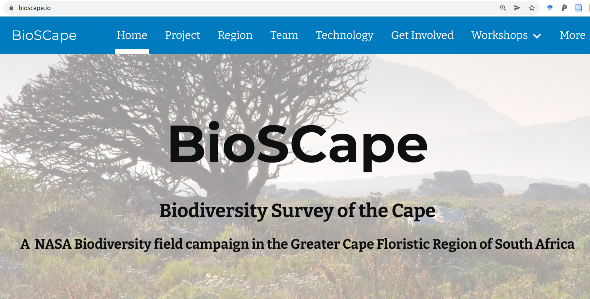
```
.left[.footnote[...and the Cape is about to be the epicentre of this endeavour - https://www.bioscape.io/]]

---

layout: false

## BioSCape: Biodiversity Survey of the Cape

.pull-left[

- $>$ 100 scientists and conservation practitioners
- 16 teams (mixed US, RSA, other)
- terrestrial and aquatic
- 2 planes
- 4 instruments (hyperspectral and LiDAR)
- fundamental and applied science

```{r echo = F, fig.align = 'center', out.width = '100%'}
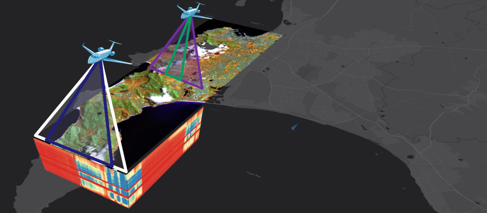
```

]

.pull-right[
```{r echo = F, fig.align = 'center', out.width = '100%'}
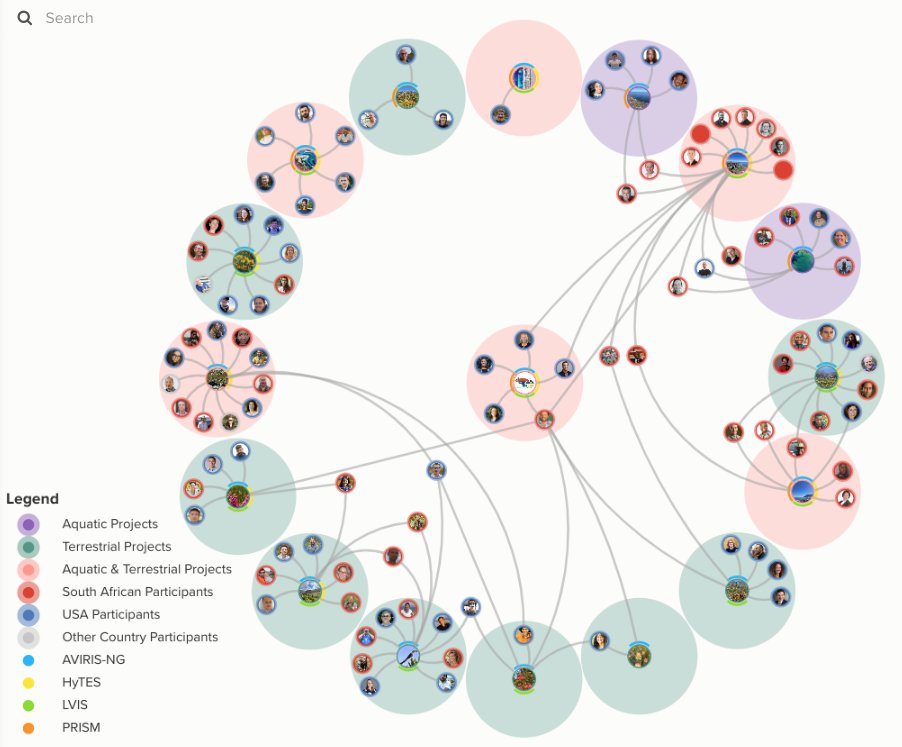
```
.footnote[www.bioscape.io]
]

---

class: center, middle

## But how do we actually measure biodiversity with remote sensing?

---

layout: false

.pull-left[
## There are many facets of biodiversity to measure!

<br>

An advantage of remote sensing is that it can directly measure the structure, composition and function of biodiversity... 

...at least from the scale of individuals up...

]

.pull-right[
```{r echo = F, fig.align = 'center', out.width = '100%'}
knitr::include_graphics("images/Noss_Biodiversity.png")
```
.footnote[Noss 1990, _Conservation Biology_]
]

---

layout: false

.pull-left[
## There are many facets of biodiversity to measure!

An advantage of remote sensing is that it can directly measure the structure, composition and function of biodiversity... 


```{r echo = F, fig.align = 'center', out.width = '120%'}
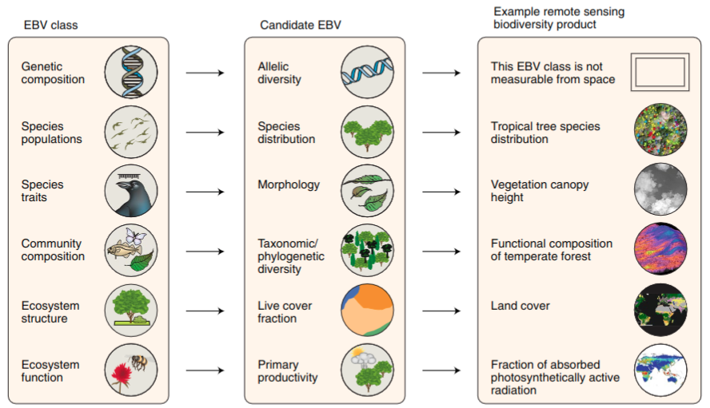
```
.footnote[Skidmore et al. 2021]

]

.pull-right[

```{r echo = F, fig.align = 'center', out.width = '90%'}
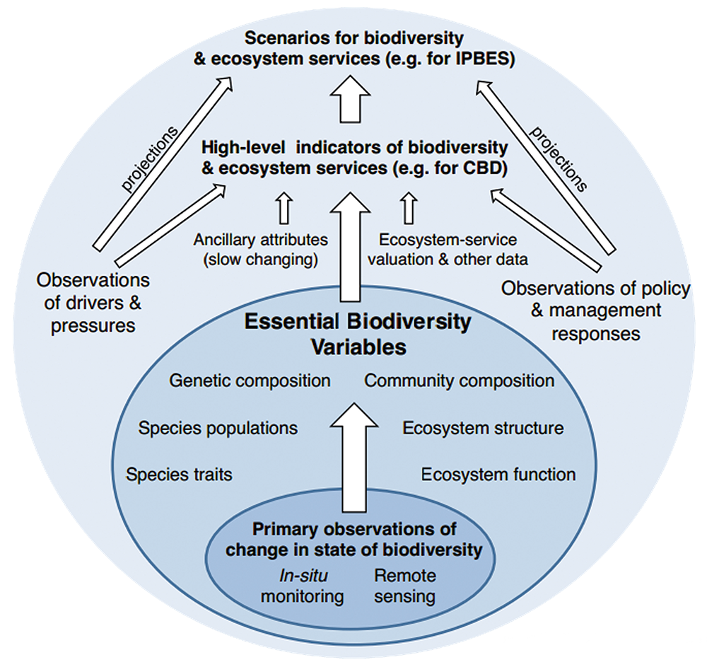
```


...at least from the scale of individuals up...

.footnote[https://geobon.org/]

]

---

class: center

##Productivity and Seasonality

```{r echo = F, fig.align = 'center', out.width = '80%'}
knitr::include_graphics("images/world_seasonality.gif")
```

---

class: center

##Land cover (and change)

```{r echo = F, fig.align = 'center', out.width = '50%'}
knitr::include_graphics("images/skowno2021.jpg")
```

.left[.footnote[Skowno et al. 2021]]

---

class: center

##Land cover change detection

```{r echo = F, fig.align = 'center', out.width = '70%'}
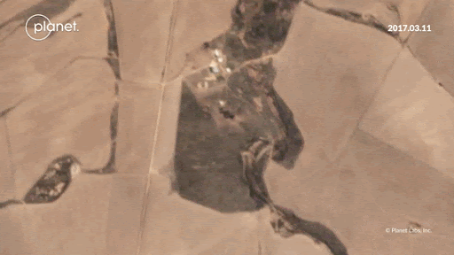
```

.left[.footnote[Moncrieff 2022]]

---

class: center

##Land cover change time series

```{r echo = F, fig.align = 'center', out.width = '60%'}
knitr::include_graphics("images/moilwe.png")
```

.left[.footnote[Moilwe et al. in prep]]

---

class: center, middle

## But what about metrics like species, functional and phylogenetic diversity?

---

layout: false

.pull-left[
## Functional diversity?

```{r echo = F, fig.align = 'center', out.width = '100%'}
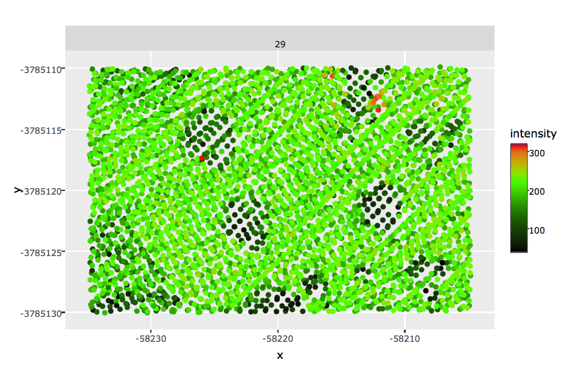
```

Proteaceae shrubs (dark green) surrounded by low shrubs, forbs and graminoids at Silvermine, TMNP. 

.footnote[Data from City of Cape Town]

]

.pull-right[
```{r echo = F, fig.align = 'center', out.width = '100%'}
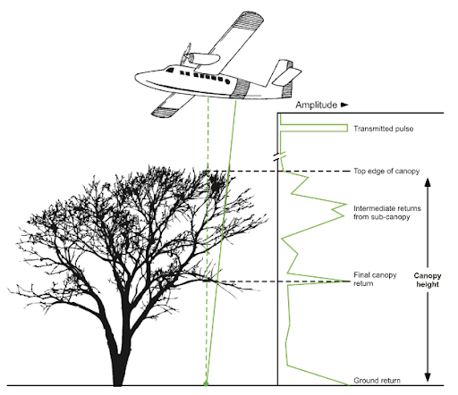
```

Light detection and ranging (LiDAR) allows you to measure topography and the vertical structure of vegetation.

.footnote[Purkis and Klemas 2011]
]

---

layout: false

.pull-left[
## Functional diversity?

Imaging spectroscopy ("hyperspectral" remote sensing) allows direct measurement of leaf traits.

```{r echo = F, fig.align = 'left', out.width = '92%'}
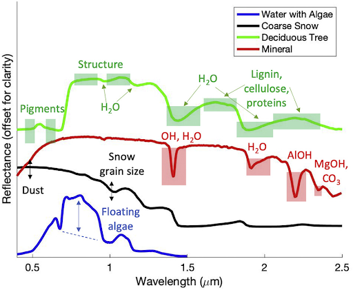
```

]

.pull-right[
```{r echo = F, fig.align = 'center', out.width = '100%'}
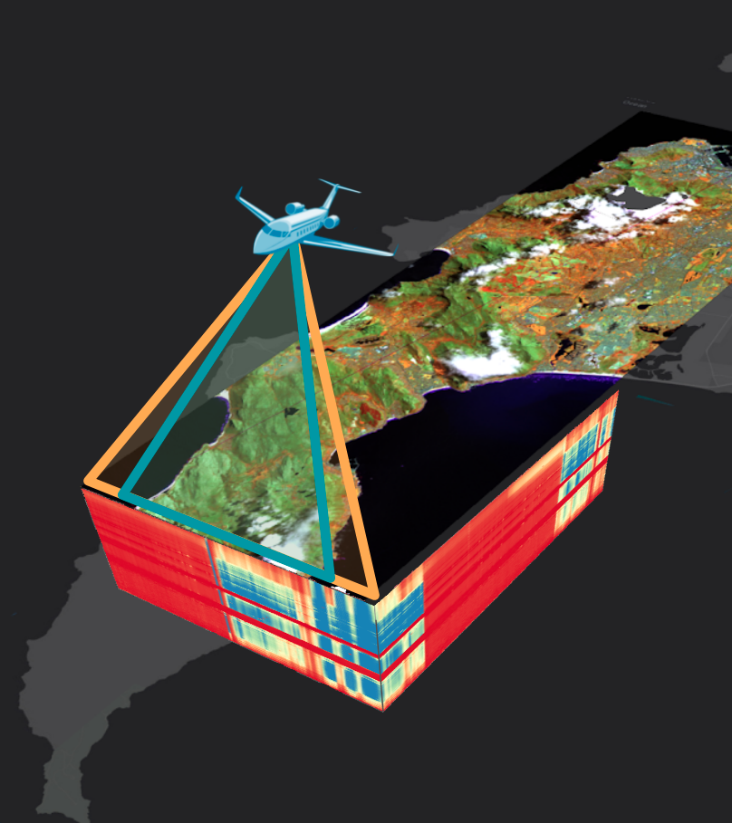
```
]

---

layout: false

## Phylogenetic diversity?

```{r echo = F, fig.align = 'center', out.width = '70%'}
knitr::include_graphics("images/meireles2020.jpg")
```

.left[.footnote[Meireles et al. 2020]]

Leaf spectra are phylogenetically conserved for some regions, so it's possible that we'll be able to discern lineages using imaging spectroscopy...

---

layout: false

.pull-left[
## Identifying species?

We can monitor populations of large species..., but identifying all species present...?

```{r echo = F, fig.align = 'center', out.width = '70%'}
knitr::include_graphics("images/machine_learning.png")
```

.footnote[https://xkcd.com/1838/]
]

.pull-right[
```{r echo = F, fig.align = 'center', out.width = '75%'}
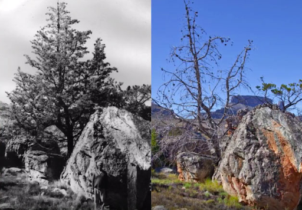
knitr::include_graphics("images/cedars_mapped.png")
```

.footnote[Hadebe 2021 MSc thesis]
]

---

class: center

##There are challenges and limitations...

```{r echo = F, fig.align = 'center', out.width = '50%'}
knitr::include_graphics("images/schimel2020_scale.png")
```

.left[.footnote[Schimel et al. 2020]]

---

class: center

##But this is what fancy modelling and proxies are for...

```{r echo = F, fig.align = 'center', out.width = '43%'}
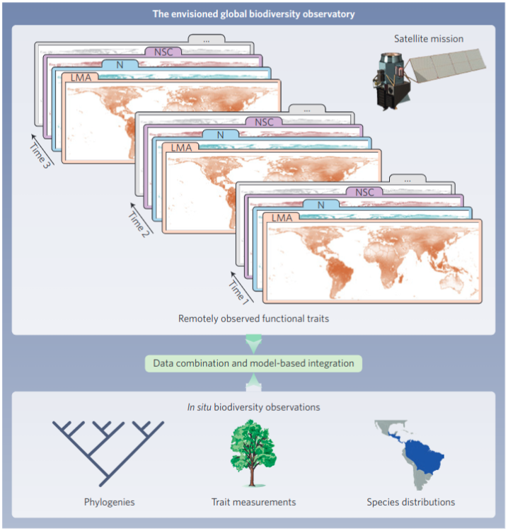
```

.left[.footnote[Jetz et al. 2016]]

---

layout: false

.pull-left[
## Combining remote sensing and in situ data

Using remotely sensed environmental data to inform species distribution models

```{r echo = F, fig.align = 'center', out.width = '100%'}
knitr::include_graphics("images/wilson2016.png")
```

E.g. Observed cloud frequency from the MODIS satellite is a better predictor of the distribution of _Protea cynaroides_ than interpolated precipitation.

.footnote[Wilson and Jetz 2016]

]

.pull-right[
```{r echo = F, fig.align = 'center', out.width = '100%'}
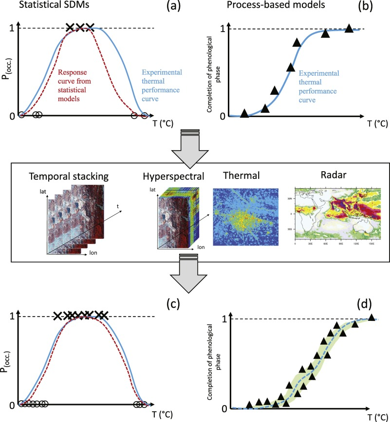
```
.footnote[Randin et al. 2020]
]

---

layout: false

.pull-left[
## The Spectral Diversity Hypothesis

Is spectral diversity a good proxy for biotic diversity?

```{r echo = F, fig.align = 'left', out.width = '100%'}
knitr::include_graphics("images/frye2021map.png")
```

]

.pull-right[
```{r echo = F, fig.align = 'center', out.width = '90%'}
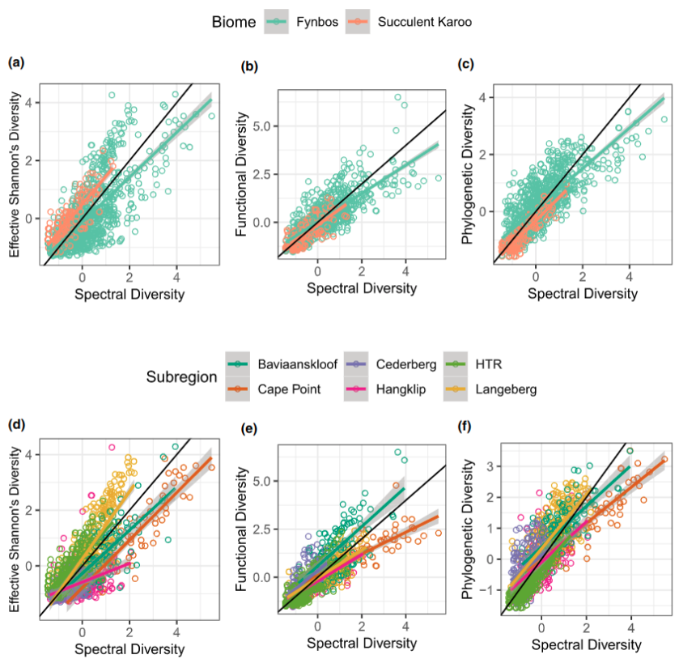
```

A test looking at spectral diversity from leaf spectra for 1210 species across 1267 plots supports the hypothesis **at the leaf level...**

.footnote[Frye et al. 2021]
]

---

layout: false

.pull-left[
## The Spectral Diversity Hypothesis


```{r echo = F, fig.align = 'left', out.width = '85%'}
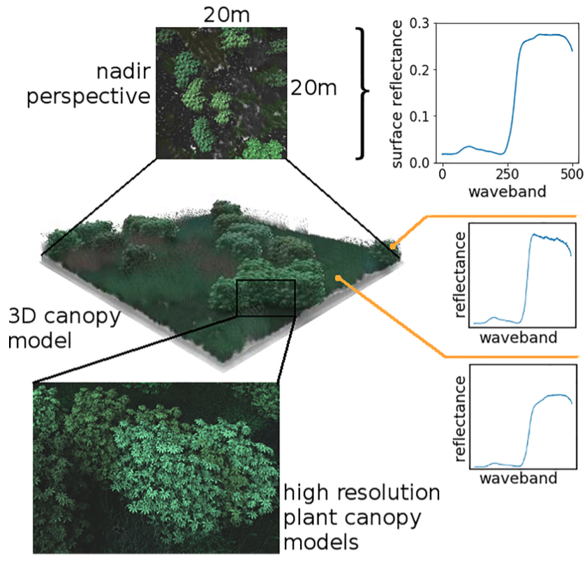
```

]

.pull-right[
```{r echo = F, fig.align = 'center', out.width = '70%'}
knitr::include_graphics("images/vanleeuwen2020b.png")
```

But canopy reflectance is more complex...

Leaf angle, shadow, density, etc affect the spectral reflectance of vegetation, reducing our ability to identify and map species - especially as the resolution of the imagery coarsens.

.footnote[van Leeuwen et al. 2021]
]

---

layout: false

.pull-left[
### Environmental heterogeneity

Another approach is just to map and monitor environmental heterogeneity

####_"Conserving nature's stage"_

The Nature Conservancy and others using this approach to identify parcels of Earth that are valuable for their capacity to support diverse life forms today and into the future

Typically identified based on their abiotic heterogeneity or geodiversity, much of which can be mapped and/or monitored with remote sensing - topography, climate, soils, etc

]

.pull-right[
```{r echo = F, fig.align = 'center', out.width = '90%'}
knitr::include_graphics("images/humboldt.jpg")
```
.footnote[Alexander von Humboldt]
]

---
class: middle

## Take-home

>*There are many ways to measure biodiversity. None are perfect. You should treat them as hypotheses.*

>*How you measure biodiversity can affect the outcome of your study. There are many ways to measure biodiversity incorrectly for the application at hand!*

>*Measures of biodiversity allow us to explore:*
> - *How biodiversity is generated and communities are assembled*
> - *How biodiversity affects ecosystem functions, including benefits to society*
> - *How the environment is changing with time and human impacts*

>*Community assembly, biotic effects on ecosystem function, and responses to global change are tightly intertwined*

---

## References

```{r refs, echo=FALSE, results="asis"}
NoCite(myBib)
PrintBibliography(myBib)
```

---
class: center, middle

# Thanks!

Slides created via the R packages:

[**xaringan**](https://github.com/yihui/xaringan)<br>
[gadenbuie/xaringanthemer](https://github.com/gadenbuie/xaringanthemer)

The chakra comes from [remark.js](https://remarkjs.com), [**knitr**](http://yihui.name/knitr), and [R Markdown](https://rmarkdown.rstudio.com).
