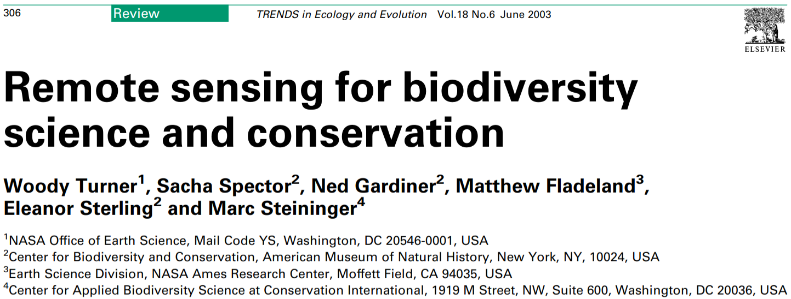
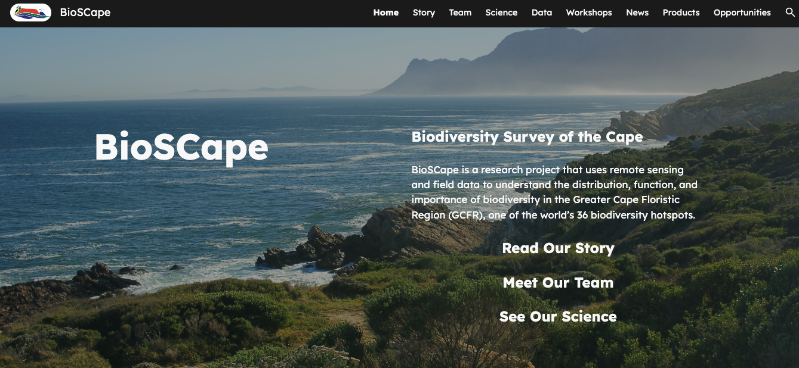
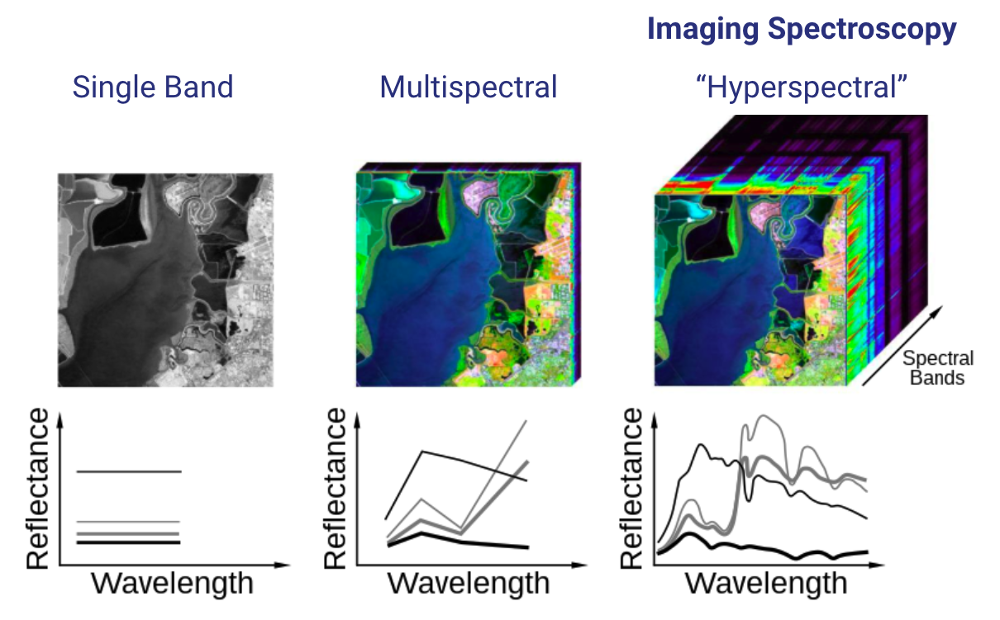
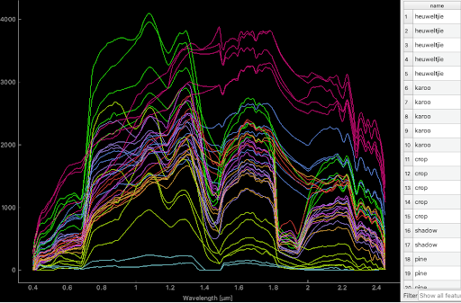
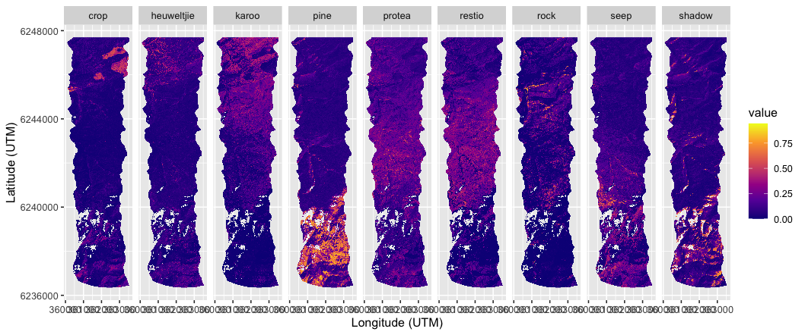
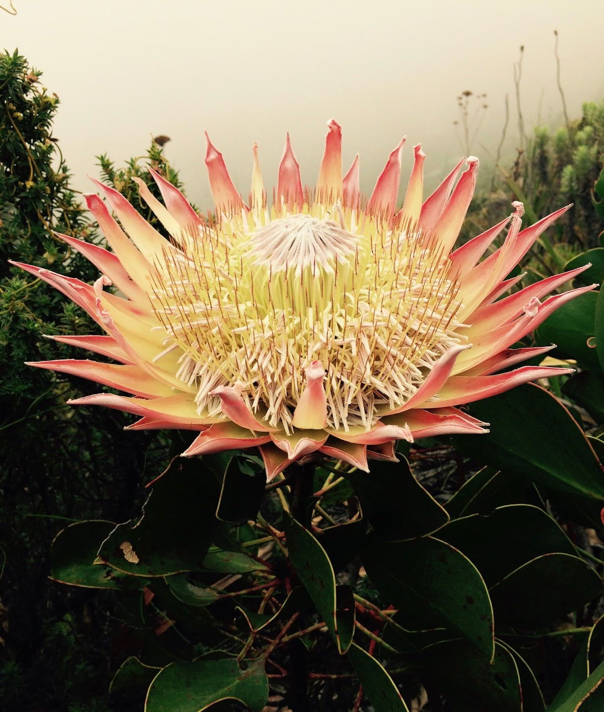
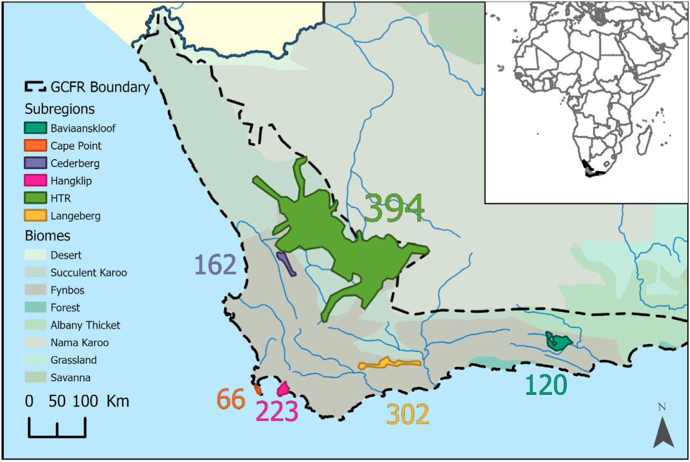

```{r setup, include=FALSE}
options(htmltools.dir.version = FALSE)
knitr::opts_chunk$set(
  fig.width=9, fig.height=3.5, fig.retina=3,
  out.width = "100%",
  cache = FALSE,
  echo = TRUE,
  message = FALSE, 
  warning = FALSE,
  hiline = TRUE
)

library(RefManageR)
BibOptions(check.entries = FALSE,
           bib.style = "authoryear",
           cite.style = "alphabetic",
           style = "markdown",
           hyperlink = FALSE,
           dashed = FALSE)
myBib <- ReadBib("bib/2_species.bib", check = FALSE)
```

```{r xaringan-themer, include=FALSE, warning=FALSE}
library(xaringanthemer)

# style_duo_accent(
#   primary_color = "#1381B0",
#   secondary_color = "#FF961C",
#   inverse_header_color = "#FFFFFF"
# )

style_mono_light(base_color = "#23395b")

#https://mycolor.space/?hex=%2323395B&sub=1 
#"Generic gradient" - #23395B #006287 #008E9D #00B897 #89DD81 #F9F871
#"Matching gradient" (reverse) - #23395B #494E77 #716292 #9C77AA #C88DBF #F5A3D0


library(knitr)
library(kableExtra)
```


```{r xaringan-tile-view, echo=FALSE}
# xaringanExtra::use_tile_view()
```

class: center, middle

### We want to measure biodiversity everywhere, all the time...

```{r echo = F, fig.align = 'center', out.width = '80%'}
knitr::include_graphics("images/world_seasonality.gif")
```

.center[Remote sensing is pretty much the only way this can be achieved...]

---

layout: false

.pull-left[

## It's a rapidly growing field

```{r echo = F, fig.align = 'left', out.width = '90%'}

```

```{r echo = F, fig.align = 'left', out.width = '90%'}
knitr::include_graphics("images/satellitelaunches.jpg")
```

.footnote[Turner et al. 2003]
]

.pull-right[

```{r echo = F, fig.align = 'left', out.width = '75%'}
knitr::include_graphics("images/cavenderbares2020.png")
```
.footnote[Cavender-Bares et al. 2020]

]

---

layout: false

## BioSCape: Biodiversity Survey of the Cape

```{r echo = F, fig.align = 'center', out.width = '90%'}

```
.left[.footnote[...and the Cape is currently the epicentre of this endeavour - https://www.bioscape.io/]]

---

layout: false

## BioSCape: Biodiversity Survey of the Cape

.pull-left[

- $>$ 150 scientists and conservation practitioners
- 19 teams (mixed US, RSA, other)
- terrestrial and aquatic
- 3 planes
- 6 instruments (2 x V-SWIR imaging spectrometers, hyperspectral thermal, multispectral (RGB + NIR) and 2 x LiDAR)
- fundamental and applied science
- mostly NASA funded

```{r echo = F, fig.align = 'center', out.width = '100%'}
knitr::include_graphics("images/bioscape_planes.png")
```

]

.pull-right[
```{r echo = F, fig.align = 'center', out.width = '100%'}
knitr::include_graphics("images/bioscape_kumu.png")
```
.footnote[www.bioscape.io]
]

---

class: center, middle

```{r echo = F, fig.align = 'center', out.width = '100%'}
knitr::include_graphics("images/Bioscape infographic_e3.jpg")
```

---

class: center, middle

## But how do we actually measure biodiversity with remote sensing?

---

layout: false

.pull-left[
## There are many facets of biodiversity to measure!

<br>

An advantage of remote sensing is that it can directly measure the structure, composition and function of biodiversity... 

...at least from the scale of individuals up...

]

.pull-right[
```{r echo = F, fig.align = 'center', out.width = '100%'}
knitr::include_graphics("images/Noss_Biodiversity.png")
```
.footnote[Noss 1990, _Conservation Biology_]
]

---

layout: false

.pull-left[
## There are many facets of biodiversity to measure!

An advantage of remote sensing is that it can directly measure the structure, composition and function of biodiversity... 


```{r echo = F, fig.align = 'center', out.width = '120%'}
knitr::include_graphics("images/skidmore2021_fig1.png")
```
.footnote[Skidmore et al. 2021]

]

.pull-right[

```{r echo = F, fig.align = 'center', out.width = '90%'}
knitr::include_graphics("images/ebv_circle.png")
```


...at least from the scale of individuals up...

.footnote[https://geobon.org/]

]

---

background-image: url("images/nasa_ems.jpeg")
background-size: contain

text-color: white

.left-column[
## .my-style-white[The Electromagnetic Spectrum]
]

---

## Many sensor types!

.left-column[

Active vs passive sensors

Multispectral vs hyperspectral (imaging spectrometers)

Much variation within each type 

- Especially spectral range and resolution!

.footnote[[Pettorelli et al. 2018](http://dx.doi.org/10.13140/RG.2.2.25962.41926)]
]

.right-column[
```{r echo = F, fig.align = 'center', out.width = '85%'}
knitr::include_graphics("images/pettorelli2018_sensors.png")
```
]

---

layout: false

## Multispectral vs hyperspectral (imaging spectrometers)

```{r echo = F, fig.align = 'center', out.width = '70%'}

```

---

### Remote sensing is particularly useful in combo with other observations

```{r echo = F, fig.align = 'center', out.width = '75%'}
knitr::include_graphics("images/turner2014.jpeg")
```

.footnote[[Turner 2014](https://doi-org.ezproxy.uct.ac.za/10.1126/science.1256014)]

---

class: center

##Productivity and Seasonality

```{r echo = F, fig.align = 'center', out.width = '80%'}
knitr::include_graphics("images/world_seasonality.gif")
```

---

class: center

##Land cover (and change)

```{r echo = F, fig.align = 'center', out.width = '50%'}
knitr::include_graphics("images/skowno2021.jpg")
```

.left[.footnote[Skowno et al. 2021]]

---

class: center

##Land cover change detection

```{r echo = F, fig.align = 'center', out.width = '70%'}
knitr::include_graphics("images/renosterveld_planet.gif")
```

.left[.footnote[Moncrieff 2022]]

---

class: center

##Land cover change time series

```{r echo = F, fig.align = 'center', out.width = '60%'}
knitr::include_graphics("images/moilwe.png")
```

.left[.footnote[Moilwe et al. in prep]]

---

class: center, middle

## But what about metrics like species, functional and phylogenetic diversity?

---

layout: false

.pull-left[
## Functional diversity?

```{r echo = F, fig.align = 'center', out.width = '100%'}
knitr::include_graphics("images/peninsula_lidar.png")
```

Proteaceae shrubs (dark green) surrounded by low shrubs, forbs and graminoids at Silvermine, TMNP. 

.footnote[Data from City of Cape Town]

]

.pull-right[
```{r echo = F, fig.align = 'center', out.width = '100%'}
knitr::include_graphics("images/purkis_klemas2011_lidar.png")
```

Light detection and ranging (LiDAR) allows you to measure topography and the vertical structure of vegetation.

.footnote[Purkis and Klemas 2011]
]

---

layout: false

.pull-left[
## Functional diversity?

Imaging spectroscopy ("hyperspectral" remote sensing) allows direct measurement of leaf traits.

```{r echo = F, fig.align = 'left', out.width = '92%'}
knitr::include_graphics("images/cawse2021_spectra.png")
```

]

.pull-right[
```{r echo = F, fig.align = 'center', out.width = '100%'}
knitr::include_graphics("images/peninsula_hyperspec.png")
```
]

---

layout: false

```{r echo = F, fig.align = 'centre', out.width = '100%'}
knitr::include_graphics("images/traitmapping.png")
```

---

layout: false

## Phylogenetic diversity?

```{r echo = F, fig.align = 'center', out.width = '70%'}
knitr::include_graphics("images/meireles2020.jpg")
```

.left[.footnote[Meireles et al. 2020]]

Leaf spectra are phylogenetically conserved for some regions, so it's possible that we'll be able to discern lineages using imaging spectroscopy...

---

layout: false

.pull-left[
## Identifying species?

We can monitor populations of large species..., but identifying all species present...?

```{r echo = F, fig.align = 'center', out.width = '70%'}
knitr::include_graphics("images/machine_learning.png")
```

.footnote[https://xkcd.com/1838/]
]

.pull-right[
```{r echo = F, fig.align = 'center', out.width = '75%'}
knitr::include_graphics("images/cedars_pic.png")
knitr::include_graphics("images/cedars_mapped.png")
```

.footnote[Hadebe 2021 MSc thesis]
]

---

class: center

## There are challenges and limitations...

```{r echo = F, fig.align = 'center', out.width = '50%'}
knitr::include_graphics("images/schimel2020_scale.png")
```

.left[.footnote[Schimel et al. 2020]]

---

class: center

## But this is what fancy modelling and proxies are for...

```{r echo = F, fig.align = 'center', out.width = '43%'}
knitr::include_graphics("images/jetz2016.png")
```

.left[.footnote[Jetz et al. 2016]]

---

class: center

## Spectral unmixing can detect "spectral signatures"

.left-column[

```{r echo = F, fig.align = 'center', out.width = '100%'}
knitr::include_graphics("images/jonaskop_class.png")
```

.smaller[Jonaskop, Riviersonderend Mountains]
]

.right-column[

Map species/types based on their reflectance of the electromagnetic spectrum!

```{r echo = F, fig.align = 'center', out.width = '50%'}

```

Given a library of spectral signatures of different species and land cover types (endmembers), spectral unmixing infers the composition of each pixel from the possible mixes of endmembers. This gives a cover map of the majority endmember for each pixel (as here) and the fraction of each endmember for all pixels (next slide).

]

---

class: center

## Spectral unmixing can detect "spectral signatures"

```{r echo = F, fig.align = 'center', out.width = '100%'}

```

.left[.footnote[Fractional cover of species (e.g. pines), functional groups or land cover types! ]]

---

layout: false

.pull-left[
## Combining remote sensing and in situ data

Using remotely sensed environmental data to inform species distribution models (SDMs)

```{r echo = F, fig.align = 'center', out.width = '100%'}
knitr::include_graphics("images/wilson2016.png")
```

E.g. Observed cloud frequency from the MODIS satellite is a better predictor of the distribution of _Protea cynaroides_ than interpolated precipitation.

.footnote[Wilson and Jetz 2016]

]

.pull-right[
```{r echo = F, fig.align = 'center', out.width = '100%'}

```
]

---

layout: false

.pull-left[
## The Spectral Diversity Hypothesis

Is spectral diversity a good proxy for biotic diversity?

```{r echo = F, fig.align = 'left', out.width = '100%'}

```

]

.pull-right[
```{r echo = F, fig.align = 'center', out.width = '90%'}
knitr::include_graphics("images/frye2021fig.png")
```

A test looking at spectral diversity from leaf spectra for 1210 species across 1267 plots supports the hypothesis **at the leaf level...**

.footnote[Frye et al. 2021]
]

---

layout: false

.pull-left[
## The Spectral Diversity Hypothesis


```{r echo = F, fig.align = 'left', out.width = '85%'}
knitr::include_graphics("images/vanleeuwen2020_scale.png")
```

]

.pull-right[
```{r echo = F, fig.align = 'center', out.width = '70%'}
knitr::include_graphics("images/vanleeuwen2020b.png")
```

But canopy reflectance is more complex...

Leaf angle, shadow, density, etc affect the spectral reflectance of vegetation, reducing our ability to identify and map species - especially as the resolution of the imagery coarsens.

.footnote[van Leeuwen et al. 2021]
]

---

layout: false

.pull-left[
### Environmental heterogeneity

Another approach is just to map and monitor environmental heterogeneity

####_"Conserving nature's stage"_

The Nature Conservancy and others using this approach to identify parcels of Earth that are valuable for their capacity to support diverse life forms today and into the future

Typically identified based on their abiotic heterogeneity or geodiversity, much of which can be mapped and/or monitored with remote sensing - topography, climate, soils, etc

]

.pull-right[
```{r echo = F, fig.align = 'center', out.width = '90%'}
knitr::include_graphics("images/humboldt.jpg")
```
.footnote[Alexander von Humboldt]
]

---
class: middle

## Take-home

>*Remote sensing is a rapidly growing field that is seen as the holy grail for mapping and monitoring biodiversity (and Essential Biodiversity Variables) at high spatial resolution from local to global scales.*

>*There are many remote sensing methods and tools, and these are constantly improving.*

>*While there are many limitations (e.g. spatial resolution), many can be addressed with modelling approaches, and are being overcome as the technology and methods improve.*

>*Remote sensing approaches must be paired with _in situ_ observations to "ground-truth" and calibrate/validate that they do reflect reality on the ground.*

>*Remote sensing can be valuable for mapping habitat variables such as climate, topography, etc that can inform inference about species distributions or other proxies for biodiversity like environmental heterogeneity or spectral diversity.*


---

## References

```{r refs, echo=FALSE, results="asis"}
NoCite(myBib)
PrintBibliography(myBib)
```

---
class: center, middle

# Thanks!

Slides created via the R packages:

[**xaringan**](https://github.com/yihui/xaringan)<br>
[gadenbuie/xaringanthemer](https://github.com/gadenbuie/xaringanthemer)

The chakra comes from [remark.js](https://remarkjs.com), [**knitr**](http://yihui.name/knitr), and [R Markdown](https://rmarkdown.rstudio.com).
