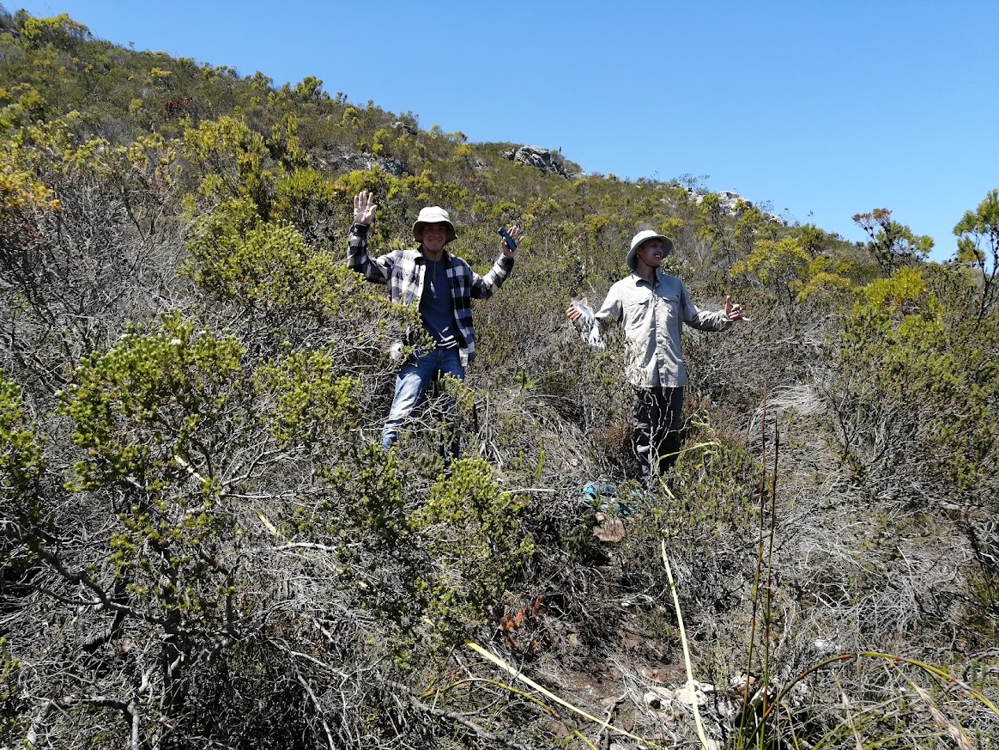

```{r setup, include=FALSE}
options(htmltools.dir.version = FALSE)
knitr::opts_chunk$set(
  fig.width=9, fig.height=3.5, fig.retina=3,
  out.width = "100%",
  cache = FALSE,
  echo = TRUE,
  message = FALSE, 
  warning = FALSE,
  hiline = TRUE
)

library(RefManageR)
BibOptions(check.entries = FALSE,
           bib.style = "authoryear",
           cite.style = "alphabetic",
           style = "markdown",
           hyperlink = FALSE,
           dashed = FALSE)
myBib <- ReadBib("bib/2_species.bib", check = FALSE)
```

```{r xaringan-themer, include=FALSE, warning=FALSE}
library(xaringanthemer)

# style_duo_accent(
#   primary_color = "#1381B0",
#   secondary_color = "#FF961C",
#   inverse_header_color = "#FFFFFF"
# )

style_mono_light(base_color = "#23395b")

#https://mycolor.space/?hex=%2323395B&sub=1 
#"Generic gradient" - #23395B #006287 #008E9D #00B897 #89DD81 #F9F871
#"Matching gradient" (reverse) - #23395B #494E77 #716292 #9C77AA #C88DBF #F5A3D0


library(knitr)
library(kableExtra)
```


```{r xaringan-tile-view, echo=FALSE}
# xaringanExtra::use_tile_view()
```

class: center

## The purpose

<br>

This is an opportunity for you to develop your own research project, from conceptualisation to data collection, analysis and interpretation.

<br>

The exercise is aimed at helping you learn to develop hypotheses, formulate questions, design field sampling and analysis methods (and test them with a power analysis), collect data, analyse data, interpret and write up your results.

---

# Guidance

We will give you most of the tools and guide you through the process.

Lectures:
- Developing hypotheses and questions (Claire)
- Scientific writing (Claire)
- Power analysis (Jasper)

Scheduled Sessions:
- Two afternoons and a morning to develop your projects
- An afternoon of presentations to get feedback
- Two afternoons for data collection

Feel free to ask ad hoc questions or bounce ideas at any time

---

class: center

## The De Hoop landscape includes a wide range of environmental conditions and vegetation communities

```{r echo = F, fig.align = 'center', out.height = '60%', warning=F, messages=F}

library(terra, quiet = T)
library(sf, quiet = T)
library(tidyverse, quiet = T)

ndvi <- rast("prac/MODIS/20220130_MODIS_v1g_POT_MOD13Q1_006_NDVI.tif")

# Get veg map and fire and plot
veg <- st_read("/Users/jasper/Documents/Datasets/SANBI/RLE_2021_Remnants/FynRemnantsClean.gpkg", quiet = T)
ndvi_g <- project(ndvi, st_crs(veg)$Wkt)
veg <- st_crop(veg, ndvi_g, quiet = T)
#fire <- st_read("/Users/jasper/Documents/Datasets/Fire/All_Fires_20_21_gw/CNCFires2021Clean.gpkg", quiet = T)
#fire <- st_crop(fire, ndvi_g, quiet = T)
mapview::mapview(veg, zcol = "name", quiet = T) #+
#mapview::mapview(fire, zcol = "year", quiet = T)

```

---

class: center

## With variation in species and their traits

.pull-left[ 
```{r echo = F, fig.align = 'center', out.width = '95%'}
knitr::include_graphics("images/eastern_ruens_shale_renosterveld.jpg")
```
]

.pull-right[ 
```{r echo = F, fig.align = 'center', out.width = '95%'}

```
]

Allowing plenty of opportunities to ask questions and test hypotheses that require sampling across different environments.

---

# Deliverable

A brief research report in the format of a paper in the journal [**_Biology Letters_**](https://royalsocietypublishing.org/rsbl/for-authors).

- 2,500 words maximum, including references.
- Standard journal paper format: Title, Abstract, Introduction, Methods, Results (with figures and tables), Discussion, References
- Consider relevant references from the lectures...
- Clearly state your research question(s) and hypothesis(es).
- Provide your power analysis and justification for your sampling design. Describe it in your methods and present it in your results. (Note that few papers present a power analysis even if they do them, but we are asking you to do and present one as it is a good practice to follow and can tell you whether your project is doomed from the start...)
- Present your results in a way that is clear and easy to interpret.
- Discuss your results in the context of your hypothesis and the literature.
- Feel free to highlight the shortcomings of your study and what could be done to improve it.
- Conclude with a summary of your findings and their implications.
- More on how to write a paper [**here**](https://docs.google.com/document/d/1xidafYQKbNyvfvBRtj7-NblW6sg_9_h5HJWgtUsgasY/edit?usp=sharing).

---

# Rules

- We usually work in groups of 2-3 to make fieldwork easier and safer. You can work alone if you prefer, but only if its something you can do safely on your own or if you can collect your data while tagging along with another team.

- You may use ChatGPT and other AI tools to help write R code etc, but you must acknowledge its use appropriately. 

- You may NOT plaigarise or use ChatGPT or other AI tools to write the text of your paper. This is considered to be academic misconduct and is a very serious offence, with severe consequences. It is also a disservice to yourself as you will not learn scientific writing, which will limit your scientific thinking. Why pay the University so you can cheat yourself?

---

class: center, middle

# Thanks!

Slides created via the R packages:

[**xaringan**](https://github.com/yihui/xaringan)<br>
[gadenbuie/xaringanthemer](https://github.com/gadenbuie/xaringanthemer)

The chakra comes from [remark.js](https://remarkjs.com), [**knitr**](http://yihui.name/knitr), and [R Markdown](https://rmarkdown.rstudio.com).
