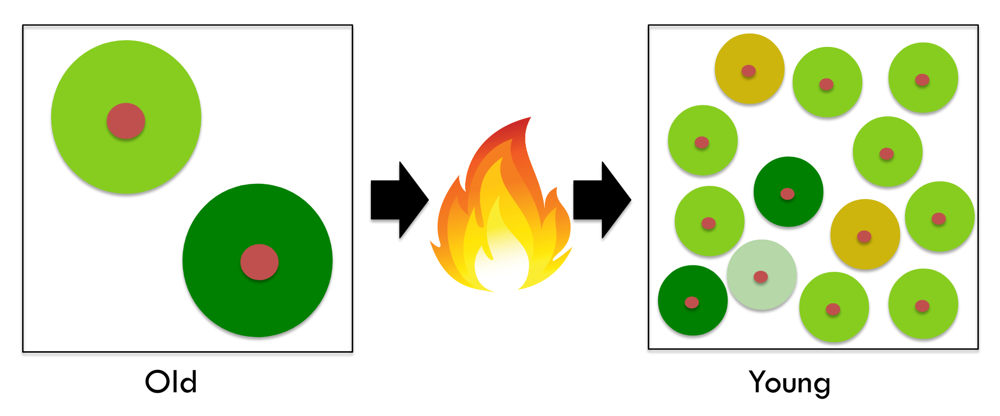
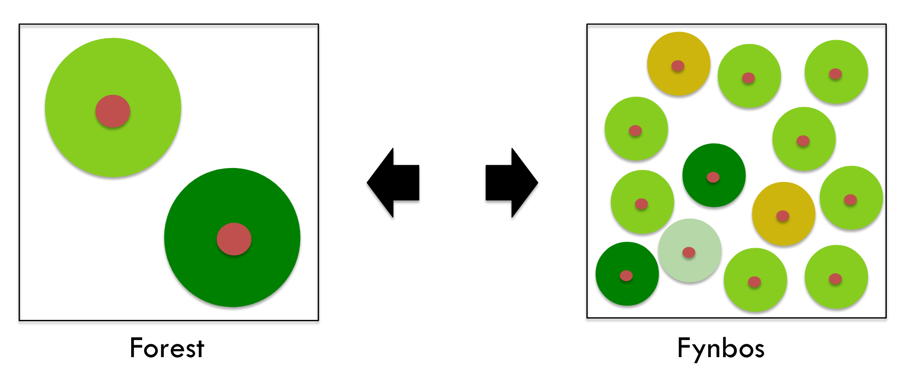
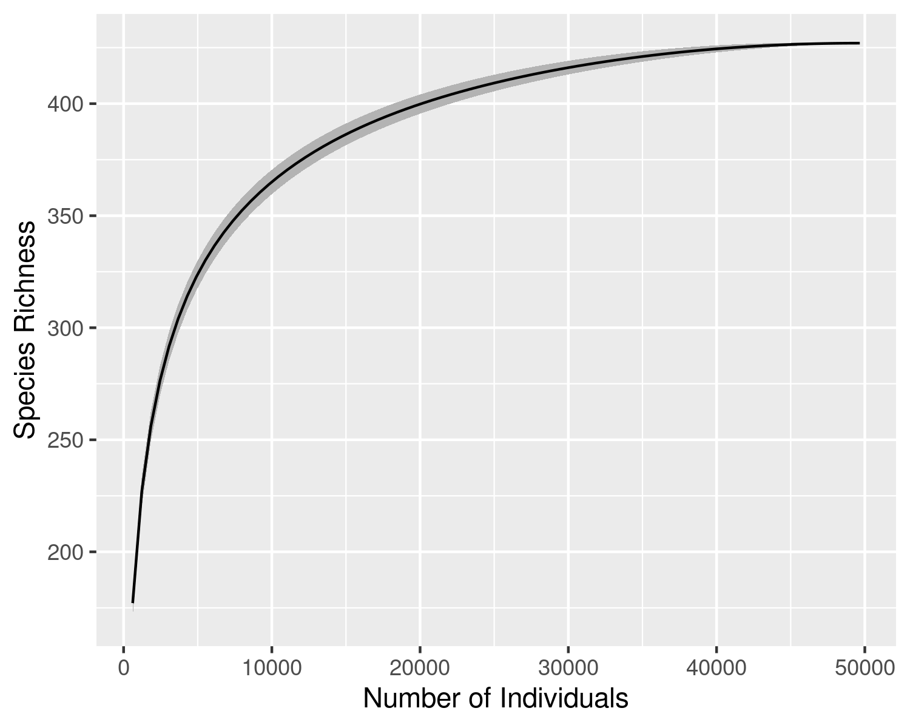
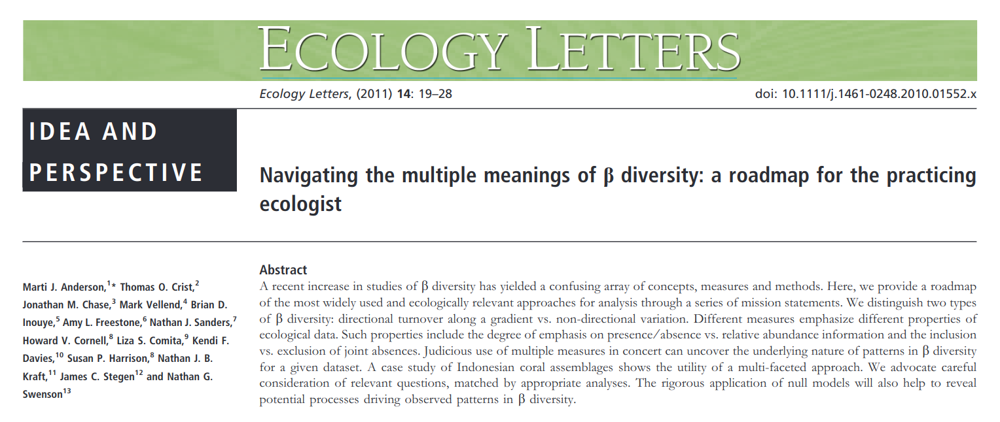

```{r setup, include=FALSE}
options(htmltools.dir.version = FALSE)
knitr::opts_chunk$set(
  fig.width=9, fig.height=3.5, fig.retina=3,
  out.width = "100%",
  cache = FALSE,
  echo = TRUE,
  message = FALSE, 
  warning = FALSE,
  hiline = TRUE
)

library(RefManageR)
BibOptions(check.entries = FALSE,
           bib.style = "authoryear",
           cite.style = "alphabetic",
           style = "markdown",
           hyperlink = FALSE,
           dashed = FALSE)
myBib <- ReadBib("bib/2_species.bib", check = FALSE)
```

```{r xaringan-themer, include=FALSE, warning=FALSE}
library(xaringanthemer)

# style_duo_accent(
#   primary_color = "#1381B0",
#   secondary_color = "#FF961C",
#   inverse_header_color = "#FFFFFF"
# )

style_mono_light(base_color = "#23395b")

#https://mycolor.space/?hex=%2323395B&sub=1 
#"Generic gradient" - #23395B #006287 #008E9D #00B897 #89DD81 #F9F871
#"Matching gradient" (reverse) - #23395B #494E77 #716292 #9C77AA #C88DBF #F5A3D0


library(knitr)
library(kableExtra)
```


```{r xaringan-tile-view, echo=FALSE}
# xaringanExtra::use_tile_view()
```

class: center, middle

## Scenario

We are on a newly discovered island. We need to do a **quantitative** survey of the ecosystems on the island so as to describe their biodiversity and infer the key ecological processes that drive them.

What are you going to measure?

---

class: center

## The De Hoop landscape includes a wide range of environmental conditions and vegetation communities

```{r echo = F, fig.align = 'center', out.height = '60%', warning=F, messages=F}

library(terra, quiet = T)
library(sf, quiet = T)
library(tidyverse, quiet = T)
library(readxl, quiet = T)
library(mapview, quiet = T)
library(vegan, quiet = T)
library(GGally, quiet = T)

ndvi <- rast("prac/MODIS/20220130_MODIS_v1g_POT_MOD13Q1_006_NDVI.tif")

# Get veg map and fire and plot
veg <- st_read("/Users/jasper/Documents/Datasets/SANBI/RLE_2021_Remnants/FynRemnantsClean.gpkg", quiet = T)
ndvi_g <- project(ndvi, st_crs(veg)$Wkt)
veg <- st_crop(veg, ndvi_g, quiet = T)
#fire <- st_read("/home/jasper/Documents/Datasets/Fire/All_Fires_20_21_gw/CNCFires2021Clean.gpkg", quiet = T)
#fire <- st_crop(fire, ndvi_g, quiet = T)
mapview::mapview(veg, zcol = "name", quiet = T) #+
#mapview::mapview(fire, zcol = "year", quiet = T)

```

---

## At each location we'll set up a 4x4m plot and...

Sample _Environmental conditions:_

- Estimate % projected cover (think the area you would see from above) bare soil

- Take a densiometer reading at ground level

- Take a **soil sample** from the 4 corners to measure volumetric soil water content

- Do a **dung count**? Or just note presence/absence?

- Note presence/absence of burnt dead skeletons or charcoal

- Note prevalence of serotiny
  
- Take a few notes (and photos) on any features you think may be interesting

---

## At each location we'll set up a 4x4m plot and...

Sample _Diversity:_

- Count the number of individuals and estimate % cover of each species

- Collect a voucher specimen of each species

- Assign species to functional types:
  
  - Trees, shrubs, herbs, grasses, succulents, geophytes, climbers, parasites, etc.?
  
---

### Some early results from the survey:

```{r echo = F, fig.align = 'center', out.height = '60%', warning=F, messages=F}
dat = read_xlsx("prac/2025/Data_Biodiversity.xlsx")

dat %>% kable("html") %>% kable_styling("striped", full_width = F)
```

---

### Some early results from the survey 

that I made up...

```{r echo = F, fig.align = 'center', out.height = '60%', warning=F, messages=F}

set.seed(1234) #So I get the same results each time

vegdat = read_xlsx("prac/pracdatasheet2023_species.xlsx", sheet = "Species2022")

vd = vegdat %>% select(Site, WorkingName) %>% 
  distinct() %>% 
  mutate(Abundance = abs(round(rnorm(nrow(.), 5, 2)))) 

vd %>%
  kable("html") %>% 
  kable_styling("striped", full_width = F)
 
```

---

### Get _count_ of species by site

```{r echo = F, fig.align = 'center', out.height = '60%', warning=F, messages=F}
vd %>% group_by(Site) %>%
  summarize(`Species Number` = n()) %>%
  kable("html") %>% 
  kable_styling("striped", full_width = F)

```

---

### Add Shannon's Diversity Index (H) by site 

...to account for differences in evenness

```{r echo = F, fig.align = 'center', out.height = '60%', warning=F, messages=F}

sdiv = vd %>% pivot_wider(names_from = WorkingName, values_from = Abundance, values_fill = 0) %>%
  select(-Site) %>%
  as.matrix() %>%
  vegan::diversity(index="shannon")

vd %>% group_by(Site) %>%
  summarize(`Species Number` = n()) %>%
  mutate(`Shannon Diversity` = sdiv) %>%
  kable("html") %>% 
  kable_styling("striped", full_width = F)

```

---

layout: false

.pull-left[

## Quantifying $\alpha$-diversity...

Can be counts of the number of species in samples,

```{r echo = F, fig.align = 'center', out.width = '70%'}
knitr::include_graphics("images/alphadiversity1.png")
```

]

.pull-right[

<br>

*S* = a simple count of species

<br>

*But what of relative abundance?*

Should a species that is represented by one individual be considered equivalent to one with thousands of individuals?

]

---

layout: false

.pull-left[

## Quantifying $\alpha$-diversity...

Can be counts of the number of species in samples, 

```{r echo = F, fig.align = 'center', out.width = '70%'}
knitr::include_graphics("images/alphadiversity1.png")
```

or include information on their **relative abundance**

]

.pull-right[

<br>

*S* = a simple count of species

<br>

*But what of relative abundance?*

Should a species that is represented by one individual be considered equivalent to one with thousands of individuals?

<br>

A community is considered more diverse if the relative abundances are more evenly distributed 
- because removing one individual is less likely to remove a species.
]

---

layout: false

.pull-left[

## Quantifying $\alpha$-diversity...

Can be counts of the number of species in samples, 

```{r echo = F, fig.align = 'center', out.width = '70%'}
knitr::include_graphics("images/alphadiversity.png")
```

or include information on their **relative abundance**

]

.pull-right[

<br>

**Shannon's index** (*H'*) quantifies species diversity taking into account both species' richness and _**evenness**_ in their relative abundance

$H' = -\sum_{i=1}^{n}(p_i*ln(p_i))$ 

where $p_i$ is the proportion of individuals belonging to the *i*th species.

<br>

You can also quantify evenness independently of richness, e.g. 

- **Pielou's evenness** (*J*) in the relative abundance (independent of *S*) can be calculated directly as $J = H'/log(S)$


]

---

### Add Pielou's evenness (J) by site 

...to understand why H differs from species counts

```{r echo = F, fig.align = 'center', out.height = '60%', warning=F, messages=F}

sdiv = vd %>% pivot_wider(names_from = WorkingName, values_from = Abundance, values_fill = 0) %>%
  select(-Site) %>%
  as.matrix() %>%
  vegan::diversity(index="shannon")

vd %>% group_by(Site) %>%
  summarize(`Species Number` = n()) %>%
  mutate(`Shannon Diversity` = sdiv) %>%
  mutate(`Pielou Evenness` = `Shannon Diversity`/log(`Species Number`)) %>%
  kable("html") %>% 
  kable_styling("striped", full_width = F)

```

---

### So what about the number of individuals per site?

.pull-left[
```{r echo = F, fig.align = 'center', out.height = '100%', warning=F, messages=F}
vd %>% group_by(Site) %>%
  summarize(`Species Number` = n(), `Number of Individuals` = sum(Abundance)) %>%
  mutate(`Shannon Diversity` = sdiv) %>%
  mutate(`Pielou Evenness` = `Shannon Diversity`/log(`Species Number`)) %>%
  kable("html") %>% 
  kable_styling("striped", full_width = F)
```
]

.pull-right[

```{r echo = F, fig.align = 'center', out.height = '100%', warning=F, messages=F}
vd %>% group_by(Site) %>%
  summarize(`Species Number` = n(), `Number of Individuals` = sum(Abundance)) %>%
  ggplot(aes(y = `Species Number`, x = `Number of Individuals`)) +
  geom_point()
```
]

---

layout: false

.pull-left[
## Quantifying $\alpha$-diversity...

Many studies will refer to species counts as "species richness", but this is often in error...

Species counts are sensitive to the number of individuals sampled. 

More individuals means greater potential to encounter more species.

```{r echo = F, fig.align = 'center', out.width = '70%'}
knitr::include_graphics("images/taylorplot.gif")
```

]

.pull-right[
```{r echo = F, fig.align = 'right', out.width = '100%'}
knitr::include_graphics("images/spp_ind_accum_CP.png")
```

##### Species counts relative to number of individuals sampled across eighty-one 50m<sup>2</sup> vegetation plots in Table Mountain National Park (data from Slingsby et al. 2017).

The relationship is non-linear and asymptotic.
]

---

layout: false

.pull-left[
## Quantifying $\alpha$-diversity...

Dependence of species counts on number of individuals sampled is problematic when the number of individuals varies between samples (e.g. vegetation plots of different area or with different size individuals, netting events, etc).

```{r echo = F, fig.align = 'center', out.width = '100%'}

```

While raw species counts can still be useful for many purposes, it is also useful to have a metric that is independent of abundance and sampling effort.

]

.pull-right[
```{r echo = F, fig.align = 'center', out.width = '90%'}
knitr::include_graphics("images/spp_abund_CP.png")
```

##### Species counts relative to number of individuals sampled for each of eighty-one 50m<sup>2</sup> vegetation plots in Table Mountain National Park (data from Slingsby et al. 2017).

Since the plots are of a set unit area (50m<sup>2</sup>), the species counts in this figure can also be termed ***species density***.
]

---

layout: false

.pull-left[
## Quantifying $\alpha$-diversity...

Dependence of species counts on number of individuals sampled is problematic when the number of individuals varies between samples (e.g. vegetation plots of different area or with different size individuals, netting events, etc).

```{r echo = F, fig.align = 'right', out.width = '100%'}

```

While raw species counts can still be useful for many purposes, it is also useful to have a metric that is independent of abundance and sampling effort.

]

.pull-right[
```{r echo = F, fig.align = 'right', out.width = '75%'}
knitr::include_graphics("images/forestyoung.jpg")
```


```{r echo = F, fig.align = 'right', out.width = '75%'}
knitr::include_graphics("images/fynbos.png")
```

]

---

layout: false

.pull-left[

## Species-Area relationship

We often compare the diversity of large areas using the species-area relationship (SAR).

```{r echo = F, fig.align = 'center', out.width = '100%'}
knitr::include_graphics("images/sad.png")
```

]

.pull-right[

<br>

We estimate the SAR by sampling nested areas of increasing size.

```{r echo = F, fig.align = 'center', out.width = '40%'}
knitr::include_graphics("images/nested_plots.png")
```

When comparing sites, one solution is to sample enough area to reach the asymptote of the SAR. 

This isn't often logistically (or logically) feasible, so we usually fit curves to estimate the diversity of the larger area by extrapolation.

]

---

layout: false

.pull-left[

## Species-Area relationship

The density of individuals can affect the shape of the species-area relationship (SAR) at fine scales, because of the relationship between species counts and the number of individuals sampled.

```{r echo = F, fig.align = 'center', out.width = '100%'}
knitr::include_graphics("images/sad.png")
```


]

.pull-right[

Many factors can affect the SAR:
- size of individuals
- patchiness/heterogeneity
- dispersal (limitation)
- immigration/extinction
- disturbance
- productivity (e.g. sparse desert vegetation has fewer individuals per unit area)

All sites have same total # of species, but may vary in:
- Site 1 = many, small individuals
- Site 2 = intermediate
- Site 3 = fewer, large individuals

Or:
- Site 1 = homogenous/uniform spread of species
- Site 2 = intermediate
- Site 3 = heterogenous/patchy spread of species


<br>

]

---

layout: false

.pull-left[
## Quantifying $\alpha$-diversity...

###*Species richness* 
...is usually reserved to mean an estimate of the number of species while taking abundance and sampling effort into account (see Gotelli and Colwell 2001 for review).

...is often estimated using individual or sample-based ***rarefaction***<sup>1</sup>. 

Rarefaction involves resampling a set number (*n*) of individuals or samples from the data to determine the expected number of species for any given *n*. Resampling is repeated multiple times for each *n* and the results averaged.

.footnote[<sup>1</sup>there are better methods these days (e.g. Hill numbers), but they are more complicated...]
]

.pull-right[
```{r echo = F, fig.align = 'right', out.width = '100%'}

```

##### Individual-based rarefaction curve developed by sampling individuals from the pooled data from eighty-one 50m<sup>2</sup> vegetation plots in Table Mountain National Park (data from Slingsby et al. 2017). Black line = mean; gray = standard deviation.
]

---

### So let's add _rarefied_ species richness per site?

```{r echo = F, fig.align = 'center', out.height = '100%', warning=F, messages=F}
sr = vd %>% pivot_wider(names_from = WorkingName, values_from = Abundance, values_fill = 0) %>%
  select(-Site) %>%
  as.matrix() %>%
  vegan::rarefy(90)

vd %>% group_by(Site) %>%
  summarize(`Species Number` = n(), `Number of Individuals` = sum(Abundance)) %>%
  mutate(`Shannon Diversity` = sdiv) %>%
  mutate(`Pielou Evenness` = `Shannon Diversity`/log(`Species Number`)) %>%
  mutate(`Species Richness` = sr) %>%
  kable("html") %>% 
  kable_styling("striped", full_width = F)
```

---

### And compare the relationships among them...

```{r echo = F, fig.align = 'center', out.height = '100%', warning=F, messages=F}
vd %>% group_by(Site) %>%
  summarize(`Species Number` = n(), `Number of Individuals` = sum(Abundance)) %>%
  mutate(`Shannon Diversity` = sdiv) %>%
  mutate(`Pielou Evenness` = `Shannon Diversity`/log(`Species Number`)) %>%
  mutate(`Species Richness` = sr) %>%
  select(-Site) %>%
  ggpairs()
```

---

### What about similarity in composition among sites?

...i.e. turnover or beta diversity, here using Sorenson's distance (i.e. presence/absence only)

```{r echo = F, fig.align = 'center', out.height = '100%', warning=F, messages=F}
sdist = vd %>% pivot_wider(names_from = WorkingName, values_from = Abundance, values_fill = 0) %>%
  select(-Site) %>%
  as.matrix() %>% 
  designdist(method = "(A+B-2*J)/(A+B)", terms = "binary")

# some tomfoolery to present it nicely... (kable() doesn't like class "dist" - i.e. distance objects)
msite_BD <- as.data.frame(as.matrix(sdist)) # make it a rectangular table
msite_BD[upper.tri(msite_BD, diag = T)] <- NA # set the top-right to "NA"
options(knitr.kable.NA = '') # set the kable() table printing function to make NA values blank
rownames(msite_BD) <- unique(vd$Site) # add names
colnames(msite_BD) <- rownames(msite_BD) # make the rownames the column names

# Present as a table
kable(msite_BD, digits = 3)
```

---

layout: false

.pull-left[
## The components of diversity

Alpha $(\alpha)$ = mean species diversity/richness within local-scale sites, habitats or communities (often termed "point diversity")

Beta $(\beta)$ = diversity/richness differences between sites or habitats (attributable to species "turnover" or "nestedness")

Gamma $(\gamma)$ = total landscape species diversity/richness

.footnote[Whittaker (1972)]
]

.pull-right[
```{r echo = F, fig.align = 'right', out.width = '110%'}
knitr::include_graphics("images/diversitycomponents.png")
```

.footnote[Three sample localities in a landscape.]

]


---
class: center, middle

## WARNING!
** $\beta$ diversity can get a little complicated... **

There's lots of methods, and opinions often differ among experts...<sup>1</sup>

```{r echo = F, fig.align = 'center', out.width = '60%'}

```

.footnote[<sup>1</sup>i.e. this is a highly active area of research...]

---

layout: false

.pull-left[
## Measuring $\beta$ diversity

There are two major approaches:

* *"Classical" diversity metrics*, calculated directly from measures of regional $(\gamma)$ and local $(\alpha)$ diversity through additive or multiplicative decomposition

* *Multivariate measures* that calculate distances (or dissimilarities) that represent the compositional resemblance between pairs of samples

.footnote[The two are related, and can even be the same thing in certain scenarios, but I'm not going to go there in this course...]

]

.pull-right[
```{r echo = F, fig.align = 'right', out.width = '110%'}
knitr::include_graphics("images/diversitycomponents.png")
```
]

---

layout: false

## The decomposition of "classical" diversity metrics...

.pull-left[

```{r echo = F, fig.align = 'center', out.width = '60%'}
knitr::include_graphics("images/diversitycomponents.png")
```

Consider this in the context of the species-area relationship. 
]

.pull-right[

```{r echo = F, fig.align = 'center', out.width = '100%'}
knitr::include_graphics("images/sad.png")
```

If $\gamma$ is constant (32) across sites, then

- S1 = higher $\alpha$, lower $\beta$ (i.e. more homogeneous)
- S2 = intermediate $\alpha$ and $\beta$
- S3 = lower $\alpha$, higher $\beta$ (i.e. more heterogeneous)
]

---

layout: false

.pull-left[
## Comparing floras...

```{r echo = F, fig.align = 'center', out.width = '100%'}
knitr::include_graphics("images/fynbos_community.jpg")
```

Fynbos has moderate to high $\alpha$ and very high $\beta$, resulting in high $\gamma$
- ~9500 vascular plant species in the Cape Flora
- ~2200 native species on the Cape Peninsula alone

]

.pull-right[

```{r echo = F, fig.align = 'center', out.width = '91%'}

```

English meadows have very high $\alpha$, but very low $\beta$, resulting in moderate to low $\gamma$
- only 1390 native species in the entire Great Britain and Ireland (~3 x the size of the CFR)

]

---

layout: false

.pull-left[
## Comparing floras...

We often compare the diversity of different regions using species-area curves (usually on log-log axes so the curves are linear) - e.g. Cowling et al. 2015

```{r echo = F, fig.align = 'left', out.width = '98%'}
knitr::include_graphics("images/fynbos.png")
```

]

.pull-right[

```{r echo = F, fig.align = 'center', out.width = '75%'}
knitr::include_graphics("images/cowling2015.png")
```

]

---

layout: false

## Multivariate measures of $\beta$ diversity

.pull-left[

There are a large number of metrics that calculate the dissimilarity of pairs of samples based on the number of species that are shared between them or unique to each.

The metrics typically differ in whether they:

* are based on species presence/absence only, or also include abundance information

* include/exclude joint absence information

* account for differences in the $\alpha$ diversity of samples
]

.pull-right[
```{r echo = F, fig.align = 'right', out.width = '90%'}
knitr::include_graphics("images/diversitycomponents.png")
```
]

---
layout: false

## Multivariate measures of $\beta$ diversity

.pull-left[

```{r echo = F, fig.align = 'center', out.width = '90%'}
knitr::include_graphics("images/betadiv_multiv.png")
```

e.g. the same equation, $(A+B-2*J)/(A+B)$ 

*where J is the shared quantity, and A and B are totals for each community* 

can be...
]

.pull-right[
### Sorenson's Dissimilarity Index

when based on species presence/absence only


### Bray-Curtis distance

when it includes abundance information

Values range from 0 (identical communities) to 1 (complete turnover).

.footnote[Be careful. The indices are often inverted (i.e. similarity metrics) depending on the goals of the study.]

]

---

### What about similarity in composition among sites?

...i.e. turnover or beta diversity, here using Bray-Curtis distance (i.e. accounts for abundance)

```{r echo = F, fig.align = 'center', out.height = '100%', warning=F, messages=F}
sdist = vd %>% pivot_wider(names_from = WorkingName, values_from = Abundance, values_fill = 0) %>%
  select(-Site) %>%
  as.matrix() %>% 
  designdist(method = "(A+B-2*J)/(A+B)", terms = "quadratic")

# some tomfoolery to present it nicely... (kable() doesn't like class "dist" - i.e. distance objects)
msite_BD <- as.data.frame(as.matrix(sdist)) # make it a rectangular table
msite_BD[upper.tri(msite_BD, diag = T)] <- NA # set the top-right to "NA"
options(knitr.kable.NA = '') # set the kable() table printing function to make NA values blank
rownames(msite_BD) <- unique(vd$Site) # add names
colnames(msite_BD) <- rownames(msite_BD) # make the rownames the column names

# Present as a table
kable(msite_BD, digits = 3)
```

---

## References

```{r refs, echo=FALSE, results="asis"}
NoCite(myBib)
PrintBibliography(myBib)
```

---
class: center, middle

# Thanks!

Slides created via the R packages:

[**xaringan**](https://github.com/yihui/xaringan)<br>
[gadenbuie/xaringanthemer](https://github.com/gadenbuie/xaringanthemer)

The chakra comes from [remark.js](https://remarkjs.com), [**knitr**](http://yihui.name/knitr), and [R Markdown](https://rmarkdown.rstudio.com).
