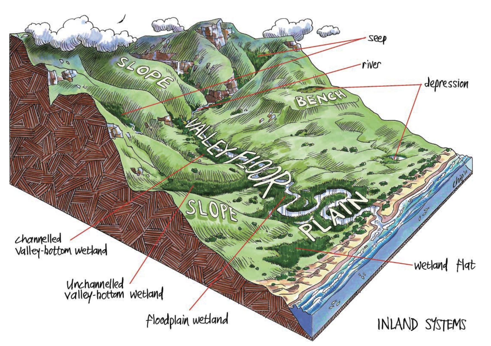
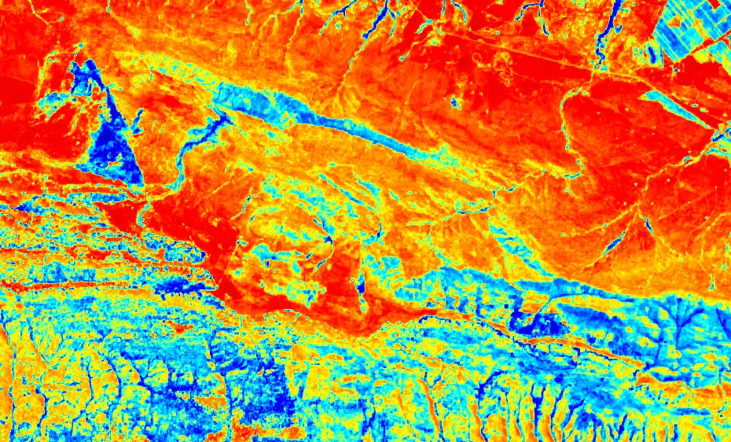
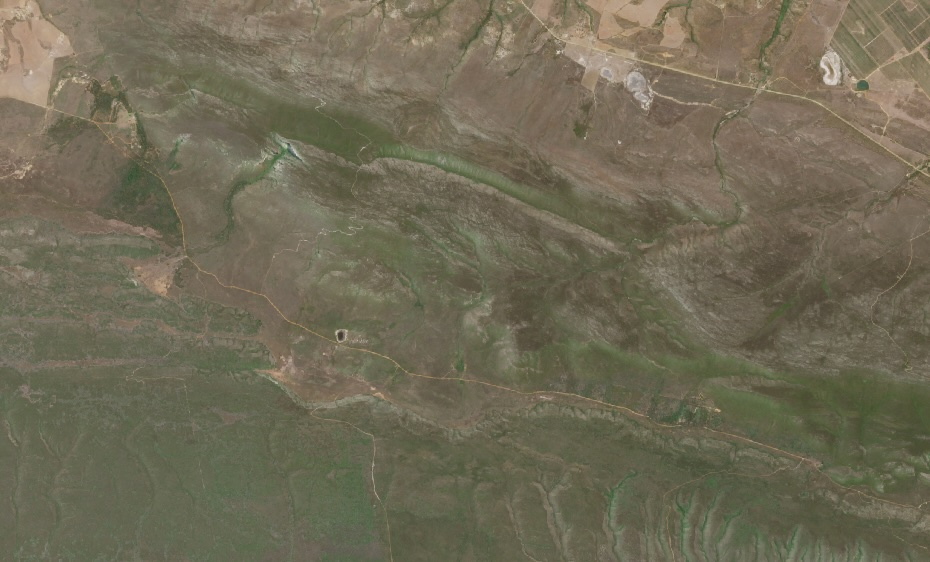
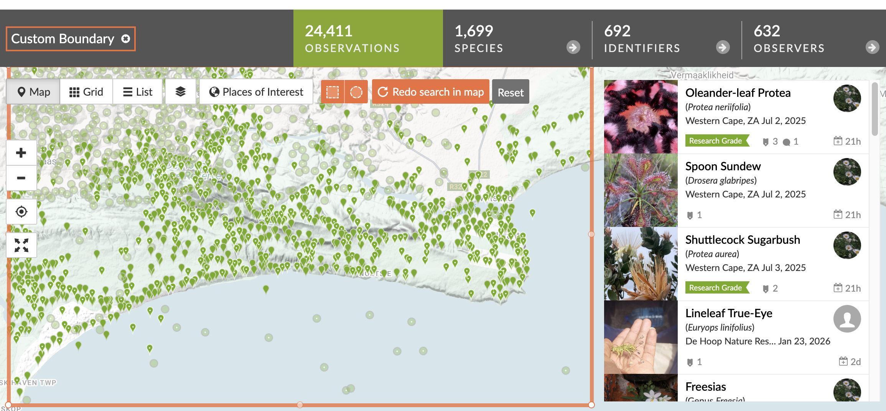

```{r setup, include=FALSE}
options(htmltools.dir.version = FALSE)
knitr::opts_chunk$set(
  fig.width=9, fig.height=3.5, fig.retina=3,
  out.width = "100%",
  cache = FALSE,
  echo = TRUE,
  message = FALSE, 
  warning = FALSE,
  hiline = TRUE
)

library(RefManageR)
BibOptions(check.entries = FALSE,
           bib.style = "authoryear",
           cite.style = "alphabetic",
           style = "markdown",
           hyperlink = FALSE,
           dashed = FALSE)
myBib <- ReadBib("bib/2_species.bib", check = FALSE)
```

```{r xaringan-themer, include=FALSE, warning=FALSE}
library(xaringanthemer)

# style_duo_accent(
#   primary_color = "#1381B0",
#   secondary_color = "#FF961C",
#   inverse_header_color = "#FFFFFF"
# )

style_mono_light(base_color = "#23395b")

#https://mycolor.space/?hex=%2323395B&sub=1 
#"Generic gradient" - #23395B #006287 #008E9D #00B897 #89DD81 #F9F871
#"Matching gradient" (reverse) - #23395B #494E77 #716292 #9C77AA #C88DBF #F5A3D0


library(knitr)
library(kableExtra)
```


```{r xaringan-tile-view, echo=FALSE}
# xaringanExtra::use_tile_view()
```

class: center, middle

## Scenario

The manager of De Hoop Nature Reserve has asked for help mapping wetlands in the reserve. The existing map does not indicate any mountain seep wetlands on Potberg, but these small wetlands are typically important for biodiversity conservation, providing hydrological refugia that support species that may otherwise not be able to survive in the prevailing climate.

---

## What is a seep?

```{r echo = F, fig.align = 'center', out.width = '60%', fig.cap = "(from Ollis et al 2012, SANBI)"}

```

"Seeps are characterised by their association with geological formations (lithologies) and topographic positions that either cause groundwater to discharge to the land surface or rain-derived water to ‘seep’ down-slope as subsurface interflow."

---

## Remote sensing - A solution?

```{r echo = F, fig.align = 'center', out.width = '70%', fig.cap = "Moisture Index for a section of De Hoop from Sentinel 2 data (from Copernicus Browser)."}

```

---

## Remote sensing - A solution?

```{r echo = F, fig.align = 'center', out.width = '70%', fig.cap = "True colour image for a section of De Hoop from Sentinel 2 data (from Copernicus Browser)."}

```

---

## Problem

One needs to "ground-truth" remote sensing data with on-the-ground surveys to be sure that you are mapping wetlands and not other features.

## Task 

You are tasked with developing and testing a rapid field survey protocol* to efficiently identify and characterise seep wetland vegetation communities on Potberg.

.footnote[*This does not mean that your study methods should be rapid, but rather that they help identify a rapid method.]

---

## What can you use as indicators?

---

## What is a wetland?

Wetlands are defined by the presence of water at or near the soil surface (which may be seasonal), hydric soils, and specially adapted vegetation (hydrophytes).

--

### What are the indicators of a wetland?

--

- Wetlands tend to have higher soil moisture (or a shallower water table) than the surrounding landscape.

- Wetlands tend to support distinct plant communities relative to the surrounding landscape, often more productive and typically dominated by hydrophytes.

- Wetlands tend to have hydric soils, which are soils that are saturated, flooded, or ponded long enough during the growing season to develop anaerobic conditions in the upper part. A good indicator of this is higher organic matter content (i.e. darker soils).

---

## How would you measure these indicators?

--

#### Soil moisture?


--


#### Vegetation?

--


- Species?
- Properties?


--


#### Soil organic matter?

---

## Field equipment?

#### Soil moisture?

#### Vegetation?
- Species?
- Properties?

#### Soil organic matter?

---

## Field equipment?

#### Soil moisture?
- The Aston (metal bar) + 5 pound hammer + 5m measuring tape + glove
- Trowel, sealable plastic bags, permanent marker

#### Vegetation?
- Species: 20m measuring tape, large plastic bags, permanent markers, masking tape, smartphone with camera

- Properties: 5m measuring tape, densiometer, clipboard, paper and pen/pencil

#### Soil organic matter?
- See _Soil moisture_ above (can inspect same sample in lab)

#### Site?
- GPS, clipboard, paper and pen/pencil, 50m measuring tape?

---

## Data sheet?

--

- Site name or number
- GPS coords
- Date, Time
- Observer(s)
- Water table depth (cm)
- Soil sample collected (Y/N)
- Site photos collected (Y/N, camera/owner, numbers/timestamp)
- Vegetation plot established (Y/N)
- Vegetation height (m)
- Vegetation cover (%)
- Densiometer reading
- Species recorded (list)
- Notes

---

## Results: The Dataset

```{r echo = F, fig.align = 'center', out.height = '60%', warning=F, messages=F}
library(tidyverse)
library(readxl)

set.seed(1234) #So I get the same results each time

d1 = read_xlsx("prac/2026/wetlands_BIO3018F_2026 complete.xlsx", sheet = "Sheet1")

d1 = d1 %>% mutate(MoistureFraction = 1 - `Dry mass (g)`/`Wet mass (g)`)

d1 %>% select(!c(Habitat,Pair)) %>%
  kable("html") %>% 
  kable_styling("striped", full_width = F) %>%
  scroll_box(width = "100%", height = "500px")
 
```

---

## Results: Site level

```{r echo = F, fig.align = 'center'}
d1 %>% filter(Species == "Soil", `Site Number` !="E") %>%
  select(Site, `Site Number`, MoistureFraction, `Bare Ground (%)`, `Veg Height (m)`) %>%
  pivot_longer(cols = c(MoistureFraction, `Bare Ground (%)`, `Veg Height (m)`), names_to = "Variable", values_to = "Value") %>%
  ggplot(aes(x = `Site Number`, y = Value, fill = Site)) +
  geom_col(outlier.shape = NA, position = "dodge") +
#  geom_line(aes(group = Pair)) +
#  geom_point() +
  facet_wrap(~Variable, scales = "free_y")
```
While we estimated bare ground at the wetland sites, it was always zero, so these bars are not visible. 

.footnote[I dropped site E as both sites sampled were wetlands, so there is no "dry" comparison.]

---

## Results: Vegetation Community

```{r echo = F, fig.align = 'center'}
d1 %>% filter(Species != "Soil", `Site Number` !="E") %>%
  ggplot(aes(x = `Site Number`, y = MoistureFraction, colour = Site)) +
  geom_boxplot(outlier.shape = NA) +
#  geom_line(aes(group = Pair)) +
  geom_point()
```

Leaf moisture fraction (1 - dry mass/wet mass) for plant species collected from wet and dry sites on Day 1. Samples are quasi-paired by relatedness (same species, genus, family, etc.), see next slide.

---

## Results: Species Level

```{r echo = F, fig.align = 'center'}

 d1 %>% group_by(Species) %>%
  filter(Species != "Soil", n_distinct(Site) >= 2) %>%
  ungroup() %>%
  ggplot(aes(x = Species, y = MoistureFraction, colour = Site)) +
  geom_boxplot(outlier.shape = NA) +
#  geom_line(aes(group = Pair)) +
  geom_point() +
  theme(axis.text.x = element_text(angle = 45, hjust = 1, vjust = 1))
```

---

## What have we learned so far?

--

- Wet sites have higher soil moisture content than dry sites
- Wet sites tend to have plants with higher leaf moisture content than dry sites
- Some species occur only in wet sites, some only in dry sites, and some in both
- Leaf moisture content may be constrained by phylogeny (related species have similar leaf moisture content), but within species individuals in wet sites tend to have higher leaf moisture content than in dry sites.

---

## Where does this leave us with regard to our task?

_You are tasked with developing and testing a rapid field survey protocol to efficiently identify and characterise seep wetland vegetation communities on Potberg._

---

## Do we have good indicators?


---

## How do we scale this up?

---

## Plant distributions as indicators?

```{r echo = F, fig.align = 'center', out.width = '70%', fig.cap = "Screenshot of iNaturalist records for plants in De Hoop NR."}

```


---

## Plant distributions as indicators?

```{r echo = F, fig.align = 'center', out.width = '70%', fig.cap = "Occurrence of the vlei kolkol (_Berzelia lanuginosa_) in De Hoop NR. It is a good indicator of wet environments, but occurs only in a few locations on Potberg."}

library(rinat)
library(sf)

#Call the data directly from iNat
bl <- get_inat_obs(taxon_name = "Berzelia lanuginosa",
                   bounds = c(-34.426285, 20.512737, -34.348832, 20.776036),
                   maxresults = 1000) %>% 
            filter(positional_accuracy<46 & 
                latitude<0 &
                !is.na(latitude) &
                captive_cultivated == "false" &
                quality_grade == "research")

#Make the dataframe a spatial object of class = "sf"
bl <- st_as_sf(bl, coords = c("longitude", "latitude"), crs = 4326)

mapview::mapview(bl, zcol = "positional_accuracy", legend = FALSE)

```

---

## Results: Literature?

```{r echo = F, fig.align = 'center'}
d1 %>% select(Site, Species, Pair, MoistureFraction,Habitat) %>%
  kable("html") %>% 
  kable_styling("striped", full_width = F) %>%
  scroll_box(width = "100%", height = "500px")
```

---

## Traits from remote sensing?

```{r echo = F, fig.align = 'center', fig.cap = "RGB image of BioSCape imagery for Potberg (see www.bioscape.io)."}
library(terra)

wat <- rast("/Users/jasper/Documents/Datasets/BioSCape/TraitMaps/Potberg/ang20231031t102201_001_L2A_OE_0b4f48b4_RFL_ORT_QL.tif")

plot(wat)

```

---

## Traits from remote sensing?

```{r echo = F, fig.align = 'center', fig.cap = "Average community leaf water content derived from BioSCape imagery for Potberg (see www.bioscape.io)."}
library(terra)

wat <- rast("/Users/jasper/Documents/Datasets/BioSCape/TraitMaps/Potberg/ang20231031t102201_001_L2A_OE_0b4f48b4_RFL_ORT_Water.nc")

plot(wat[[1]])

```


---

## Sampling methods

### You decided that at each location you'd set up a 4x4m plot and...

Sample _Environmental conditions:_

- Estimate % projected cover (the area you would see from above) bare soil

- Take a densiometer reading at ground level

- Take a **soil sample** from the 4 corners to measure volumetric soil water content

- Note prevalence of **dung**: none/low/medium/high

- Note presence/absence of burnt dead skeletons or charcoal

- Note prevalence of serotiny
  
- Take a few notes (and photos) on any features you think may be interesting

---

## Sampling methods

### You decided that at each location you'd set up a 4x4m plot and...

Sample _Diversity:_

- Count the number of individuals and estimate % cover of each species

- Collect a voucher specimen of each species

- Assign species to functional types:
  
  - Trees, shrubs, herbs, grasses, succulents, geophytes, climbers, parasites, etc.?

---

class: center, middle

R code for this presentation with R code for the following analyses can be accessed [**at this link**](https://github.com/jslingsby/BIO3018F/blob/main/PracPresentation2026.Rmd)

<br>

The data are available [**here**](https://github.com/jslingsby/BIO3018F/blob/main/prac/)

---
class: center, middle

# Thanks!

Slides created via the R packages:

[**xaringan**](https://github.com/yihui/xaringan)<br>
[gadenbuie/xaringanthemer](https://github.com/gadenbuie/xaringanthemer)

The chakra comes from [remark.js](https://remarkjs.com), [**knitr**](http://yihui.name/knitr), and [R Markdown](https://rmarkdown.rstudio.com).
